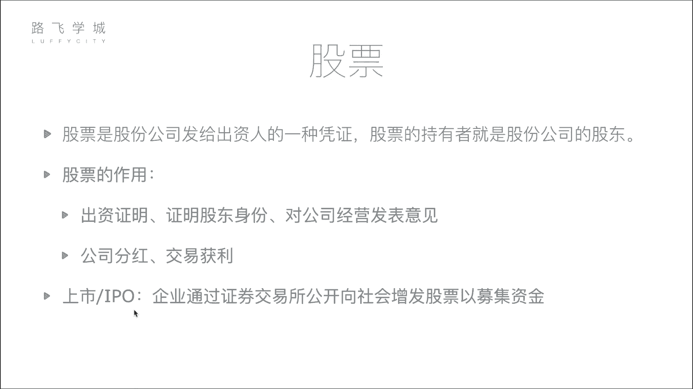
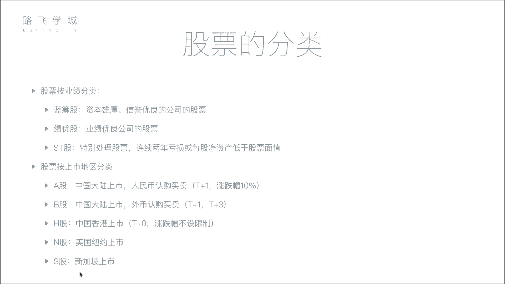

# 金融量化分析：P3：02：股票基本知识与分类 📈

在本节课中，我们将学习股票的核心概念、作用以及分类方式。理解这些基础知识是进行金融量化分析的第一步。

## 股票的定义

股票是股份公司发给出资人的一种凭证。股票的持有者就是股份公司的股东。

为了更形象地解释，我们可以设想一个场景：一位创业者需要资金，而投资者（如亿万富翁）愿意提供资金。投资者将资金给予创业者，创业者则向投资者发行公司的股票作为凭证。例如，一个公司初始市值为5亿，由五位出资人（包括创业者本人）各出资1亿建立，那么每位出资人将获得该公司20%的股票。股票证明了出资人对公司的所有权和股东身份。

## 股票的作用

股票主要有两个核心作用。

### 1. 股东身份与权利证明
持有股票意味着你是公司的股东。这不仅是出资证明，也赋予了你参与公司决策的权利，例如在股东大会上投票。

### 2. 获取收益的途径
作为股东，可以通过两种主要方式获利：
*   **公司分红**：当公司盈利时，会按股东持股比例进行利润分配。例如，若公司年净利润为5000万，持有20%股份的股东可获得1000万的分红。
*   **交易获利（套现）**：股东可以在市场上出售其股票。如果公司市值增长，出售股票就能获得价差收益。例如，初始投资1亿获得20%股份，当公司市值从5亿增长到50亿时，这20%股份的价值就变成了10亿。此时出售部分股份（如10%），即可套现5亿资金用于其他投资，同时仍保留部分公司股权。

对于资金量较小的普通股民而言，获利逻辑相同，只是参与方式需要通过证券交易所进行股票买卖。

## 什么是上市？

上市是指企业通过证券交易所，首次公开向全社会投资者发行股票以募集资金的过程。

公司不能随意向公众募集资金，这属于非法集资。上市需要公司达到一定体量，并向证监会提交申请。证监会审核公司的财务状况、发展前景等信息，确认其合规且具备持续经营能力后，才允许其上市。

上市后，公司的股票就能在证券交易所公开挂牌交易，所有符合条件的投资者都可以买卖这只股票。上市的核心目的是拓宽融资渠道，从广大的公众投资者那里募集资金，而不仅仅依赖于少数“有钱人”。

**IPO（首次公开募股）** 就是指公司第一次向社会公众发行股票的行为。

## 股票的分类

股票主要有两种分类方式。

### 按业绩分类
根据公司的经营业绩，股票可分为以下三类：
*   **蓝筹股**：指资本雄厚、信誉优良的大型公司股票，通常经营稳定，像“大胖子”一样体量庞大。例如，中石油、中石化。
*   **绩优股**：指业绩优良公司的股票。这类公司可能规模不是最大，但盈利能力强且增长稳定。例如，贵州茅台。
*   **ST股**：中文名为“特别处理股票”。如果公司连续两年亏损，或每股净资产低于股票面值，其股票名称前会被加上“ST”标记，以警示投资者该公司存在较高风险。

### 按上市地区分类
根据股票上市交易的地点和结算货币，主要分为：
*   **A股**：在中国大陆（上海、深圳证券交易所）上市，以人民币认购和交易的股票。
*   **B股**：同样在中国大陆上市，但以外币（如美元、港币）认购和交易的股票。
*   **H股**：在中国香港上市的股票。
*   **N股**：在美国纽约上市的股票。
*   **S股**：在新加坡上市的股票。

不同市场的交易规则有所不同，以下是A股的两项核心限制：
1.  **涨跌幅限制**：为防止股价剧烈波动，保护投资者，A股设有每日涨跌幅限制，通常为**10%**。即一只股票当日的价格波动幅度不能超过前一日收盘价的±10%。
2.  **T+1交易制度**：“T”代表交易当天。A股实行**T+1**交割制度，即当日买入的股票，必须等到下一个交易日才能卖出。这旨在减少市场中的过度投机行为。

相比之下，港股、美股等市场多实行**T+0**交易（当日可买卖），且通常没有涨跌幅限制。

---

本节课中，我们一起学习了股票的定义、作用、上市流程以及两种主要的分类方式。理解股票是公司所有权的凭证，以及通过分红和交易获利的原理，是进入金融市场的基础。同时，了解不同市场（如A股）的特有规则，对于后续的实际分析和交易至关重要。