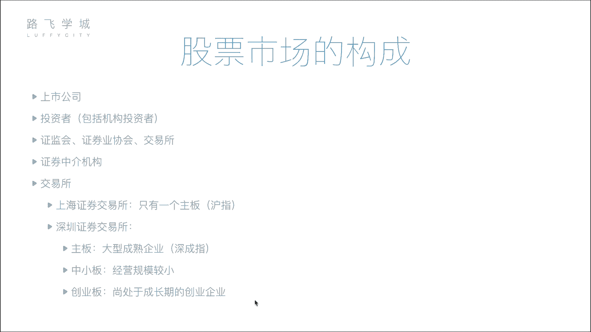
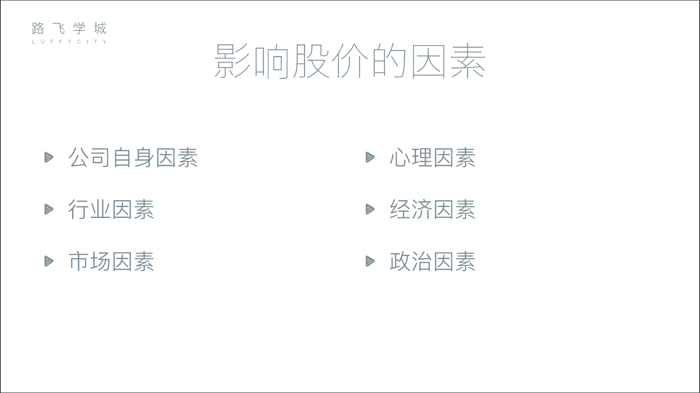

# 金融量化分析：P4：03 股票市场构成 🏛️📈

在本节课中，我们将要学习股票市场的构成。了解市场中有哪些参与者以及他们各自扮演的角色，是理解股票交易如何运作的基础。我们将从公司和投资者开始，逐步介绍监管机构、交易所和中介机构，最后解释股票市场的板块与大盘指数。

## 公司与投资者

上一节我们介绍了股票的分类，本节中我们来看看股票市场的参与者。首先，市场中最核心的两方是公司和投资者。

*   **公司**：是需要融资的一方。
*   **投资者**：是提供资金的另一方。

公司通过上市向投资者募集资金，投资者则通过购买股票进行投资。但股票交易并非由公司和投资者直接进行。

## 监管与服务机构

为了保证市场的公平与秩序，需要监管和服务机构。以下是主要的机构类型：

*   **证监会**：这是证券行业的监管机构。公司若想上市，必须向证监会提交各种材料。证监会负责审查公司是否存在财务造假、洗钱等违法行为，并有权决定公司能否上市或是否应退市。
*   **证券业协会**：这是一个行业自律组织，作用相对较弱。例如，证券从业资格考试常由其主办。
*   **交易所**：交易所提供股票集中交易的场所。在中国，主要有上海和深圳两家交易所。早期投资者需要亲自到交易所交易，现在则通过网络连接。交易所的核心功能是处理所有买卖股票的请求。

## 证券中介机构

个人投资者通常不能直接进入交易所买卖股票，这需要通过证券中介机构，也就是我们常说的券商。

其存在的原因是历史形成的交易成本与门槛问题。在电子化交易之前，交易手续繁琐，凭证核实成本高。因此，交易所设立了高价的交易“席位”，只有购买席位的机构才能入场交易。这些机构为了赚回席位费，便发展出代理业务，汇集众多小投资者的资金和指令，代为进场交易。

演变至今，情况如下：
*   **券商**：如中信证券、中金公司等，它们在交易所拥有席位。
*   **交易流程**：投资者通过券商提供的软件（如各券商APP或同花顺）发出交易指令。指令先到达券商的服务器，再由券商通过其在交易所的席位，将指令传达给交易所执行。

## 交易所板块与大盘指数

中国有两个主要交易所：上海证券交易所和深圳证券交易所。每个交易所内部又划分为不同的板块。

以下是各交易所的板块划分：
*   **上海证券交易所**：主要设**主板**。
*   **深圳证券交易所**：分为**主板**、**中小板**和**创业板**。中小板和创业板是为规模较小但成长性好的创业公司提供的融资平台，上市门槛较主板低。

对于每个板块，都有一个综合性的**大盘指数**来反映该板块的整体表现。

**指数**的含义是：它反映了该板块内所有股票价格变动的综合趋势。例如，上海主板的大盘指数是**上证指数**（沪指）。它并非单只股票的价格，而是将所有股票的表现通过特定算法“打包”计算得出的一个趋势图，用以判断市场整体是向好还是向坏。

以下是各板块对应的主要指数：
*   上海主板：**上证指数（沪指）**
*   深圳主板：**深证成指（深成指）**
*   深圳中小板：**中小板指**
*   深圳创业板：**创业板指**

---

本节课中我们一起学习了股票市场的构成。我们认识了市场的核心参与者——公司与投资者，了解了维护市场秩序的证监会、提供交易场所的交易所，以及连接投资者与交易所的券商。最后，我们明白了不同交易所的板块划分，以及大盘指数作为市场整体“晴雨表”的重要作用。理解这些基本构成，是进行后续金融量化分析的重要前提。