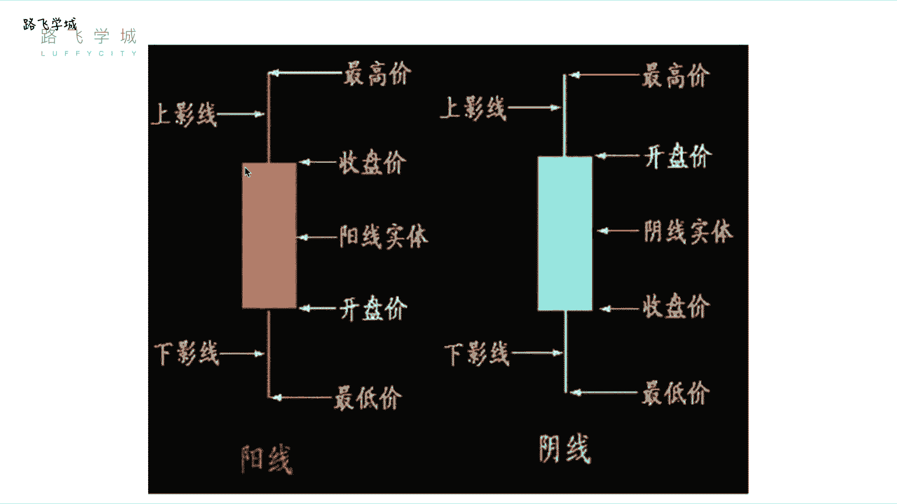
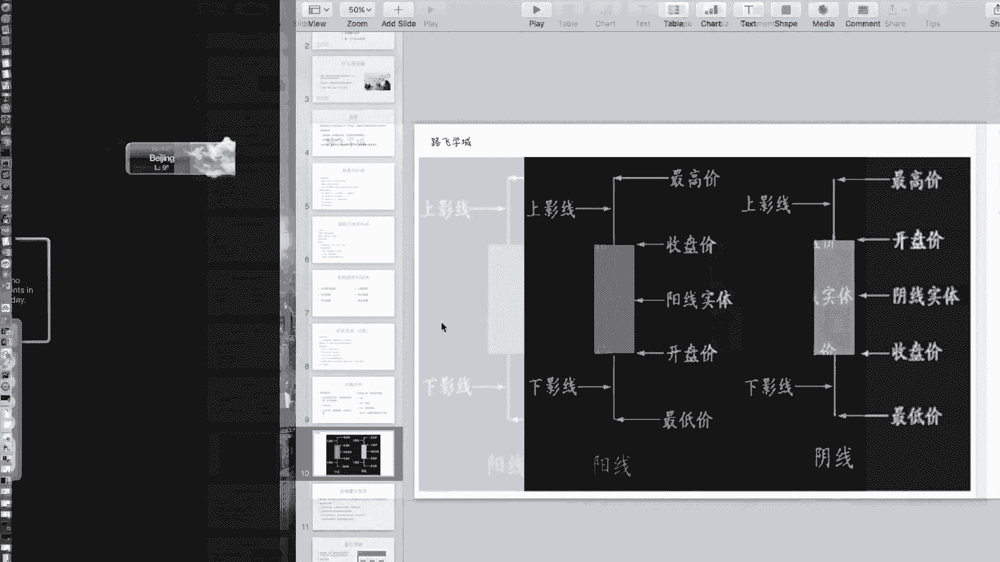
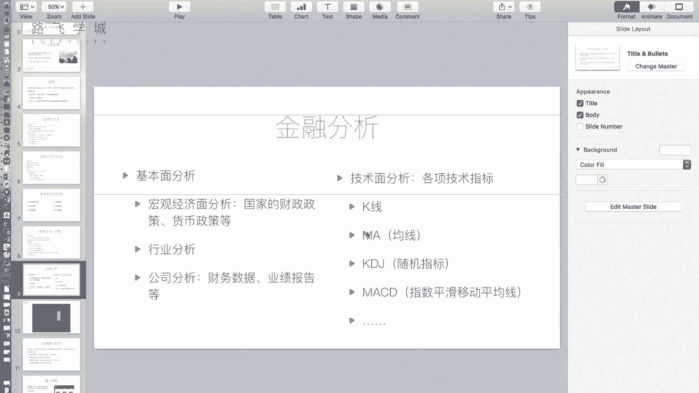
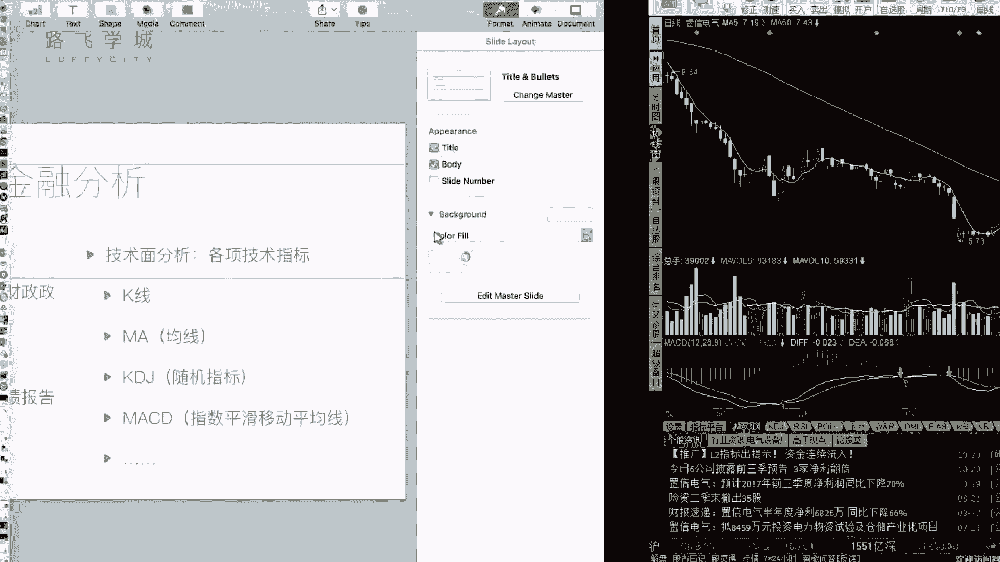

# 金融量化分析：P6：05 金融分析 📈

在本节课中，我们将要学习金融分析的核心方法。上一节我们介绍了金融和股票的基础知识，本节中我们来看看如何通过分析手段来判断股票的买卖时机，避免盲目投资。

金融分析主要分为两种方法：基本面分析和技术面分析。

## 基本面分析

基本面分析的核心是评估公司的运营状况，即我们之前提到的“公司自身因素”。通过分析当前经济状况、行业前景以及公司具体的财务表现，来决定是否购买其股票。

基本面分析包含以下三个方面：

以下是基本面分析的三个层面：

1.  **宏观经济面分析**：分析国家的财政政策、货币政策等宏观因素，判断整体经济环境对股市的影响。但需注意，宏观经济规律并非总是与股市表现一致。
2.  **行业分析**：判断特定行业（如教育、IT、能源等）的整体发展前景。可以通过观察该行业内几只代表性股票的走势来辅助判断。
3.  **公司分析**：这是最具体的一环。分析目标公司的公开财务数据，如年度报告和季度报告。如果通过分析或信息预判公司经营状况良好，可以在财报发布前买入；如果无法预判，则通过研读已发布的客观财报数据来做决策。

## 技术面分析

上一节我们介绍了基本面分析，本节中我们来看看技术面分析。技术面分析的核心观点是：所有信息都已蕴含在市场交易数据中。它通过研究历史价格走势和一系列技术指标来预测未来动向。

以下是两个基础且重要的技术指标：

### K线图

K线图是展示股票每日价格变动的图表。一根K线包含四个关键价格：开盘价、收盘价、最高价和最低价。

K线分为阳线和阴线：
*   **阳线**（通常为红色或空心）：表示当日股价上涨，即收盘价高于开盘价。
*   **阴线**（通常为绿色或实心）：表示当日股价下跌，即收盘价低于开盘价。

一根标准K线的构成如下：
*   **实体**：中间的矩形部分。实体的**上、下边缘**分别代表收盘价和开盘价（阳线），或开盘价和收盘价（阴线）。
*   **影线**：实体上方和下方的细线。**上影线顶端**代表当日最高价，**下影线底端**代表当日最低价。

K线存在一些特殊形态，例如“十字星”（开盘价等于收盘价）或“光头光脚线”（无影线），这些形态可用于进一步分析。

### 移动平均线（MA）

移动平均线（Moving Average，简称MA）是取前若干天收盘价的平均值，并将每日的均值连接起来形成的曲线。它用于平滑价格波动，反映趋势。

常见的均线有：
*   **MA5**：5日均线，取前5天收盘价的平均值。
*   **MA60**：60日均线，取前60天收盘价的平均值。

计算公式可以简化为：
`MA(N) = (P1 + P2 + ... + PN) / N`
其中，`P1` 到 `PN` 代表最近N个交易日的收盘价。

均线策略（如双均线策略）是量化交易中常用的工具，我们将在后续课程中详细介绍。

---

本节课中我们一起学习了金融分析的两大支柱：基本面分析和技术面分析。基本面分析侧重于公司价值，而技术面分析侧重于市场行为。理解K线和均线这两个基础技术指标，是进行更深入量化分析的第一步。