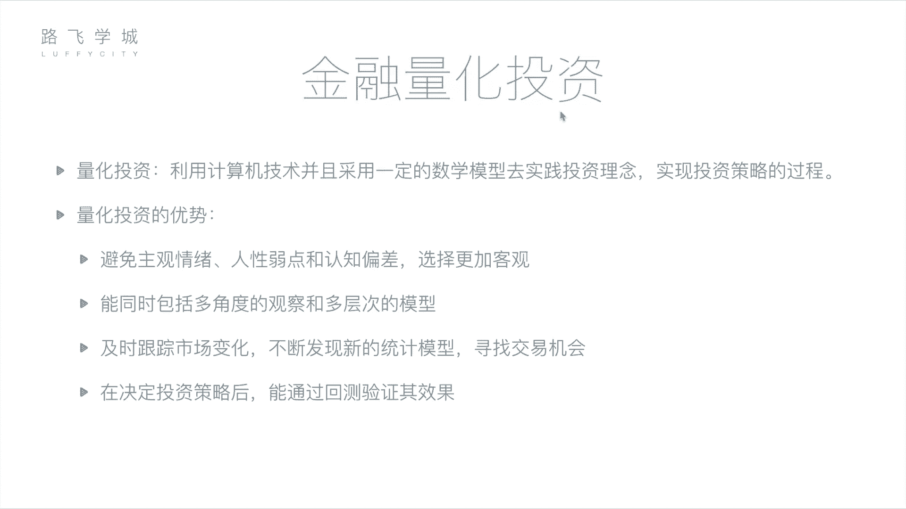
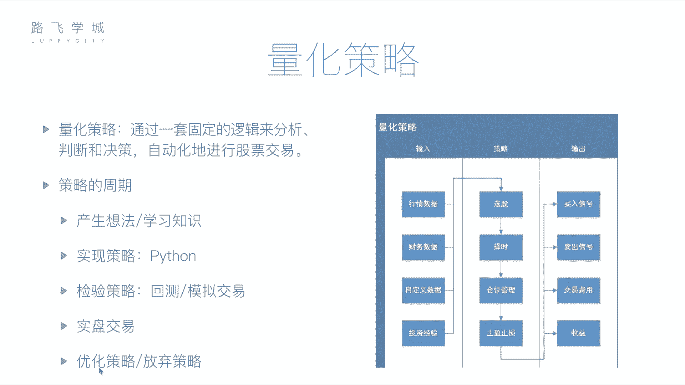

# 金融量化分析：P7：06：金融量化投资介绍 💹

在本节课中，我们将要学习金融量化投资的核心概念。我们将了解什么是量化投资，它与传统人工投资的区别，以及构成一个量化策略的关键组成部分。通过本课，你将建立起对量化分析流程的基本认识。

## 什么是量化投资？🤖

上一节我们介绍了金融分析的基本面与技术面方法。本节中我们来看看如何将这些分析方法自动化。

金融分析是通过基本面或技术面对公司及股票进行判断的过程。这个判断过程可以交给计算机来完成。无论是基本面分析所需的财务报表，还是技术面分析所需的历史价格与交易记录，都可以被获取。利用计算机进行这些分析的过程，就称为**量化投资**或**量化分析**。

所谓量化投资，是指**利用计算机技术，并采用一定的数学模型，去实践投资理念，实现投资策略的过程**。它包含三个重要部分：
1.  **计算机技术**：即使用计算机编程的方式。
2.  **数学模型**：即具体的策略与套路，例如均线就是一个数学模型，其公式可表示为 `MA = (P1 + P2 + ... + Pn) / n`，其中 `P` 代表价格，`n` 代表周期。
3.  **实践**：使用编写好的计算机程序去真实投资或预先进行策略测试。

## 量化投资的优势 ⚡

相较于传统人工投资，量化投资具有多项优势。

以下是量化投资的主要优势：

*   **避免主观情绪干扰**：人类投资者容易受到情感、人性弱点（如贪婪、恐惧）和认知偏差的影响。例如，持有某只股票后，即使各种迹象表明它将下跌，也可能因“不舍得”或“有感情”而拒绝卖出；或者因股票连续几日下跌而恐慌性抛售，错过后续反弹。量化投资由程序执行，决策完全基于预设规则，更加客观。
*   **处理海量信息与复杂模型**：计算机能够同时从多角度、多层次分析海量信息。它可以快速分析数千只股票的众多指标（如均线、财报数据、行业新闻等），而人类难以同时处理如此大量的信息。将投资经验总结为程序后，计算机可能在十分钟内完成人类需要数天才能完成的全市场扫描。
*   **及时跟踪与发现机会**：市场每时每刻都在变化。计算机程序可以7x24小时不间断监控市场，一旦满足交易条件，便能以远超人类的速度执行操作。同时，程序也更容易尝试和集成新的投资方法或机器学习模型。
*   **通过回测验证策略**：在将策略投入真实交易前，可以进行**回测**。回测是指使用历史数据来检验策略在过去的表现。例如，可以测试一个策略从2012年到2017年的模拟收益。通过在不同时间段反复回测和调整参数，可以在一定程度上验证策略的有效性，降低直接实盘交易带来的风险。

## 量化策略的核心构成 🧩

理解了量化投资的概念与优势后，本节我们深入探讨其核心——量化策略。一个完整的量化策略主要包括输入、处理逻辑和输出三部分。

### 策略输入：数据源

策略需要数据作为分析依据。以下是主要的数据输入类型：

*   **行情数据**：股票的历史交易数据，例如每日的开盘价、收盘价、最高价、最低价、成交量等。
*   **财务数据**：上市公司的财务报表数据，如资产负债表、利润表、现金流量表。
*   **自定义数据**：任何可量化的、可能影响股价的信息。例如，通过自然语言处理分析的新闻舆情数据，甚至是某些投资者考虑的“非传统”指标。

### 策略处理：四大功能

策略程序拿到数据后，主要执行以下四类任务：

1.  **选股**：从全市场数千只股票中，筛选出符合特定条件的股票池。例如，筛选出市盈率低于20且近期成交量放大的所有股票。
2.  **择时**：决定买卖的具体时机。目标是实现“低买高卖”，程序需要判断何时是买入或卖出的最佳时点。
3.  **仓位管理**：决定资金在不同股票之间的分配比例。对于判断上涨概率更高的股票，可以分配更多资金。
4.  **止盈止损**：必要的风险控制手段。
    *   **止损**：当股价下跌达到预设比例（如-10%）时自动卖出，防止损失扩大。
    *   **止盈**：当股价上涨达到预设比例（如+30%）时自动卖出，锁定利润，避免后续回调。

### 策略输出：信号与结果

策略运行后，会产生以下输出：

*   **交易信号**：程序生成的直接指令，如“买入”或“卖出”。这可以是一个提示信息，也可以直接连接到券商系统进行自动交易。
*   **交易费用与收益**：计算每次交易产生的佣金、手续费等成本，并最终核算策略的净收益、收益率等绩效指标。

## 量化策略的开发周期 🔄

一个量化策略从构思到应用并非一蹴而就，它遵循一个完整的生命周期。

下图展示了量化策略从产生到优化或淘汰的典型周期：

该周期包含以下几个关键阶段：

1.  **产生想法**：基于投资经验、学术理论或新发现的指标，形成初步的交易思路。
2.  **策略实现**：使用编程语言（如Python）将想法转化为可执行的计算机程序。
3.  **回测验证**：使用历史数据对策略进行测试，评估其过去的表现。
4.  **模拟交易**：在当下市场环境中，用实时数据但虚拟资金进行交易演练，进一步验证策略在近期市场的适应性。
5.  **实盘交易**：经过充分验证后，将策略投入真实资金进行交易。在此阶段，仍需持续监控策略表现。
6.  **优化与迭代**：根据回测、模拟或实盘的结果，对策略参数或逻辑进行调整优化。如果策略失效，则可能被放弃，并开启新一轮的“产生想法”阶段。

## 总结 📝

本节课中，我们一起学习了金融量化投资的基础知识。我们明确了量化投资是利用计算机程序和数学模型执行投资决策的过程，并分析了其客观、高效、可回测的优势。我们拆解了一个量化策略所需的**数据输入**、包含**选股、择时、仓位管理、止盈止损**四大功能的处理逻辑以及最终的**信号输出**。最后，我们了解了策略从构思、编程、回测、模拟到实盘与优化的完整开发周期。

接下来，我们将开始学习如何使用Python及其强大的数据分析库（如NumPy和Pandas）来具体实现这些量化策略，将理论转化为实战工具。