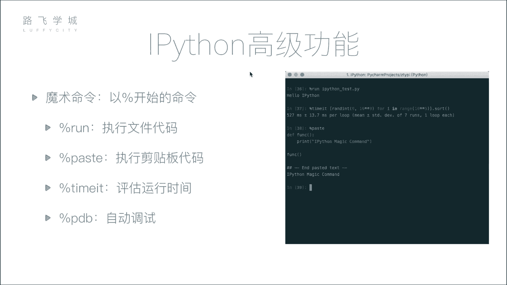
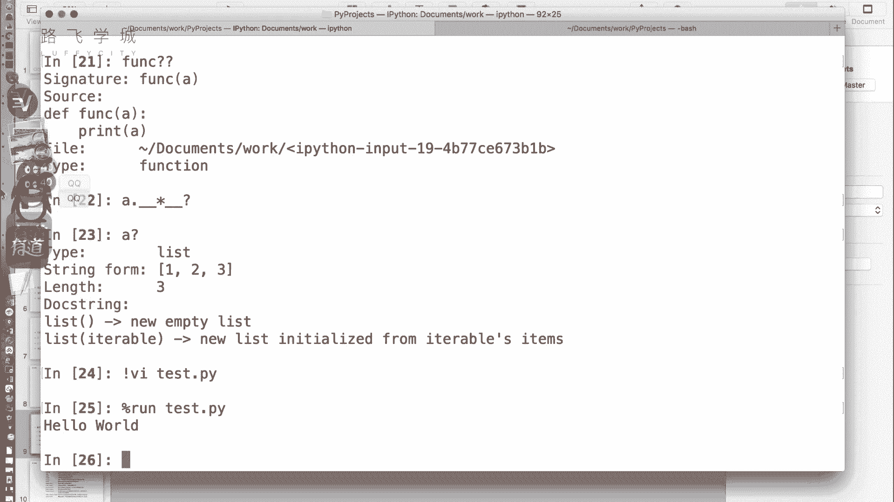
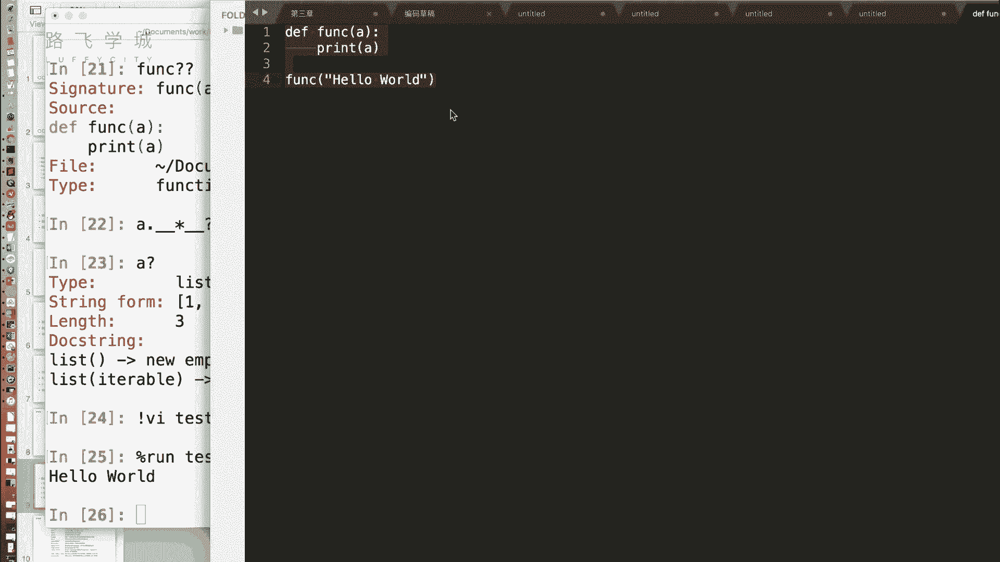
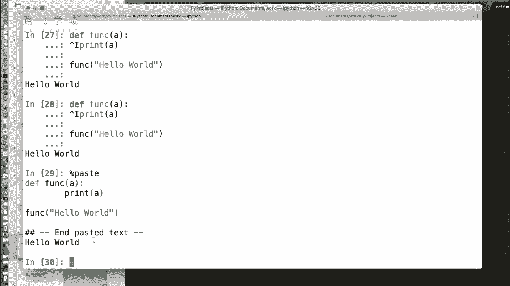
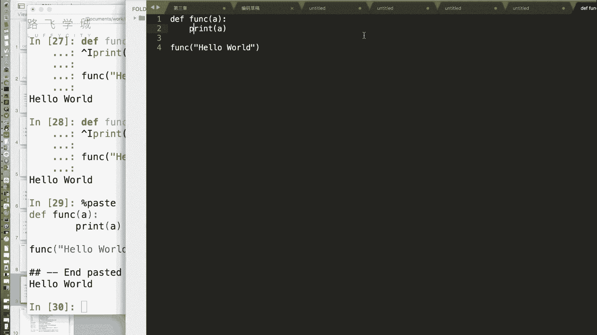
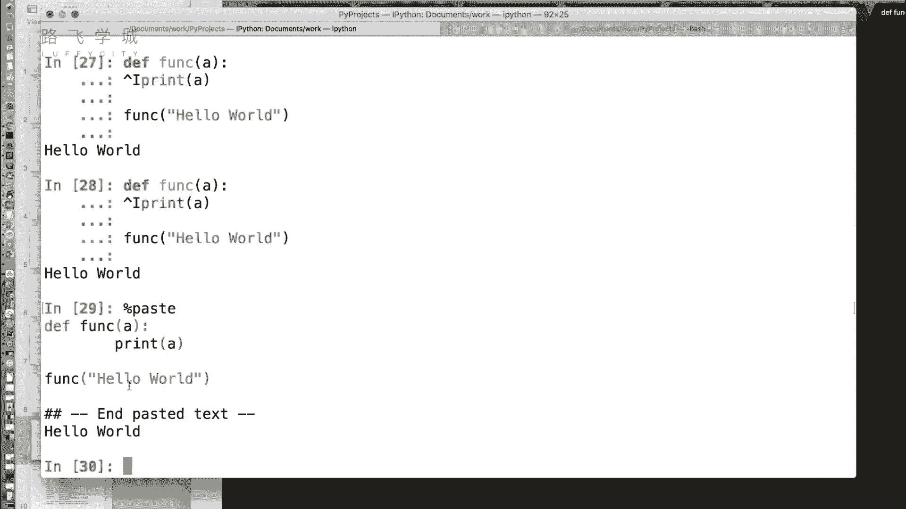
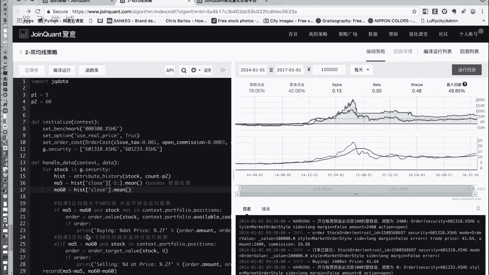
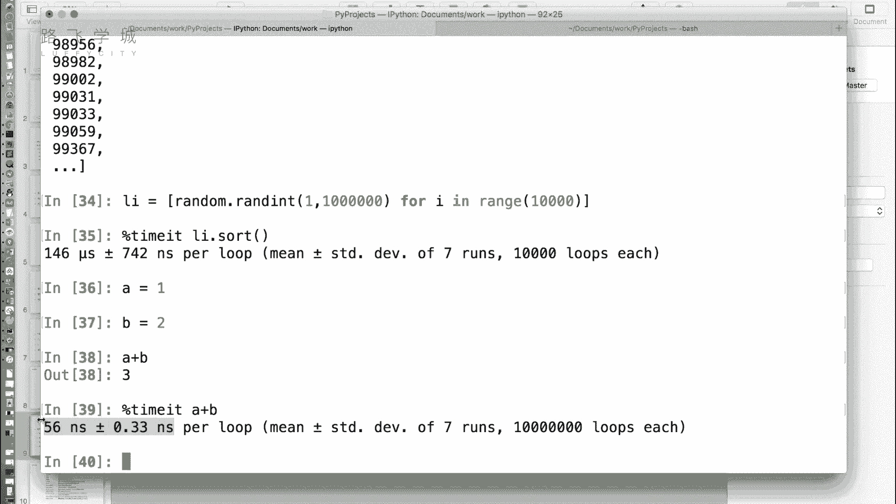

# 金融量化分析：P9：IPython魔术命令 🪄



在本节课中，我们将学习IPython中一些强大且实用的“魔术命令”。这些命令以百分号（`%`）开头，能够极大地提升我们在交互式环境中编写、测试和调试代码的效率。

## 概述

IPython魔术命令是一系列以`%`为前缀的特殊指令。它们提供了标准Python交互式环境所不具备的高级功能，例如直接运行外部脚本、执行剪贴板中的代码、精确测量代码运行时间等。掌握这些命令，能让我们的数据分析工作流程更加流畅。

---

## 运行外部Python脚本

在标准的Python命令行中，若要运行一个外部的`.py`文件，通常需要退出交互环境，再通过命令行执行。在IPython中，我们可以使用`%run`命令直接运行，无需中断当前会话。



以下是使用`%run`命令的步骤：

1.  首先，创建一个简单的Python脚本文件，例如`hello.py`，内容为：
    ```python
    print("Hello, World!")
    ```
2.  在IPython环境中，输入以下命令即可运行该脚本：
    ```python
    %run hello.py
    ```
    执行后，你将看到输出“Hello, World!”。



这个功能使得测试和调用现有代码文件变得非常便捷。

---

## 执行剪贴板中的代码

有时，我们可能从编辑器或其他地方复制了一段代码，希望快速在IPython中执行测试，但又不想手动创建文件。这时，`%paste`命令就派上了用场。



`%paste`命令会直接执行当前剪贴板中的代码内容。它的工作流程是：先打印出即将执行的代码，然后用分隔符隔开，最后执行并输出结果。



例如，假设你的剪贴板中有以下代码：
```python
def greet(name):
    return f"Hello, {name}!"



print(greet("Quant"))
```
在IPython中输入`%paste`，这段代码将被自动执行，并输出“Hello, Quant!”。



这对于快速测试代码片段或从长脚本中提取部分功能进行验证非常有用。

---

## 精确测量代码运行时间

在性能分析和优化时，我们需要精确测量代码的执行时间。虽然可以使用Python的`time`模块，但对于运行时间极短的代码，单次测量可能不准确（例如显示为0秒）。

IPython提供了`%timeit`这个魔术命令来解决这个问题。它会自动多次运行指定的代码，并计算平均运行时间，从而得到更精确的结果。

### 基本用法

直接在代码前加上`%timeit`即可：
```python
%timeit sorted([5, 2, 8, 1, 9])
```
输出可能类似于：
```
146 µs ± 742 ns per loop (mean ± std. dev. of 7 runs, 10,000 loops each)
```
这表示：对列表排序操作平均耗时146微秒，标准偏差为742纳秒。该结果是基于7次运行，每次运行循环了10,000次后取的平均值。

### 为何需要多次运行？

对于极其微小的操作（例如一个简单的加法`a + b`），单次运行时间可能远低于计时器精度。`%timeit`通过自动进行大量循环，能够有效测量出这种微小操作的真实耗时，例如56纳秒。这对于进行底层代码性能优化至关重要。

---

## 总结

本节课我们一起学习了IPython中三个核心的魔术命令：
1.  **`%run`**：用于在交互式环境中直接运行外部的Python脚本文件。
2.  **`%paste`**：用于快速执行复制到剪贴板中的代码，方便代码片段的测试。
3.  **`%timeit`**：用于精确测量代码段的运行时间，尤其擅长测量耗时极短的操作，是代码性能分析的利器。



熟练运用这些魔术命令，可以显著提升我们在金融量化分析中探索数据、测试策略和优化代码的效率。