# 量化交易实战：P6：突变点调参 🔧

在本节课中，我们将学习 Prophet 模型中一个关键参数——突变点权重（`changepoint_prior_scale`）的调整方法。我们将通过实验观察不同参数值对模型拟合效果和预测性能的影响，并学习如何选择最优参数。

## 概述

Prophet 模型通过识别时间序列中的突变点（Changepoints）来捕捉趋势变化。`changepoint_prior_scale` 参数控制着模型对突变点的敏感度。理解并调整这个参数，是优化模型性能、平衡欠拟合与过拟合风险的关键步骤。

## 突变点权重参数解析

上一节我们介绍了 Prophet 模型的基本构建。本节中，我们来看看核心参数 `changepoint_prior_scale` 的作用。

该参数指定了突变点的先验权重（prior scale）。其核心含义是：**权重越大，模型在训练时会更重视数据中的突变点，使拟合曲线更紧密地跟随训练数据的波动趋势**。

这带来一个权衡：
*   **权重过大**：模型能更好地拟合训练数据（包括噪声和突变），但可能导致**过拟合**，即在未知数据（测试集）上表现变差。
*   **权重过小**：模型对突变点不敏感，趋势预测会趋于平缓保守，可能导致**欠拟合**，无法捕捉数据中的重要变化模式。

Prophet 框架为该参数设置的默认值是 **0.05**，这是一个相对较小的值，表明模型默认对突变点持保守态度。

## 参数影响实验分析

为了直观展示参数影响，我们使用四组不同的 `changepoint_prior_scale` 值进行实验：`0.001`， `0.05`（默认值）， `0.1`， `0.2`。

以下是实验的核心代码逻辑：

```python
# 假设 df_train 是训练数据
params = [0.001, 0.05, 0.1, 0.2]
forecasts = {}

for param in params:
    # 1. 创建模型并设置参数
    model = Prophet(changepoint_prior_scale=param)
    model.fit(df_train)
    
    # 2. 构建未来时间框并预测
    future = model.make_future_dataframe(periods=180)
    forecast = model.predict(future)
    
    # 3. 存储预测结果
    forecasts[param] = forecast[‘yhat’]
    
# 4. 可视化对比
plt.figure(figsize=(12, 6))
plt.plot(df_train[‘ds’], df_train[‘y’], ‘k.’, label=‘Actual Data’)
for param, yhat in forecasts.items():
    plt.plot(forecast[‘ds’], yhat, label=f‘CP={param}’)
plt.legend()
plt.show()
```

实验结果的图像分析如下：

*   **蓝色线 (CP=0.001)**：权重极小。模型几乎忽略了所有突变点，预测趋势是一条非常平缓的直线，出现了明显的**欠拟合**。
*   **红色线 (CP=0.05)**：默认权重。模型捕捉到部分主要趋势变化，拟合效果优于蓝色线，但依然比较保守。
*   **灰色/黄色线 (CP=0.1, 0.2)**：权重较大。模型紧密跟随训练数据的波动，尤其是黄色线，几乎穿过了所有训练数据点，对突变点的捕捉非常强烈。但这带来了**过拟合**的风险。

## 模型评估与参数选择

仅仅观察拟合曲线不够，我们需要量化评估。通常计算模型在训练集上的误差（Train Error）和测试集上的误差（Test Error）。

以下是评估不同参数性能的步骤：

1.  **分割数据**：将时间序列数据按时间点分为训练集和测试集。
2.  **训练与预测**：对每个参数值，用训练集训练模型，并预测测试集时间段。
3.  **计算误差**：常用的误差指标包括均方误差（MSE）或平均绝对误差（MAE）。
    *   **公式（均方误差）**：`MSE = (1/n) * Σ(实际值 - 预测值)^2`
4.  **选择参数**：**选择在测试集上误差最小的参数**。因为测试集误差最能反映模型在未知数据上的泛化能力。

在我们的实验中，随着 `changepoint_prior_scale` 从 `0.001` 增大到 `0.2`：
*   **训练误差持续下降**：权重越大，对训练数据拟合得越好。
*   **测试误差先下降后可能上升**：存在一个最优值使测试误差最低。

## 深入调参与最终选择

基于初步实验，我们测试了更大范围的参数值：`[0.25, 0.4, 0.5, 0.6, 0.7, 0.8]`。

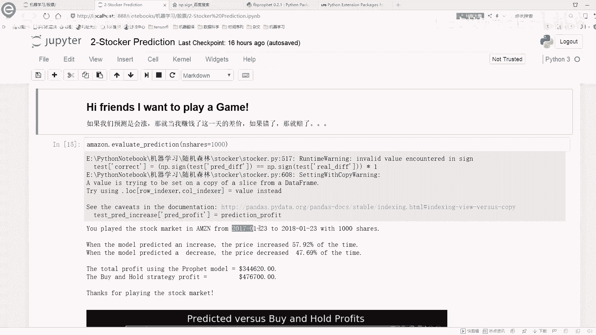

实验发现，当参数增至 **0.7** 左右时，测试误差达到了最低点（例如 MSE=66），之后趋于稳定或略有上升。因此，对于当前的数据集和预测任务，**`changepoint_prior_scale = 0.7` 是最优选择**。

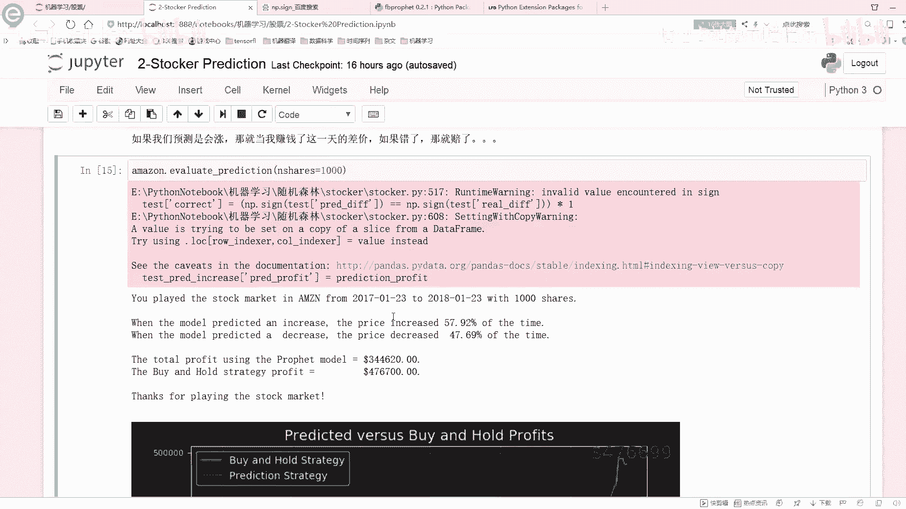

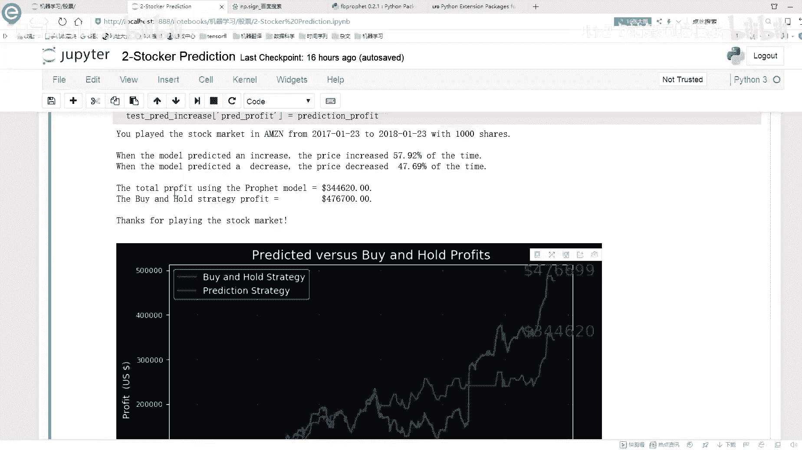

使用优化后的参数重新训练模型并进行预测，其预测值（如1263）与后续的真实值（如1294）之间的差距，会比使用默认参数时更小，验证了调参的有效性。

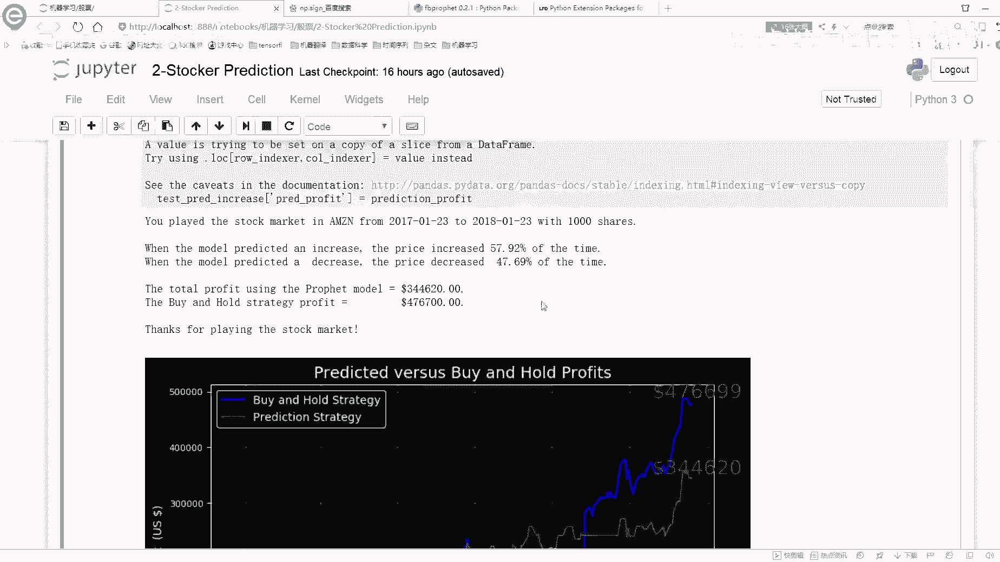

## 实践应用：简单的策略回测

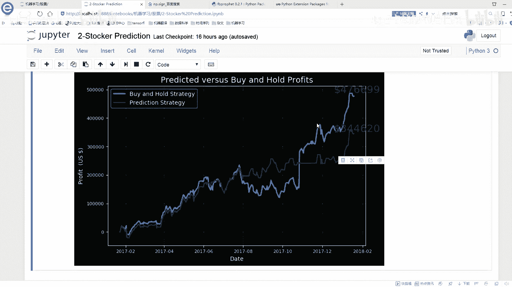

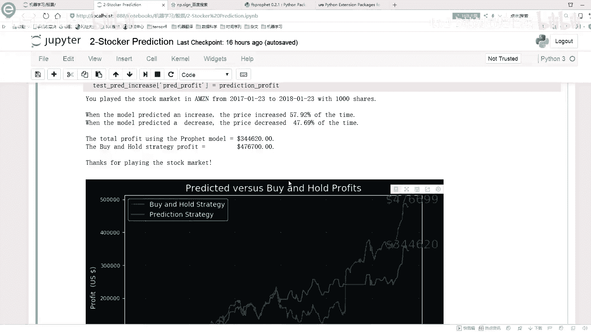

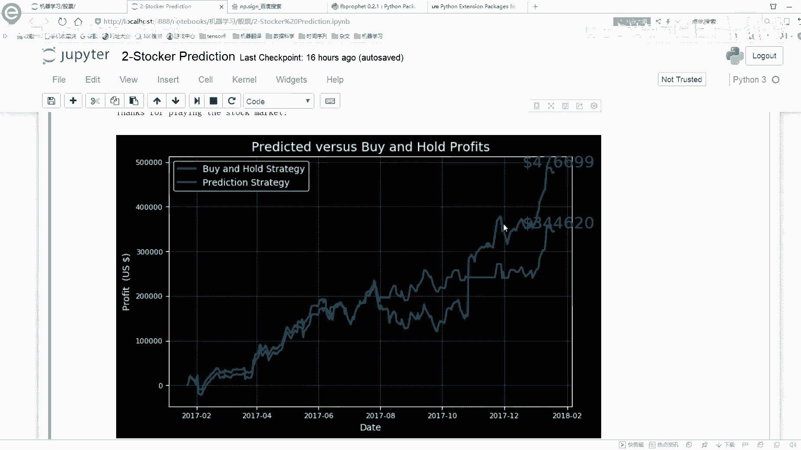

模型调优后，我们可以进行简单的概念验证。例如，基于模型的次日涨跌预测，模拟一个交易策略：

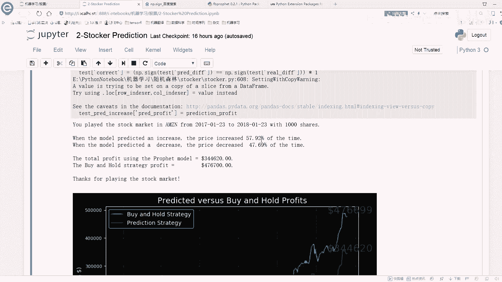

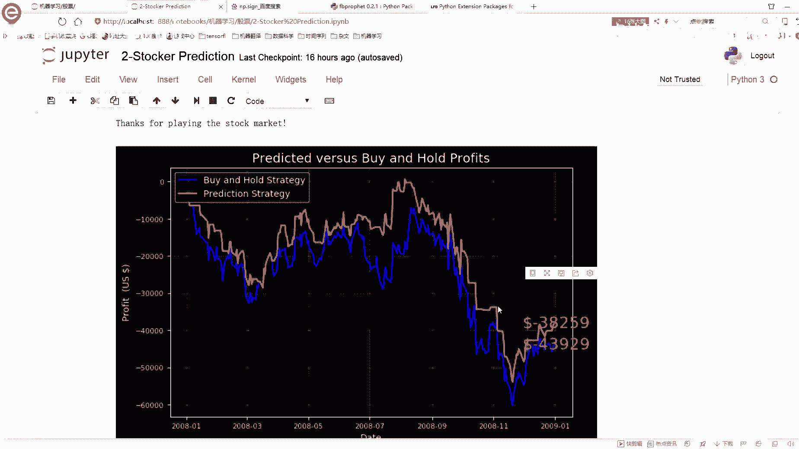

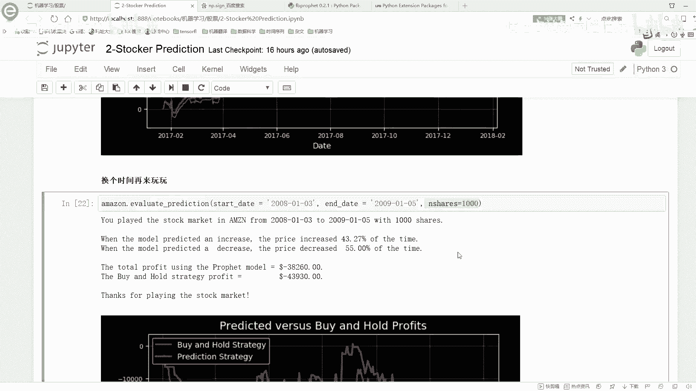

*   **规则**：若模型预测明日股价上涨，则今日收盘买入，明日收盘卖出，赚取差价；若预测下跌，则不操作。
*   **回测**：在历史数据的一段时期内（如2017年）运行此策略，计算总收益。
*   **注意**：这只是一个简化示例。实际量化交易策略需要考虑手续费、滑点、仓位管理等多种复杂因素。历史表现也不能完全代表未来。

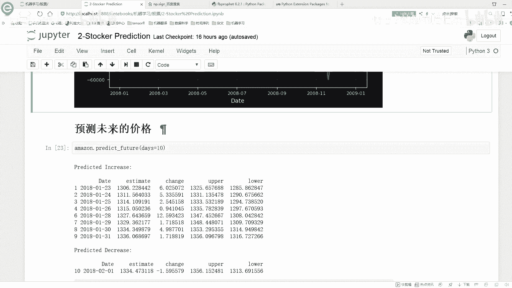

## 总结

本节课中我们一起学习了 Prophet 模型的关键调参步骤。
1.  **核心参数**：`changepoint_prior_scale` 控制模型对趋势突变的敏感度，需要在欠拟合与过拟合之间取得平衡。
2.  **调参方法**：通过网格搜索测试不同参数值，并**依据测试集上的误差（如 MSE）选择最优值**。
3.  **评估标准**：模型最终目标是良好的泛化能力，因此测试集误差比训练集误差更重要。
4.  **持续学习**：要深入掌握 Prophet 或其他库，最佳实践是结合官方文档进行动手实验。

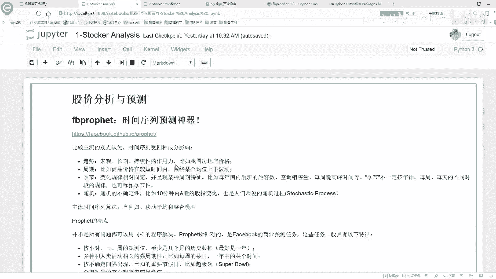

通过本节的调参实战，你不仅优化了一个时间序列预测模型，也掌握了机器学习中模型选择与评估的基本思想。