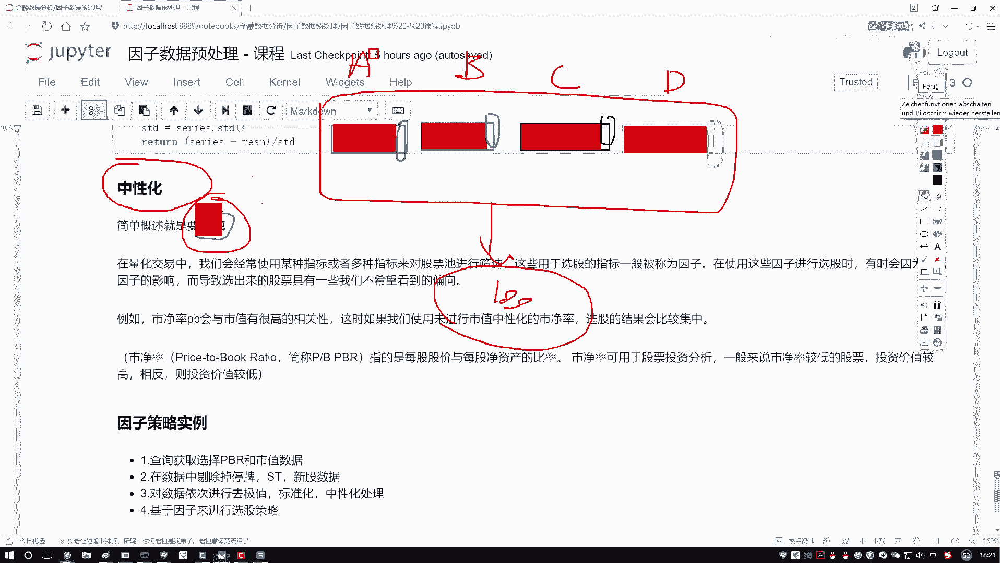
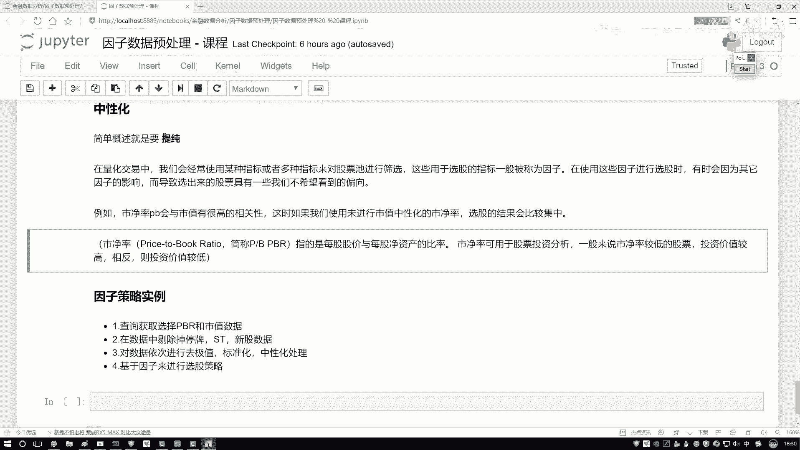

# Python金融分析与量化交易实战教程：P31：06-6-中性化处理方法通俗解释 🧪

## 概述
在本节课程中，我们将学习量化交易中的一个重要概念——**中性化**。我们将解释中性化的目的、核心思想，并通过一个具体的例子来理解它如何帮助我们“提纯”因子，从而在选股策略中获取更独特、更有价值的信息。

## 中性化的目的：提纯因子
上一节我们介绍了因子分析的基本概念。本节中，我们来看看如何通过中性化处理来优化我们的因子。

中性化的核心目的是**提纯**。那么，什么是提纯呢？让我们先通过一个例子来理解。

假设我们设计了一个选股策略，其中使用了四个不同的因子，我们称之为因子A、B、C、D。这四个因子都会对最终的选股结果产生影响。然而，在实际操作中，你可能会发现一个现象：无论你如何调整和组合这四个因子，最终选出的股票池总是高度相似，甚至总是那几只股票。

为什么会出现这种情况？一种可能的原因是，这四个看似不同的因子，其内部可能包含了大量相同的信息。例如：
*   因子A（比如市净率）的数值可能绝大部分与公司的**市值**高度相关。
*   因子B、C、D虽然代表不同的指标，但它们绝大部分的变动也可能主要由**市值**驱动。

如果四个因子绝大部分的“成分”都是市值，那么无论你使用哪个因子，选股结果本质上都是由市值这个单一因素决定的。这就无法体现出每个因子独特的预测能力，也使得策略缺乏多样性。

**中性化**要做的，就是从每个因子中，剔除掉这些共有的、普遍的影响（如市值的影响），从而提取出该因子**独有的、有价值**的部分。这个过程就像化学实验中的“提纯”，目的是获得更纯净的物质。

## 量化交易中的中性化应用
在量化交易中，我们经常使用多个指标（因子）对股票池进行筛选，以决定买入或卖出哪些股票。在使用这些因子选股的过程中，有时会因为某些强大的共同影响因素（如前面提到的市值），导致选出的股票具有我们不希望看到的倾向性，例如全部集中于大盘股或小盘股。

如果不进行中性化处理，选股结果可能会过于集中，无法有效利用因子提供的独特信息。例如，市净率（PB）因子与市值通常有较高的相关性。如果直接使用原始的市净率选股，选出的股票可能会强烈偏向某一特定市值范围。

**关于市净率（PB）**：
市净率的计算公式为：
`市净率(PB) = 每股股价 / 每股净资产`
其中，每股净资产 = （公司总资产 - 公司总负债）/ 总股数，它代表了每股股票所代表的公司净资产的多少。
在投资中，通常认为较低的市净率可能意味着股票被低估，其未来上涨的潜力或投资的安全边际相对更高。

## 中性化的计算方法
前面我们从概念上解释了中性化。接下来，我们来看看其核心的计算方法。在代码实践中，我们通常使用线性回归模型来实现因子的中性化。



中性化的核心思想是：将一个因子（如市净率）中，可以被其他一个或多个因子（如市值）解释的部分剥离出去。

具体步骤如下：
1.  **建立回归模型**：以需要中性化的因子（如市净率）作为因变量 `y`，以需要剔除的影响因子（如市值）作为自变量 `x`。
    `y = β * x + α + ε`
    其中，`β` 是回归系数，`α` 是截距项，`ε` 是残差项。
2.  **计算残差**：进行回归后，得到的残差 `ε` 就是中性化后的因子值。
    `中性化后的因子 = ε = y - (β * x + α)`
    这个残差 `ε` 代表了原始因子 `y` 中无法被 `x`（如市值）解释的部分，即我们“提纯”后得到的、与市值无关的独特信息。

以下是使用Python代码实现这一过程的简要框架：
```python
import pandas as pd
import statsmodels.api as sm

# 假设 df 是一个DataFrame，包含‘pb_ratio’（市净率）和‘market_cap’（市值）两列
y = df[‘pb_ratio’]  # 因变量：待中性化的因子
X = df[‘market_cap’]  # 自变量：需要剔除的影响因子
X = sm.add_constant(X)  # 添加常数项（截距α）

# 执行线性回归
model = sm.OLS(y, X).fit()

# 计算残差，即为中性化后的市净率因子
df[‘pb_ratio_neutral’] = model.resid
```
通过以上操作，`pb_ratio_neutral` 列中的值就是去除了市值影响后的、“纯净”的市净率因子，可以用于更有效的选股分析。

## 总结
本节课中，我们一起学习了量化交易中的**中性化**处理方法。
*   我们首先理解了中性化的**目的**是“提纯”因子，即剔除因子中由其他常见因素（如市值）驱动的部分，提取其独特的预测信息。
*   然后，我们探讨了在选股策略中，如果不进行中性化，可能导致选股结果**过于集中**，无法充分利用因子多样性。
*   最后，我们介绍了中性化的核心**计算方法**——通过线性回归模型提取残差，并给出了简单的代码实现框架。



掌握中性化处理，能帮助我们在构建量化模型时，更准确地评估和使用每一个因子的真实影响力，从而提升策略的有效性和稳定性。在接下来的实战环节，我们将在量化平台中调用真实数据，演示完整的因子中性化流程。