# Python金融分析与量化交易实战教程：P70：06-6-DBSCAN可视化展示 🎯

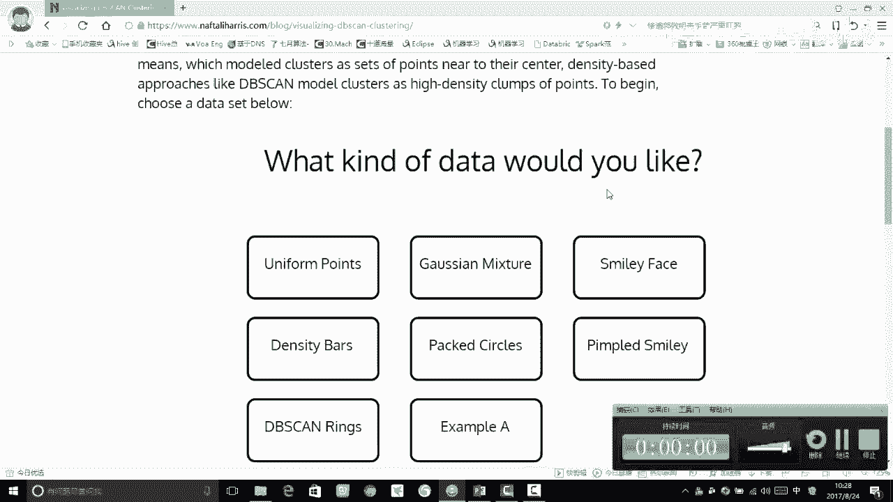

在本节课中，我们将通过可视化演示，直观地理解DBSCAN算法的核心工作流程。我们将看到算法如何基于密度“发展下线”，形成聚类簇，并观察关键参数如何影响最终的聚类结果。

---

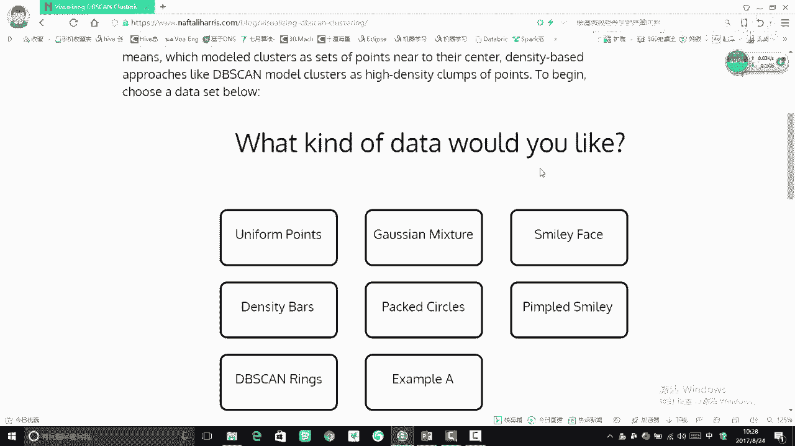

## 算法流程回顾与可视化引入

上一节我们介绍了DBSCAN算法的核心概念与工作流程。本节中，我们来看看如何通过一个交互式工具，动态地展示DBSCAN聚类的每一步。

我们将使用一个可视化工具，它可以让我们手动调整参数并观察聚类过程。

## 核心参数与初始设置

以下是启动DBSCAN可视化时需要指定的两个核心参数：

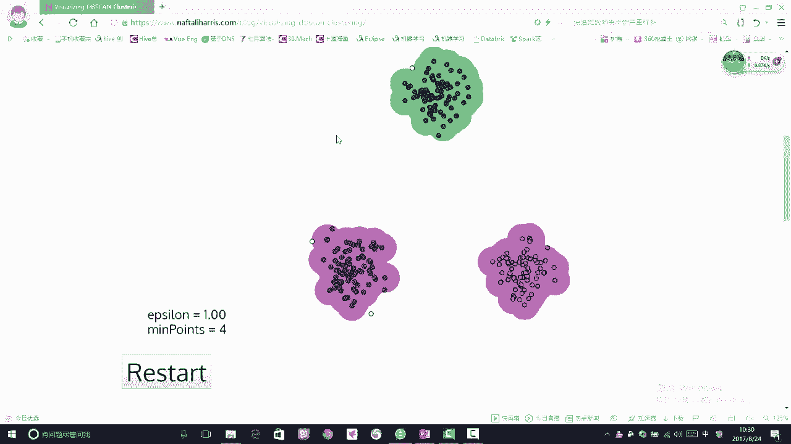

*   **半径 (eps)**：用于定义邻域范围的半径。在代码中通常表示为 `eps`。
*   **最小点数 (min_samples)**：形成一个核心点所需邻域内的最少样本数。在代码中通常表示为 `min_samples`。

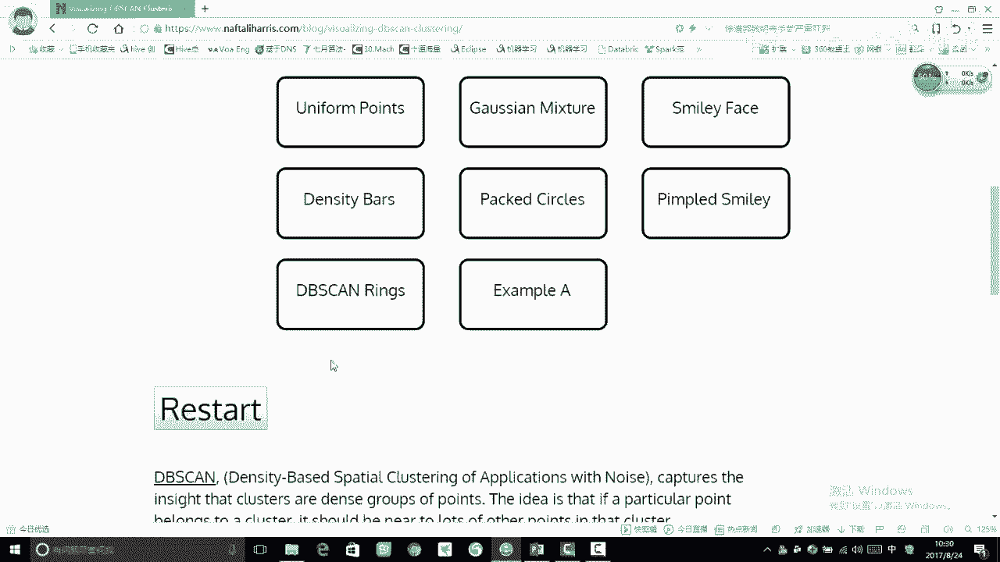

这两个参数需要手动指定，它们直接决定了聚类的形状和数量。

在工具中，我们可以选择一个示例数据集，并将初始半径设置为1，最小点数保持默认。

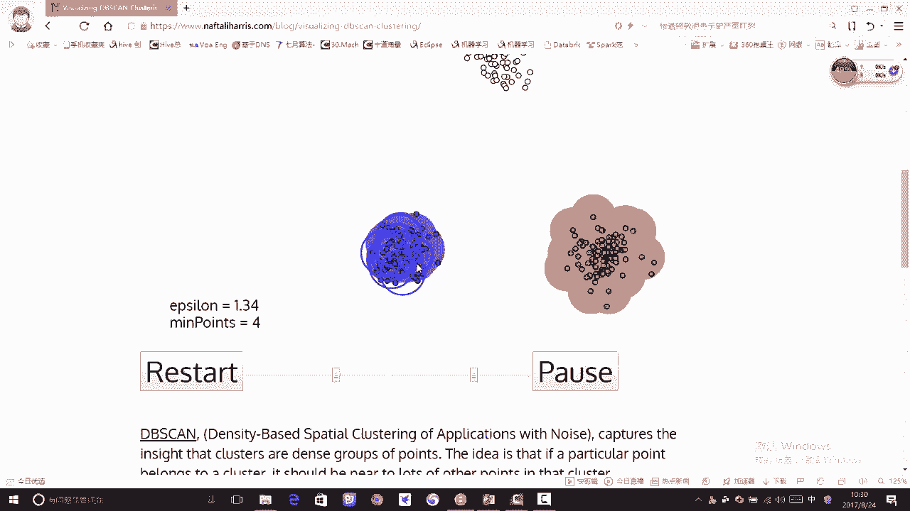

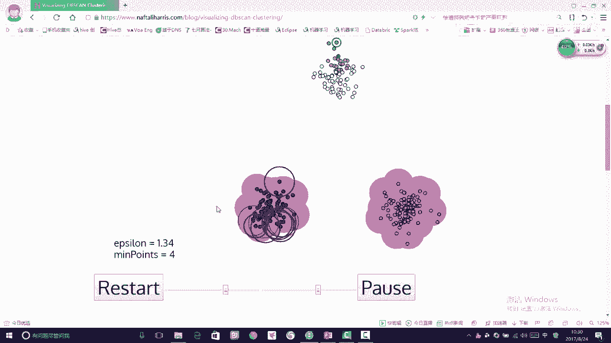

## DBSCAN工作流程逐步演示

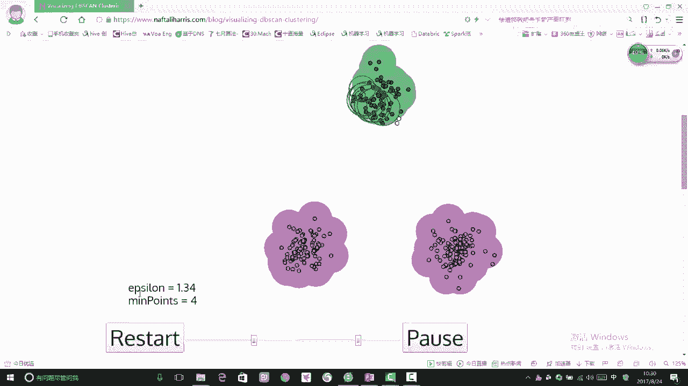

现在，我们开始逐步执行算法，观察其“传销式”的聚类过程。

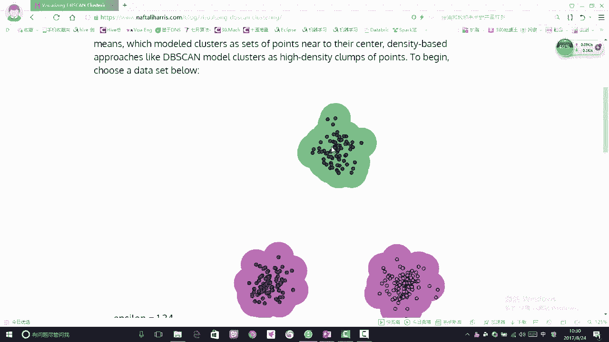

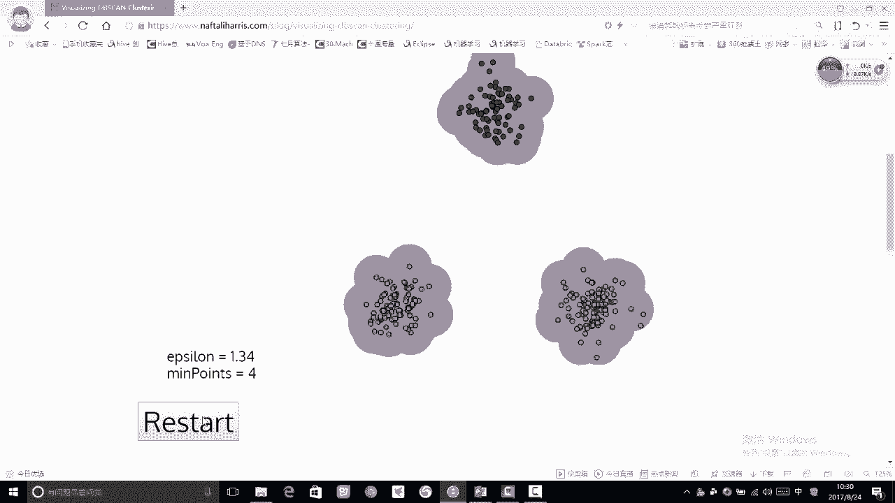

1.  **选择起始点**：算法随机选择一个未访问的点。
2.  **发展“下线”**：以该点为中心，画一个半径为 `eps` 的圆。如果圆内的点数（包括自身）达到 `min_samples`，则该点成为**核心点**，圆内的所有点都被标记为同一个簇，并加入“待发展”队列。
3.  **递归扩张**：对队列中的每一个新点，重复步骤2，将其密度可达的点都纳入当前簇。这个过程就像发展下线一样，不断扩张簇的边界。
4.  **完成一个簇**：当当前簇无法再扩张时，该簇形成完成。
5.  **寻找新簇**：算法再选择一个未被访问的点，重复步骤1-4，建立新的“大陆”。
6.  **标记噪声**：所有未被任何簇包含的点，被标记为**离群点**或**噪声点**。

执行后，我们可以看到数据被分成了三个簇，并识别出了几个白色的离群点。

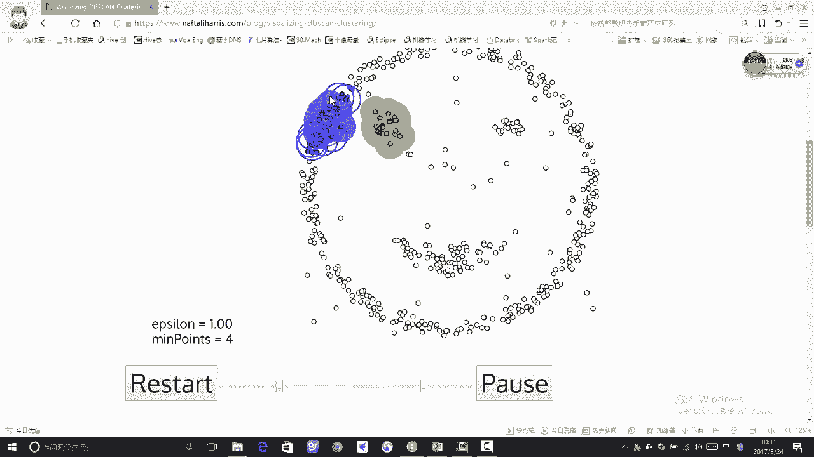

## 参数对结果的影响

参数 `eps` 和 `min_samples` 对聚类结果有决定性影响。我们通过调整它们来观察变化。

### 增大半径的影响

当我们将 `eps` 半径调大后，原本的离群点可能被纳入邻近的簇中。

可以看到，半径增大后，更多的点被圈入簇内，离群点消失了。这说明**较大的半径会使聚类更宽松，噪声减少**。

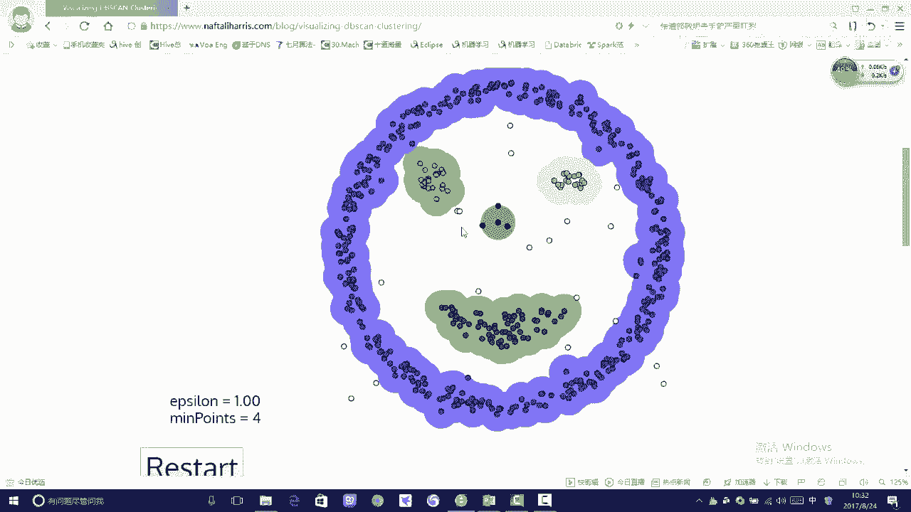

### 发现任意形状簇的优势

我们用一个复杂的“笑脸”形状数据集来对比。K-Means算法在处理这种非球形簇时效果不佳，而DBSCAN则能很好地处理。

使用默认参数运行DBSCAN，算法成功地根据密度将外层圆圈、眼睛和嘴巴分别识别为不同的簇。

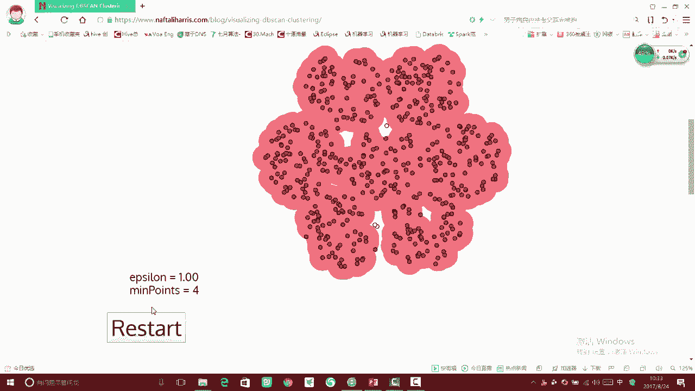

这个演示清楚地表明，**只要区域密度相连（密度可达），DBSCAN就能发现任意形状的簇**，这是其相对于K-Means的一大优势。

### 密集数据下的挑战与调参

然而，DBSCAN并非万能。当数据整体都非常密集时，它可能将大部分数据归为一个簇。

如上图所示，默认参数下，几乎所有点都被归入同一个红色簇，这失去了聚类的意义。此时，我们需要通过**调参**来获得更有意义的结果。

*   **调小半径 (`eps`)**：将半径调小，如设为0.5，算法会识别出大量的小簇，导致聚类结果过于碎片化。
*   **寻找合适参数**：经过多次尝试，将半径调整为0.88左右，可能得到一个更合理的聚类结果，将数据分成几个有意义的模块。

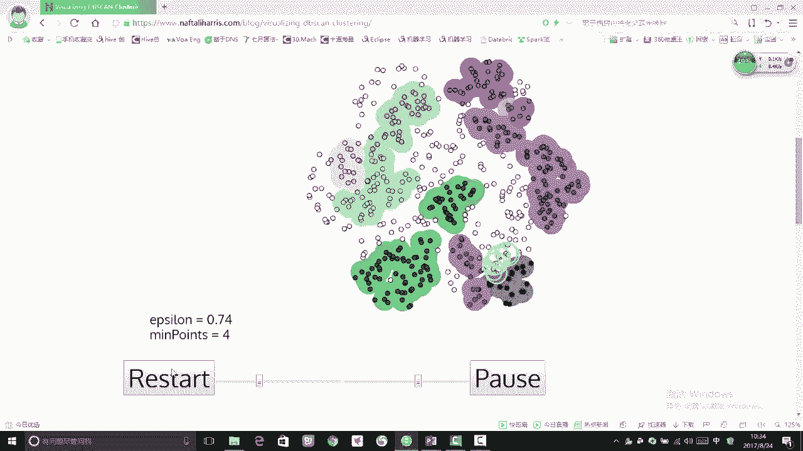

这个过程说明，**没有一套参数适用于所有数据集**。`eps` 和 `min_samples` 的微小变化可能导致完全不同的聚类结果。寻找最佳参数是一个需要结合业务理解和多次实验的挑战。

### 识别离群点的价值

最后，我们观察一个场景。通过设置较小的 `eps` 和 `min_samples`，DBSCAN可以有效地识别出稀疏区域的离群点。

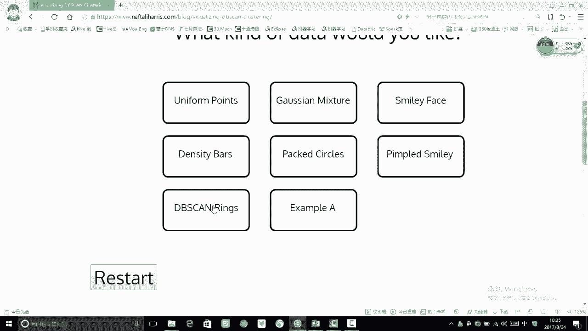

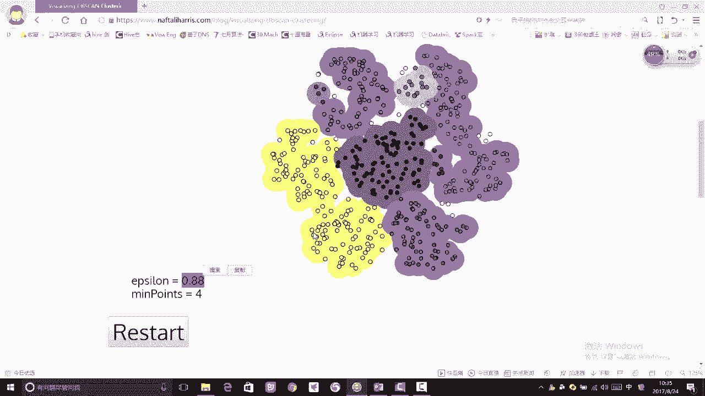

这些离群点在欺诈检测、异常监控等场景中具有重要的分析价值。

---

## 总结

本节课中我们一起学习了DBSCAN算法的可视化工作流程。

我们首先回顾了其基于密度“发展下线”的核心思想。通过动态演示，我们清晰地看到算法如何从核心点出发，逐步形成聚类簇，并标记噪声点。

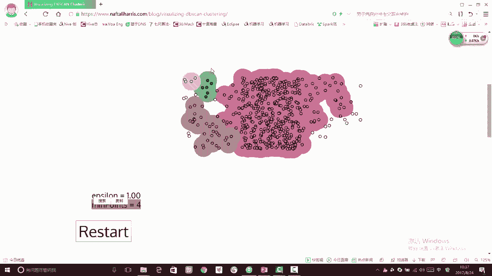

我们重点探讨了两个关键参数 **`eps`（半径）** 和 **`min_samples`（最小样本数）** 对结果的巨大影响：它们决定了簇的紧密程度、数量以及噪声点的识别。

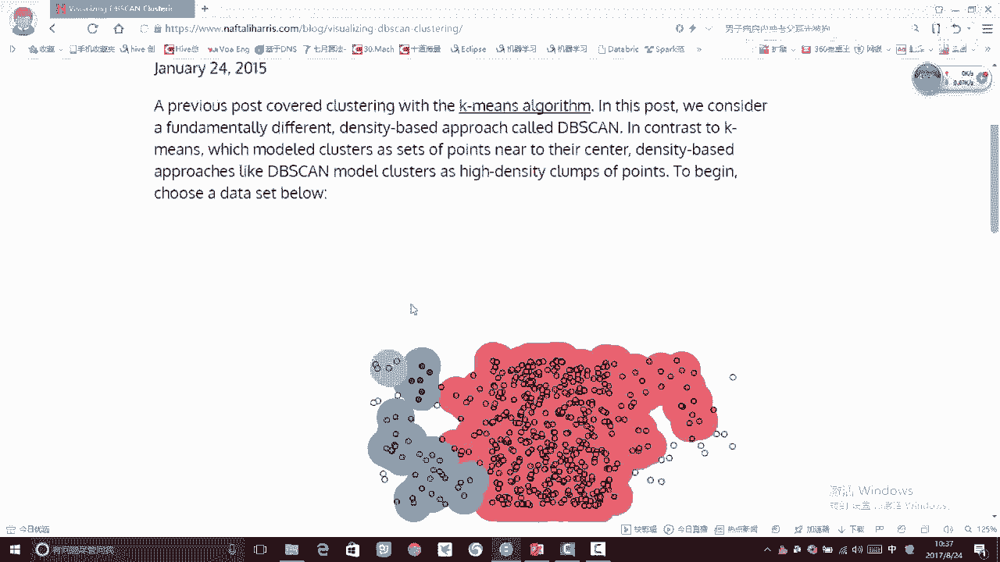

最后，我们总结了DBSCAN的优缺点：
*   **优点**：无需指定簇数、能发现任意形状簇、可以有效识别噪声点。
*   **缺点**：对参数敏感，在密度不均匀的数据集上效果可能不佳，调参缺乏绝对标准。

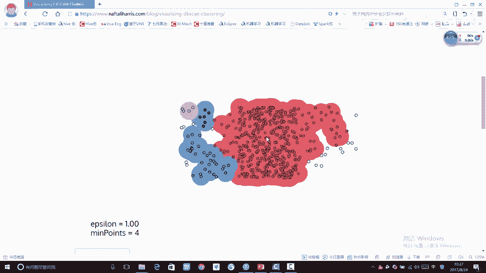

掌握这些可视化洞察，将帮助你在实际应用中更好地理解和运用DBSCAN算法。