# Python金融分析与量化交易实战教程：P71：07-6-DBSCAN可视化展示 🎯

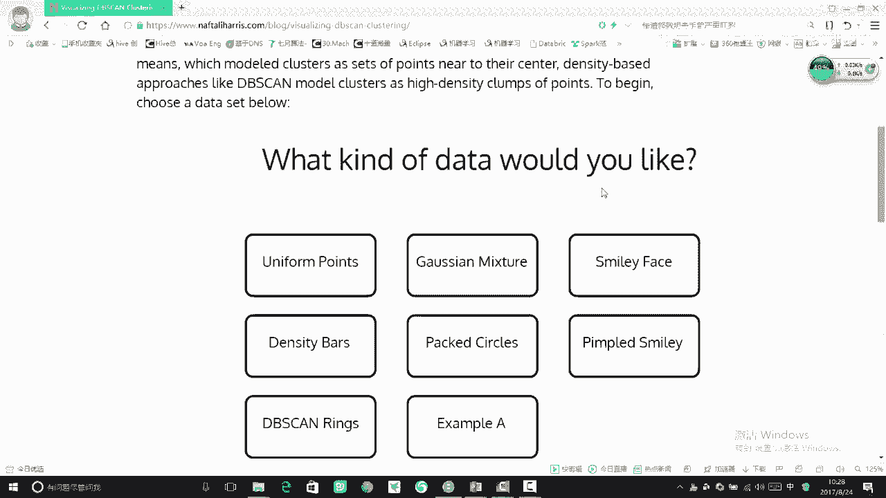

在本节课中，我们将通过可视化演示，深入理解DBSCAN算法的核心工作流程。我们将看到算法如何基于密度“发展”聚类，以及关键参数如何影响最终的聚类结果。

## 算法流程可视化演示

上一节我们介绍了DBSCAN算法的核心概念，本节中我们来看看它在实际数据集上是如何运行的。

我们首先选择一个数据集，并指定算法的两个核心参数：半径（`eps`）和最小点数（`min_samples`）。这两个参数需要手动指定，它们共同定义了“密度”的阈值。

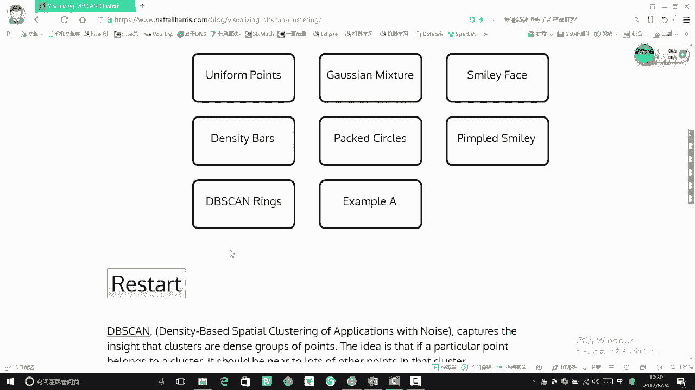

以下是DBSCAN的工作步骤演示：
1.  **选择起始点**：算法随机选择一个未访问的数据点。
2.  **“发展”聚类**：以该点为中心，画一个半径为 `eps` 的圆。如果圆内的点数（包括中心点）达到 `min_samples`，则该点被标记为核心点，并开始“发展”：将其圆内的所有点都纳入当前簇，并对这些新点重复此过程（即递归地画圆检查）。
3.  **完成当前簇**：当无法再找到新的可达点时，当前簇的扩展停止。
4.  **寻找新簇**：算法再选择一个未被访问的点，重复步骤2，开始建立一个新的“簇”。
5.  **标记噪声**：所有未被任何核心点“发展”到的点，最终被标记为噪声点或离群点。

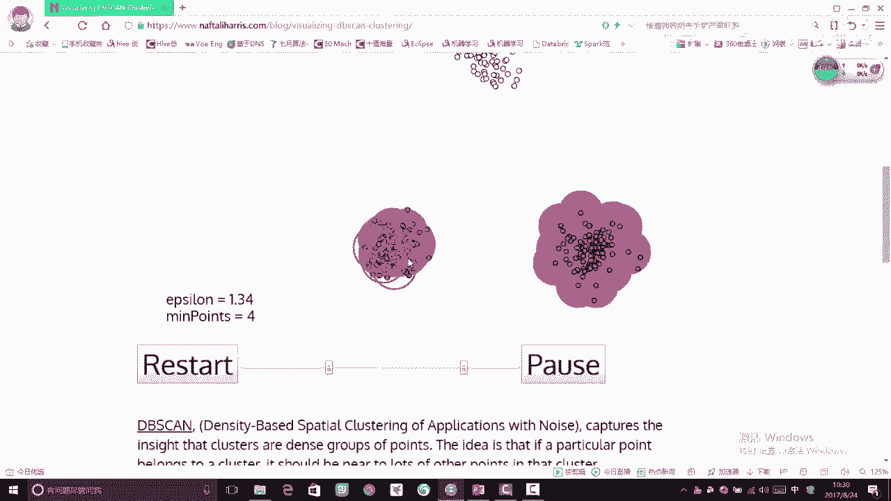

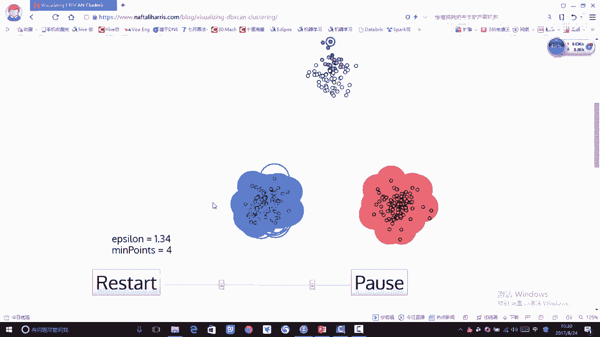

通过这个过程，算法成功地将数据点划分为了三个簇，并识别出了三个离群点（白色点）。这就是DBSCAN基于密度“发展”的工作流程。

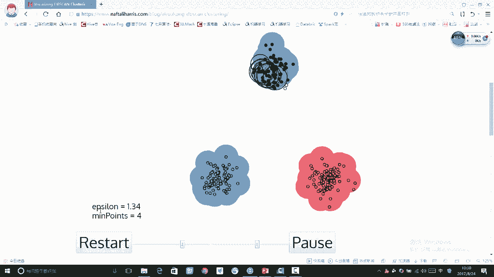

## 参数对结果的影响

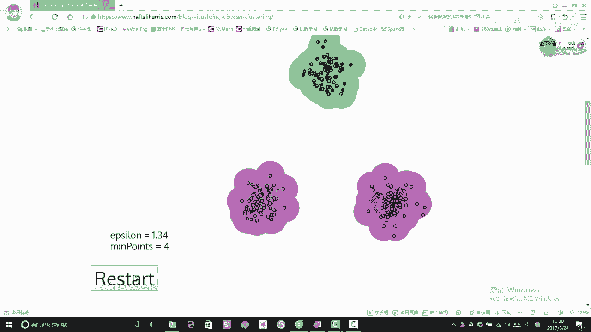

我们已经看到了DBSCAN的基本流程，现在我们来探讨一下参数调整如何改变聚类结果。

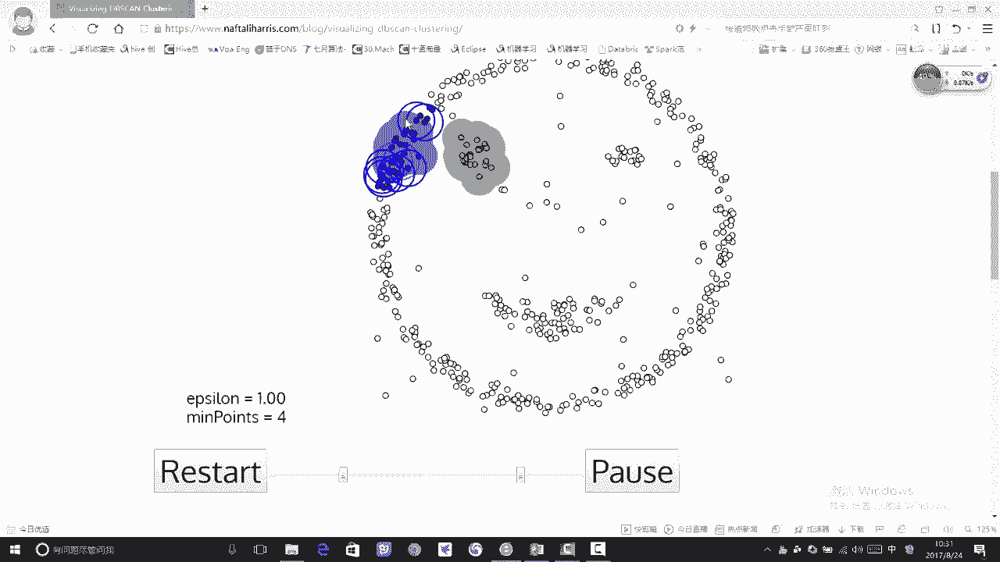

核心参数 `eps`（半径）和 `min_samples`（最小点数）对聚类形状，尤其是对离群点的判定有决定性影响。

以下是参数影响的观察：
*   **增大 `eps`**：当把半径设置得稍大一些，之前被判定为离群的点可能被纳入附近的簇中，从而减少或消除离群点。
*   **减小 `eps` 和 `min_samples`**：如果想更敏感地识别出离群点，可以将这两个参数设置得稍小一些。但这可能导致将原本稀疏的区域也分割成许多小簇。

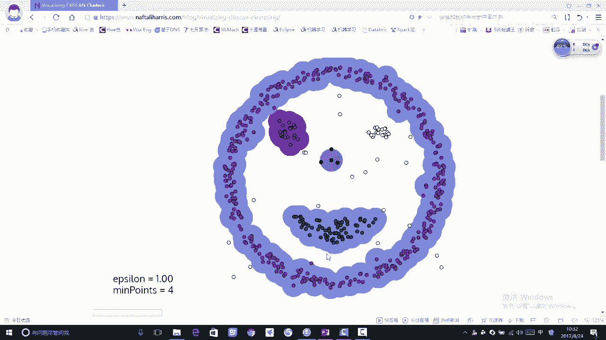

参数的选择没有固定答案，它直接决定了算法对数据“密度”的定义，从而影响最终的簇的个数和形状。

## DBSCAN vs. K-Means：处理复杂形状

之前我们提到K-Means在处理非球形数据时效果不佳。本节我们来看看DBSCAN如何应对这一挑战。

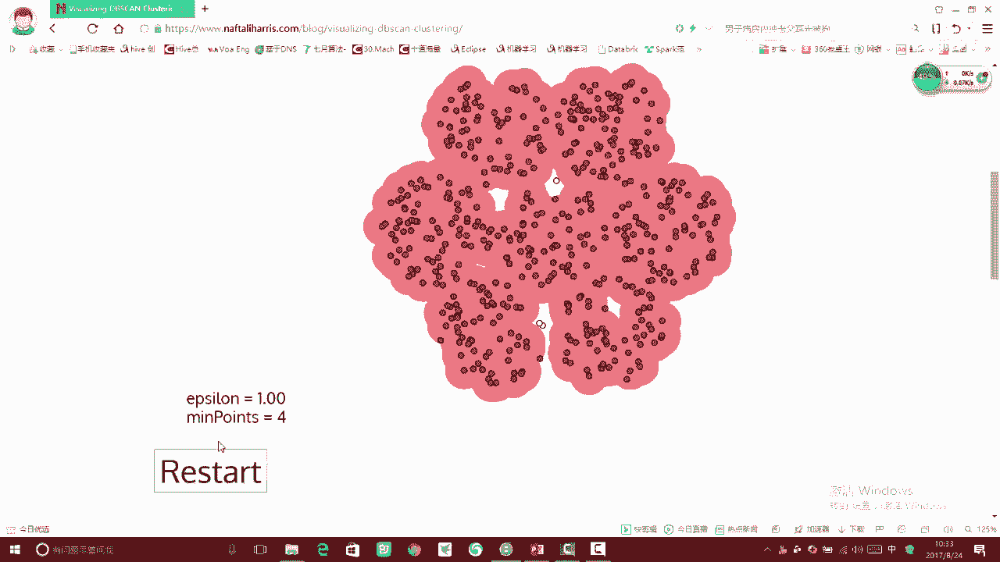

我们使用之前K-Means效果不好的“笑脸”形状数据集。DBSCAN的优势在于，它不需要预先指定簇的数量（`K`），并且能够发现任意形状的簇，只要簇内点满足密度可达的条件。

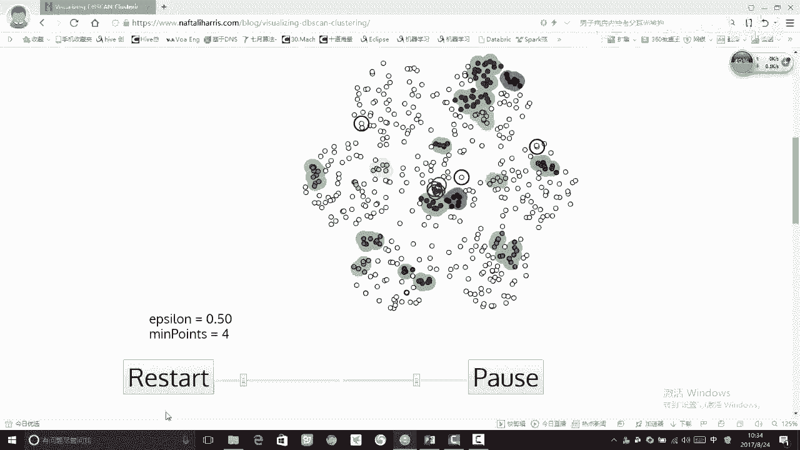

以下是DBSCAN处理复杂形状的过程：
1.  算法从一个点开始“发展”，逐渐将外圈相连的点纳入同一个簇（红色）。
2.  完成外圈后，算法从新的未访问点开始，发展出内部的簇（蓝色、绿色等）。
3.  只要区域内的点密度足够且相互可达，就会被归为同一簇。

最终，DBSCAN成功地根据密度将“笑脸”的不同部分区分开来，效果明显优于K-Means。这体现了基于密度聚类在发现任意形状簇方面的能力。

## 密集数据的挑战与参数调整

DBSCAN在处理密集且均匀分布的数据时，也会面临挑战。本节我们通过调整参数来观察结果的变化。

当数据整体都非常密集时，DBSCAN可能会将大部分数据点都圈进一个巨大的簇中，这失去了聚类的意义。

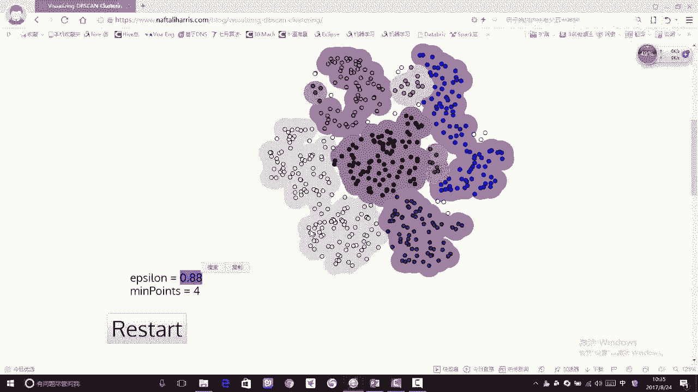

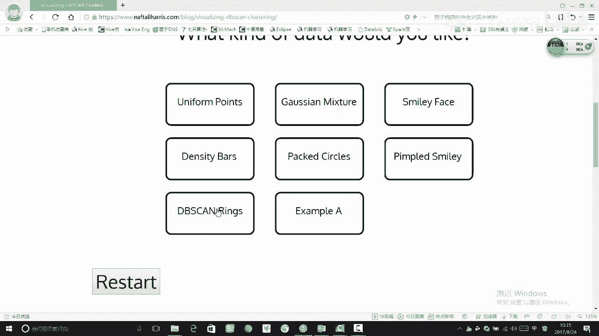

以下是调整参数 `eps` 的尝试：
*   **默认/较大 `eps`**：可能导致几乎所有点都被归为一个簇。
*   **过小 `eps`**：会将数据分割成数量过多、无意义的小簇。
*   **适中 `eps`**：需要反复调试，才能找到一个值，使得聚类结果既不过于笼统也不过于琐碎，形成几个有意义的“大模块”。

这个例子说明，**对于聚类问题，参数调优是一个关键且困难的环节**。因为没有绝对正确的“标准答案”，评估什么样的聚类结果“合适”很大程度上依赖于具体业务需求和分析目标。

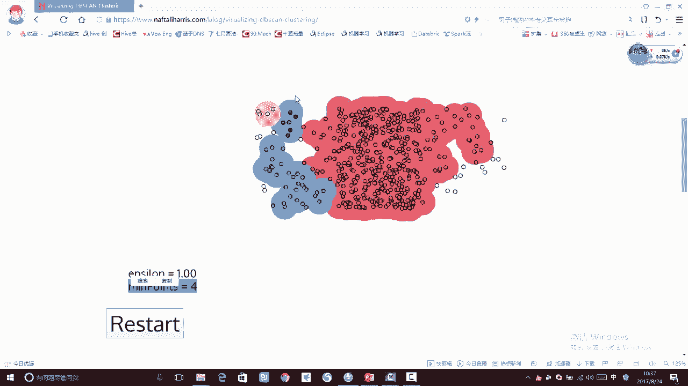

## 总结

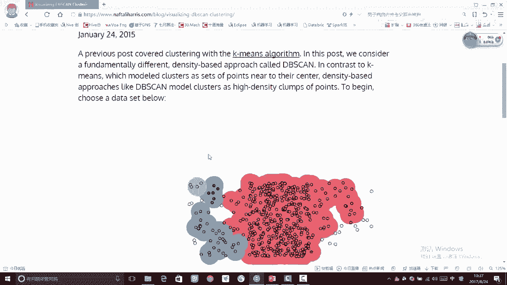

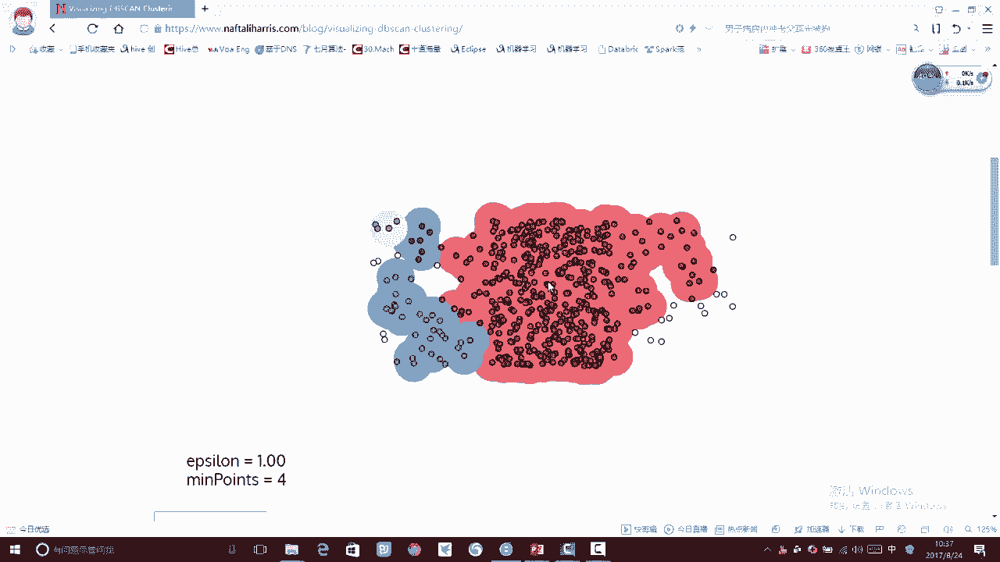

本节课中我们一起学习了DBSCAN算法的可视化工作流程。我们看到了它如何通过“发展”的方式形成聚类，并识别离群点。我们重点探讨了核心参数 `eps` 和 `min_samples` 对聚类结果的巨大影响，以及DBSCAN在发现任意形状簇方面的优势和在处理均匀密集数据时的挑战。理解这些特性，对于在实际应用中正确选择和调试聚类算法至关重要。