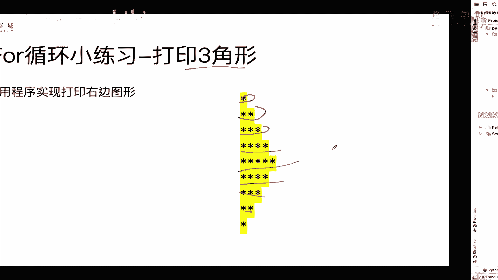
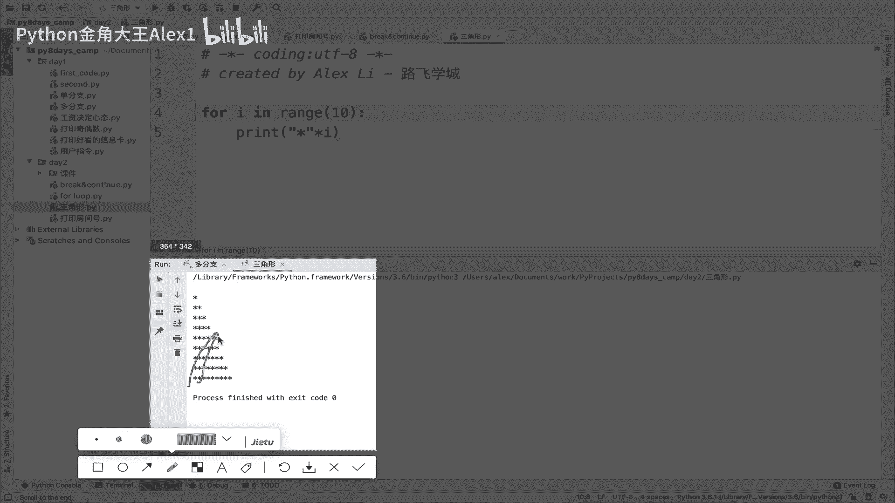
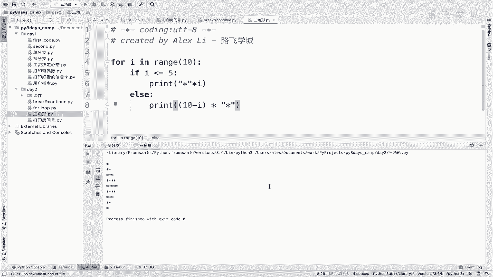

# Python数据分析实战：P23：04 for循环打印三角形

## 概述
在本节课中，我们将学习如何使用Python的`for`循环结构，通过控制星号（`*`）的打印数量，来绘制一个对称的三角形图案。这个练习将帮助我们巩固循环和条件判断的逻辑应用。

---

## 需求分析
程序的目标是打印出一个由星号组成的对称三角形。观察目标图形，可以发现其规律：星号的数量先逐行增加，到达中间行后，再逐行减少，最终形成一个对称的三角形。

## 实现思路
上一节我们介绍了基本的`for`循环。本节中我们来看看如何结合条件判断来控制循环行为，以生成特定图案。

核心思路是：使用一个`for`循环控制总行数。在循环内部，通过判断当前行数是否小于等于总行数的一半，来决定是增加还是减少该行打印的星号数量。



## 代码实现与讲解
以下是实现对称三角形打印的完整代码和分步解释。

```python
# 定义总行数为10
total_lines = 10



for i in range(1, total_lines + 1):
    # 判断当前是否为上半部分（包括中间行）
    if i <= total_lines // 2:
        # 打印 i 个星号
        print('*' * i)
    else:
        # 打印 (total_lines - i + 1) 个星号
        # 例如，第6行(i=6)，打印 10-6+1 = 5 个星号
        print('*' * (total_lines - i + 1))
```

**代码逻辑分解：**
1.  `for i in range(1, total_lines + 1):` 循环从1到10，控制打印10行。
2.  `if i <= total_lines // 2:` 判断当前行`i`是否小于等于总行数的一半（即5）。`//`是整除运算符。
3.  如果条件为真（第1到5行），则执行`print('*' * i)`。这里利用了字符串乘法，`'*' * i`会生成由`i`个星号组成的字符串。
4.  如果条件为假（第6到10行），则执行`print('*' * (total_lines - i + 1))`。这个公式确保星号数量从中间行之后开始递减。例如，第6行`i=6`，则打印`10-6+1=5`个星号。

## 运行结果
运行上述代码，将在控制台输出以下对称三角形：
```
*
**
***
****
*****
*****
****
***
**
*
```

## 总结
本节课中我们一起学习了如何利用`for`循环和`if-else`条件判断来打印一个对称的三角形。我们掌握了两个关键点：
1.  使用`range()`函数控制循环次数。
2.  在循环体内通过条件判断，并应用字符串乘法（`*`操作符）来动态决定每行输出的内容。



这个练习很好地融合了循环控制与基础逻辑，是理解程序流程控制的经典案例。