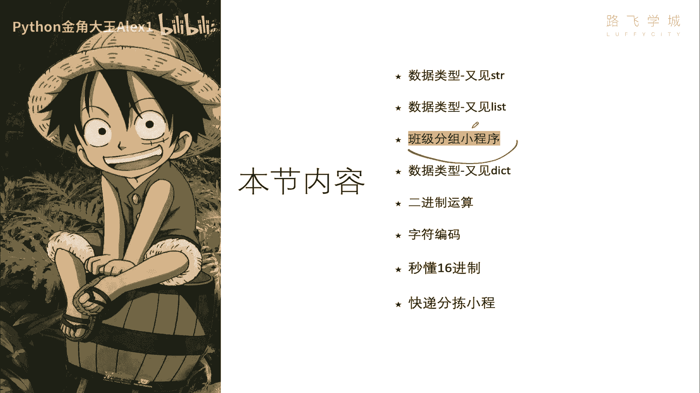
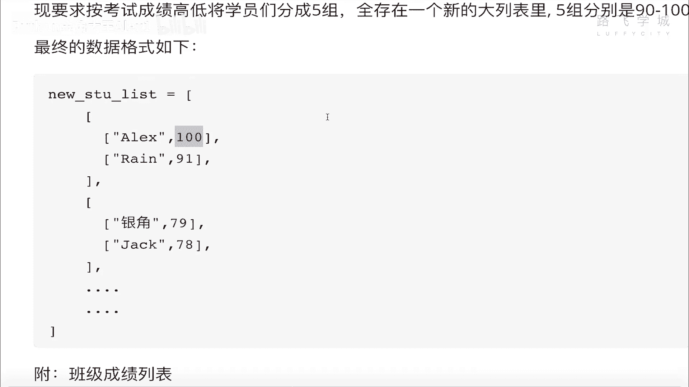
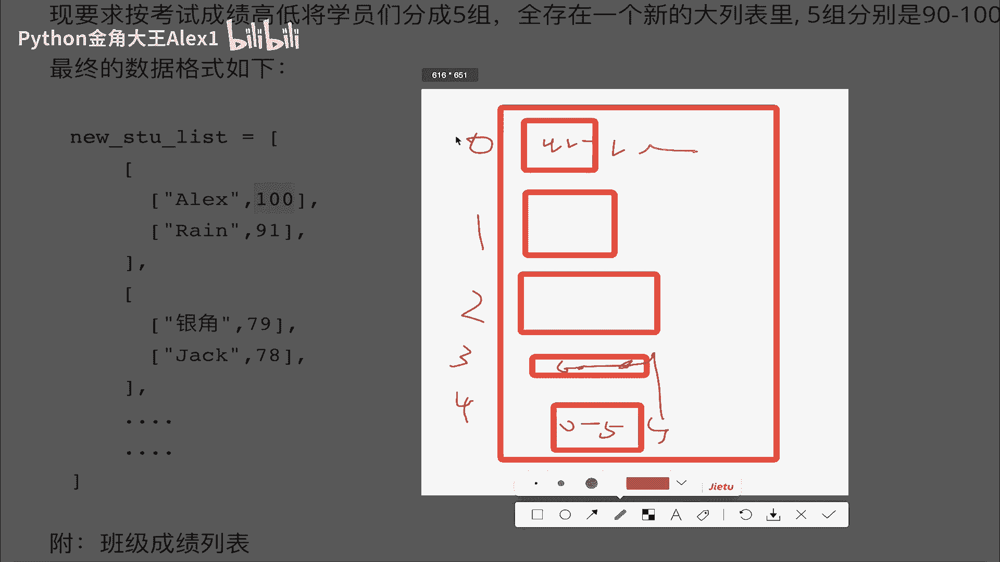
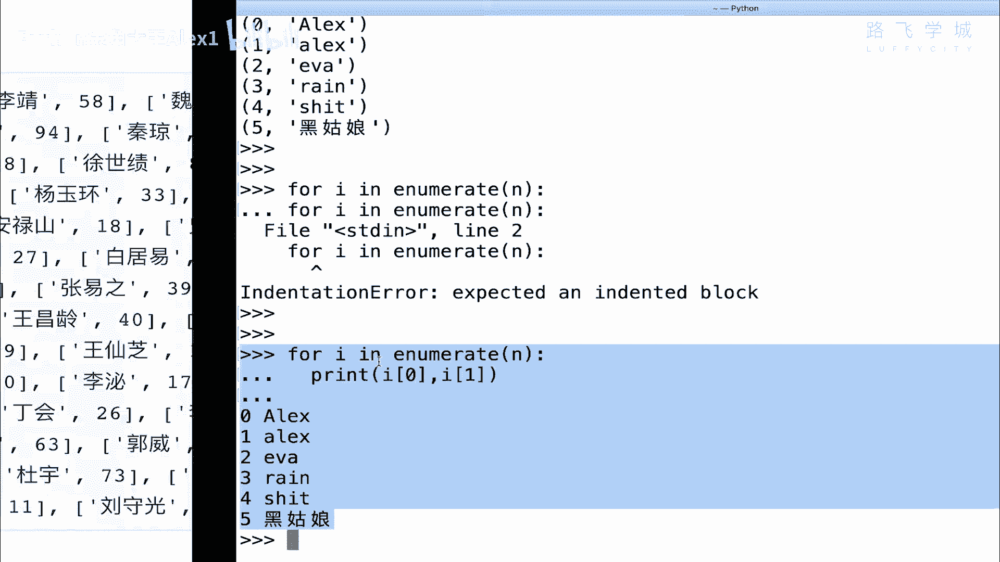
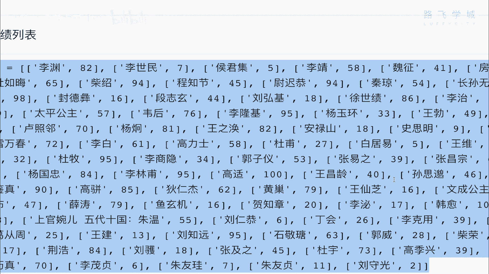
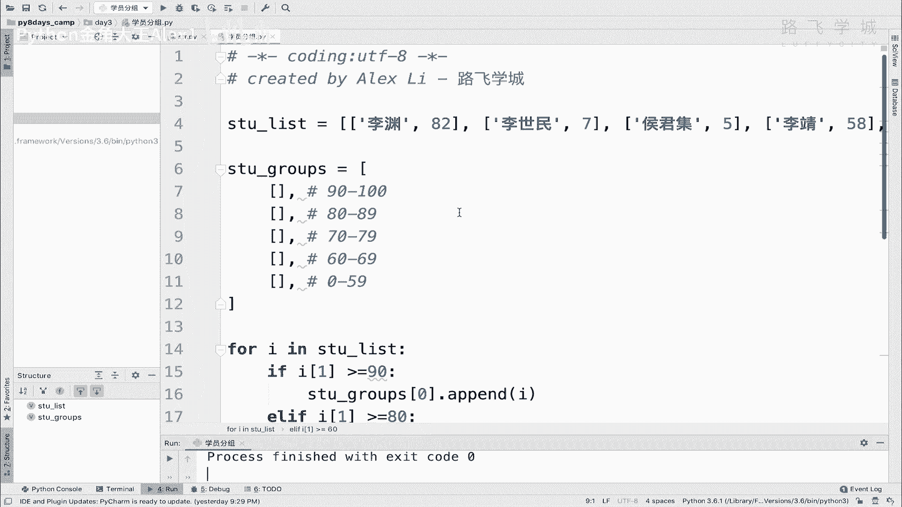
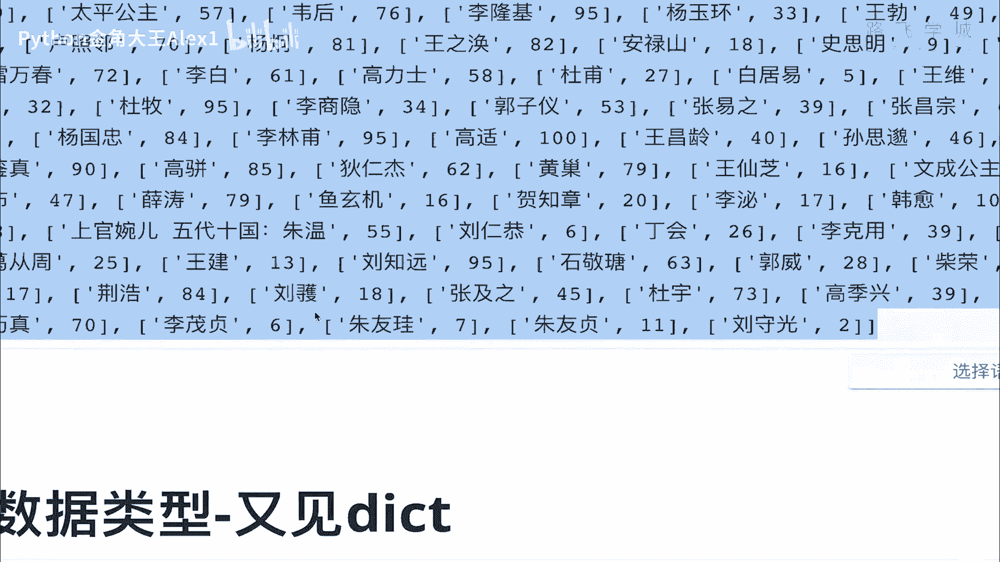

# Python数据分析实战：P32：04 班级按成绩分组小程序 📊



在本节课中，我们将学习如何利用Python列表，完成一个“班级按成绩分组”的小程序。我们将从一个包含学生姓名和成绩的原始列表出发，根据分数区间将学生分配到不同的组别，并最终整理成结构化的分组列表。

---

## 需求分析

假设一个班级有50多名学生。每位学生的姓名和成绩存储在一个大的列表中，其中每个元素又是一个小列表，格式为 `[姓名, 成绩]`。

我们的任务是根据成绩将学生分为五组：
*   **A组**：90~100分
*   **B组**：80~89分
*   **C组**：70~79分
*   **D组**：60~69分
*   **E组**：0~59分（不及格）

最终，我们需要生成一个新的列表，其结构为：一个包含五个子列表的大列表，每个子列表对应一个成绩区间的学生信息。

**原始数据格式示例：**
```python
[['张三', 95], ['李四', 82], ['王五', 77], ...]
```



**目标数据格式示例：**
```python
[
    [['张三', 95], ...], # A组：90~100分
    [['李四', 82], ...], # B组：80~89分
    [['王五', 77], ...], # C组：70~79分
    [...], # D组：60~69分
    [...]  # E组：0~59分
]
```

---

## 实现思路

上一节我们明确了需求，本节中我们来看看如何实现。核心思路分为两步：



1.  **初始化结果容器**：首先创建一个包含五个空子列表的大列表，分别对应五个成绩区间。
2.  **遍历与分类**：然后遍历原始学生列表，根据每个学生的成绩判断其所属区间，并将其添加到结果大列表对应的子列表中。

以下是实现这个思路的具体步骤。





### 步骤一：准备数据与初始化分组列表

我们首先定义原始的学生成绩列表 `stu_list`。接着，初始化目标分组列表 `stu_groups`，它是一个包含五个空列表的大列表。

```python
# 原始学生数据列表
stu_list = [
    ['李存勖', 99],
    ['李隆基', 98],
    ['杜牧', 97],
    ['李林甫', 96],
    ['韩愈', 95],
    ['刘知远', 94],
    ['长孙无忌', 85],
    ['李渊', 84],
    ['房玄龄', 83],
    ['太平公主', 82],
    ['李元霸', 81],
    ['李元吉', 80],
    ['李建成', 79],
    ['李治', 78],
    ['李显', 77],
    ['李旦', 76],
    ['李重茂', 75],
    ['李重俊', 74],
    ['李裹儿', 73],
    ['李令月', 72],
    ['李令则', 71],
    ['李令仪', 70],
    ['李令婉', 69],
    ['李令英', 68],
    ['李令晖', 67],
    ['李令媛', 66],
    ['李令娥', 65],
    ['李令娣', 64],
    ['李令姬', 63],
    ['李令妤', 62],
    ['李令媖', 61],
    ['李令娴', 60],
    ['李世民', 7],
    ['李承乾', 8],
    ['李泰', 9],
    ['李恪', 10],
    ['李愔', 11],
    ['李贞', 12],
    ['李慎', 13],
    ['李福', 14],
    ['李明', 15],
    ['李灵夔', 16],
    ['李元祥', 17],
    ['李元晓', 18],
    ['李元婴', 19],
    ['李凤', 20],
    ['李元轨', 21],
    ['李元庆', 22],
    ['李元裕', 23],
    ['李元名', 24],
    ['李灵龟', 25],
    ['李元方', 26],
    ['李元礼', 27],
    ['李元嘉', 28],
    ['李元则', 29],
    ['李元懿', 30]
]

# 初始化分组列表：一个包含5个空列表的大列表
# 索引0: 90-100分, 索引1: 80-89分, 索引2: 70-79分, 索引3: 60-69分, 索引4: 0-59分
stu_groups = [[], [], [], [], []]
```

### 步骤二：遍历学生列表并进行分组

接下来，我们遍历 `stu_list` 中的每一个学生信息。对于每个学生，我们提取其成绩，并通过一系列条件判断决定将其放入 `stu_groups` 中的哪一个子列表。

```python
# 遍历原始学生列表
for student in stu_list:
    name = student[0]   # 学生姓名
    score = student[1]  # 学生成绩

    # 根据成绩区间，将学生添加到对应的分组中
    if score >= 90:
        stu_groups[0].append(student)  # A组
    elif score >= 80:
        stu_groups[1].append(student)  # B组
    elif score >= 70:
        stu_groups[2].append(student)  # C组
    elif score >= 60:
        stu_groups[3].append(student)  # D组
    else:
        stu_groups[4].append(student)  # E组 (不及格组)
```

### 步骤三：输出分组结果

最后，我们可以遍历 `stu_groups`，打印出每个分组的学生信息，以验证程序是否正确运行。

```python
# 打印分组结果
for index, group in enumerate(stu_groups):
    group_name = ['A组(90-100)', 'B组(80-89)', 'C组(70-79)', 'D组(60-69)', 'E组(0-59)'][index]
    print(f"\n{group_name}:")
    for student in group:
        print(f"  {student[0]}: {student[1]}分")
```

运行以上完整代码，你将在控制台看到按成绩清晰分组的班级学生名单。

---

## 总结



本节课中我们一起学习了“班级按成绩分组”小程序的实现。通过这个练习，我们巩固了Python列表的核心操作，包括：
1.  **列表的嵌套结构**：创建和操作包含子列表的大列表。
2.  **列表的遍历**：使用 `for` 循环处理列表中的每个元素。
3.  **条件判断**：使用 `if-elif-else` 语句根据成绩进行逻辑分支。
4.  **列表元素的添加**：使用 `.append()` 方法将元素添加到指定列表。



这个程序虽然简单，但完整地体现了数据处理中“**数据准备 -> 逻辑处理 -> 结果输出**”的基本流程。掌握这种思路，是进行更复杂数据分析与处理的基础。你会发现，许多复杂任务的核心，正是由这样清晰而简单的步骤组合而成。