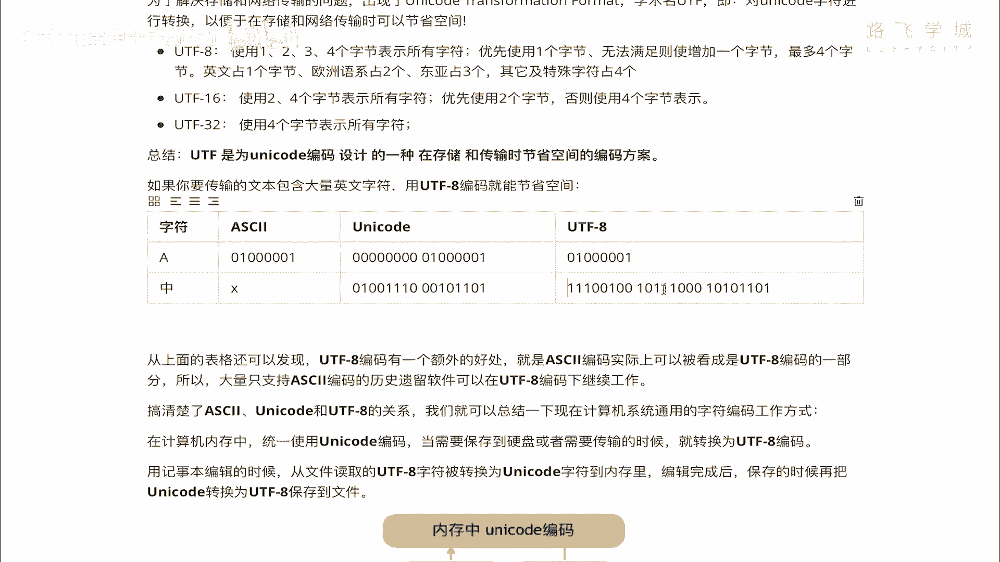
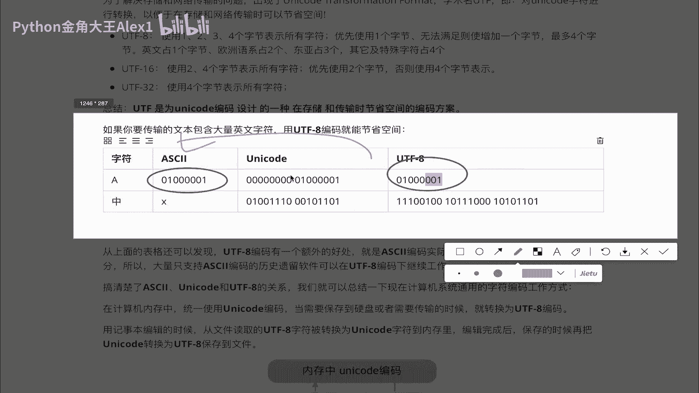
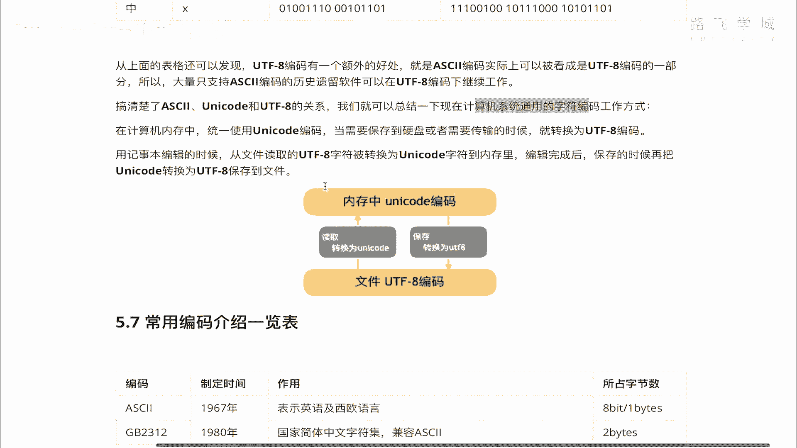
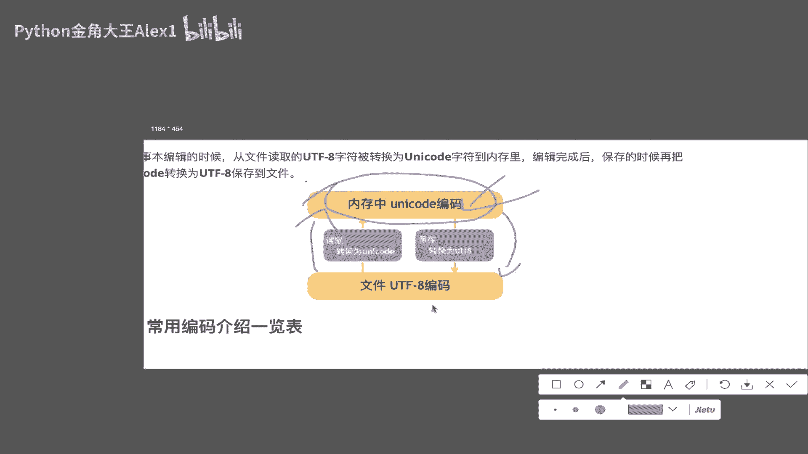
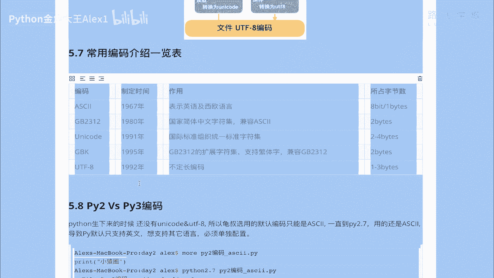
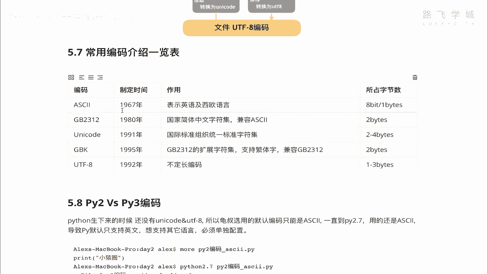
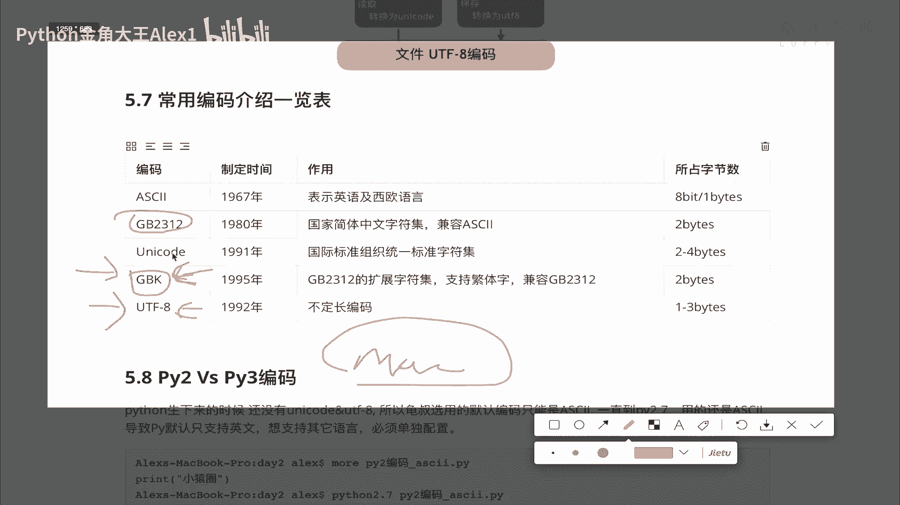
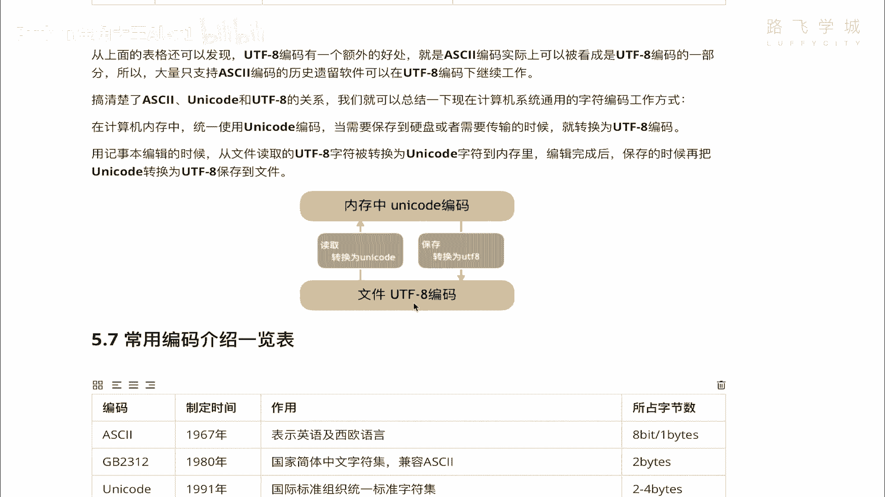

# Python数据分析实战：P39：11：UTF-8编码详解 🧩

在本节课中，我们将深入探讨字符编码的最后一个核心概念——UTF-8。我们将了解它为何被创造出来，它与ASCII、Unicode的关系，以及它在现代计算机系统中的核心作用。

## 概述

上节课我们学习了Unicode（万国码），它解决了全球字符统一编码的问题，消除了乱码。然而，Unicode带来了新的挑战：存储和传输效率的降低。本节课，我们将看看UTF-8编码是如何解决这个问题的。

## Unicode带来的存储问题

Unicode为所有字符分配了唯一的码点，但其存储方式（如UTF-16）存在空间浪费的问题。

*   **常用字符**（如大部分中文、英文字母）通常占用2个字节。
*   **特殊字符**可能占用3到4个字节。

这导致了一个直接的问题：对于原本使用ASCII编码的纯英文文本，文件大小会急剧膨胀。

**例如**：
*   在ASCII编码中，英文字符 `A` 占用 **1个字节**。
*   在Unicode（如UTF-16）中，同一个字符 `A` 至少占用 **2个字节**。

这意味着，一个10MB的纯英文文本文件，如果简单地转换为Unicode存储，体积可能翻倍至20MB。这对于硬盘存储和网络传输来说是无法接受的效率损失。

## UTF-8的诞生与设计理念

为了解决Unicode在存储和传输时的空间效率问题，科学家们设计了 **UTF-8**（Unicode Transformation Format - 8-bit）。

它的全称揭示了其本质：**Unicode转换格式**。UTF-8是一种针对Unicode的可变长度字符编码。它并非一套全新的字符集，而是一种将Unicode码点高效编码成字节序列的“压缩”技术。

其核心设计思想是：**根据字符的不同，动态地使用1到4个字节进行编码**。

以下是UTF-8的编码规则：
*   **英文字符**：占用 **1个字节**。其编码与ASCII码完全兼容。
*   **欧洲语系字符**（如拉丁语、希腊语、西里尔字母）：通常占用 **2个字节**。
*   **东亚字符**（如中文、日文、韩文）：占用 **3个字节**。
*   **其他非常用字符和符号**：占用 **4个字节**。



这种设计带来了巨大优势：
1.  **完全兼容ASCII**：所有ASCII文本本身就是有效的UTF-8编码，保证了历史遗留软件的兼容性。
2.  **节省空间**：对于英文为主的文本，其存储大小与ASCII相同，远小于固定2字节的Unicode编码。
3.  **自同步性**：便于从字节流的任意位置开始识别字符。



> **注意**：对于中文文本，UTF-8（3字节）相比某些Unicode编码（如UTF-16的2字节）反而会占用更多空间。但由于其整体优势和国际通用性，它已成为互联网和文件存储的事实标准。

## 编码关系总结与工作流程



现在，让我们理清ASCII、Unicode和UTF-8三者的关系，以及现代计算机系统如何处理字符编码。

**编码关系对比表**：

| 字符 | ASCII | Unicode (示例) | UTF-8 |
| :--- | :--- | :--- | :--- |
| 英文字母 `A` | `0x41` (1字节) | `U+0041` (2字节) | `0x41` (1字节) |
| 中文 `中` | 不支持 | `U+4E2D` (2字节) | `0xE4B8AD` (3字节) |




从上表可以看出，UTF-8在编码英文时直接沿用了ASCII码，这使得它具备了向后兼容性。





**现代计算机系统中的编码工作流程**：

计算机系统采用一种“内外有别”的策略来处理编码，具体流程如下图所示：

```
        [ 内存处理 ]
              │
        Unicode编码 (统一码点)
              │
        ╔══════════╗
        ║   编码   ║ ← 存储到文件或网络发送
        ║ 转换过程 ║
        ║ (Encode) ║
        ╚══════════╝
              │
        UTF-8编码 (存储/传输格式)
              │
        [ 硬盘存储 / 网络传输 ]
              │
        ╔══════════╗
        ║   解码   ║ ← 从文件读取或网络接收
        ║ 转换过程 ║
        ║ (Decode) ║
        ╚══════════╝
              │
        Unicode编码 (统一码点)
              │
        [ 内存处理 ]
```

1.  **内存中**：程序运行时，字符串在内存中通常以 **Unicode** 形式存在，这是为了便于程序内部对各种语言字符进行统一处理。
2.  **存储或传输时**：当需要将字符串保存到文件或通过网络发送时，会通过 **编码（Encode）** 过程，将内存中的Unicode字符串转换为节省空间的 **UTF-8** 字节序列。
3.  **读取或接收时**：当从文件读取数据或从网络接收数据时，得到的是一串UTF-8字节序列。程序需要通过 **解码（Decode）** 过程，将其转换回内存中的Unicode字符串，以便处理。



这个“**内存用Unicode，存储传输用UTF-8**”的模式，是目前最通用和高效的字符处理方案。

## 常用编码简介与现状

以下是几种常见编码的简要介绍：
*   **ASCII**：最早期，仅支持英文和基本控制字符。
*   **GB2312 / GBK**：中国制定的国家标准，用于编码简体中文。GBK是GB2312的扩展。在一些历史遗留系统和Windows中文版默认环境中仍在使用。
*   **Unicode**：字符集标准，为全球所有字符提供唯一编号（码点）。
*   **UTF-8**：Unicode的一种实现方式，是目前互联网和跨平台文件存储的**首选编码**。

> **系统差异**：Windows系统的默认编码通常是GBK，而macOS、Linux及大多数现代开发环境的默认编码是UTF-8。在跨平台协作时，明确指定使用UTF-8可以避免很多乱码问题。

## Python中的编码实践

Python语言的发展也深刻反映了编码史的变迁。理解这一点有助于避开潜在的编码陷阱。

**Python 2 vs Python 3 的重大区别**：
*   **Python 2**：诞生于Unicode标准普及之前，默认采用ASCII编码处理源代码。因此，在Python 2的源代码文件中直接写中文可能会引发语法错误。必须在文件开头声明编码，解释器才能正确识别。
    ```python
    # -*- coding: utf-8 -*-
    print("你好，世界！")
    ```
*   **Python 3**：将**Unicode作为默认的字符串编码**。源代码文件默认使用UTF-8编码，因此可以直接书写和处理多国语言字符，无需特殊声明。
    ```python
    # 在Python 3中，这是完全合法的
    print("Hello, 世界！")
    ```

幸运的是，我们现在学习的是Python 3，它已经很好地处理了编码问题，让开发者可以更专注于逻辑本身。具体的编码转换操作（如`encode()`和`decode()`方法）我们将在后续讲解文件操作时深入学习。

## 总结

本节课我们一起深入学习了UTF-8编码。我们了解到UTF-8是为了解决Unicode在存储和传输时空间效率低下而设计的可变长编码方案。它巧妙地兼容了ASCII，并根据字符范围使用1到4个字节，在空间和兼容性上取得了最佳平衡。



我们掌握了现代计算机系统“内存Unicode，外存UTF-8”的核心工作流程，并了解了Python 3如何将Unicode作为默认编码，极大简化了多语言文本的处理。理解这些编码知识，是进行数据处理、文件操作和网络通信的重要基础。