# Python文件操作：P49：08 跳到文件任意位置修改 📂

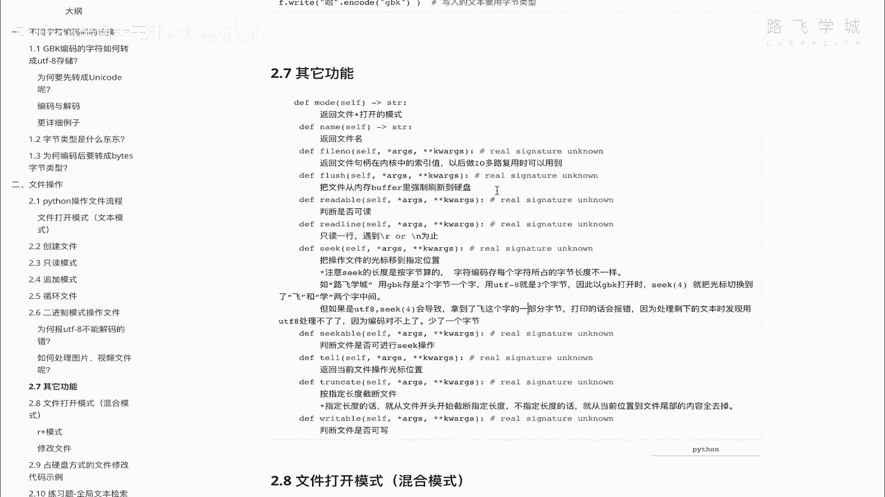

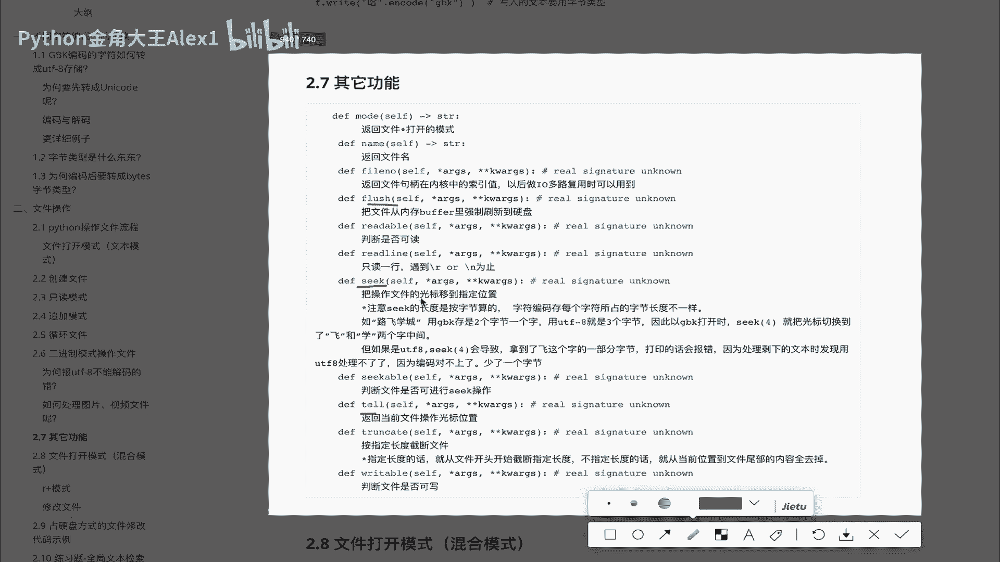

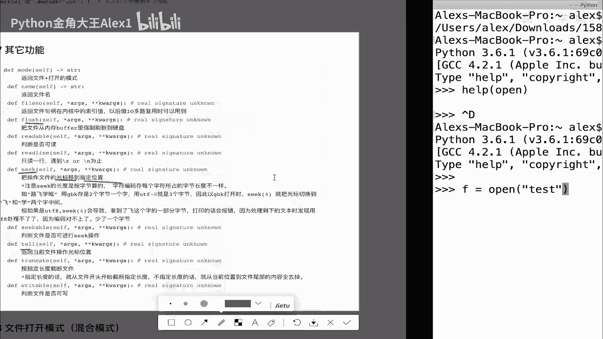

在本节课中，我们将学习Python操作文件的三个重要方法：`seek()`、`tell()`和`flush()`。这些方法能帮助我们更灵活地控制文件读写的位置，并理解数据写入硬盘的机制。

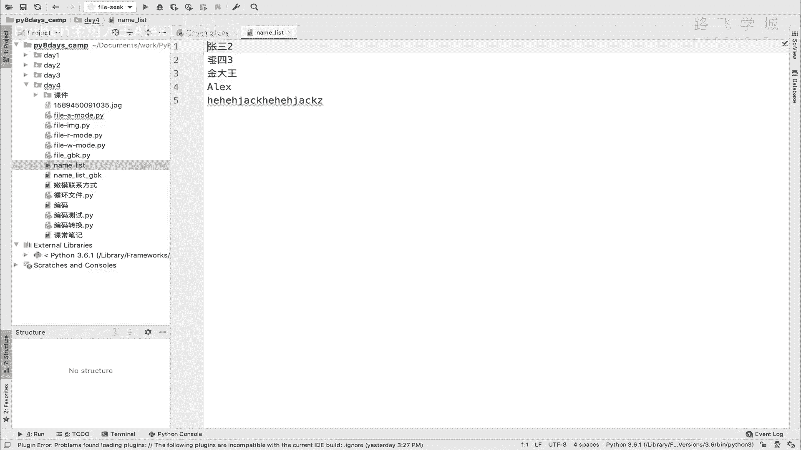

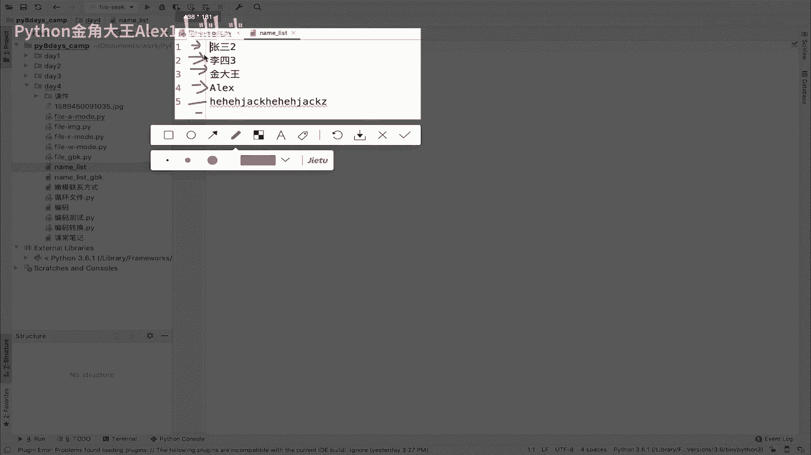

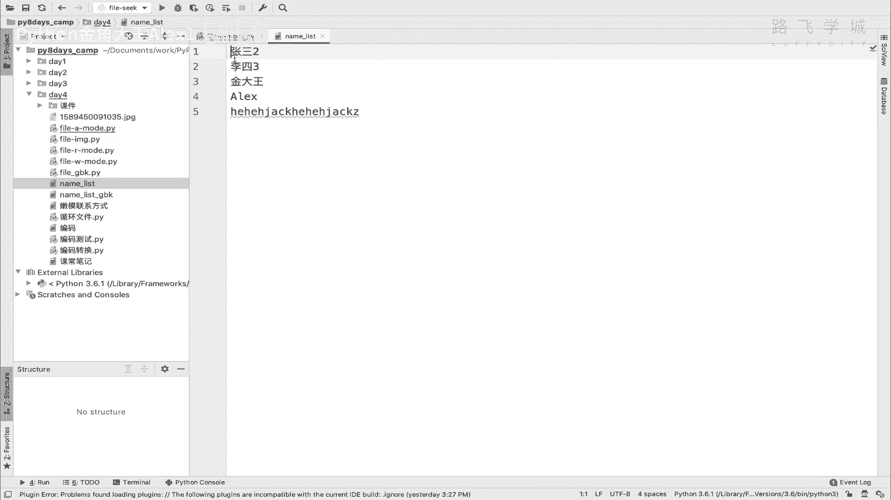

## 理解文件光标 📍

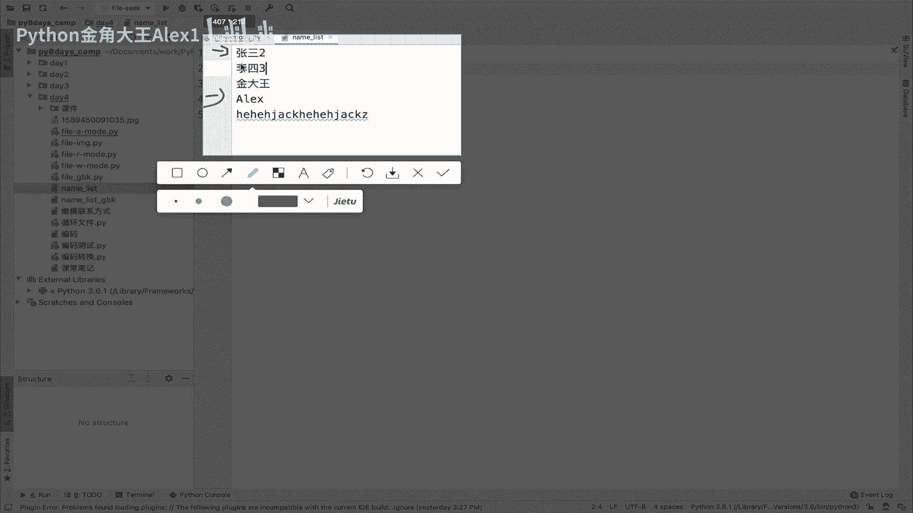

上一节我们介绍了基本的文件读写操作。本节中我们来看看如何控制文件内部的光标位置。

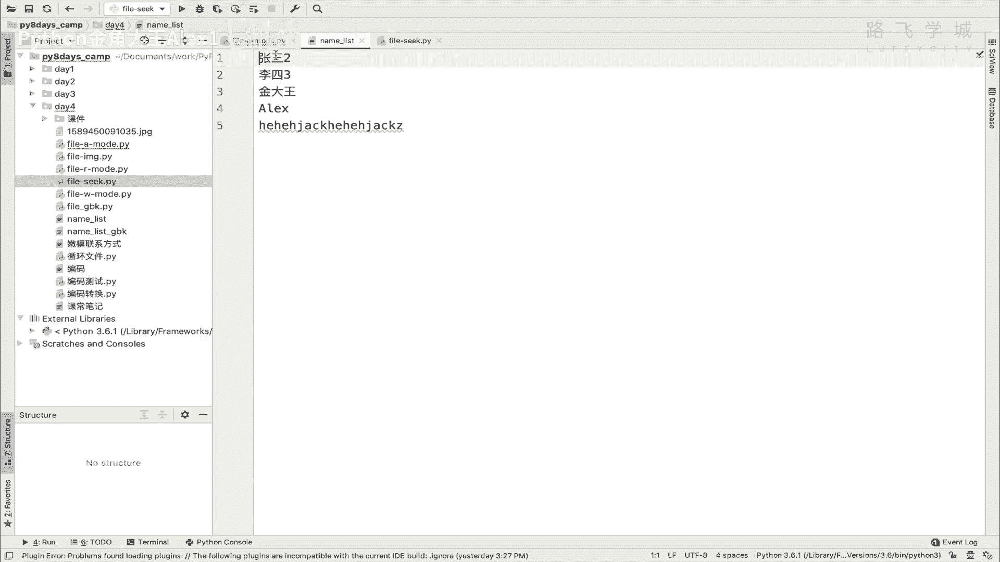

当我们打开一个文件时，系统内部会有一个“光标”来记录当前的读写位置。这个光标就像在Word文档中闪烁的竖线，指示着下一个操作发生的位置。初始时光标位于文件开头（位置0）。每执行一次`readline()`，光标就会移动到下一行的开头。

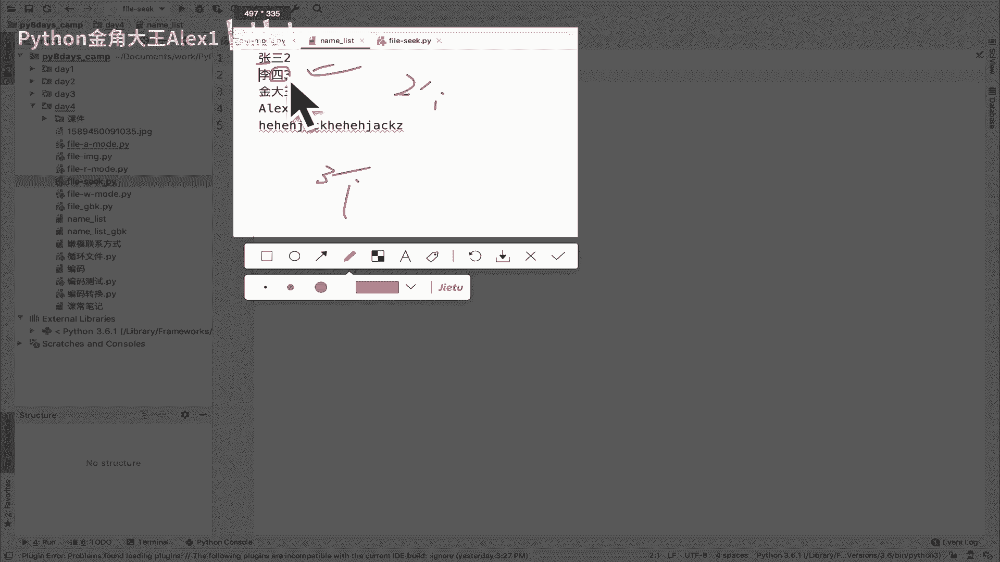

`seek()`方法的作用就是**将操作文件的光标移动到指定的位置**。其基本语法是：
```python
file.seek(offset)
```
其中`offset`参数代表要移动到的**字节位置**，而不是字符个数。

## 使用 `seek()` 移动光标

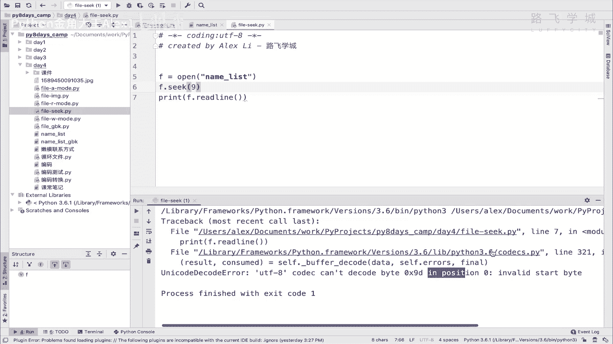

以下是使用`seek()`方法移动光标并读取文件的步骤：

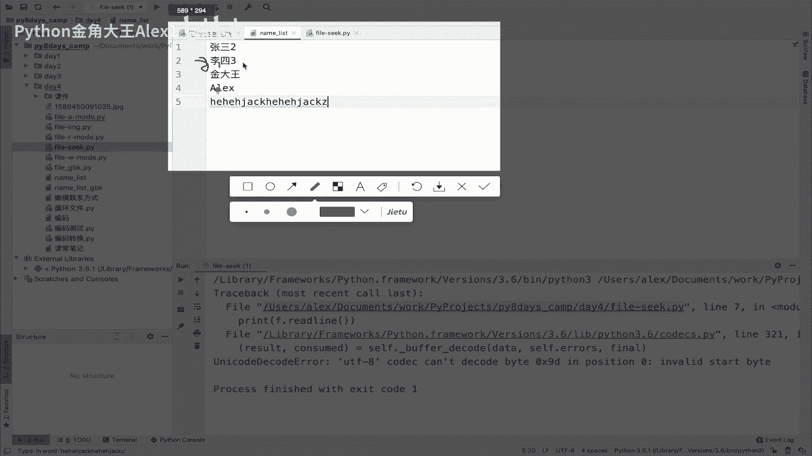

1.  打开文件，默认光标在位置0。
2.  使用`seek()`将光标移动到指定字节位置。
3.  从新的光标位置开始执行读写操作。

让我们通过代码来演示。假设我们有一个UTF-8编码的文件`name_list.txt`，内容如下：
```
张三
李四
王五
```
在UTF-8编码中，一个中文字符占3个字节，换行符`\n`占1个字节。

```python
with open('name_list.txt', 'r', encoding='utf-8') as f:
    # 将光标移动到第6个字节（即“张”字之后，“三”字之前）
    f.seek(6)
    # 从当前位置读取一行
    print(f.readline())  # 输出：三
```
**注意**：移动光标时不能破坏字符的完整性。例如，一个UTF-8中文字符由3个字节组成，如果将光标移动到某个字符的中间（如第7或第8字节），再尝试读取会导致解码错误。

## 使用 `tell()` 获取光标位置

与`seek()`成对出现的方法是`tell()`。`tell()`的作用是**返回光标当前所在的字节位置**。

```python
with open('name_list.txt', 'r+', encoding='utf-8') as f:
    f.write('Hello1\nHello2\nHello3\n')
    # 获取写完三行后光标的位置
    print(f.tell())  # 输出一个数字，例如 21
    # 将光标移回某个位置（例如第10字节）
    f.seek(10)
    print(f.tell())  # 输出：10
    # 在光标位置写入新内容，会覆盖原有内容
    f.write('NewText')
```
需要了解的是，在已有内容的文件上使用`seek()`定位并写入时，新内容会**直接覆盖**原位置之后的内容，而不是将原有内容“挤开”。

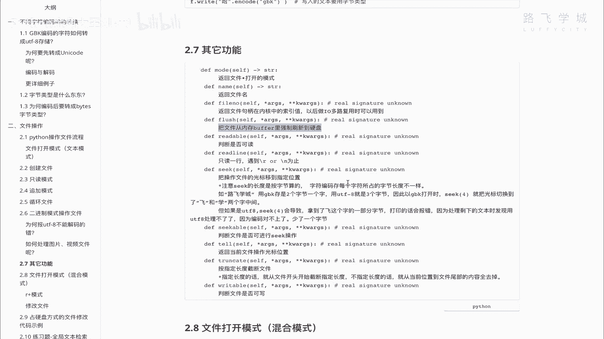

## 使用 `flush()` 强制写入硬盘 🚀

最后，我们来学习`flush()`方法。要理解它，首先需要知道数据写入的流程。

计算机的CPU、内存和硬盘速度差异很大。为了提高效率，当我们执行`write()`操作时，数据通常不会立刻写入速度较慢的硬盘，而是先暂存到内存中的一个**缓冲区（Buffer）**。当缓冲区积累了一定量的数据，系统才会一次性将其写入硬盘。

`flush()`方法的作用就是**强制将缓冲区中的数据立刻写入硬盘**，确保数据持久化。这在处理重要数据（如金融交易）时非常有用，可以防止程序意外终止导致数据丢失。

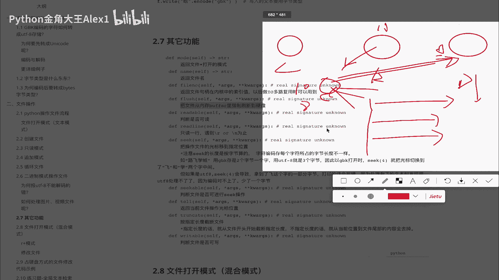

```python
# 演示 flush() 的作用
with open('important.log', 'w') as f:
    f.write('Transaction Step 1: Start\n')
    # 重要数据，立即写入硬盘
    f.flush()
    # ... 执行一些其他操作
    f.write('Transaction Step 2: Processing\n')
    f.flush()
```
如果不调用`flush()`，在缓冲区未满或文件未关闭的情况下，数据可能只存在于内存中。如果此时断电或程序崩溃，这些数据就会丢失。

## 总结 📝

本节课中我们一起学习了三个控制文件操作的核心方法：
1.  **`seek(offset)`**：将文件光标移动到指定的字节位置。
2.  **`tell()`**：返回当前光标的字节位置。
3.  **`flush()`**：强制将内存缓冲区中的数据写入硬盘，确保数据安全。

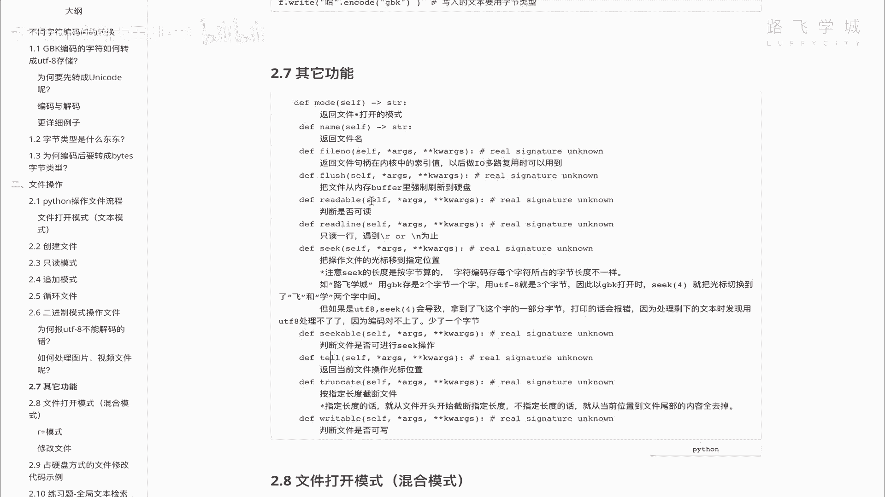

理解光标的概念是灵活进行文件操作的基础，而`flush()`则帮助我们理解了数据从内存到硬盘的写入机制，在需要保证数据可靠性的场景中至关重要。