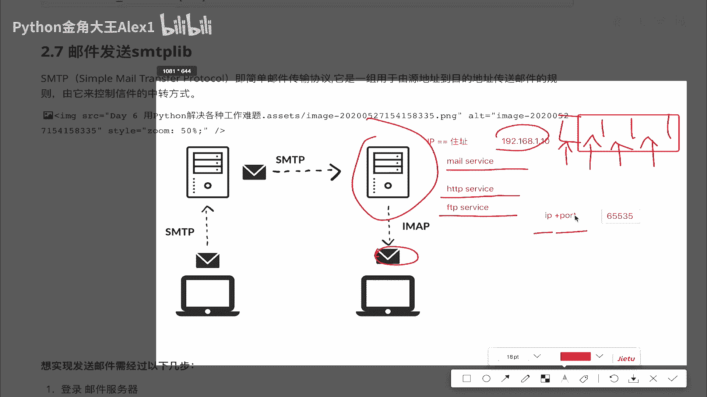
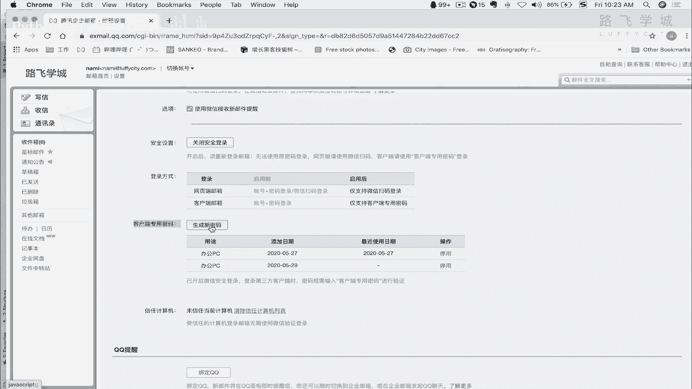
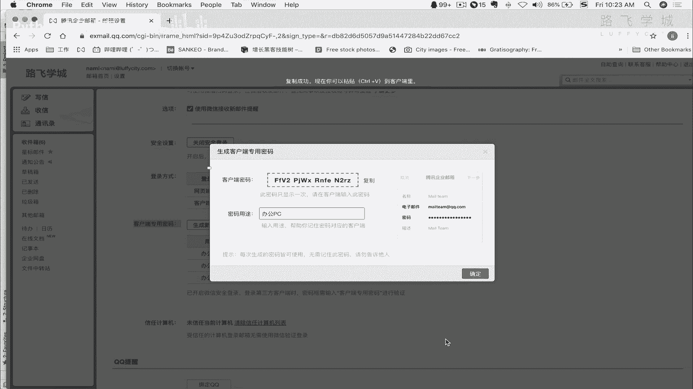
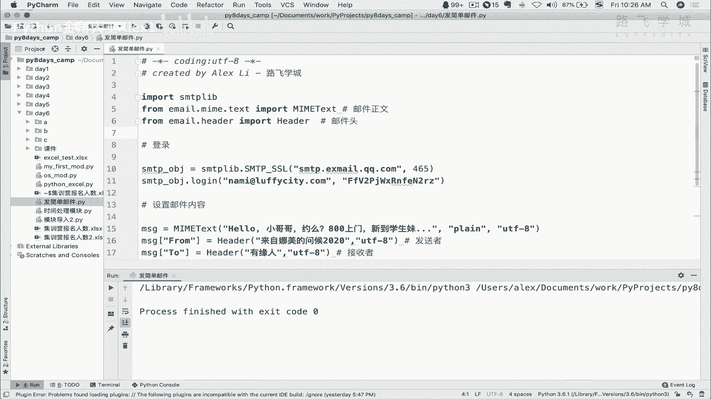
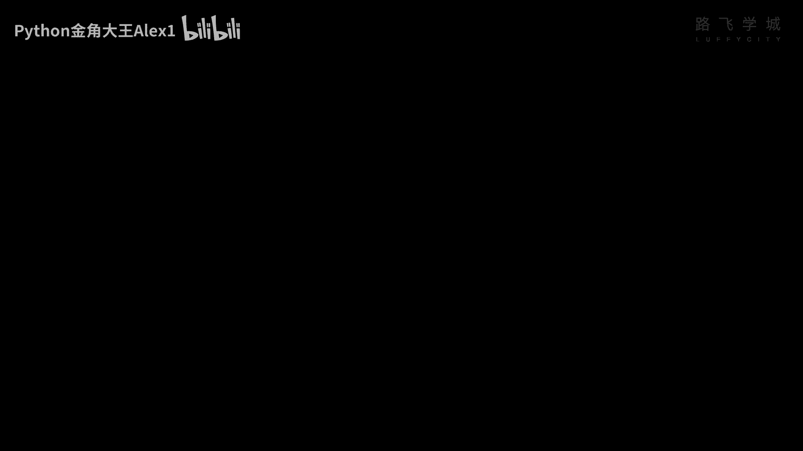
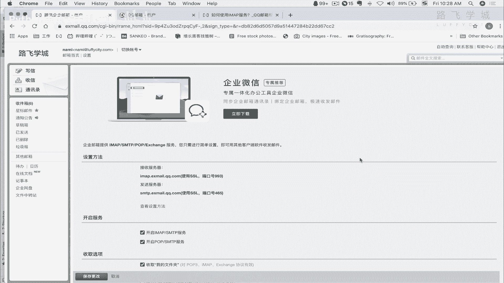
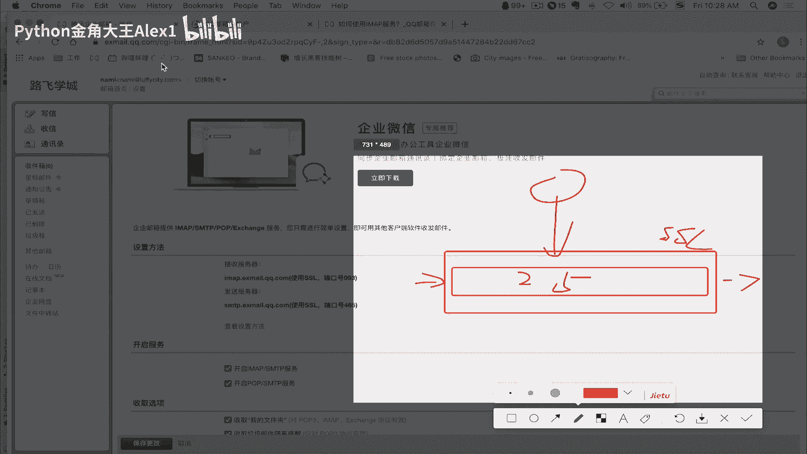
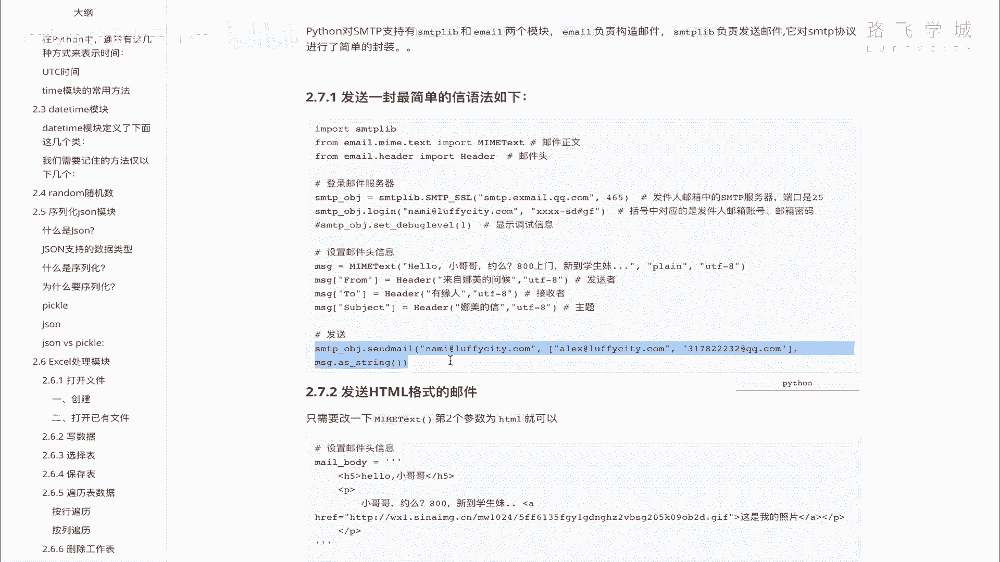

# Python邮件发送：P79：12 用Python发邮件 📧

## 概述
在本节课中，我们将学习如何使用Python自动发送电子邮件。掌握这项技能后，你可以自动发送报表、通知等，实现工作流程的自动化。

## 邮件发送的基本原理
上一节我们介绍了数据分析的可视化，本节中我们来看看如何用Python与外部系统交互，例如发送邮件。首先，我们需要理解邮件发送的基本流程。

发送邮件需要遵循一个名为SMTP的协议。SMTP是**简单邮件传输协议**的缩写，它规定了在互联网上传输邮件的规则。你可以将协议理解为一种“语言”，计算机之间必须使用相同的“语言”才能互相理解并进行通信。

邮件发送并非直接从你的电脑发送到收件人的电脑。其过程通常如下：
1.  你的电脑（邮件客户端）将邮件发送到你邮箱提供商的**SMTP服务器**。
2.  你的SMTP服务器检查邮件格式，然后将其转发到收件人邮箱的SMTP服务器。
3.  收件人的SMTP服务器接收并存储这封邮件。
4.  收件人通过他的邮件客户端（如网页或软件）从服务器上**拉取**这封邮件。

因此，用程序发送邮件需要三个核心步骤：
1.  **登录邮件服务器**：使用你的邮箱账号和密码进行身份认证。
2.  **构造邮件内容**：按照SMTP协议的规则，编写邮件的标题、正文、收件人等信息。
3.  **发送邮件**：将构造好的邮件内容提交给服务器进行发送。

## Python邮件发送模块
在Python中，我们主要使用两个模块来实现上述步骤：
*   **`email` 模块**：负责**构造邮件内容**（第二步）。
*   **`smtplib` 模块**：负责**登录服务器**和**发送邮件**（第一步和第三步）。

## 发送一封简单的文本邮件
以下是发送一封简单文本邮件的完整代码示例和分步讲解。



### 步骤1：导入必要的模块
```python
import smtplib
from email.mime.text import MIMEText
from email.header import Header
```
*   `smtplib`：用于连接和登录SMTP服务器。
*   `MIMEText`：用于创建纯文本或HTML格式的邮件正文。
*   `Header`：用于创建邮件的头部信息，如发件人、收件人显示名称。

### 步骤2：登录邮件服务器
我们需要连接到SMTP服务器并进行登录。这里以腾讯企业邮箱为例，使用了SSL加密连接（端口465）。
```python
# 邮件服务器地址和端口 (需要根据你的邮箱提供商修改)
mail_host = "smtp.exmail.qq.com"
mail_port = 465
# 发件人邮箱和密码 (密码可能是邮箱密码或客户端专用密码)
mail_user = "your_email@example.com"
mail_pass = "your_password"

# 创建SMTP_SSL对象并登录
smtp_obj = smtplib.SMTP_SSL(mail_host, mail_port)
smtp_obj.login(mail_user, mail_pass)
```
**关键概念解释：端口**
服务器地址（如 `smtp.exmail.qq.com`）类似于家庭住址。**端口**则像是这栋房子上的不同门牌，用于区分不同的服务（如邮件服务、网页服务）。常见的SMTP端口是25，但为了安全，现在普遍使用SSL加密的465端口。

### 步骤3：构造邮件内容
我们需要分别构造邮件的正文和头部信息。
```python
# 构造邮件正文
mail_content = "Hello，这是一封测试邮件。"
message = MIMEText(mail_content, 'plain', 'utf-8')

# 构造邮件头部
message['From'] = Header("发件人昵称", 'utf-8')  # 发件人显示名称
message['To'] = Header("收件人昵称", 'utf-8')    # 收件人显示名称
message['Subject'] = Header("邮件主题", 'utf-8') # 邮件主题
```
*   `MIMEText` 的第二个参数 `'plain'` 表示这是纯文本邮件。如果发送HTML邮件，则需改为 `'html'`。
*   `Header` 中的内容用于在收件箱中显示，并非实际的邮箱地址。





### 步骤4：发送邮件
最后，使用登录后的 `smtp_obj` 对象发送邮件。
```python
# 实际发送邮件
# 参数：发件邮箱， 收件邮箱列表， 邮件内容字符串
sender = "your_email@example.com"
receivers = ["receiver1@example.com", "receiver2@example.com"]





smtp_obj.sendmail(sender, receivers, message.as_string())
# 关闭连接
smtp_obj.quit()
```
*   `sendmail` 方法中的 `receivers` 是一个列表，可以同时发送给多人。
*   `message.as_string()` 将构造好的邮件对象转换为符合SMTP协议的字符串格式。

## 如何查找你的邮箱服务器配置
不同的邮箱提供商（如QQ邮箱、163邮箱、Gmail）的SMTP服务器地址和端口可能不同。通常你可以在邮箱设置的“账户”或“安全”相关页面找到“开启SMTP服务”的选项，并查看服务器地址和端口号。同时，你可能需要生成一个“客户端专用密码”用于程序登录，而非直接使用邮箱登录密码。







## 总结
本节课中我们一起学习了使用Python自动发送电子邮件。我们了解了SMTP协议的基本原理，掌握了使用 `smtplib` 和 `email` 模块登录服务器、构造邮件内容并发送的完整流程。通过本课的知识，你已经可以编写脚本来自动向指定邮箱发送文本格式的邮件通知了。