# AI云量化：第2讲：量化策略代码学习

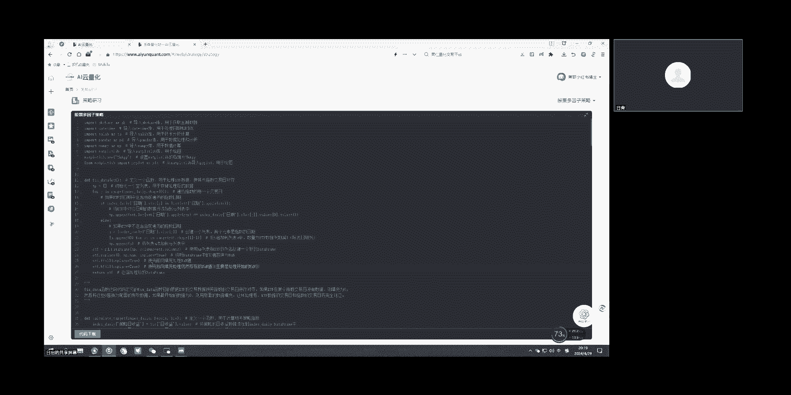

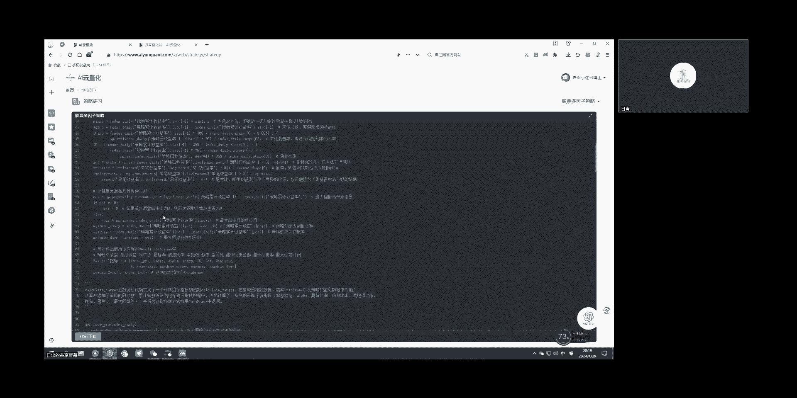

在本节课中，我们将学习一个量化策略代码的核心结构。我们将从数据准备后的步骤开始，逐步解析策略的初始化、因子计算、交易信号生成以及回测循环中的开仓与平仓逻辑。课程内容将尽可能简单直白，确保初学者能够理解。

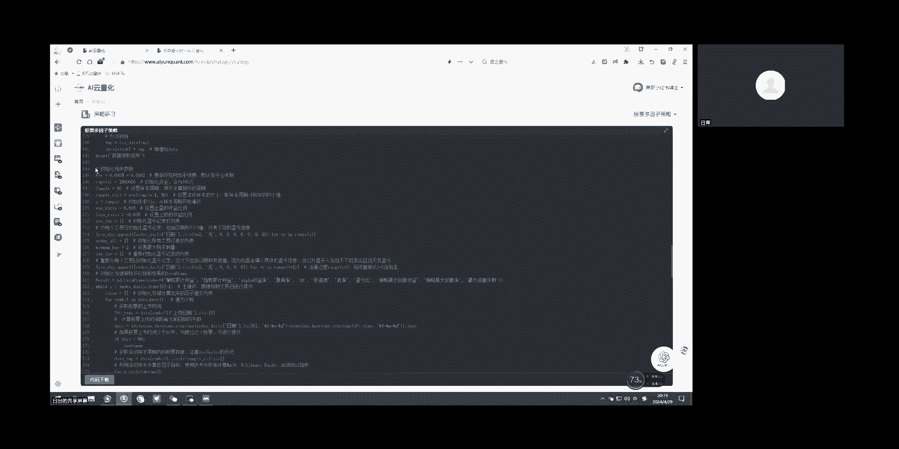

---

## 数据准备与初始化 🛠️

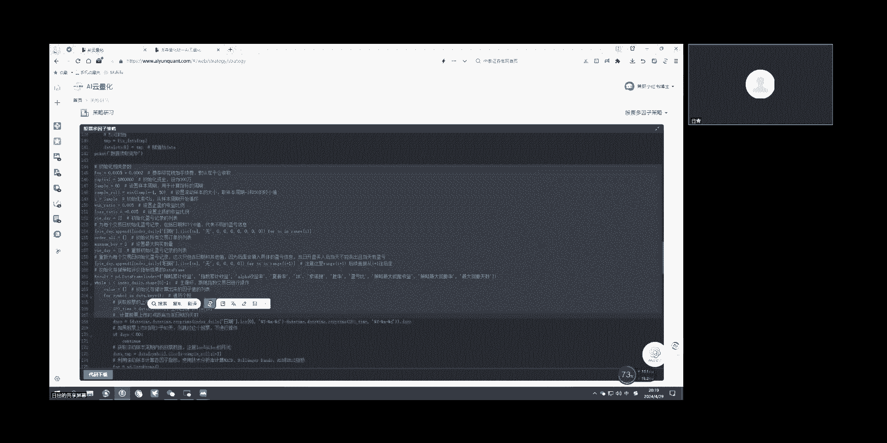

处理好数据并校对数据之后，就进入下一步。我们定位到代码的第145行。

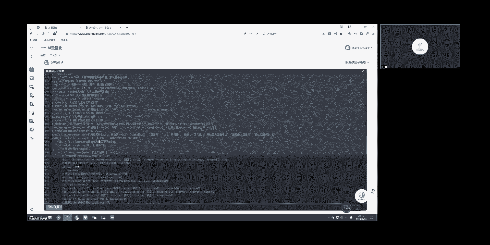

从第145行开始，可以看作是一些初始的相关参数定义。这些参数包括涉及到的费率、本金、滚动样本窗口、止盈止损值等。此外，还有一些在策略中会用到的初始化变量，例如每日的收益情况、每笔信号记录等信息。定义好这些初始参数是策略运行的基础。

---

## 进入回测循环 🔄

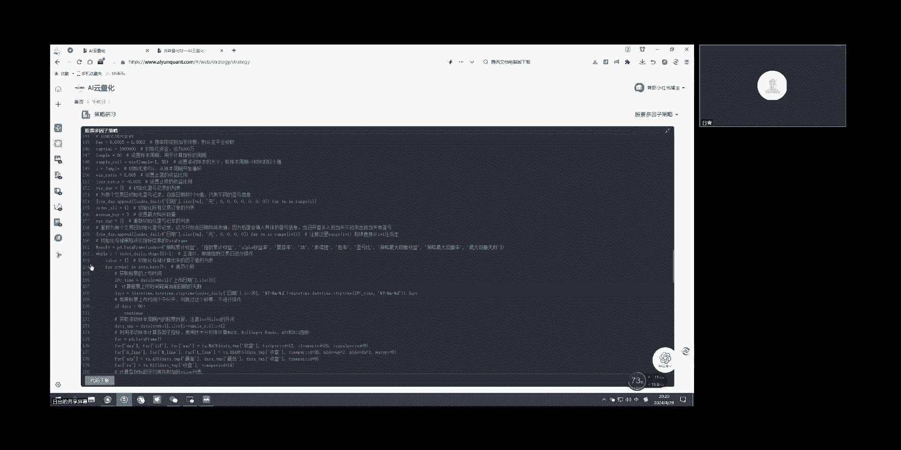

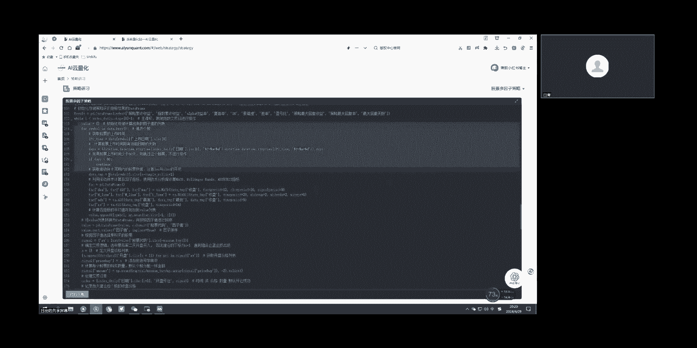

上一节我们介绍了策略的初始化参数，本节中我们来看看策略的核心执行部分——回测框架。回测框架从第162行的 `while` 循环开始。

这里的 `i` 是指数据索引下标。例如，假设总共有八百个交易日，且数据已经处理好了。如果 `i` 的值是40，就代表从第40个交易日开始进行策略处理。进入循环后，首先需要计算因子。

以下是计算因子的过程，对应代码第163至179行：

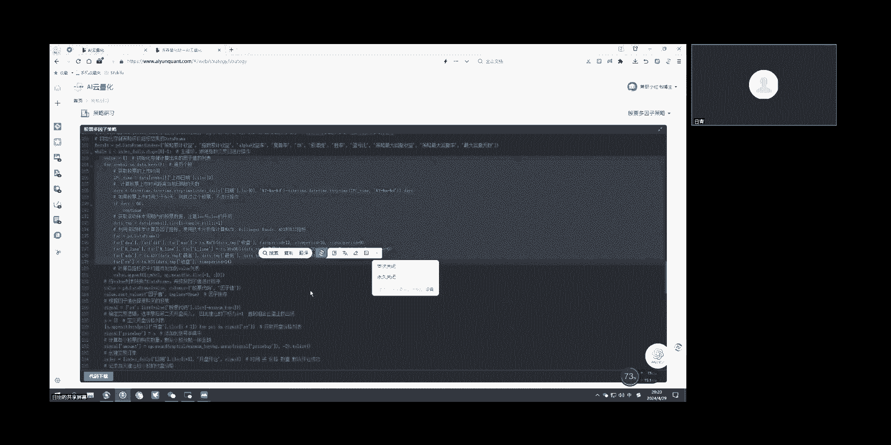

*   假设当前 `data.key()` 里面有十只股票，策略需要逐一为它们计算相关指标。
*   计算完成后，会将每只股票对应的指标值统一放到 `value` 这个变量中。
*   整个流程下来，相当于为每只股票都计算出了一个对应的因子值。

这通常被理解为初步的指标计算。之后，策略还会对这些值进行简单的处理。例如，这里使用排序方法，按升序排列。策略可以选择排名前五的股票，或者选择倒数最后五只股票。这种方法用于确定最终选择哪些股票进行交易。

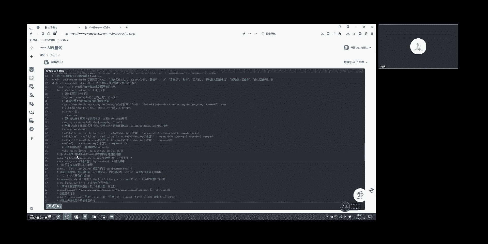

---

## 生成交易信号与开仓 📈

上一节我们了解了如何计算并筛选因子，本节我们来看如何根据筛选结果生成交易信号并执行开仓操作。

从第186行开始，变量 `single` 用于记录本次的交易订单。它是一个字典，记录了这次要买入什么股票、每只股票对应的买入价格以及买入数量。因为策略设置了最大持仓数量（例如三只或五只），所以本次最多选择这么多股票。

策略会先将这次的开仓交易订单记录下来。开仓之后，当天就会产生持仓收益，因此需要计算一下。

这里有一个关键点：第189行代码中使用了 `i + 1`。初学者可能不理解为什么是 `i + 1` 而不是 `i`。这需要根据代码逻辑来理解。策略的逻辑是：使用截止到第 `i` 天的数据来计算交易信号，但实际买入操作计划在第二天开盘时执行。因此，买入价格使用的是第二天的开盘价，通过索引下标 `i + 1` 来获取这个价格。

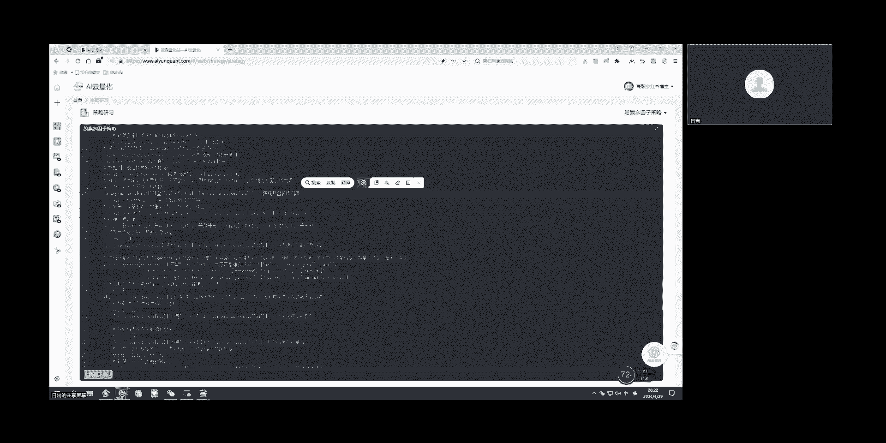

---

## 执行平仓与收益计算 📉

上一节我们介绍了如何开仓，本节中我们来看看如何平仓并计算收益。由于A股市场实行T+1交易制度，使用第 `i` 天数据计算信号，在第 `i+1` 天开盘买入，那么真正能够卖出的时间至少要再隔一天，即从第 `i+2` 天开始进入平仓逻辑。

进入平仓阶段后，同样可以计算相关的持仓收益。根据前面记录的开仓价格和数量，可以计算当前时刻的持仓累计收益，也可以计算今日相对于昨日的持仓收益变化。这一部分的计算方式是开放的，如果不想采用固定的止盈止损规则，可以在这里进行修改。本策略代码提供了按预设的止盈止损阈值来触发平仓的机制。

---

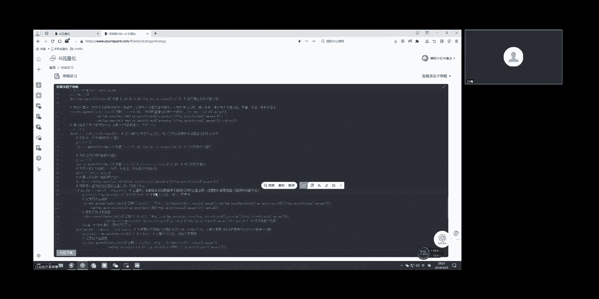

本节课中我们一起学习了量化策略代码的基本框架。我们从参数初始化开始，逐步分析了回测循环、因子计算、交易信号生成、开仓操作以及平仓与收益计算等核心环节。理解这些步骤是编写和调试自己量化策略的重要基础。