# AI辅助量化策略开发：P1：使用大模型自动生成并回测策略 🚀

在本节课中，我们将学习如何利用大语言模型（AI）辅助我们自动编写量化交易策略，并完成本地回测。整个过程将展示从自然语言描述到生成可执行代码，再到运行回测的完整自动化流程。

## 效果演示

首先，我们来看一下最终实现的效果。我开发了一个小工具，其界面类似于聊天机器人，可以接收文字输入。

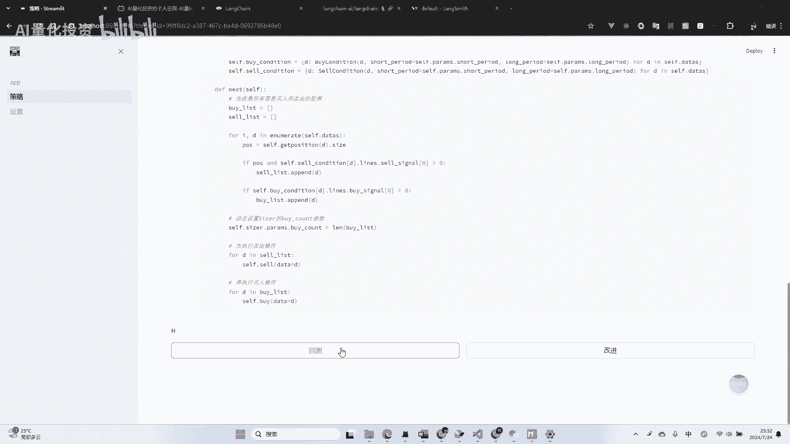

以下是该工具的核心工作流程：

1.  **输入策略描述**：用户在输入框中用自然语言描述一个策略。
2.  **AI生成代码**：工具调用大模型API，根据描述和预设模板生成完整的策略代码。
3.  **执行回测**：工具将生成的代码嵌入回测框架，使用本地数据源执行回测。
4.  **展示结果**：回测完成后，工具会绘制出账户资金曲线等结果。

接下来，我们通过两个具体例子来演示这个过程。

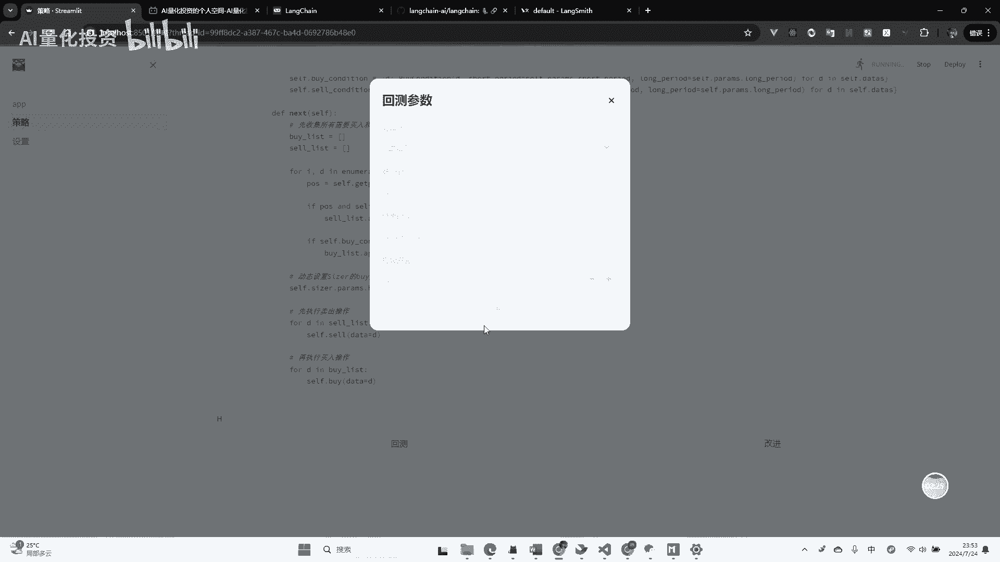

### 示例一：双均线策略

我们首先尝试生成一个经典的双均线策略。

```python
# 示例：用户输入“双均线策略”
用户输入 = “双均线策略”
```

工具接收到指令后，开始调用大模型API生成代码。生成过程大约需要50秒，消耗2000多个token。生成成功后，界面会显示完整的策略代码。这段代码是按照我预先定义好的策略模板编写的。

代码生成后，我们进行回测。回测参数预设如下：
*   **股票池**：上证50
*   **起止时间**：最近一年
*   **数据源**：基于本地QMT客户端（需提前启动）

点击回测按钮，程序会快速调用本地回测引擎执行。回测成功后，工具会绘制出策略的资金曲线图。这证明AI生成的策略代码是有效且可执行的。

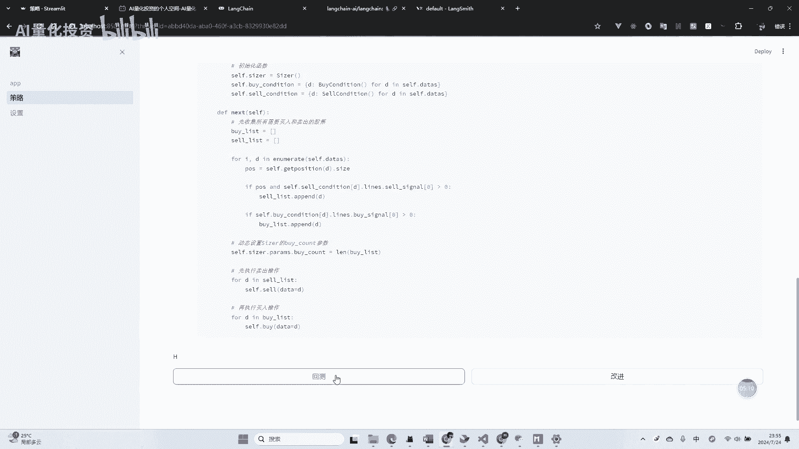

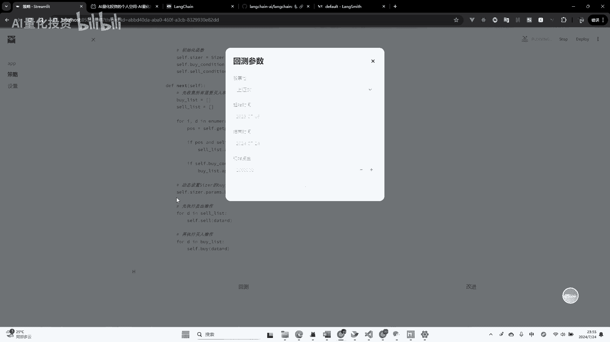

### 示例二：“老太太”策略

为了测试工具的泛化能力，我们尝试一个更简单的策略描述：“连续下跌三天就买入，连续上涨三天就卖出”。

```python
# 示例：用户输入“老太太策略”
用户输入 = “连续下跌三天就买入，连续上涨三天就卖出”
```

同样地，工具调用API生成对应策略代码，耗时约45秒，消耗1900多个token。生成代码后，我们使用相同的参数（上证50，最近一年）进行回测。

回测再次成功执行，并输出了该策略的资金曲线。这表明，对于这类逻辑清晰的简单策略，AI能够准确理解并转化为可运行的代码。

通过以上演示，我们可以看到，AI能够将我们简单的文字描述，转化为完整的、可回测的量化策略，大大提升了策略原型的开发效率。

## 技术框架与原理

上一节我们看到了AI生成策略的效果，本节中我们来了解一下支撑这套流程背后的技术框架和核心原理。

### 大模型API服务

当前是进行AI应用开发的绝佳时机。国内多家厂商提供了性价比极高的大模型API服务。

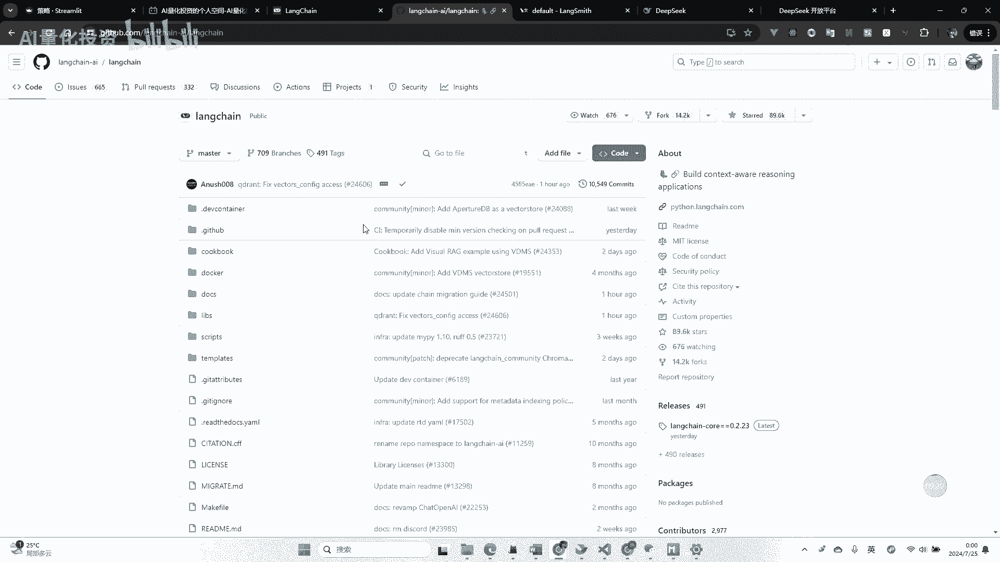

**核心概念：API调用成本**
目前，许多国产大模型的API定价约为 **1元 / 100万token**。这意味着生成一个策略（约2000 token）的成本极低。我演示中使用的DeepSeek模型，甚至提供了免费的初始额度，足以进行大量测试。

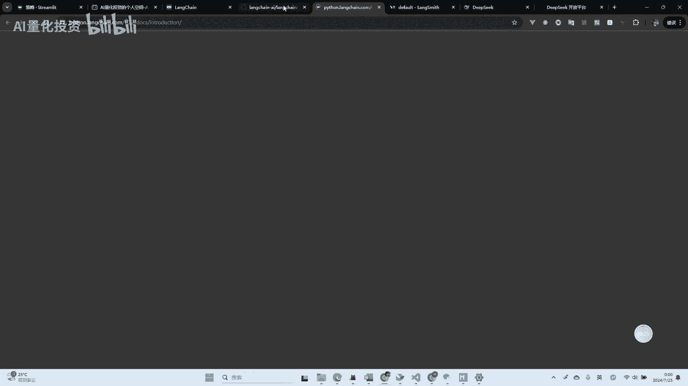

### LangChain框架

我开发这个工具主要依托于**LangChain**框架。这是一个用于构建由大语言模型驱动的应用程序的流行框架。

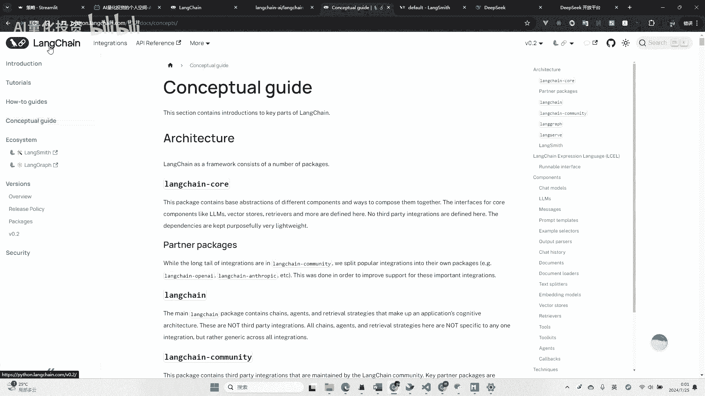

*   **GitHub星标**：近9万，表明其拥有庞大的开发者社区和活跃的生态。
*   **核心思想**：LangChain的核心是构建**智能体（Agent）**。智能体可以理解为能根据目标自主调用工具、执行任务的大模型应用。
*   **LangGraph**：我使用的关键组件是LangChain的**LangGraph**。它允许开发者以**图（Graph）** 数据结构来定义复杂的工作流。

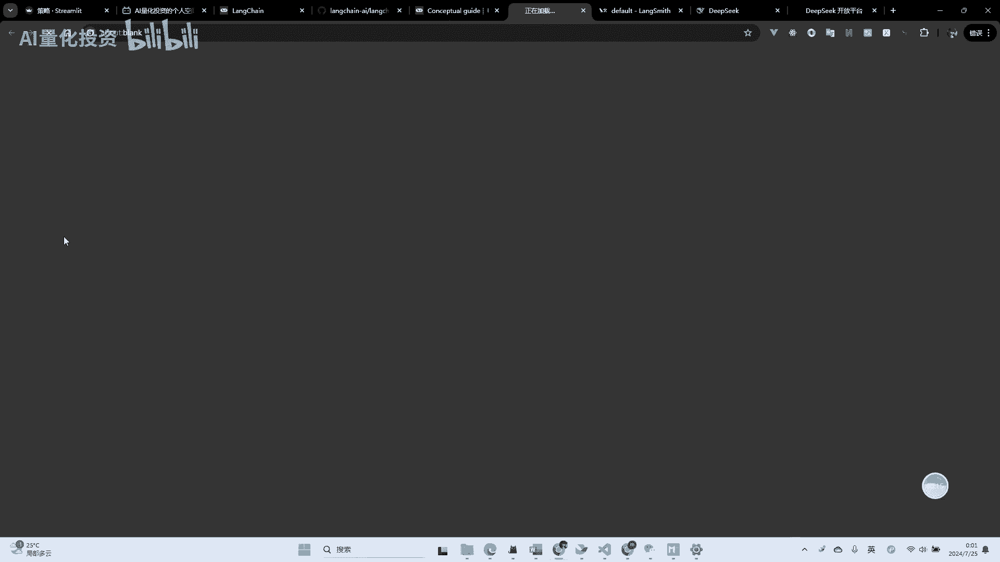

**工作流示例**：
在我的工具中，整个流程就是一个由LangGraph定义的工作流图：
1.  节点A：接收用户输入，调用大模型**编写策略**。
2.  节点B：提供选项，让用户决定是**运行策略**还是**改进策略**。
3.  节点C（运行分支）：**执行回测**。
4.  节点D：**分析并可视化**回测结果。

这个有向图清晰地管理了任务的状态流转和依赖关系。

### 提示词工程

AI之所以能写出符合要求的策略代码，关键在于**提示词（Prompt）** 的设计。我并非仅仅将“双均线策略”五个字发给模型，而是在背后构建了包含以下内容的复杂提示：

1.  **策略代码模板**：规定了策略类必须包含`initialize`和`handle_data`等方法的结构。
2.  **详细的指令**：明确要求输出格式、必须包含的参数（如均线周期）、买卖信号逻辑的写法等。
3.  **上下文示例**：提供示例，让模型更好地理解我们的需求。

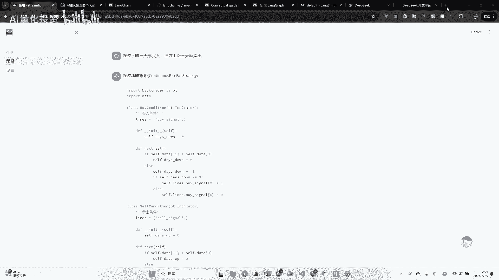

```python
# 提示词结构示意（非完整代码）
prompt_template = """
你是一个量化策略专家。请根据用户描述，生成一个用于Backtrader框架的回测策略。
策略必须遵循以下Python类结构：
class MyStrategy(bt.Strategy):
    params = ((‘short_period‘, 10), (‘long_period‘, 30)) # 示例参数
    def __init__(self):
        # 在这里初始化指标，例如移动平均线
        self.sma_short = bt.indicators.SMA(self.data.close, period=self.params.short_period)
        self.sma_long = ...
    def next(self):
        # 在这里编写交易逻辑
        if self.sma_short > self.sma_long:
            self.buy()
        elif self.sma_short < self.sma_long:
            self.sell()
用户描述：{user_input}
请生成完整策略代码。
"""
```


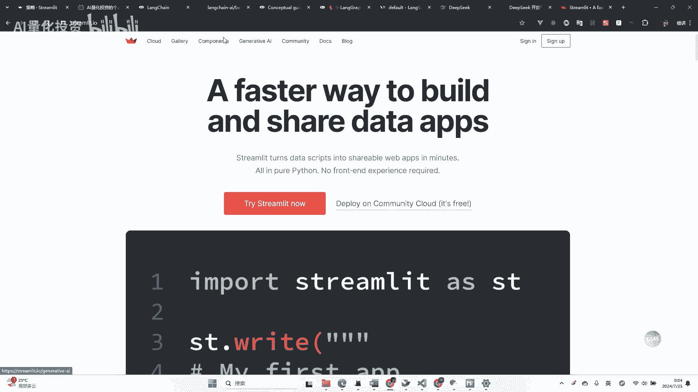

### 用户界面开发

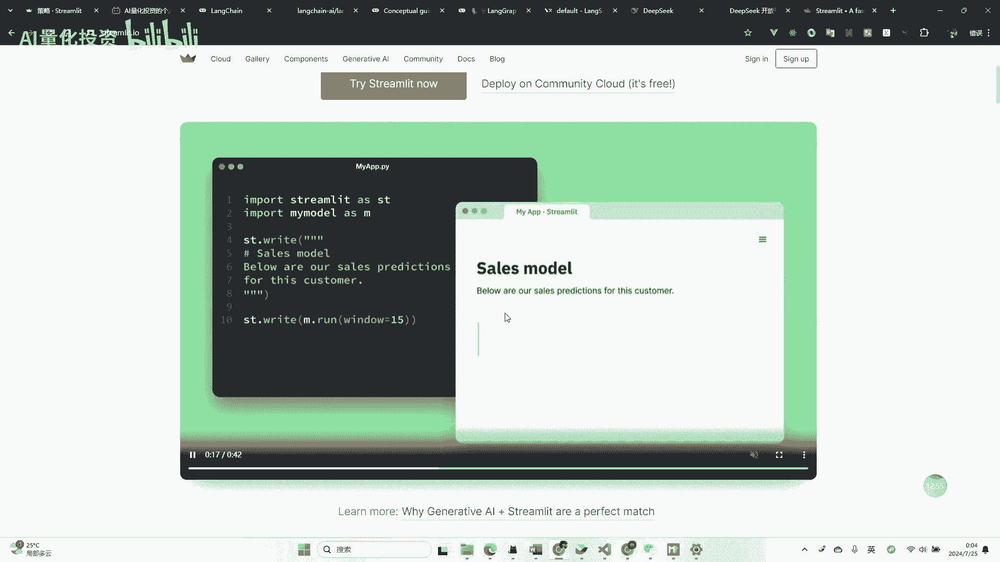

工具的交互界面是使用 **Streamlit** 框架快速构建的。Streamlit允许用纯Python脚本创建美观的Web应用，它天然适合数据科学和机器学习项目的演示，并且也提供了与LangChain等AI框架便捷集成的组件。

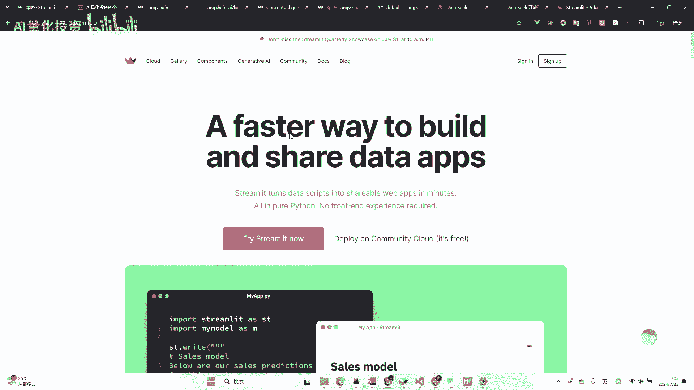

## 总结与展望

本节课中我们一起学习了如何利用大语言模型自动生成量化策略并进行回测。我们首先演示了从自然语言到策略回测的完整流程，然后剖析了其背后的技术支柱：高性价比的大模型API、强大的LangChain（特别是LangGraph）工作流框架、精心设计的提示词工程以及快速的UI开发工具Streamlit。

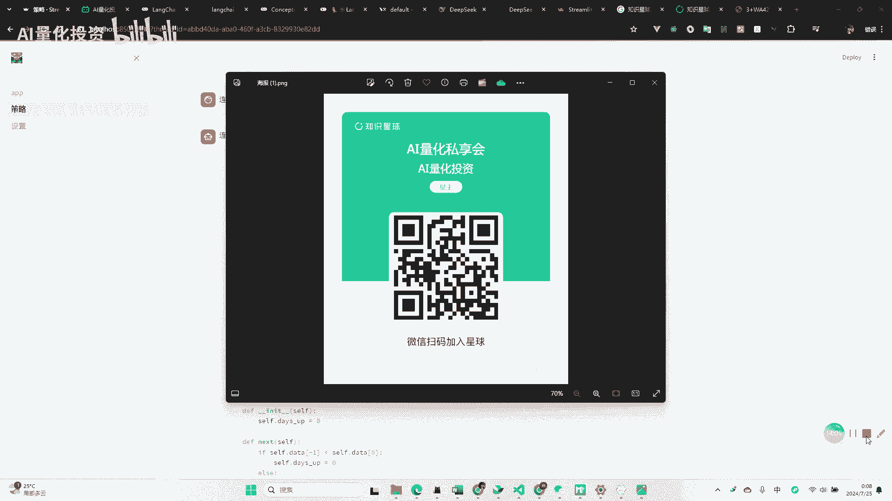

目前，这套方法对于逻辑清晰的经典策略或简单策略非常有效，能极大提升开发效率。对于更复杂的策略，可能需要结合人工校验和分步调试。这个领域正在快速发展，随着模型能力的提升和开发工具的完善，AI在量化投资中的应用将会更加深入和广泛。