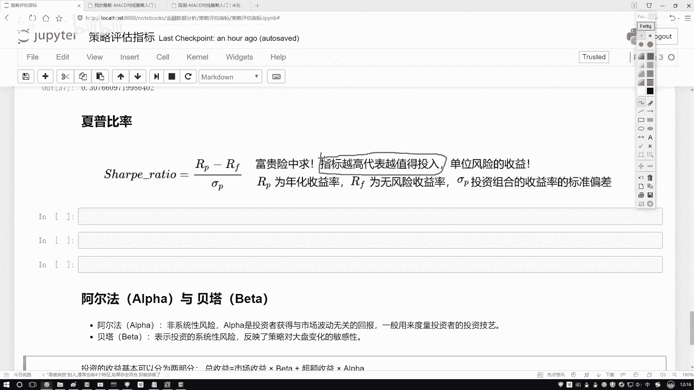
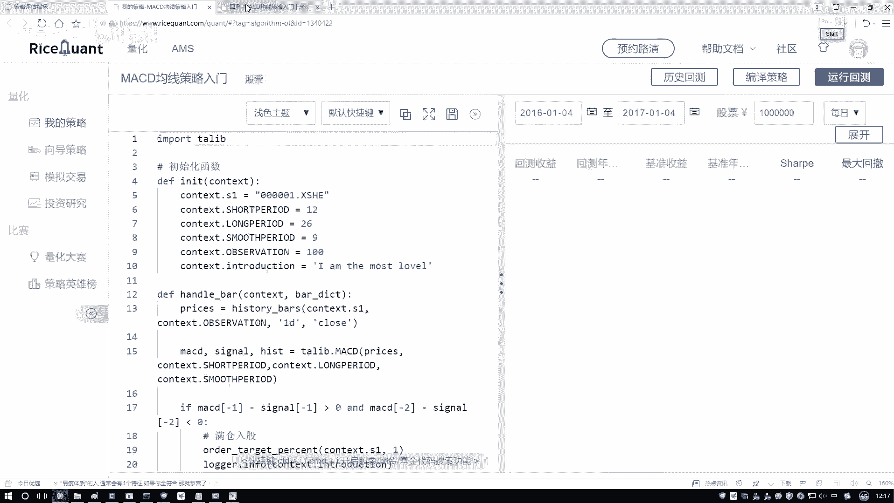
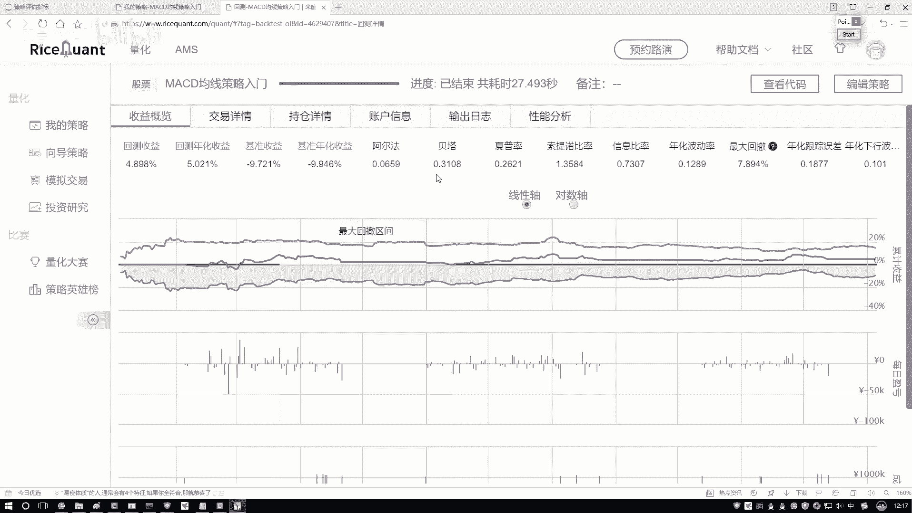
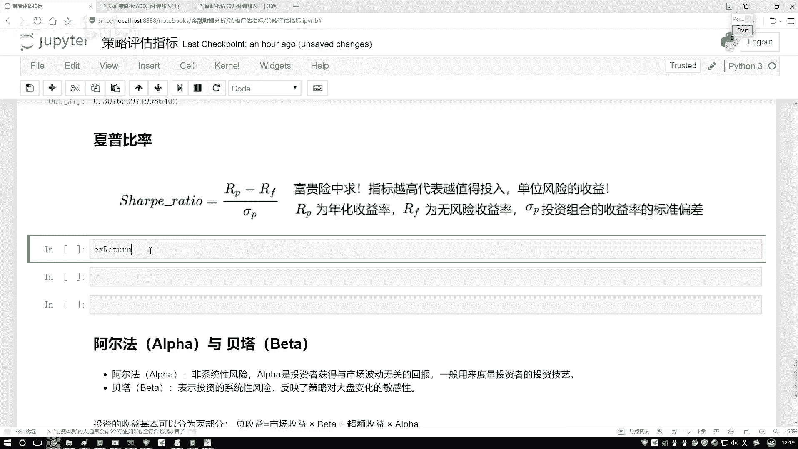
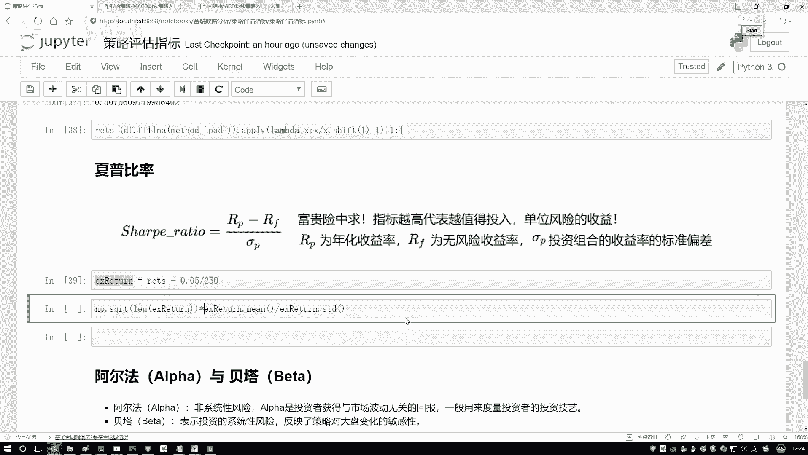
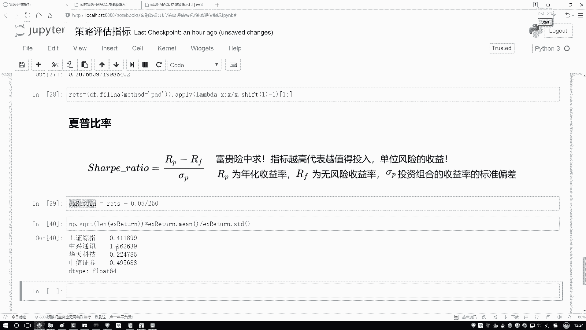
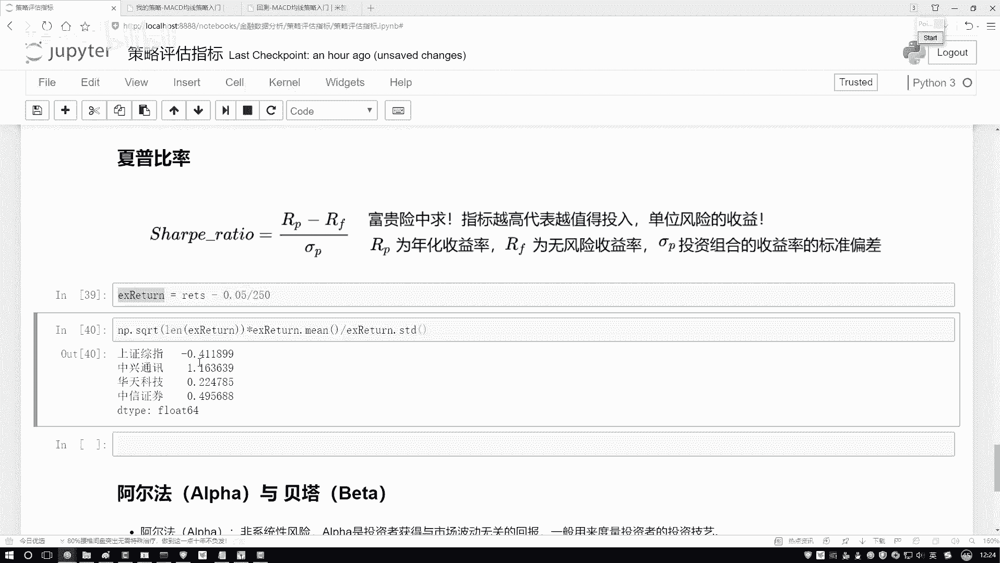
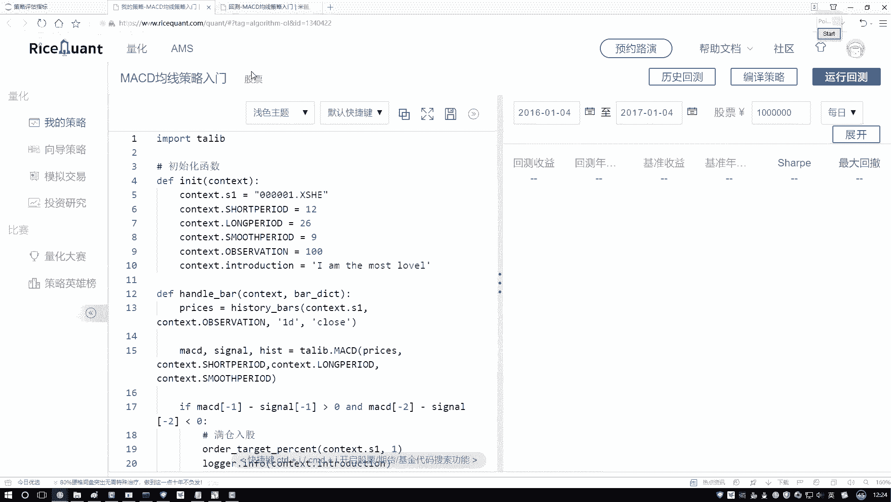
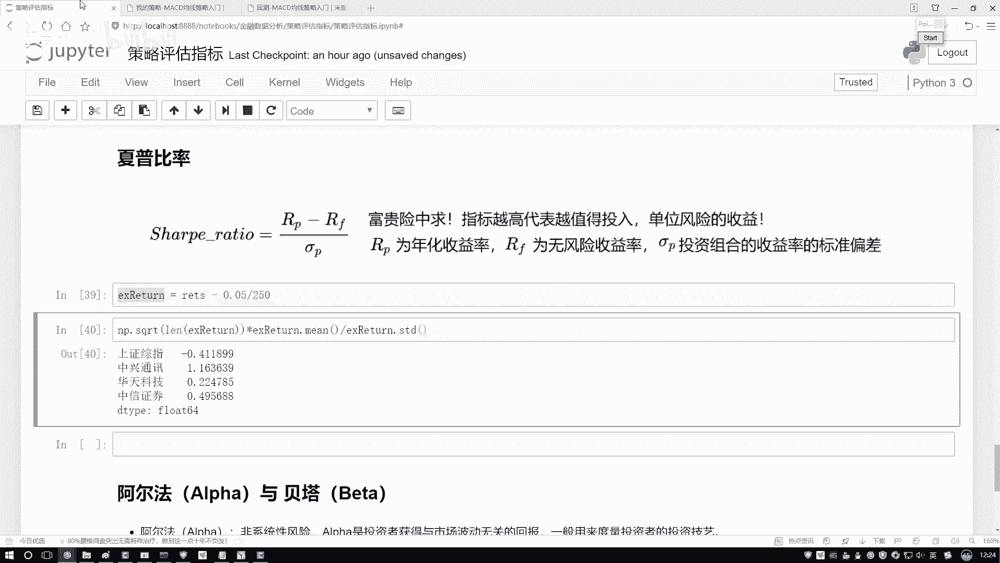

# Python金融分析与量化交易实战：P18：夏普比率的作用 📈

在本节课中，我们将要学习一个在金融投资中至关重要的风险调整后收益指标——夏普比率。我们将理解它的核心概念、计算公式，并基于Python代码演示如何计算和比较不同投资组合的夏普比率。

## 夏普比率的定义与意义

上一节我们介绍了投资回报率，本节中我们来看看如何衡量风险与收益的关系。夏普比率描述的是这样一个指标：对于每承担一单位的风险，我们能获得多少超额收益。





为了便于理解，我们可以举一个生活中的例子。例如，一份在战乱地区日薪极高的工作，其高薪对应的是极高的风险。夏普比率就是用来评估，为了获得更高的收益，我们承担额外的风险是否“值得”。在选股或选择投资组合时，夏普比率越高，意味着在承担相同风险的情况下，我们能获得的超额收益越高，因此该指标是“越大越好”的。



## 夏普比率的计算公式

理解了夏普比率的意义后，我们来看看如何计算它。其核心思想是比较投资组合的收益与无风险收益的差异，并将这个差异与投资组合自身的波动性（风险）进行比较。

夏普比率的计算公式如下：

**Sharpe Ratio = (Rp - Rf) / σp**

其中：
*   **Rp** 代表投资组合的平均收益率。
*   **Rf** 代表无风险收益率（例如国债利率、银行固定存款利率）。
*   **σp** 代表投资组合收益率的标准差，用于衡量风险。

这个公式计算的就是“单位风险所获得的超额收益”。我们期望这个值越高越好。

## 基于Python计算夏普比率



接下来，我们将在Python环境中，基于实际的股票回报率数据来计算夏普比率。在计算前，我们通常需要对数据中的缺失值进行处理，例如使用前一天的收盘价进行填充。

以下是计算夏普比率的关键代码步骤：

```python
# 假设 returns 是已经计算好的每日收益率序列（例如，使用 pct_change() 计算）
# 假设无风险年化利率为 5%
risk_free_rate = 0.05

# 计算年化夏普比率
# 第一步：计算超额收益（投资组合收益 - 无风险收益）
# 注意：需要将年化无风险利率转换为日度利率，假设一年有250个交易日
excess_returns = returns - risk_free_rate/250



# 第二步：计算夏普比率
# 公式：(超额收益的均值 / 超额收益的标准差) * sqrt(交易日数量)
sharpe_ratio = (excess_returns.mean() / excess_returns.std()) * np.sqrt(250)
```



执行以上代码后，我们可以得到不同股票或投资组合的夏普比率。例如，计算结果显示“中兴通讯”的夏普比率最高，这意味着在我们分析的标的中，投资它能在单位风险下获得最高的超额回报。而结果为负值的标的，通常意味着其收益尚不及无风险收益，不是理想的选择。



## 总结





本节课中我们一起学习了夏普比率。我们首先了解了它作为“风险调整后收益”指标的核心意义，即衡量承担每单位风险所能获得的额外回报。接着，我们学习了它的标准计算公式 **Sharpe Ratio = (Rp - Rf) / σp**。最后，我们通过Python代码实战，演示了如何从处理好的收益率数据出发，计算并比较不同投资标的的夏普比率，从而为投资决策提供一个重要的量化依据。记住，在同等条件下，我们应优先选择夏普比率更高的投资组合。