# Python金融分析与量化交易实战：P31：31.5-标准化处理方法 📊

在本节课中，我们将要学习数据预处理中的一个核心步骤——标准化。标准化是数据挖掘和机器学习中非常常用的技术，其目的是消除不同特征（或指标）之间由于量纲和取值范围不同所带来的影响，使得数据更易于分析和建模。

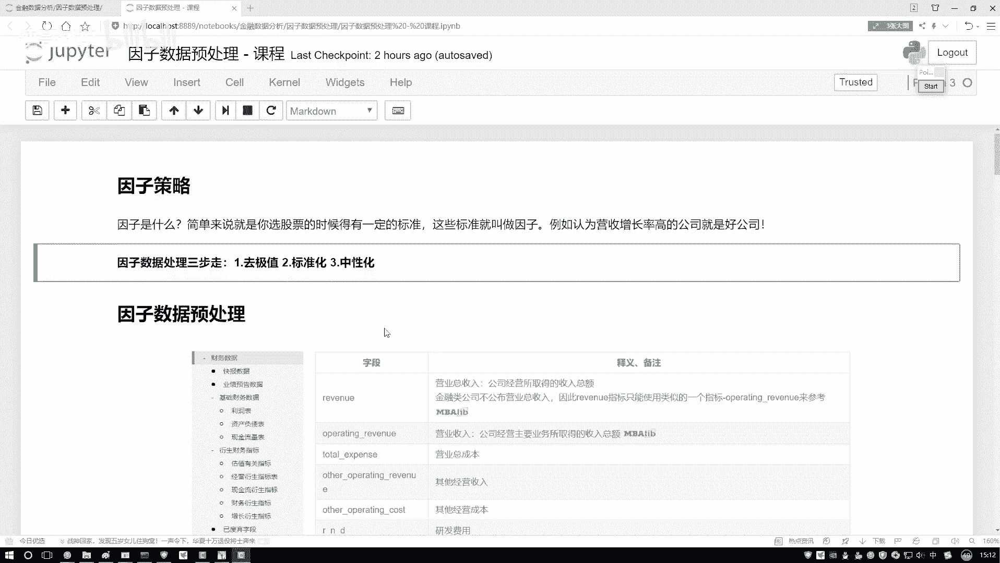

## 标准化的目的与原理

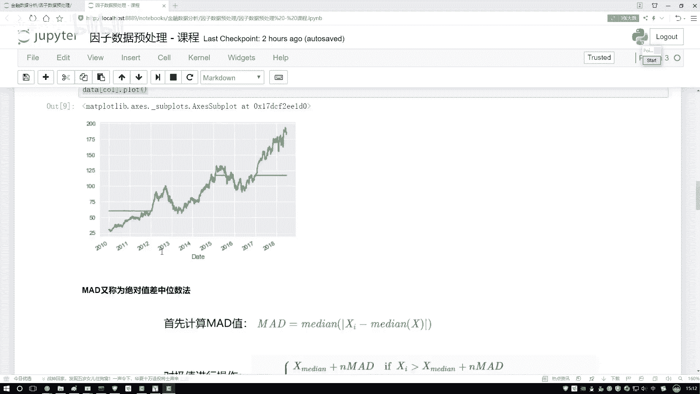

上一节我们介绍了数据预处理的重要性，本节中我们来看看标准化的具体原理。

标准化操作的核心目标是：**使得不同特征（维度）的数值处于相近的数值范围，以便公平地比较和分析它们**。

为了理解这一点，请看下图。假设我们有一组二维数据，包含特征X1和X2。


从图中可以看出，X1的取值范围较大（例如从-10到10），而X2的取值范围较小（例如从-2到2）。如果直接使用这些原始数据，取值范围大的特征（如X1）可能会在后续的模型计算中占据主导地位，从而影响结果的准确性。标准化就是为了解决这个问题。

## 标准化的公式分解

标准化的具体操作通过一个公式完成，该公式可以分解为两个步骤。

标准化的核心公式如下：

**`z = (x - μ) / σ`**

其中：
*   `x` 是原始数据。
*   `μ` 是数据在该特征维度上的均值。
*   `σ` 是数据在该特征维度上的标准差。

这个公式可以分解为两个连续的操作：

**第一步：去均值（中心化）**
操作：`x - μ`
目的：将数据的中心移动到零点。如下图所示，去均值后，数据在各个维度上都以零为中心对称分布。


**第二步：除标准差（缩放）**
操作：`(x - μ) / σ`
目的：调整数据的“离散程度”，使不同特征的取值范围变得相近。

为什么除以标准差能实现这个目的？我们可以通过一个比喻来理解：
*   假设第一组人的收入都在1万到2万之间，差异很小，计算出的标准差`σ`也很小。
*   假设第二组人包含收入1万、2000亿、3000亿的个体，差异极大，计算出的标准差`σ`非常大。

对于取值范围小的数据，除以一个小的标准差；对于取值范围大的数据，除以一个大的标准差。这样操作之后，所有数据的数值范围都会被“压缩”或“拉伸”到一个相对统一且较小的区间内（通常在-3到3之间）。

最终效果如下图所示，经过标准化后，数据不仅以零为中心，而且各个维度的取值范围也变得基本一致。

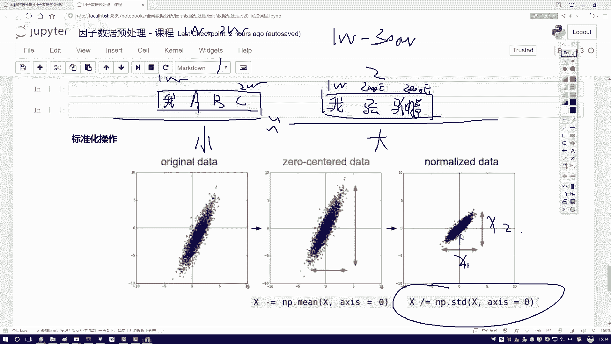

## 基于Python实现标准化

理解了原理后，我们来看看如何用Python代码实现标准化操作。代码实现非常简单直接。

以下是实现标准化功能的一个函数示例：


```python
def standardize_series(series):
    """
    对输入的pandas Series进行标准化处理。
    参数:
        series: 待处理的pandas Series数据。
    返回:
        标准化后的pandas Series数据。
    """
    # 第一步：计算均值和标准差
    mean_val = series.mean()
    std_val = series.std()

    # 第二步：应用标准化公式 (x - μ) / σ
    standardized_series = (series - mean_val) / std_val

    return standardized_series
```

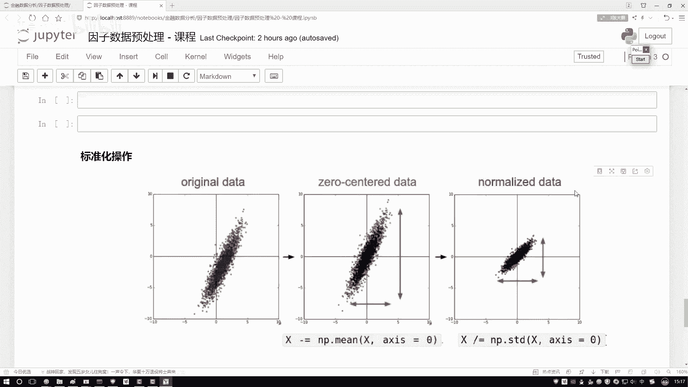

代码说明：
1.  首先计算输入数据序列的均值（`mean_val`）和标准差（`std_val`）。
2.  然后，将序列中的每个值减去均值，再除以标准差。
3.  返回处理后的新序列。

## 使用工具包快速标准化

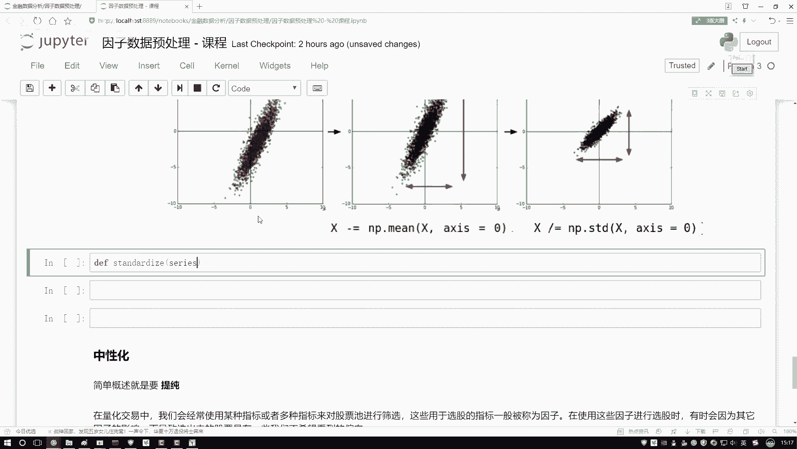

除了手动实现，我们也可以利用成熟的机器学习库来快速完成标准化，这通常只需一行代码。

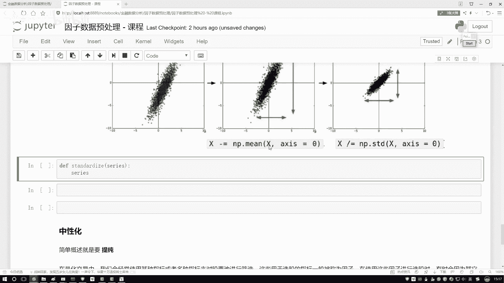

如果你想使用更便捷的方法，可以借助 `scikit-learn` 库中的 `StandardScaler` 工具。以下是使用示例：

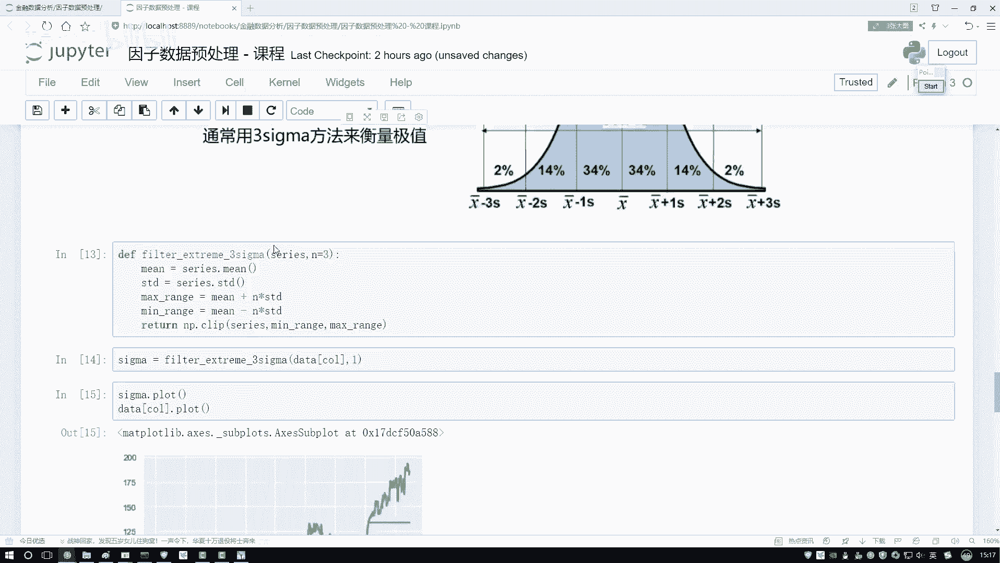

```python
from sklearn.preprocessing import StandardScaler

# 假设 `data` 是一个二维数组或DataFrame
scaler = StandardScaler()
standardized_data = scaler.fit_transform(data)
```

使用 `scikit-learn` 的优势在于它功能强大、经过优化，并且能方便地集成到机器学习管道中。

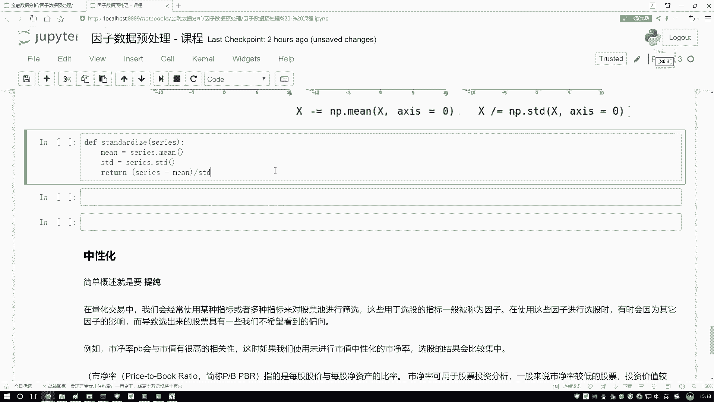

## 标准化效果演示

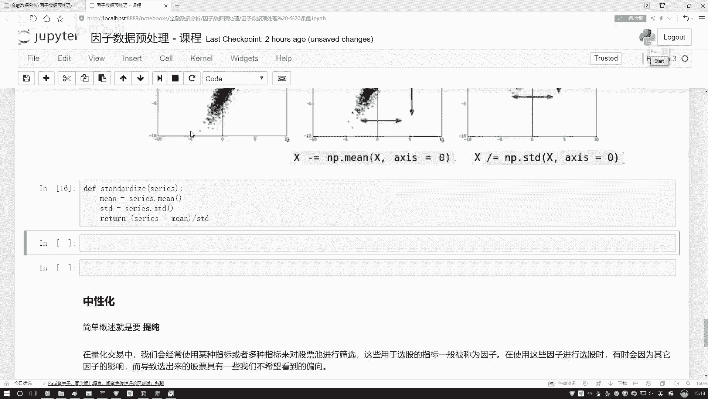

让我们通过一个简单的例子来观察标准化的效果。

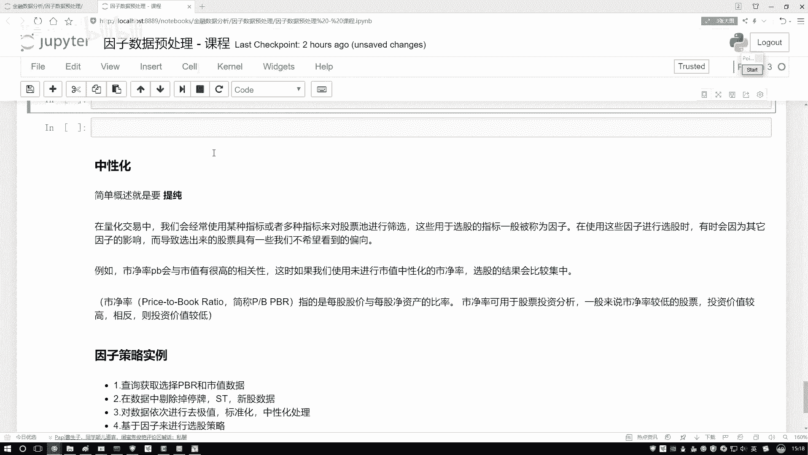

假设我们有一组原始的股票价格数据，其数值范围差异较大。

```python
# 假设这是原始数据预览
print(“原始数据预览:”)
print(data.head())
# 输出可能包含如 30.5, 22.1, 105.7 等数值，范围差异大。
```

应用我们编写的 `standardize_series` 函数后：

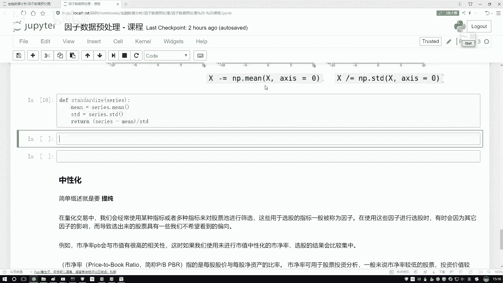

```python
standardized_data = standardize_series(data[‘price’]) # 假设对‘price’列进行标准化
print(“标准化后的数据预览:”)
print(standardized_data.head())
```

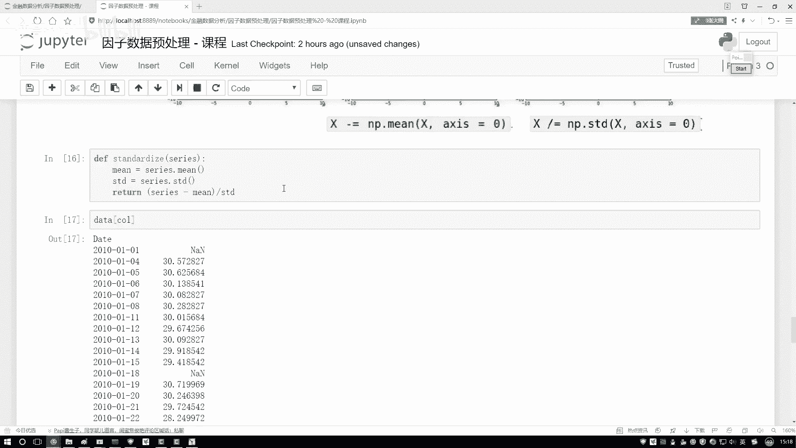

观察输出结果，你会发现所有数值都被转换了。例如，原来的 30.5、22.1、105.7 可能变成了 0.5、-0.8、1.9 等。这些新数值通常分布在零点附近的一个较小区间内（如-3到3），并且不同特征间的尺度变得一致。

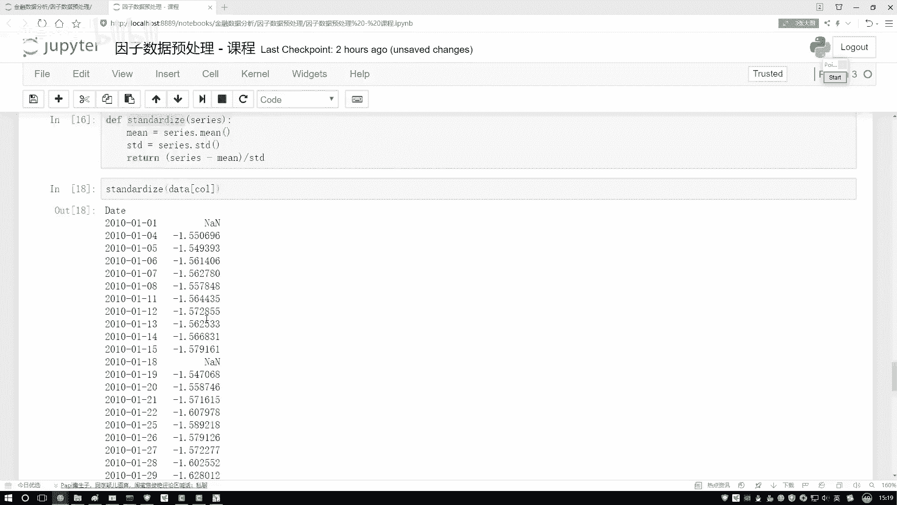

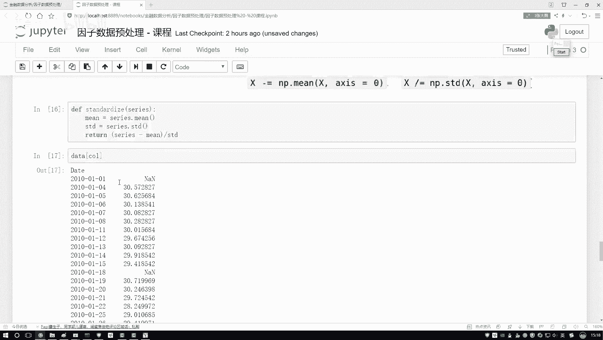

## 总结

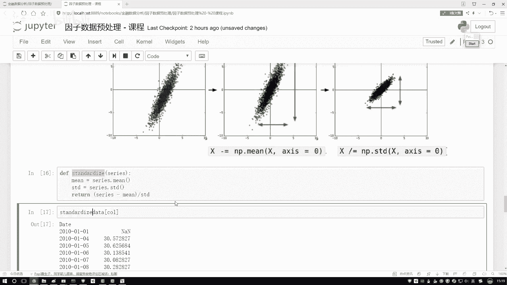

本节课中我们一起学习了数据标准化处理。


我们首先明确了标准化的目的：**消除不同特征间量纲和取值范围的差异，为后续分析提供公平的起点**。

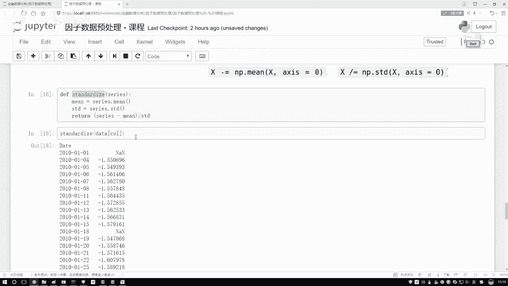

接着，我们深入剖析了标准化的核心公式 **`z = (x - μ) / σ`**，并将其分解为两个步骤：
1.  **去均值**：使数据以零为中心对称。
2.  **除标准差**：使各维度数据的取值范围变得相近。

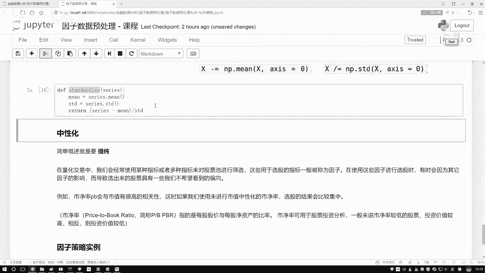

然后，我们动手实践，用Python编写了标准化函数，也介绍了使用 `scikit-learn` 库中的 `StandardScaler` 进行快速标准化的方法。

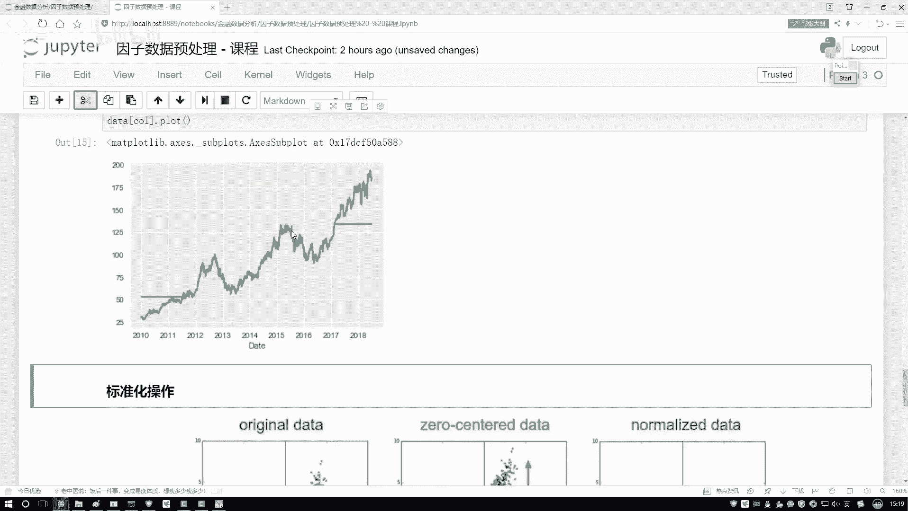

最后，我们通过示例数据演示了标准化的实际效果，看到数据被成功转换到统一的尺度上。

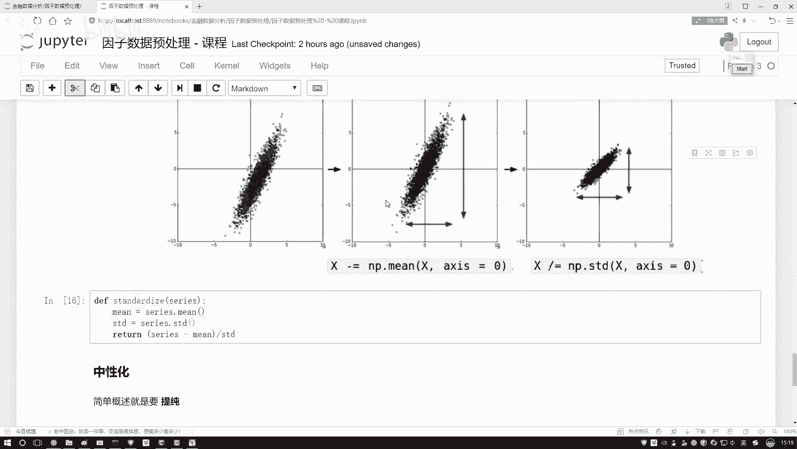

标准化是数据预处理中至关重要且常用的一步，掌握它能为你的金融数据分析和量化模型构建打下坚实的基础。