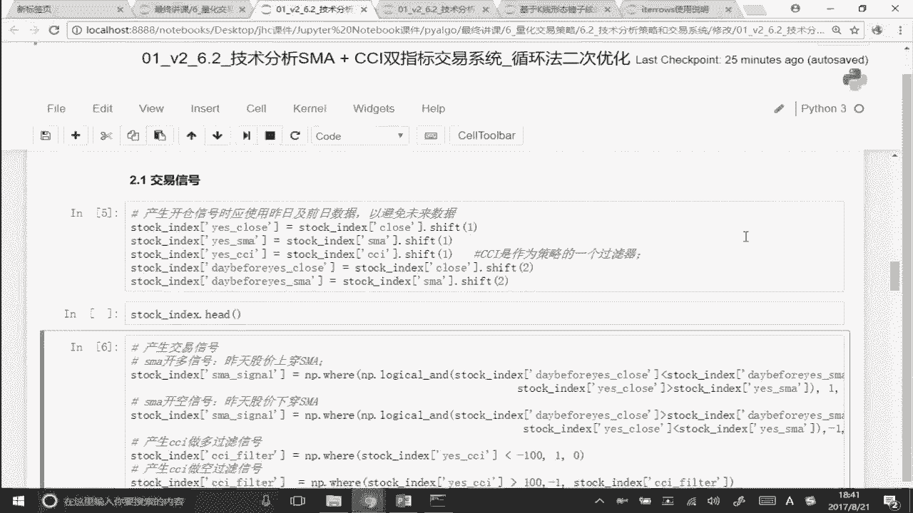

# 量化金融专业知识与实务：P5：SMA和CCI双指标交易系统 📊

在本节课中，我们将学习如何构建一个结合了简单移动平均线（SMA）和商品通道指数（CCI）的双指标交易系统。这个系统利用SMA产生基础交易信号，并使用CCI作为过滤器来提高信号的可靠性。我们将重点理解其交易逻辑，并学习如何将两个独立的信号组合成一个最终的交易信号。

## 概述

上一节我们介绍了CCI和布林带等单指标策略。本节中，我们来看看如何将两个技术指标结合起来，构建一个更稳健的交易系统。我们将使用SMA和CCI指标，通过特定的逻辑组合它们的信号。

## 策略逻辑

该交易系统的核心逻辑如下：它并非简单地依赖单一指标，而是要求两个条件同时满足才执行交易。这旨在过滤掉一些可能不可靠的单一信号。

以下是具体的交易规则：

*   **做多信号**：当股价上穿短期SMA均线，**并且**CCI指标值小于-100（处于超卖区域）时，触发买入信号。
*   **做空信号**：当股价下穿短期SMA均线，**并且**CCI指标值大于+100（处于超买区域）时，触发卖出信号。

## 代码实现要点

整个代码的结构与我们之前学习的策略类似，主要区别在于交易信号的生成部分。以下是关键步骤的说明：

1.  **数据准备与指标计算**：首先导入数据，并分别计算SMA和CCI指标。
    ```python
    # 示例：计算5日简单移动平均线和CCI
    data[‘SMA_5’] = talib.SMA(data[‘close’], timeperiod=5)
    data[‘CCI’] = talib.CCI(data[‘high’], data[‘low’], data[‘close’], timeperiod=14)
    ```

2.  **生成基础信号**：分别生成基于SMA和CCI的初步交易信号列。
    *   **SMA信号**：判断股价是否上穿或下穿均线。例如，上穿信号可定义为：`前一日收盘价 < 前一日SMA` 且 `当日收盘价 > 当日SMA`，此时标记为1（潜在买入）；下穿则标记为-1（潜在卖出）。
    *   **CCI过滤器信号**：根据CCI值生成信号。例如，当`CCI < -100`时，标记为1（符合买入条件）；当`CCI > 100`时，标记为-1（符合卖出条件）。

3.  **合成最终信号**：这是本策略的核心。将两个信号列相加，只有当他们指向同一方向时，最终信号才有效。
    ```python
    # 合成信号
    data[‘final_signal’] = data[‘sma_signal’] + data[‘cci_filter_signal’]
    # 只有当两个信号同时为1（和为2）时，才确认为买入信号（设为1）
    # 只有当两个信号同时为-1（和为-2）时，才确认为卖出信号（设为-1）
    # 其他情况（和为-1，0，1）均视为无信号（设为0）
    data.loc[data[‘final_signal’] == 2, ‘position_signal’] = 1
    data.loc[data[‘final_signal’] == -2, ‘position_signal’] = -1
    data[‘position_signal’].fillna(0, inplace=True)
    ```

4.  **计算持仓与收益**：根据最终的`position_signal`列，计算每日的持仓以及策略的累计收益曲线。这部分代码与之前单指标策略中的持仓计算逻辑完全一致。

## 策略的延伸与优化

这个双指标系统为我们提供了一个可扩展的框架。理解其核心——即**通过逻辑运算（如相加）来组合多个独立信号**——之后，你可以轻松地将其拓展为三指标或更多指标的系统。

例如，如果你想加入第三个指标（如RSI）作为过滤器，你可以：
1.  计算第三个指标的信号列。
2.  将三个信号列相加：`final_signal = signal1 + signal2 + signal3`。
3.  只有当和等于3（三个信号都指向买入）或-3（三个信号都指向卖出）时，才执行交易。

这种方法允许你灵活地构建和测试更复杂的多因子交易模型。

## 总结




本节课中我们一起学习了如何构建一个SMA和CCI双指标交易系统。我们重点掌握了将两个技术指标信号进行逻辑组合的方法，即通过信号相加并设定阈值来生成最终的交易指令。这个策略不仅是对之前单指标策略的复习和应用，更重要的是，它提供了一个可扩展的模板，你可以在此基础上加入更多指标来优化和定制你自己的交易系统。