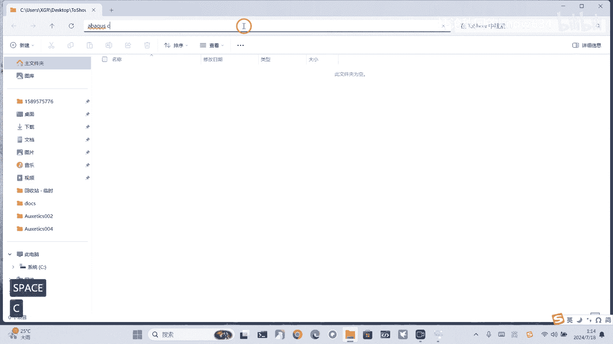
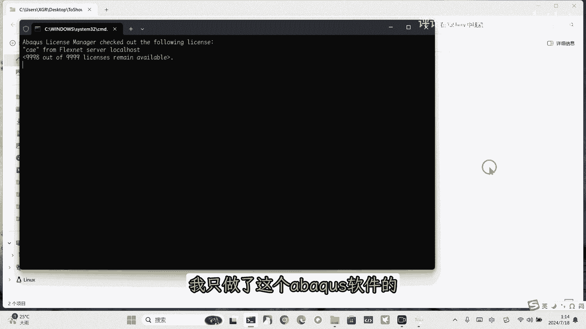
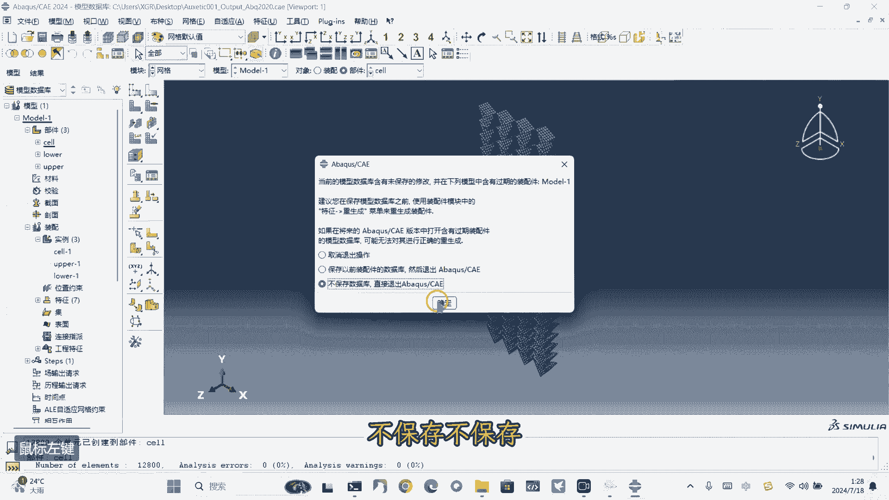
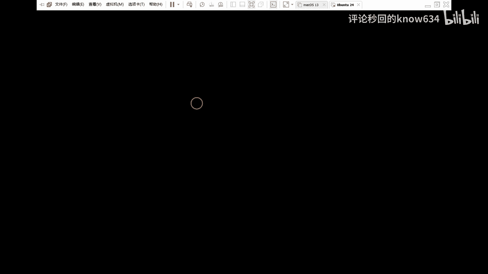
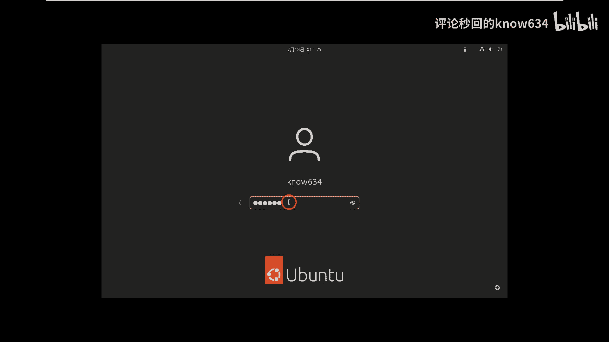
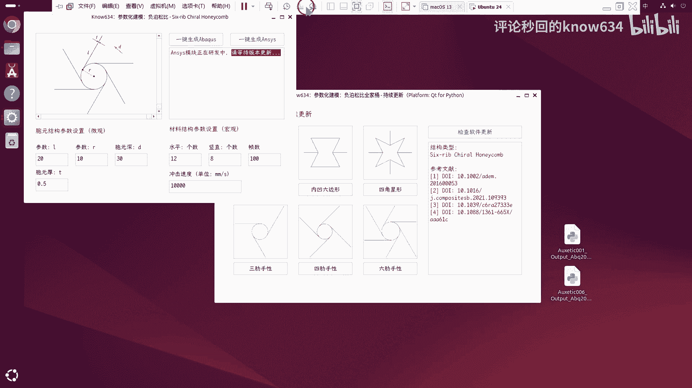
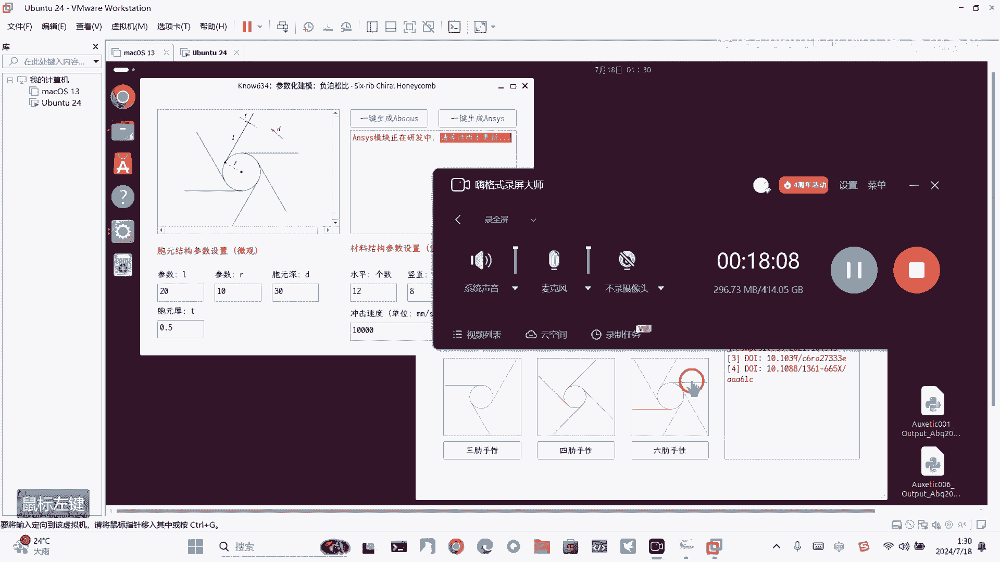

# Abaqus Python 二次开发：P1：负泊松比结构参数化建模工具介绍与使用 🚀

在本节课中，我们将学习一款用于Abaqus的参数化建模工具。该工具能够一键生成多种具有负泊松比特性的结构模型，极大简化了冲击仿真前的建模工作流程。

## 概述 📋

本教程将详细介绍该工具的安装、界面功能以及如何用它快速生成六种经典的负泊松比结构模型。我们将从软件安装开始，逐步演示每个模型的一键生成过程。

## 软件安装与启动 💻

首先，获取软件的安装包。双击打开安装程序，按照提示进行安装。在安装过程中，可以选择安装地址并创建桌面快捷方式。安装完成后，直接运行软件即可。

软件界面目前集成了六种经典负泊松比结构的建模功能。

## 软件界面与基础功能 🖱️

启动软件后，可以看到主界面。界面支持涂鸦功能，使用鼠标左键可以画图，鼠标右键可以擦除。这方便用户在做笔记或标记时使用。此外，软件还提供检查更新的功能。

上一节我们启动了软件，本节中我们来看看其核心的建模功能。

## 一键生成模型流程 🛠️

该工具的核心功能是参数化建模，用户无需在Abaqus中手动建模。以下是一键生成模型的基本步骤。

1.  在软件界面中选择目标结构类型。
2.  在参数输入区调整模型的几何参数。
3.  点击“一键生成”按钮，脚本文件将自动保存到桌面。
4.  打开Abaqus软件，运行桌面生成的脚本文件，模型即被自动创建。

生成模型后，用户可以在Abaqus中继续后续操作，如定义材料属性、设置分析步、施加荷载和划分网格。

## 六种结构模型演示 📐

接下来，我们将逐一演示六种负泊松比结构的一键生成过程。所有模型均以冲击压缩实验为背景，包含上下两个离散刚体冲击板。

### 1. 双箭头结构 ➡️⬅️

首先演示双箭头结构。在软件中选择该结构，调整图中所示的参数，然后点击一键生成。脚本将保存至桌面。

在Abaqus中运行此脚本，一个参数化的双箭头结构压缩实验模型便立即生成。

### 2. 内凹六边形结构 ⬢

删除上一个模型，我们来看内凹六边形结构。同样地，在软件中设置参数（如微观尺寸、宏观尺寸等），然后一键生成。

在Abaqus中运行新脚本，内凹六边形结构模型随之创建。该模型同样包含壳单元和两个离散刚体。

### 3. 四角星结构 ✦

第三个是四角星结构。其形状由三个关键参数决定。设置好参数后一键生成。

在Abaqus中运行脚本，星形结构迅速生成。通过调整参数，可以方便地获得不同尺寸的星形模型。

### 4. 三浦折叠结构 🪁

第四个是三浦折叠结构，其建模逻辑相对复杂。主要参数是折叠面的长度和半径。

运行生成的脚本，三浦折叠结构成功创建。该结构的难点在于计算每个面需要旋转的角度以实现平整排列。

### 5. 四边形蜂窝结构 🔲

第五个是四边形蜂窝结构。设置参数后一键生成，模型快速创建，结构整齐排列。

### 6. 六边形蜂窝结构 ⬣

最后是六边形蜂窝结构。操作方式相同，通过调整水平方向和竖直方向上的单元数量，可以批量生成不同规模的蜂窝阵列，体现了参数化建模的批量处理优势。

## 模型后处理与网格划分 📏

模型生成后，我们可以在Abaqus中进行后续设置。例如，为冲击板赋予质量属性（通过“以点带面”的方式创建惯性），为上面的冲击板施加一个初始速度作为荷载。

最后是网格划分。选中模型部件，为其指定合适的单元类型（如壳单元），然后进行检查和网格划分。工具生成的模型通常能够顺利通过网格检查并生成高质量网格。

## 跨平台支持：Linux系统演示 🐧

该工具支持跨平台使用。对于Linux系统或超算平台用户，软件提供了对应的版本。

在Linux系统中，软件通常是一个压缩包。解压后，运行其中的可执行文件即可启动，其界面和功能与Windows版本完全一致。生成脚本并在Abaqus中运行的方式也完全相同。

## 总结 🎯

本节课中我们一起学习了“负泊松比全家桶”参数化建模工具的使用。我们从软件安装开始，逐步了解了其界面功能，并详细演示了六种不同负泊松比结构的一键生成流程。该工具能自动处理复杂的几何建模，将模型保存为Abaqus Python脚本，用户只需运行脚本即可获得完整的分析前模型，大大提升了研究效率。目前该工具主要支持Abaqus，针对ANSYS的版本仍在开发中。