# 神经网络量化技术：P1：神经网络量化及其在计算机视觉中的应用综述 🧠

在本节课中，我们将要学习神经网络量化技术的基本概念、分类方法及其在计算机视觉领域的应用。量化是一种重要的模型压缩技术，旨在将神经网络中的浮点参数转换为离散的整数表示，从而减少模型存储空间和计算开销，使其更适合部署在资源受限的设备上。

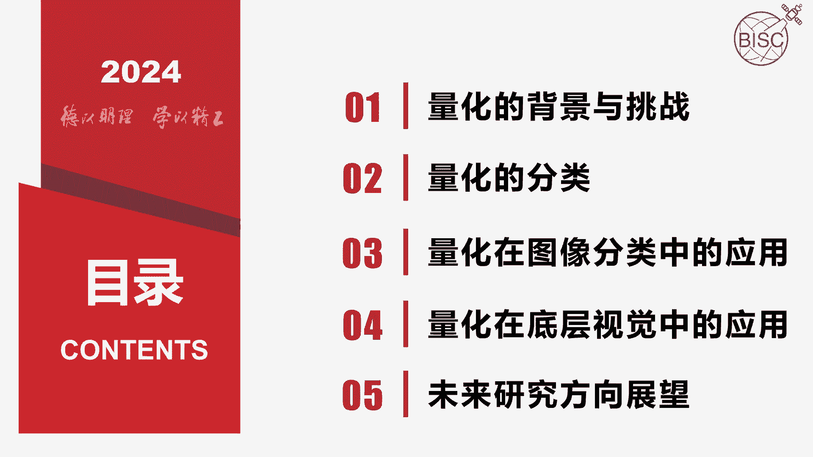

## 量化的背景与挑战 🎯

近年来，深度神经网络飞速发展。然而，神经网络包含大量的存储参数和很高的计算复杂度。这给其在硬件资源有限的设备上的使用带来了挑战。因此，对神经网络进行有效的压缩十分必要。

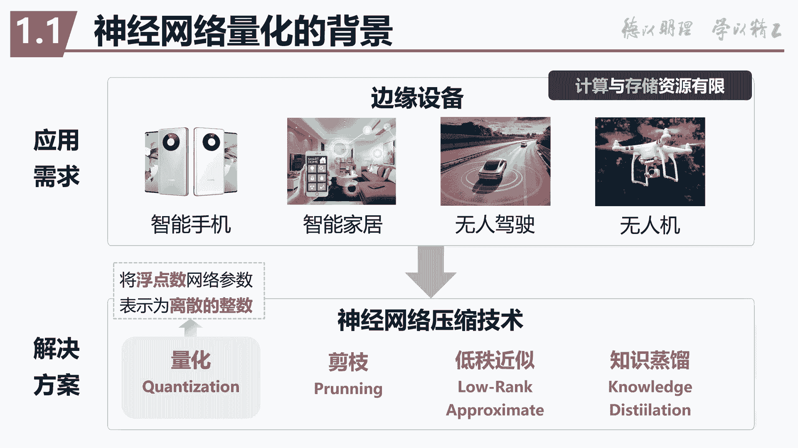

神经网络压缩技术主要有量化、剪枝、低秩近似和知识蒸馏等。其中，量化技术是将浮点参数表示为离散的整数。因其可以实现神经网络高压缩，且降低性能较小等优势被广泛利用。

目前，深度神经网络量化主要存在以下挑战：

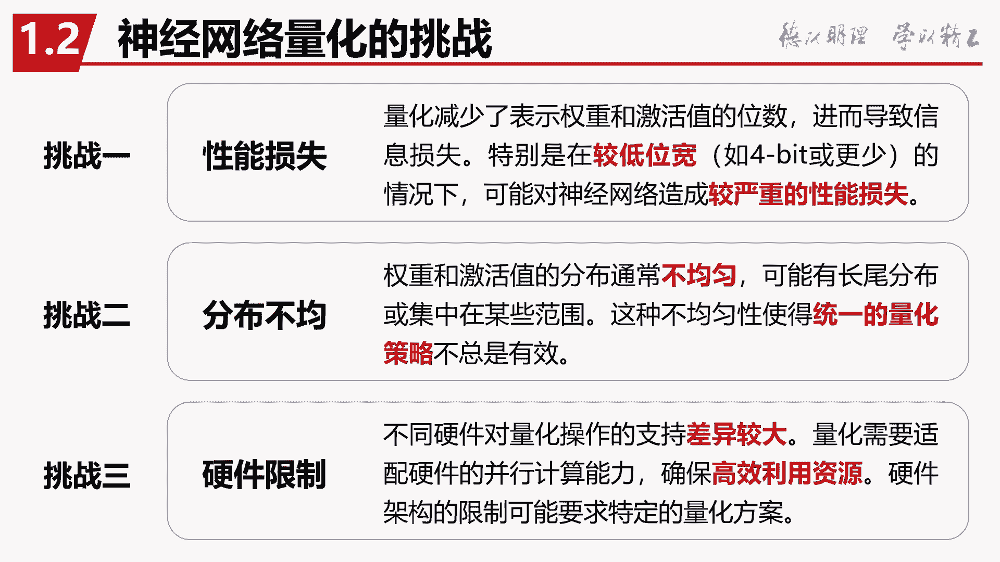

以下是量化技术面临的主要挑战：
1.  **性能损失**：因量化导致的误差累积导致严重的性能损失，特别是在低比特量化方案中。
2.  **分布不均**：不同层的权重和激活值分布通常不相似。这可能导致统一的量化策略失效。
3.  **硬件限制**：不同硬件对量化操作的支持差异较大，不能够保证高效的利用硬件资源。

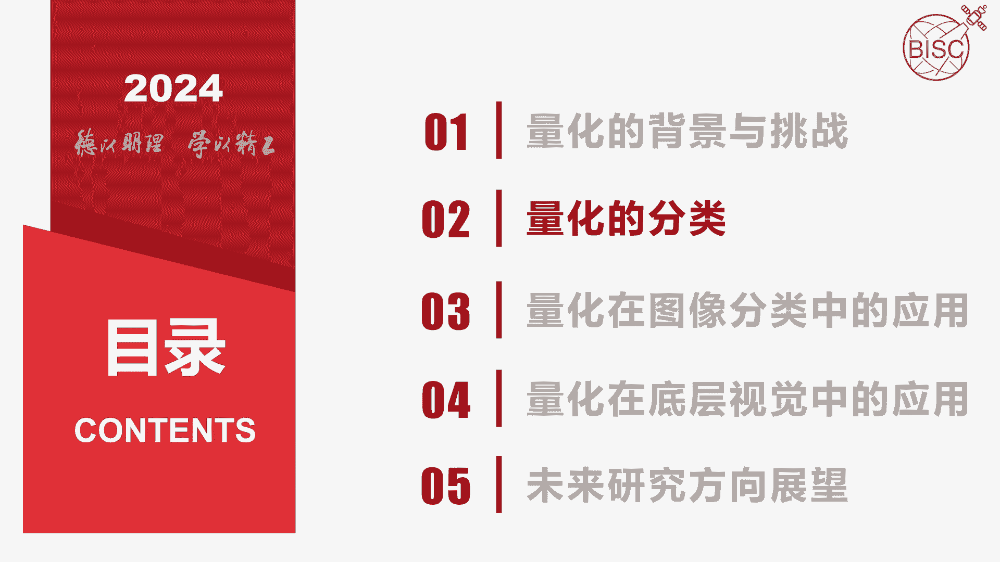

## 量化的分类 📊

上一节我们介绍了量化的背景与挑战，本节中我们来看看量化技术有哪些不同的分类方式。

以下是几种主要的量化分类标准：
*   **按量化分布分类**：
    *   **均匀量化**：量化网格步长相同的量化方式。
    *   **非均匀量化**：量化网格步长不同的量化方式。
*   **按量化发生的时间点分类**：
    *   **训练后量化**：在模型训练完成后进行量化。
    *   **量化感知训练**：在模型训练过程中模拟量化效应。
        *   `QAT` 在低比特量化（四比特及以下）相比 `PTQ` 有明显的优势，但训练时间较长。
*   **按量化确定性分类**：
    *   **确定性量化**：量化过程是确定的。
    *   **随机性量化**：量化过程引入随机性，通常表现出更好的模型泛化性，但硬件支持方面仍有挑战。
*   **按量化粒度分类**：
    *   **层尺度量化**：一个层中所有的滤波器均采用相同的量化参数，易于实现。
    *   **通道尺度量化**：每个滤波器有一套独立的量化参数，其效果较好。
    *   **通道组尺度量化**：介于层尺度量化和通道尺度量化之间。

## 量化在图像分类任务中的应用 🖼️

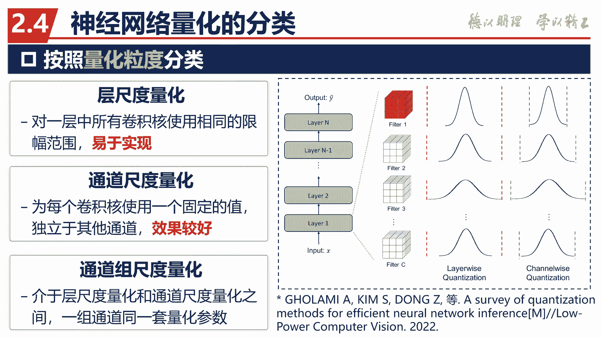

了解了量化的基本分类后，我们来看看它在具体任务中的应用。当前神经网络量化技术的研究仍处于初级阶段，大部分研究工作都是在图像分类任务上验证其方法的有效性。

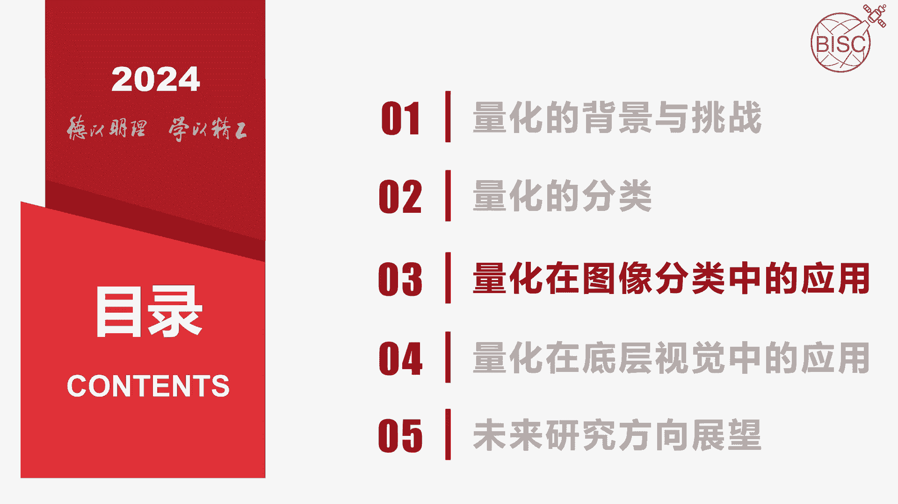

部分代表性的基于 CNN 的网络量化方法如下表所示（数据为原论文在 ResNet18 网络和 ImageNet 数据集上报告的准确率）：

| 方法 | 描述 |
| :--- | :--- |
| **N2UQ** | 表现最好的方法之一 |

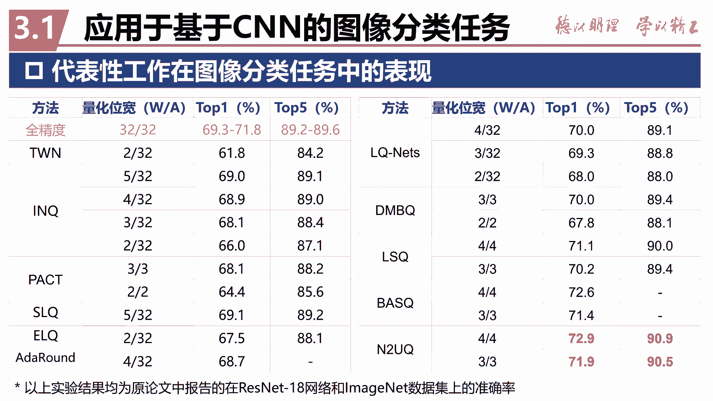

我们可以看到表现最好的方法是 **N2UQ** 这个方法。下面我们介绍一下这个方法。

**N2UQ 方法**提出了一种非均匀到均匀的量化方法。该方法通过将量化映射函数中的所有阈值都设置为可学习参数，在保证硬件友好性的同时提升了精度。该方法同时引入了广义直通估计器来计算量化器的梯度，进一步提升训练效果。

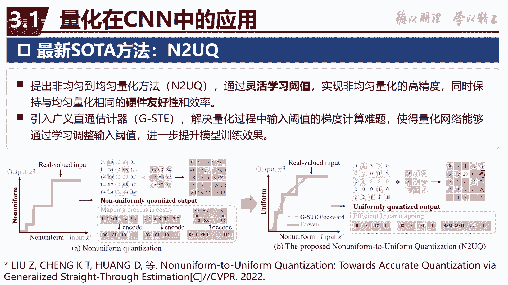

下面我们做了一个小实验，比较几种典型 QAT 优化方法在小数据集 CIFAR-10 上低比特量化的有效性。实验设置中不使用预训练模型或知识蒸馏辅助量化，均采用从零训练的方式。

我们可以看到，**N2UQ 在 2、3、4 比特上的量化效果均表现最好**。

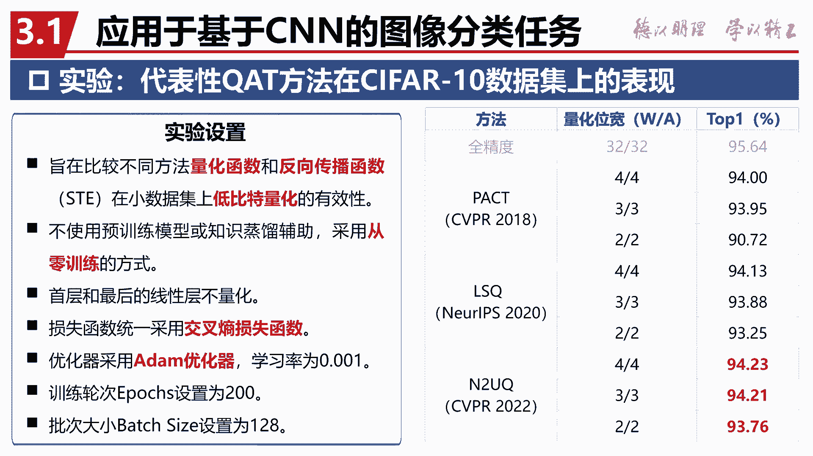

对于基于 Transformer 网络的量化技术，现有的研究主要针对算法和硬件两个方面进行改进和提升。表中展示了代表性量化方法在 Transformer 网络上的量化表现。可以看出，**GPUSQ-Lean** 和 **PackQViT** 表现较为突出。

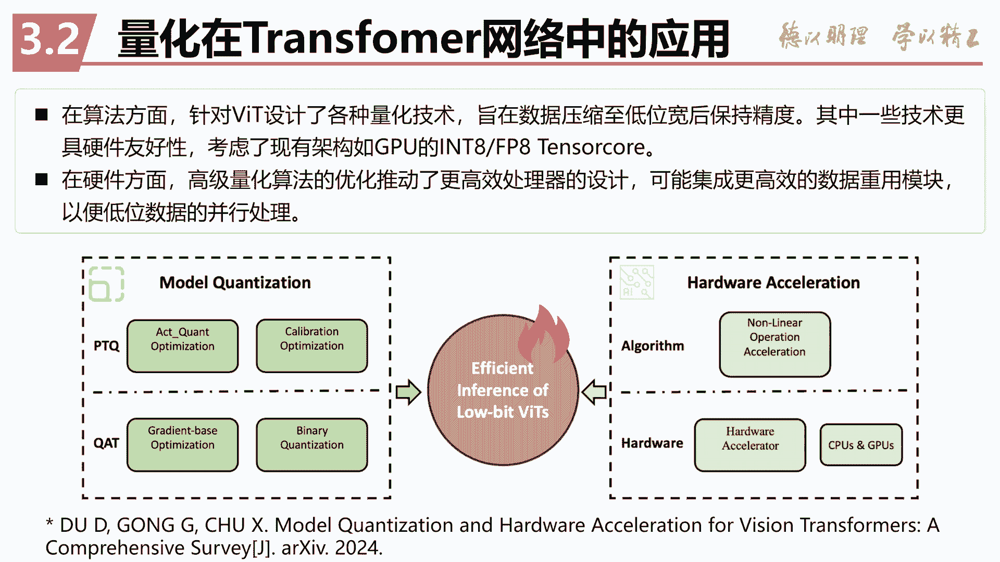

**PackQViT** 针对 8 比特和 4 比特提出了两套不同的量化方案，结合全量化和打包量化技术，提高了模型硬件效率和推理精度。

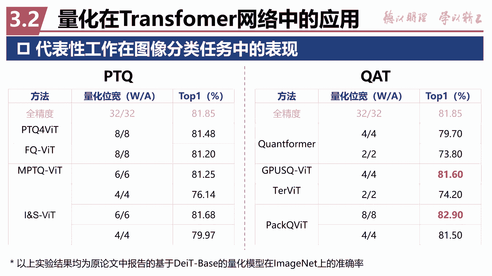

## 量化技术在底层视觉任务中的应用 🔍

前面我们主要讨论了量化在图像分类任务中的应用，本节中我们来看看量化在更广泛的底层视觉任务中的应用。底层视觉任务包括图像或视频的超分辨率、去噪、去模糊、去雾、去雨、低光增强等等。

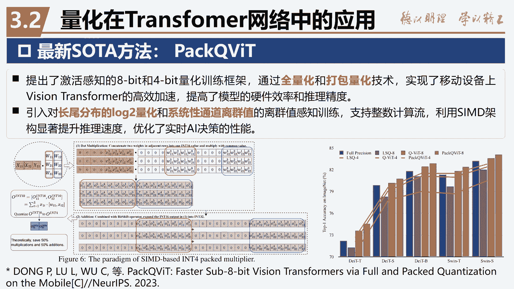

最新的图像超分辨率量化工作代表之一 **QuantSR**，其针对超分网络引入了可学习量化器和动态量化架构，提升了低比特量化模型的信息表示能力，并实现了量化与精度的平衡。

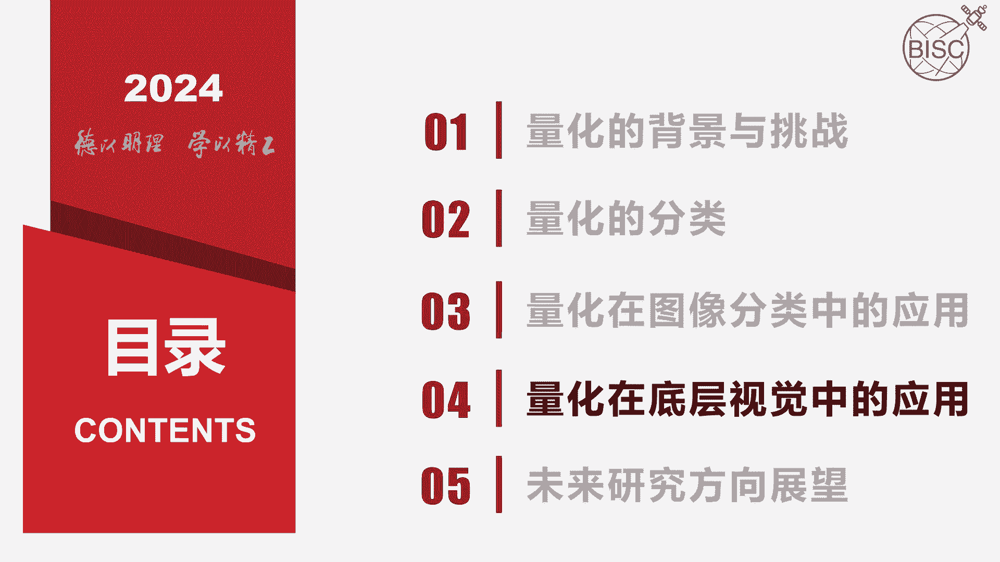

另一篇工作是针对低光照/弱光视频增强任务，提出了一个二进制神经网络模型（即量化位宽为 1 比特）。该方法在没有严重影响增强效果的前提下，将模型的计算量和参数量降低了 98%。

我们对这篇工作进行了复现和改进实验。我们对其中的空间、时间位移操作和二进制单元的层数进行调整，在进一步降低参数量的同时，提升了增强视频的 PSNR 和 SSIM 等评价指标。右边是增强后的视频可视化效果。

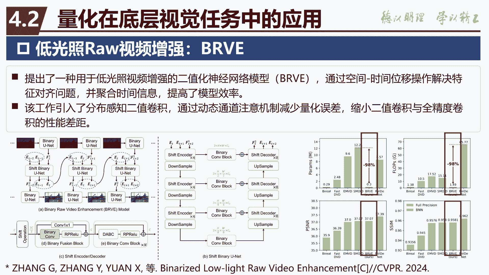

## 总结与展望 🚀

本节课中我们一起学习了神经网络量化技术。我们首先了解了量化技术产生的背景及其面临的主要挑战，如性能损失、分布不均和硬件限制。接着，我们系统学习了量化技术的多种分类方式，包括按分布、时间点、确定性和粒度进行分类。

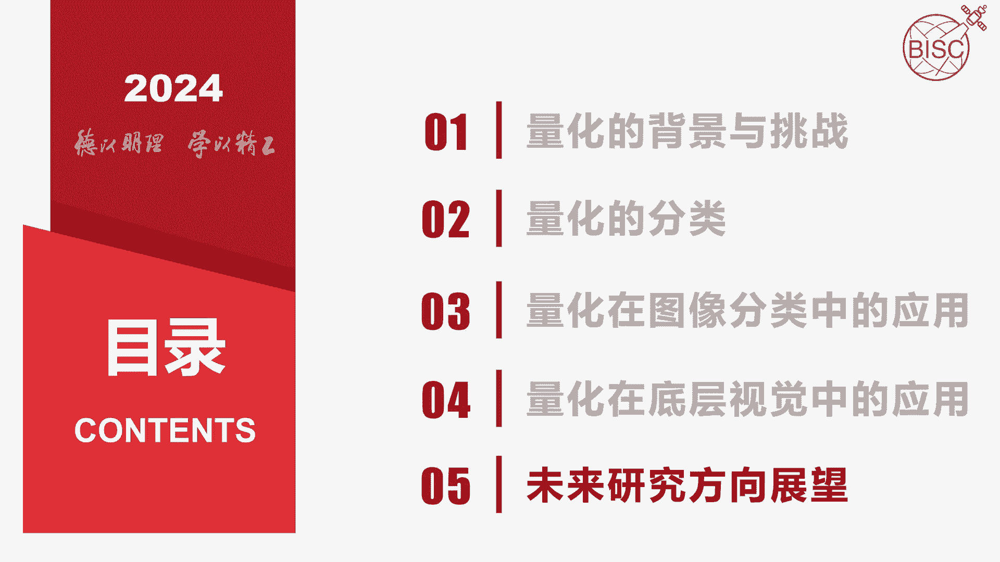

然后，我们探讨了量化在图像分类任务中的应用，重点介绍了表现优异的 **N2UQ** 方法及其在 CNN 和 Transformer 网络上的效果。最后，我们看到了量化技术在底层视觉任务（如超分辨率和低光增强）中的成功应用案例。

展望未来，研究方向包括：
1.  针对特定的视觉任务提出相应的量化方案。
2.  目前主流硬件对 4 比特及以下的量化方案支持有限，专用硬件设计是未来的研究方向之一。
3.  对量化噪声的传递进行更精准的数学建模，从而进一步补偿量化带来的精度损失。

以上就是关于神经网络量化技术及其应用的综述内容。