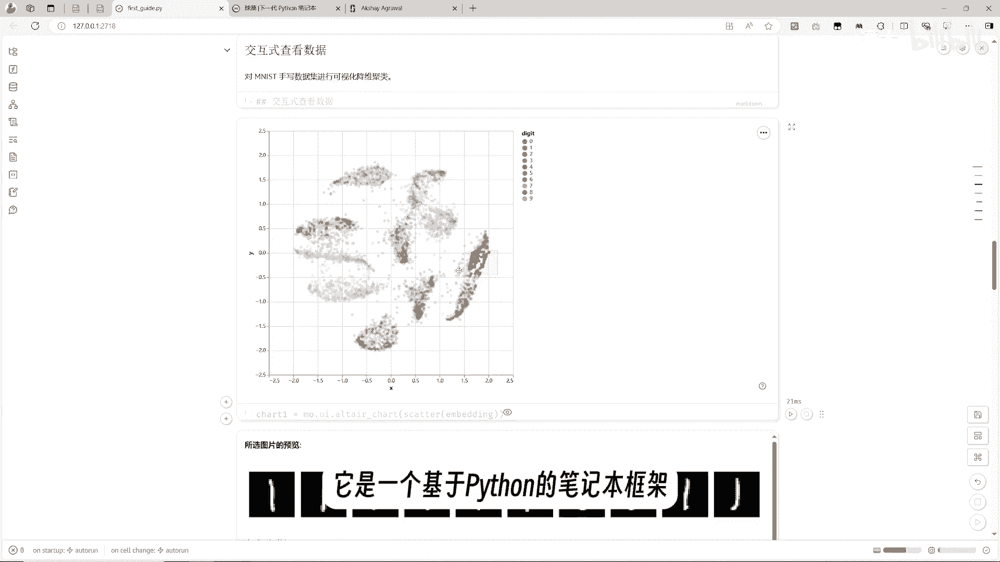
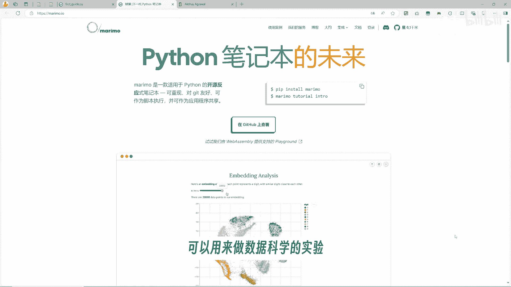
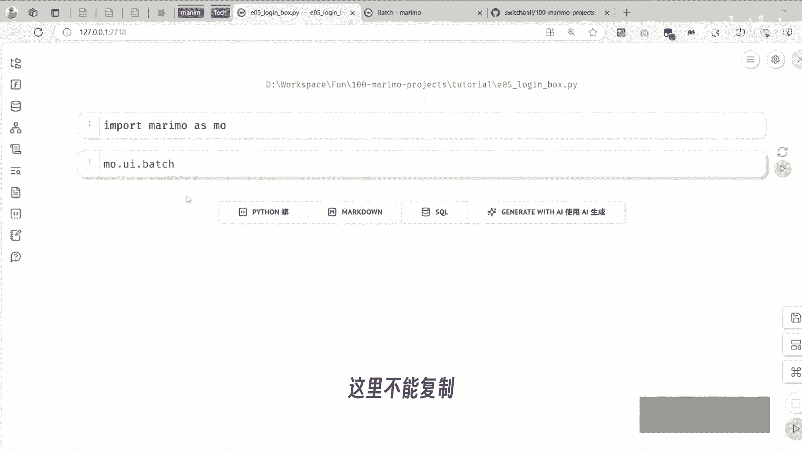
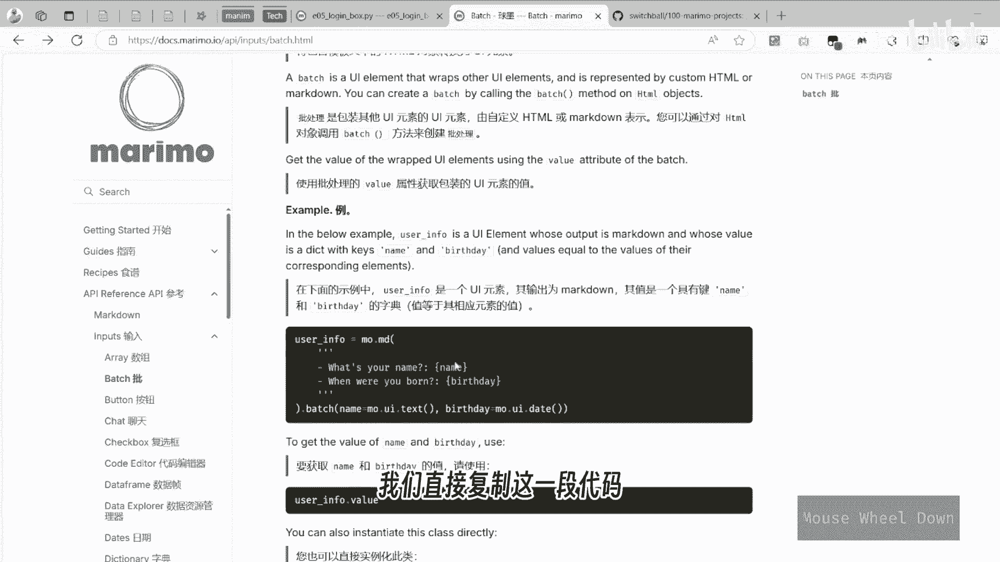
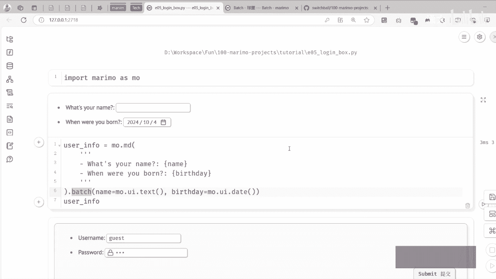
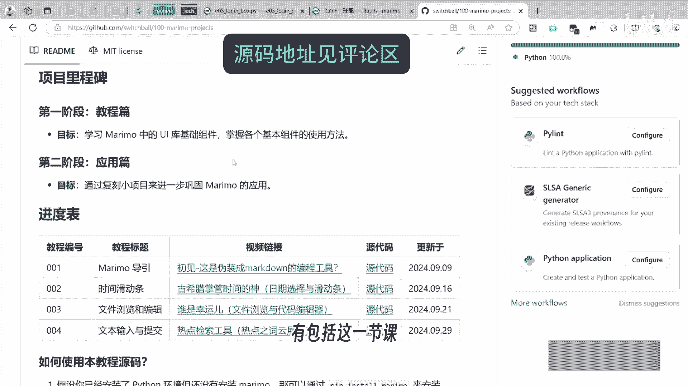
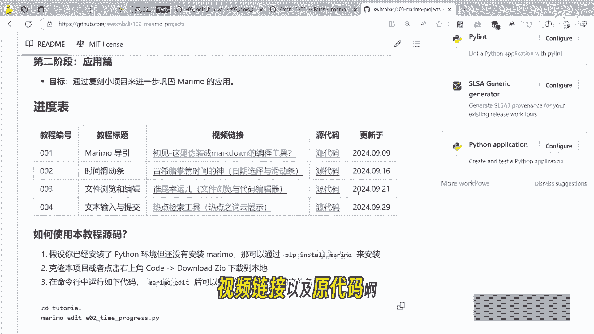
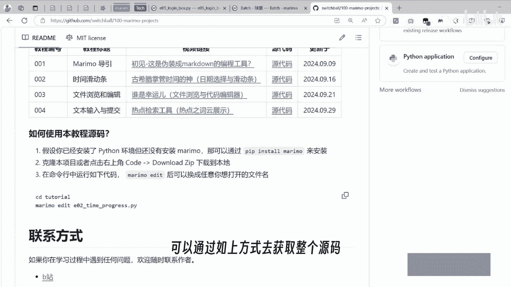
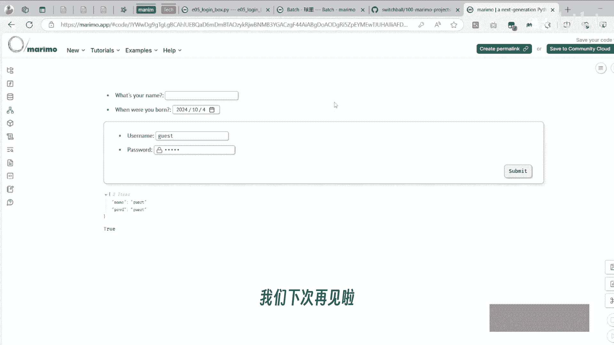

# Marimo系列教程：05：使用Batch构建登录框UI


在本节课中，我们将学习Marimo框架中的`batch`功能，并利用它来构建一个包含用户名和密码输入框的登录界面。我们将从理解`batch`的基本概念开始，逐步实现一个具有表单提交和登录验证功能的完整示例。

---



## 概述：什么是Marimo？🤔

Marimo是一个基于Python的笔记本框架。它类似于Jupyter Notebook，可用于数据科学实验，也可以将笔记本部署为网页端的交互式工具。



上一节我们介绍了Marimo的基础，本节中我们来看看如何使用`batch`功能来批量化地创建UI组件。

---

## 理解Batch功能 🔄



`batch`这个词可以翻译为批处理或批量化。根据官方介绍，它的作用是将一个包含模板文本的HTML对象，转换为一个UI元素。这个概念初听可能有些抽象。

我们通过一个简单的例子来理解。以下是官方文档中的一个基础示例代码：



```python
import marimo as mo

# 定义一个包含占位符的模板字符串
template = "Hello, {name}! Your birthday is {birthday}."
# 使用batch将占位符替换为对应的UI组件
ui = mo.batch(
    template,
    name=mo.ui.text(value="Marimo"),
    birthday=mo.ui.date()
)
ui
```

运行这段代码，会输出一个交互式界面。其中，`{name}`占位符被替换为一个文本输入框，`{birthday}`占位符被替换为一个日期选择器。

**核心概念**：`mo.batch(template, **placeholders)`函数接收一个模板字符串和一系列关键字参数。模板中的花括号`{}`包裹的占位符名，会被对应关键字参数提供的UI组件所替换。**注意**：模板字符串无需使用f-string格式，直接使用花括号即可。

---

## 构建登录对话框 🖥️

理解了`batch`的基本用法后，我们尝试用它来构建一个登录对话框。登录框通常需要用户名和密码输入框。

首先，我们创建一个包含`name`和`password`占位符的模板字符串。

```python
login_template = "Username: {name}\nPassword: {password}"
```

接着，我们使用`batch`函数，将占位符替换为具体的UI组件。

以下是替换过程的关键代码：

```python
login_ui = mo.batch(
    login_template,
    name=mo.ui.text(value="guest"),  # 用户名输入框，默认值"guest"
    password=mo.ui.text(type="password")  # 密码输入框，类型设为password以隐藏输入
)
login_ui
```

现在，我们得到了一个名为`login_ui`的UI对象，它包含了两个输入框。我们可以通过`login_ui.value`属性来获取用户输入的值。这个值是一个字典，键是占位符的名称。

---

## 添加表单提交功能 ✅

目前，输入框的值会实时响应变化。为了实现更传统的“提交后验证”流程，我们可以使用`mo.ui.form`组件。表单可以将内部的输入控件包裹起来，并提供一个提交按钮。只有在点击提交按钮后，才会返回输入的值。

我们将刚才的`login_ui`放入一个表单中：

```python
login_form = mo.ui.form(login_ui, label="Login")
login_form
```

此时，界面上会出现一个提交按钮。只有点击“Login”按钮后，`login_form.value`才会更新为最新的输入值。

---

## 实现登录验证逻辑 🔐

有了表单和输入数据，我们需要验证用户名和密码是否正确。首先，我们模拟一个用户账户数据库。

```python
# 模拟一个简单的账户数据库，格式为 {用户名: 密码}
accounts = {
    "root": "admin123",
    "guest": "guest123"
}
```

接下来，我们定义一个函数`check_login`，用于验证登录信息。



```python
def check_login(credentials):
    """验证用户名和密码"""
    username = credentials.get("name")
    password = credentials.get("password")
    # 检查用户名是否存在且密码匹配
    if username in accounts and accounts[username] == password:
        return True
    else:
        return False
```

现在，我们将表单的提交结果传递给这个验证函数，并根据结果输出不同的提示信息。



```python
# 获取表单提交后的值
submitted_value = login_form.value
if submitted_value is not None:
    is_valid = check_login(submitted_value)
    if is_valid:
        mo.output.append(mo.md("### 🎉 登录成功！"))
    else:
        mo.output.append(mo.md("### ❌ 用户名或密码错误", style="color: red;"))
```



当用户输入正确的用户名（如`guest`）和密码（`guest123`）并提交后，会看到“登录成功”的提示。如果信息错误，则会以红色字体显示“用户名或密码错误”。

---



## 分享你的应用 🌐

完成登录框制作后，你可能希望分享它。Marimo提供了便捷的分享功能。

以下是两种分享方式：
1.  在笔记本界面点击 **共享 (Share)** -> **创建链接 (Create Link)** -> **发布 (Publish)**。系统会生成一个链接，他人可以通过此链接在浏览器中直接运行你的应用。
2.  另一种方式是创建 **WebAssembly 链接**，这同样会生成一个长链接，打开后应用将在用户的浏览器本地执行，无需后端服务器支持。

你可以尝试使用生成的链接，在浏览器中打开你的登录框，并测试登录功能。

---

## 总结 📝

本节课我们一起学习了Marimo中`batch`功能的使用。我们掌握了如何通过以下步骤构建一个交互式登录界面：
1.  **理解`batch`**：使用模板字符串和占位符批量生成UI组件。
2.  **构建UI**：将`{name}`和`{password}`占位符替换为文本输入框。
3.  **管理交互**：使用`mo.ui.form`控制数据提交时机。
4.  **实现逻辑**：编写Python函数验证用户输入，并根据结果动态更新输出内容。
5.  **分享应用**：利用Marimo的发布功能，将笔记本转换为可共享的网页应用。



通过这个完整的例子，你应该对如何使用Marimo创建具有实际功能的Web UI有了更深入的了解。