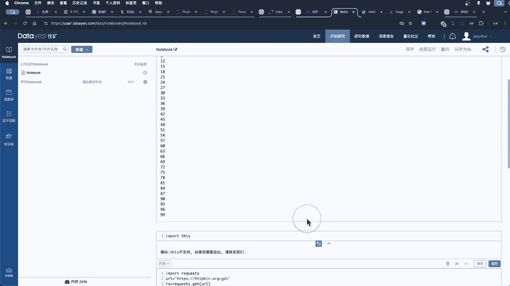
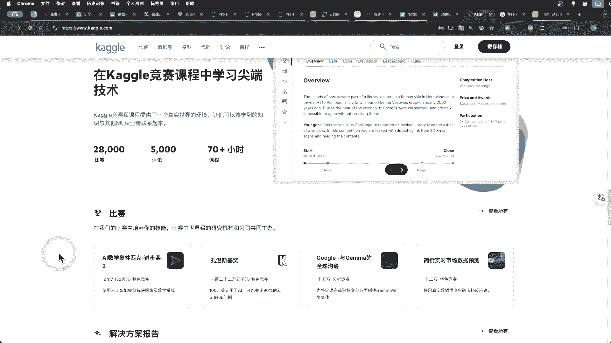
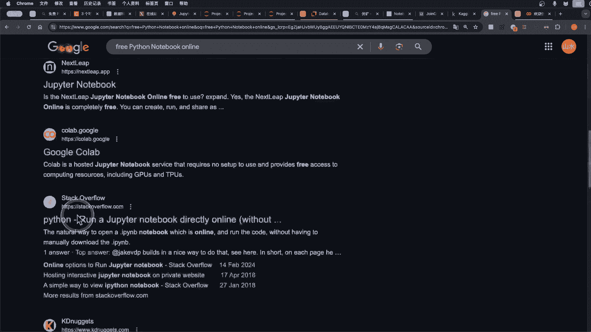
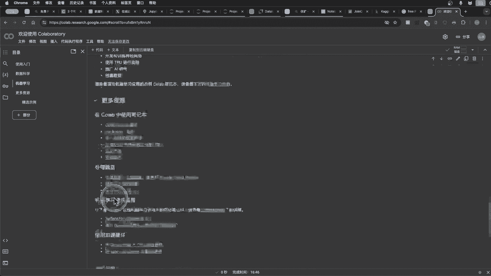
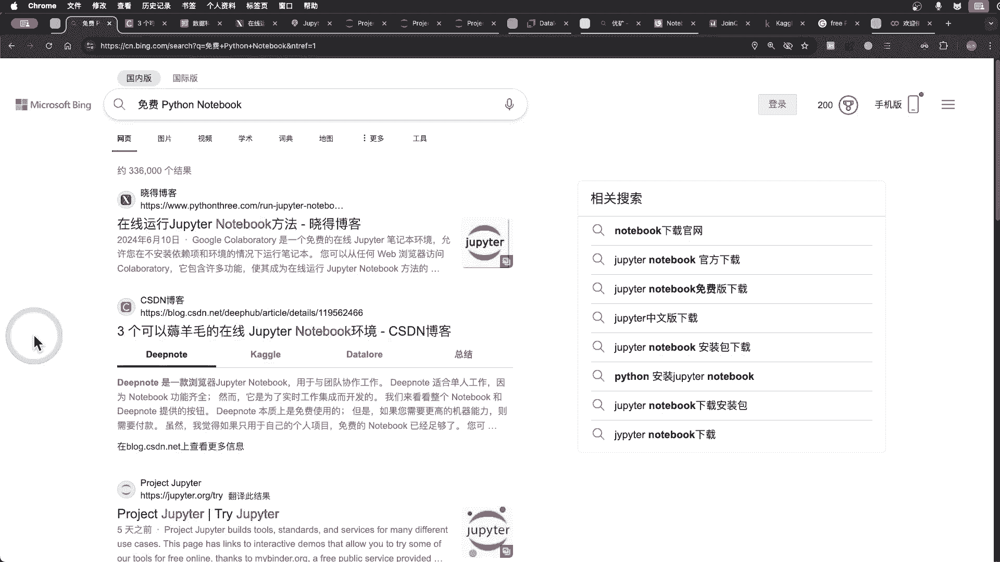

# Python在线开发环境：P1：免费Python Notebook平台概览

## 概述
在本节课中，我们将学习如何获取并使用免费的在线Python Notebook运行环境。这些平台允许你直接在浏览器中编写和运行Python代码，无需在本地计算机上安装和配置复杂的开发环境。这对于初学者快速上手Python、进行数据分析或机器学习项目非常方便。

上一节我们介绍了在线Python Notebook的概念，本节中我们来看看具体有哪些平台可供选择。

## 主要免费Python Notebook平台介绍
以下是几个主流的免费在线Python Notebook平台及其特点。

### 1. DNOTE
DNOTE适合单人工作，功能齐全，集成了学习和工作环境。它提供免费试用，但更高级的功能需要付费。其可视化功能较为强大。

### 2. Kaggle
Kaggle是一个初学者和专业数据科学家都应该关注的网站。它提供了用于数据科学竞赛的定制化Notebook环境、海量数据集，并允许用户每周免费使用40小时的TPU资源。

### 3. Data Law
Data Law提供自动代码补全和帮助功能，其代码提示功能非常好用。

### 4. Google Colab
Google Colab是谷歌提供的最佳在线运行环境之一。它免费提供TPU和GPU资源，但访问可能需要特定的网络条件。

### 5. 其他平台
此外，还有阿里云、MyBinder、COCO、CONGODNOTE等平台也提供类似服务。

## 平台使用演示与注意事项
我们以JupyterLite为例进行简单演示。这是一个官方的轻量级尝试环境。

打开JupyterLite后，我们可以创建一个新的Notebook并执行代码。例如，导入Python的“禅宗”模块并打印其内容：

```python
import this
```



执行上述代码会输出《Python之禅》的文本。


我们也可以尝试使用`requests`模块获取网络数据：



```python
import requests
response = requests.get(‘https://api.ipify.org?format=json‘)
print(response.json())
```

这段代码会返回你的公共IP地址信息。在这个环境中学习Python是一个很好的方法。你可以复制代码片段，或添加`print`语句来查看输出。



然而，需要注意的是，像JupyterLite这样的轻量级环境可能不支持所有模块，尤其是需要连接外部网络的模块（如`requests`），可能会因为环境限制而无法正常工作。

## 更多学习资源与平台
除了基础的代码运行，一些平台还提供了丰富的学习资源。

例如，Kaggle平台不仅提供运行环境，还包含大量高质量公共数据集（如视频游戏销售数据）、预训练模型以及竞赛项目，是深入学习的宝贵资源。



Google Colab则深度集成了机器学习库（如TensorFlow、PyTorch），允许用户在浏览器中直接编写和执行Python代码，无需任何配置即可免费使用GPU，并轻松分享项目。



## 总结
本节课中我们一起学习了多种免费的在线Python Notebook平台。这些平台，如Kaggle、Google Colab、JupyterLite等，为学习和使用Python提供了极大的便利，让你无需在本地部署安装Python环境即可开始编程、数据分析与机器学习项目。Python Notebook是一个极佳的学习和实践Python的工具。