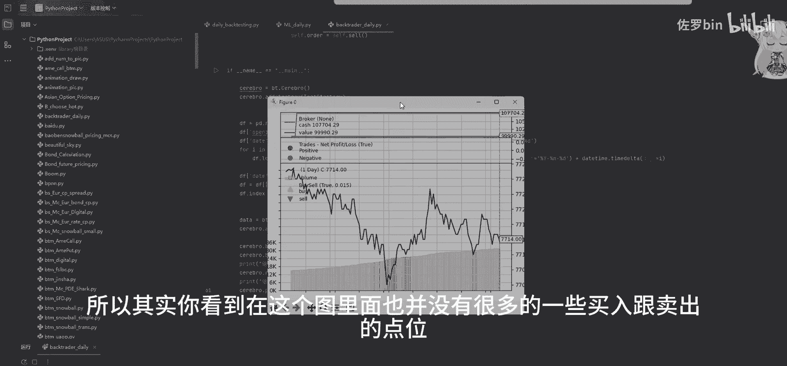
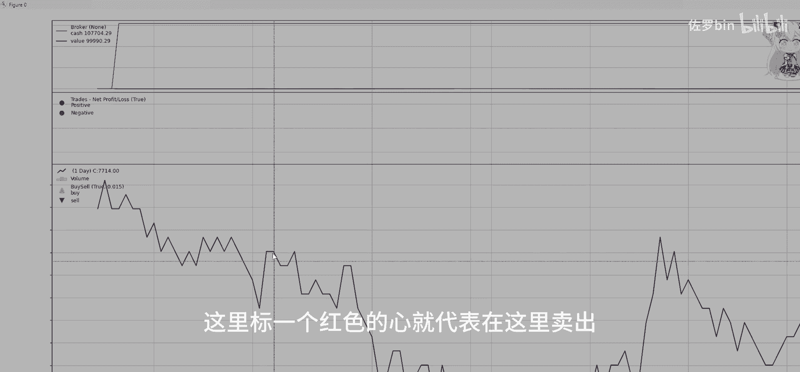
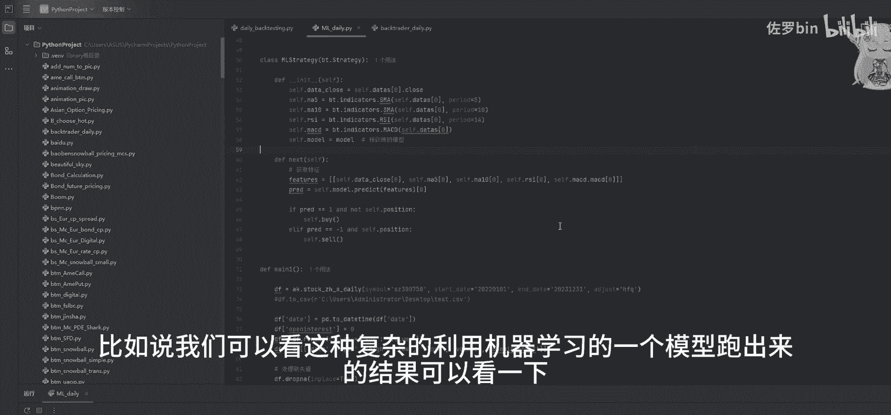
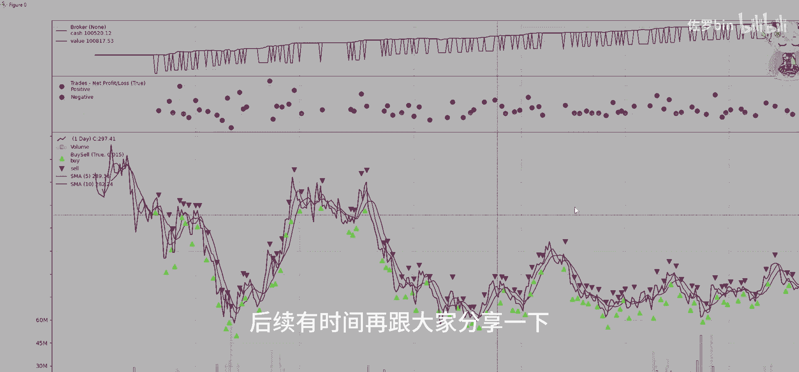
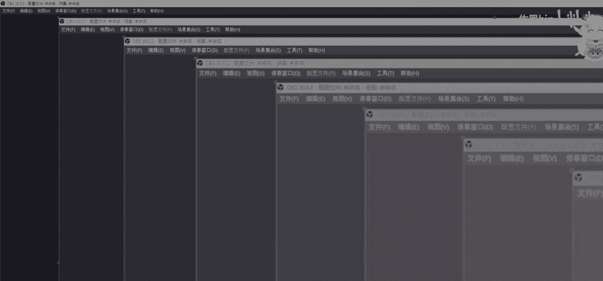

# Python量化回测入门：P1：构建基础回测框架 📈


在本节课中，我们将学习如何使用Python构建一个最基础的量化交易策略回测框架。我们将使用`backtrader`库作为回测引擎，并实现一个简单的“逢低买入，逢高卖出”策略。

## 概述

量化交易的核心步骤之一是策略回测，即在历史数据上验证交易策略的有效性。一个完整的回测框架需要包含数据加载、策略逻辑定义、交易执行模拟以及结果分析等部分。本节我们将从零开始，搭建这样一个框架。

## 准备工作：导入必要库

首先，我们需要导入两个核心库：
*   `backtrader`：一个功能强大的量化交易策略回测和分析框架。
*   `pandas`：用于数据处理和分析。

以下是导入代码：
```python
import backtrader as bt
import pandas as pd
```

## 第一步：定义交易策略类

上一节我们介绍了所需的工具库，本节中我们来看看如何定义具体的交易策略。我们将创建一个继承自`backtrader.Strategy`的类。

```python
class TestStrategy(bt.Strategy):
```
在策略类中，我们需要定义几个关键方法。

### 1. 日志记录函数

首先，定义一个简单的日志函数，用于打印策略运行过程中的关键信息。

```python
    def log(self, txt):
        print(txt)
```

### 2. 初始化方法 `__init__`

在`__init__`方法中，我们需要声明和初始化策略用到的各种变量。

```python
    def __init__(self):
        self.dataclose = self.datas[0].close  # 引用数据序列的收盘价
        self.order = None  # 跟踪订单状态
        self.buyprice = None  # 记录买入价格
        self.buycomm = None  # 记录买入时的手续费
```
*   `self.dataclose`：保存收盘价数据序列的引用，便于后续访问。
*   `self.order`：用于跟踪是否有未完成的订单。
*   `self.buyprice` 和 `self.buycomm`：用于记录交易详情。

### 3. 策略逻辑核心：`next` 方法

`next`方法在每一个新的数据点（例如每一天）都会被调用，是我们放置买卖逻辑的地方。

```python
    def next(self):
        self.log(f‘收盘价： {self.dataclose[0]}’)  # 打印当前收盘价

        # 检查是否有未完成的订单，如果有则不再发新订单
        if self.order:
            return

        # 检查当前是否持有仓位
        if not self.position:
            # 如果没有持仓，则考虑买入条件
            # 条件：连续两天下跌 (今日收盘价 < 昨日收盘价 且 昨日收盘价 < 前日收盘价)
            if self.dataclose[0] < self.dataclose[-1] and self.dataclose[-1] < self.dataclose[-2]:
                self.log(‘发出买入信号’)
                self.order = self.buy()  # 执行买入
        else:
            # 如果已经持有仓位，则考虑卖出条件
            # 条件：连续两天上涨
            if self.dataclose[0] > self.dataclose[-1] and self.dataclose[-1] > self.dataclose[-2]:
                self.log(‘发出卖出信号’)
                self.order = self.sell()  # 执行卖出
```
策略逻辑非常简单：当检测到价格连续下跌两天时买入，连续上涨两天时卖出。

## 第二步：准备回测数据

定义了策略之后，我们需要为它提供历史数据进行测试。数据需要包含特定的字段。

以下是数据准备的关键步骤：
1.  **读取数据**：从CSV文件中读取原始数据。
2.  **规范字段**：确保数据包含`backtrader`必需的字段。
3.  **处理日期**：将日期列设置为索引并格式化。

```python
# 1. 读取CSV数据文件
df = pd.read_csv(‘your_data.csv’)

# 2. 添加必需字段（如果原数据没有）
# ‘openinterest’持仓量字段，若无可用0填充
df[‘openinterest’] = 0
# ‘datetime’日期时间字段是必须的，需转换为datetime格式
df[‘datetime’] = pd.to_datetime(df[‘date’])  # 假设原数据有‘date’列
df.set_index(‘datetime’, inplace=True)  # 将日期设置为索引

# 3. 确保列名符合backtrader要求
# 必需的列包括: ‘open’, ‘high’, ‘low’, ‘close’, ‘volume’, ‘openinterest’
df = df[[‘open’, ‘high’, ‘low’, ‘close’, ‘volume’, ‘openinterest’]]
```

## 第三步：创建并运行回测引擎

现在，我们将策略和数据组合起来，在回测引擎`Cerebro`中运行。

```python
# 初始化回测引擎
cerebro = bt.Cerebro()

# 将数据添加到引擎中
data = bt.feeds.PandasData(dataname=df)
cerebro.adddata(data)

# 将我们定义的策略添加到引擎中
cerebro.addstrategy(TestStrategy)



# 设置初始资金为100，000元
cerebro.broker.setcash(100000.0)
# 设置交易手续费为0.1%（单边）
cerebro.broker.setcommission(commission=0.001)

print(‘初始资金: %.2f’ % cerebro.broker.getvalue())

# 运行回测
cerebro.run()

print(‘最终资金: %.2f’ % cerebro.broker.getvalue())



# 绘制回测结果图表
cerebro.plot()
```

## 回测结果分析

运行上述代码后，我们会得到最终的账户资金和一张图表。图表中：
*   黑色线代表标的资产的价格走势。
*   绿色的星号（`*`）标记买入点。
*   红色的星号（`*`）标记卖出点。

由于我们使用的策略非常简单（仅基于过去两天的价格涨跌），在复杂的市场环境中可能不会产生很多交易信号，最终收益也可能很普通，甚至亏损。这正体现了回测的重要性——它可以帮助我们快速验证一个策略想法的基本表现。



更复杂的策略（例如结合机器学习模型）会产生更频繁的交易信号，但其开发和验证过程也更为复杂。

## 总结



本节课中我们一起学习了量化回测的基础流程：
1.  **导入库**：引入`backtrader`和`pandas`。
2.  **定义策略**：创建继承自`bt.Strategy`的类，并在`__init__`和`next`方法中实现初始化和交易逻辑。
3.  **准备数据**：使用`pandas`加载和处理数据，确保格式符合`backtrader`要求。
4.  **运行回测**：使用`Cerebro`引擎整合策略与数据，设置初始资金和手续费，执行回测并分析结果。



通过这个简单的框架，你已经可以开始测试自己的交易想法了。后续可以尝试修改策略逻辑、添加技术指标或优化参数，以探索更有效的交易策略。