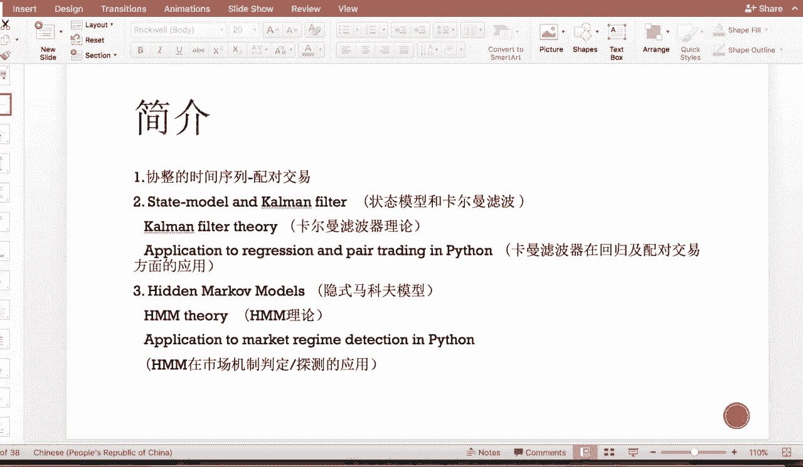
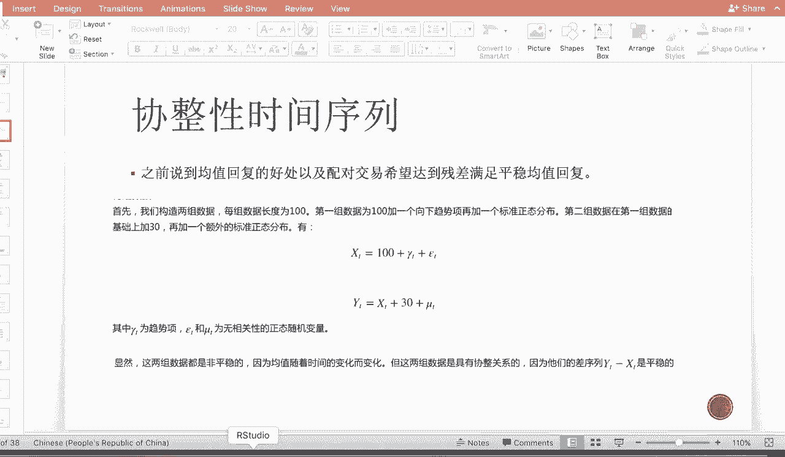
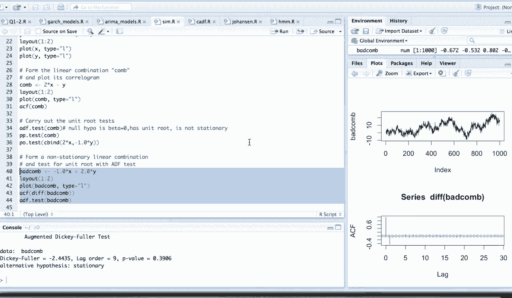
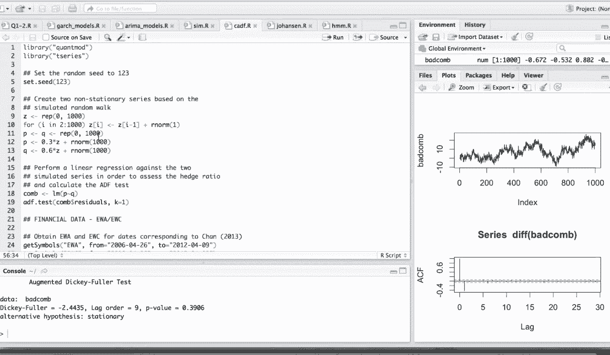
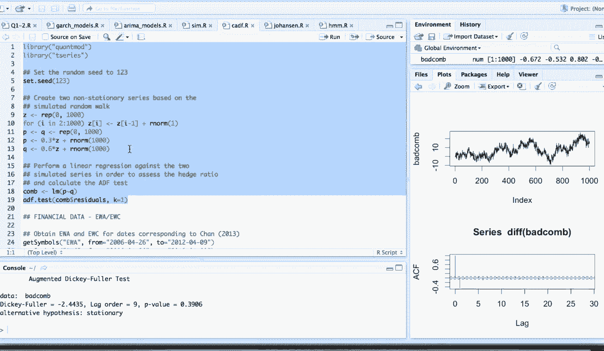
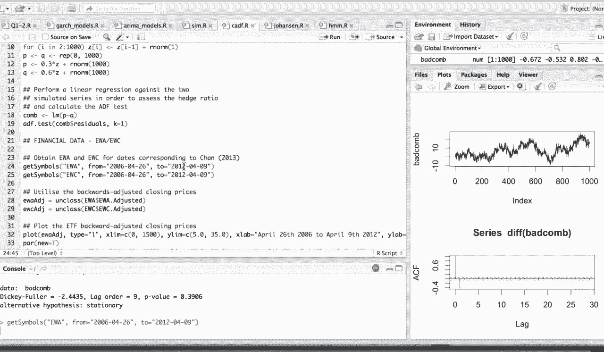
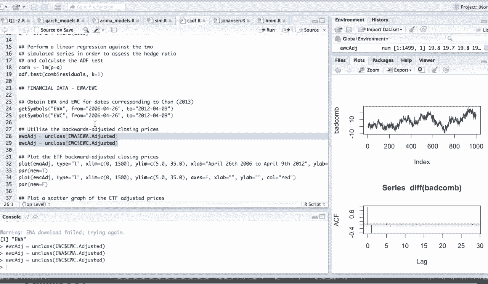
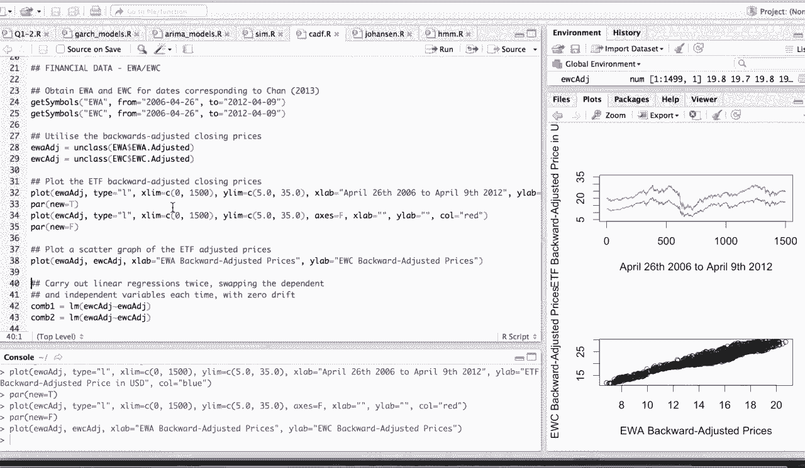
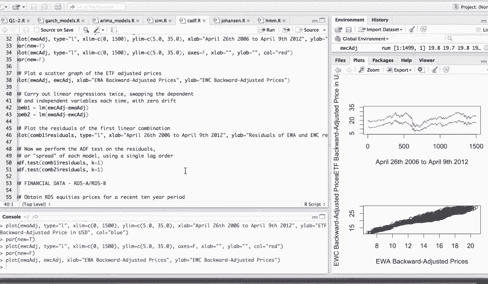
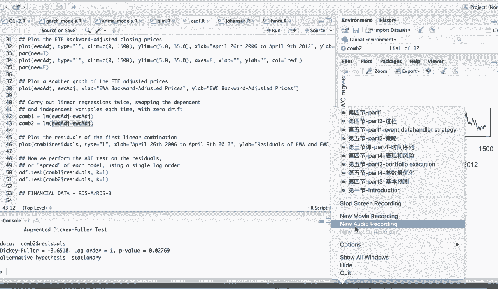

# Python量化交易：第15节：金融时间序列-II-协整性 📈


在本节课中，我们将延续上一节关于金融时间序列的内容，深入探讨协整性及其在配对交易中的应用。我们将学习如何检验时间序列的协整关系，并介绍状态空间模型、卡尔曼滤波以及隐马尔可夫模型的基本概念及其在量化交易中的应用。

## 回顾协整时间序列与配对交易 🔄

上一节我们介绍了均值回复序列的概念。本节中，我们来看看如何利用协整性来构建配对交易策略。

均值回复序列的好处在于，当价格偏离其长期均值时，我们有理由预期它会回归。如果价格高于均值，则可能产生卖出信号；如果价格低于均值，则可能产生买入信号。然而，许多金融时间序列本身并不具备均值回复特性。这时，我们可以通过配对交易，寻找两组非平稳但具有协整关系的资产，使它们的线性组合（价差）呈现均值回复特性，从而应用上述交易逻辑。



协整性的定义是：两组非平稳的时间序列，如果它们的某个线性组合是平稳的（即均值回复的），则称这两个时间序列存在协整关系。

以下是协整性的一个简单例子。我们构造两组数据 `X` 和 `Y`，它们都由一个共同的随机游走趋势项加上不同的白噪声项构成。

```r
# 设置随机种子
set.seed(1)
# 创建一个随机游走序列 Z
z <- cumsum(rnorm(100))
# 构造 X 和 Y
x <- 0.3 * z + rnorm(100)
y <- 0.6 * z + rnorm(100)
```

`X` 和 `Y` 本身都是非平稳的，但它们的线性组合 `2*X - Y` 可以消除共同的趋势项 `Z`，剩下的将是白噪声，因此这个组合是平稳的。

```r
# 构造线性组合
combination <- 2*x - y
# 进行ADF检验（平稳性检验）
library(tseries)
adf.test(combination)
```

检验结果显示 `p-value` 小于显著性水平（如0.05），因此我们拒绝“序列存在单位根”的原假设，接受备择假设，即该组合序列是平稳的。相反，一个错误的线性组合（如 `x + y`）将无法消除趋势，检验结果会显示其为非平稳序列。



## 真实金融数据的配对交易案例 💹

理论之后，让我们看看如何将协整性应用于真实的金融数据。

我们选取两只走势相似的ETF：EWA和EWC。首先从雅虎财经获取它们的历史价格数据。

```python
# 示例代码框架，实际获取数据需使用如yfinance库
import yfinance as yf
ewa = yf.download('EWA', start='2010-01-01', end='2023-01-01')
ewc = yf.download('EWC', start='2010-01-01', end='2023-01-01')
```

绘制它们的价格走势图，可以看到两者趋势高度相似。接下来，我们对两只ETF的价格进行线性回归。例如，以EWC为因变量(Y)，EWA为自变量(X)进行回归，得到残差序列。

```python
import statsmodels.api as sm
# 进行线性回归：EWC = alpha + beta * EWA + epsilon
X = sm.add_constant(ewa['Adj Close']) # 添加常数项
model = sm.OLS(ewc['Adj Close'], X).fit()
residuals = model.resid # 获取残差
```

然后，我们对残差序列进行ADF检验，以判断其是否平稳。

```python
from statsmodels.tsa.stattools import adf_test
result = adf_test(residuals)
print('ADF Statistic: %f' % result[0])
print('p-value: %f' % result[1])
```

如果 `p-value` 显著小于0.05，则表明残差序列是平稳的，即EWA和EWC存在协整关系。我们可以基于这个残差序列（价差）构建均值回复交易策略：当价差过高时做空价差（卖EWC/买EWA），当价差过低时做多价差（买EWC/卖EWA）。

## 引入状态空间模型与卡尔曼滤波 🧮

在传统的线性回归中，我们假设对冲比率（`beta`）是固定不变的。但在实际市场中，资产间的关系可能是动态变化的。本节中，我们来看看状态空间模型和卡尔曼滤波如何帮助我们动态估计参数。



状态空间模型将系统描述为两个方程：
1.  **状态方程（State Equation）**：描述系统状态（如真实的 `beta`）如何随时间演化。
    `beta_t = F * beta_{t-1} + w_t`，其中 `w_t` 是过程噪声。
2.  **观测方程（Observation Equation）**：描述我们观测到的数据与系统状态之间的关系。
    `y_t = H * beta_t + v_t`，其中 `v_t` 是观测噪声，`y_t` 是EWC的价格，`H` 是EWA的价格。



卡尔曼滤波是一种递归算法，它根据当前时刻的观测值，来最优地（在均方误差意义下）估计当前时刻的系统状态。其过程分为两步：
*   **预测（Predict）**：基于上一时刻的状态估计，预测当前时刻的状态和观测值。
*   **更新（Update）**：利用当前时刻的实际观测值，修正预测值，得到当前时刻最优的状态估计。



在配对交易中，我们可以将 `beta`（对冲比率）作为状态变量，使用卡尔曼滤波进行动态估计。这样得到的 `beta_t` 能更灵活地反映市场关系的变化，从而实现动态对冲（Dynamic Hedging）。



## 隐马尔可夫模型简介与市场状态识别 🎭



最后，我们简要介绍隐马尔可夫模型（HMM）及其在量化交易中的一个应用——市场状态识别。



HMM假设系统存在一些我们无法直接观测的**隐含状态**（例如：牛市、熊市、震荡市），这些状态之间以一定的概率转移。我们能观测到的是由这些隐含状态生成的**观测序列**（例如：每日收益率）。



HMM的核心要素包括：
*   隐含状态的集合。
*   状态转移概率矩阵 `A`，`A[i][j]` 表示从状态 `i` 转移到状态 `j` 的概率。
*   观测概率矩阵 `B`，`B[i][k]` 表示在状态 `i` 下生成观测 `k` 的概率。
*   初始状态概率分布 `pi`。

在金融中，我们可以使用HMM对市场收益率序列进行建模，通过算法（如鲍姆-韦尔奇算法）估计出模型参数，然后推断出每个交易日最可能处于哪种市场状态。识别出市场所处的“机制”（Regime），可以帮助我们宏观地指导交易策略，例如在熊市中降低仓位，在震荡市中采用均值回复策略等。

## 总结 📝

本节课中我们一起学习了：
1.  **协整性**的概念与检验方法，以及如何利用资产间的协整关系构建配对交易策略。
2.  **状态空间模型与卡尔曼滤波**的基本原理，它们可以用于动态估计配对交易中的对冲比率，适应市场关系的变化。
3.  **隐马尔可夫模型**的基本思想，及其在市场状态识别中的应用，这为策略提供了宏观的市场环境判断。



这些高级时间序列分析工具，能够帮助我们更精细地刻画市场动态，从而构建更具适应性的量化交易模型。