# Python数据分析：P11：03 金融量化项目案例_01 股票数据预处理 📈

在本节课中，我们将学习如何获取并预处理股票历史行情数据。我们将使用 `tushare` 财经数据接口包获取数据，并利用 `pandas` 进行数据清洗和格式转换，为后续的金融量化分析打下基础。

上一节我们介绍了 `DataFrame` 的基础操作，本节中我们来看看如何将这些操作应用于一个实际的股票数据预处理项目中。

## 项目需求概述

首先，我们需要明确本项目的两个核心需求：
1.  使用 `tushare` 包获取某只股票的历史行情数据。
2.  对获取到的数据进行预处理，包括存储到本地、读取、删除无用列、转换数据类型以及设置索引。

## 第一步：获取股票历史数据

要制定股票买卖策略，我们需要分析股票的历史交易数据。`tushare` 是一个免费的 Python 财经数据接口包，可以方便地获取各类金融数据。

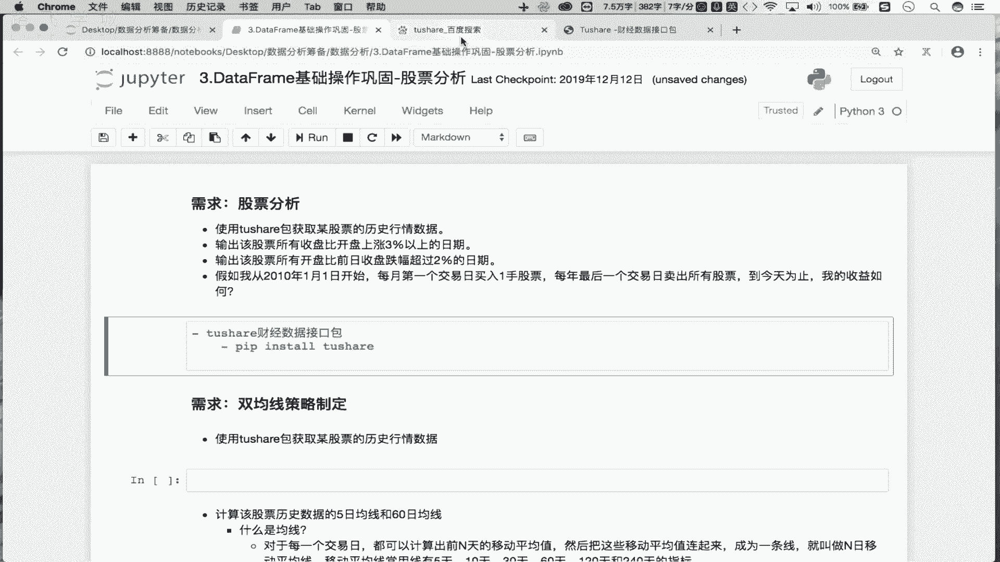

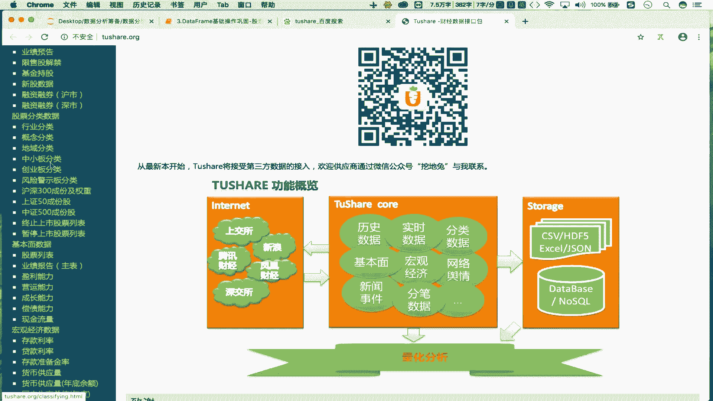

以下是获取数据前的准备工作：

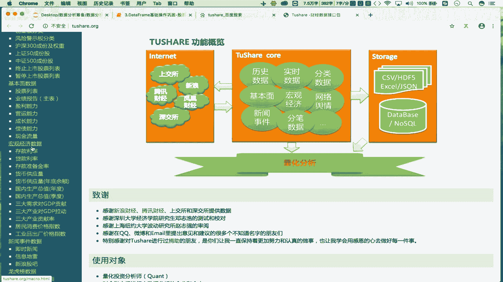

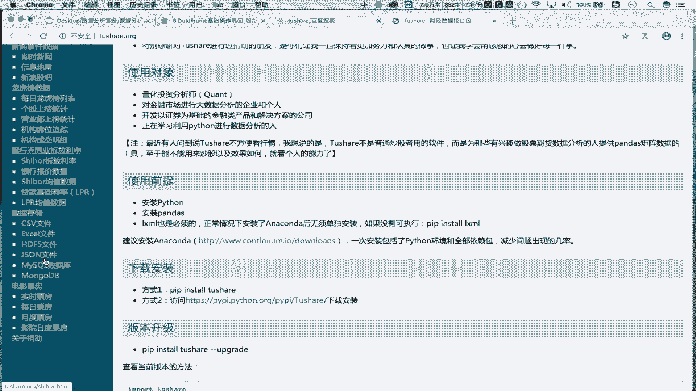

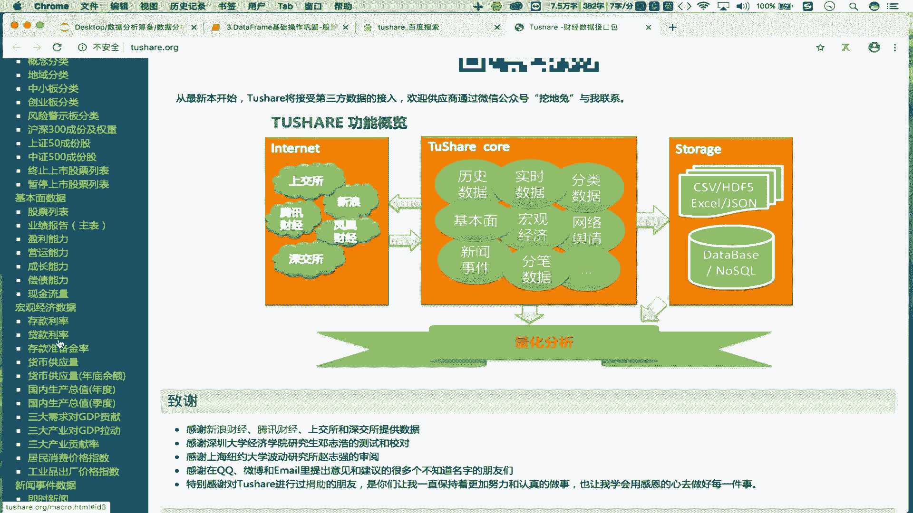

1.  **安装 `tushare` 包**：在命令行中执行 `pip install tushare`。
2.  **导入必要模块**：在 Python 脚本中导入 `tushare` 和 `pandas`。

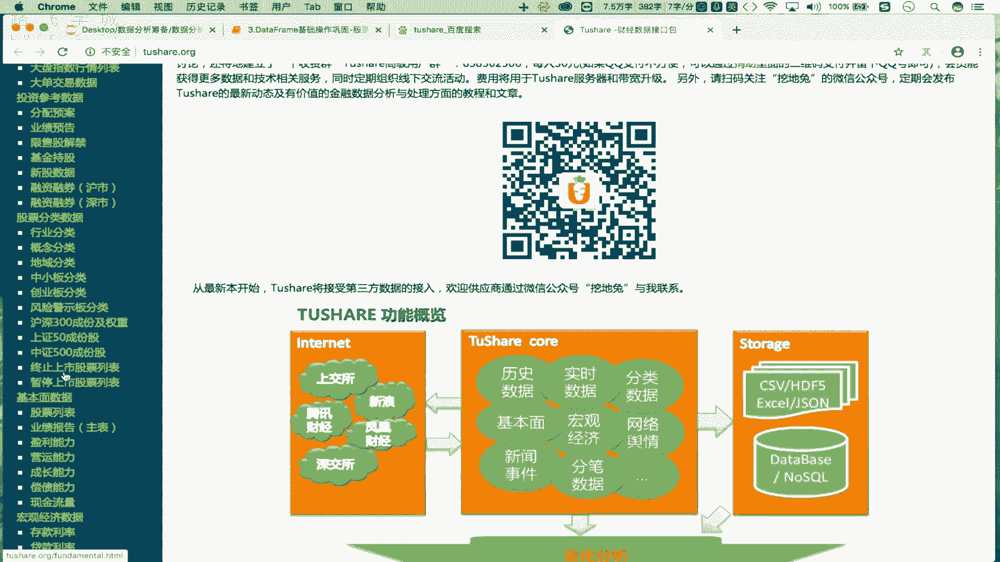

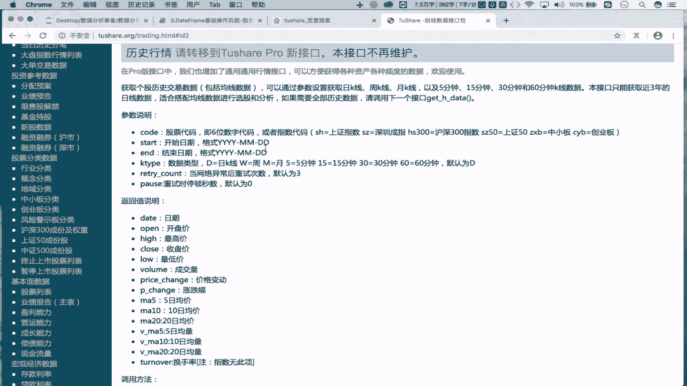

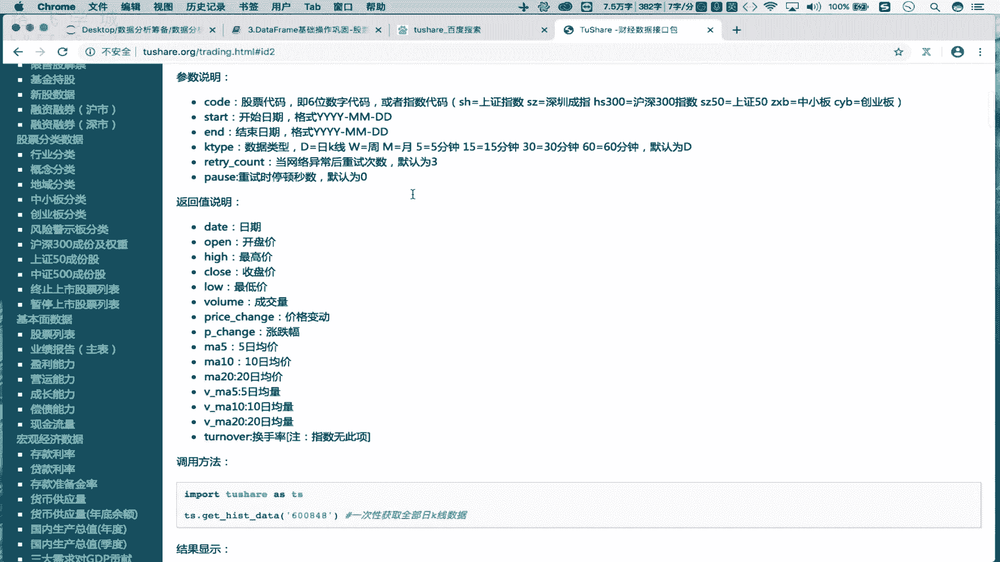

```python
import tushare as ts
import pandas as pd
from pandas import DataFrame, Series
import numpy as np
```

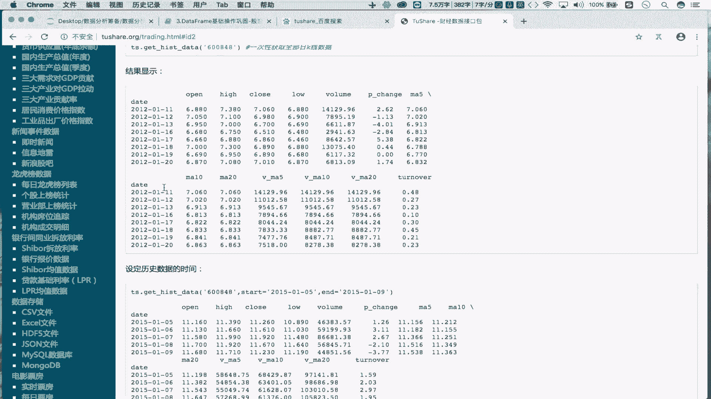

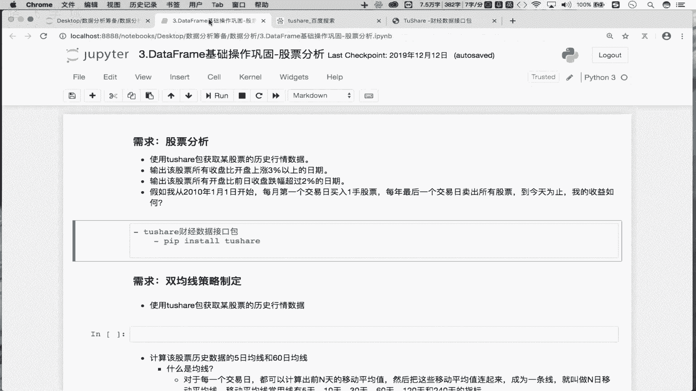

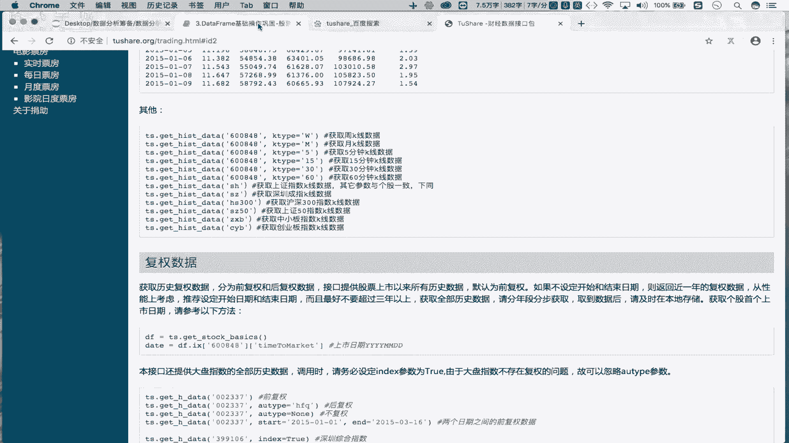

接下来，我们使用 `tushare` 获取股票“贵州茅台”（股票代码：600519）自上市以来到最近一个交易日的历史数据。

```python
# 获取股票历史数据
df = ts.get_k_data(code=‘600519‘, start=‘2000-01-01‘)
print(df)
```

代码说明：
*   `ts.get_k_data()` 是获取股票历史行情数据的方法。
*   `code` 参数传入股票代码。
*   `start` 参数设定开始日期。设置为一个较早的日期（如‘2000-01-01’）可以获取该股票上市以来的所有数据。不设置 `end` 参数则默认获取到最近一个交易日。

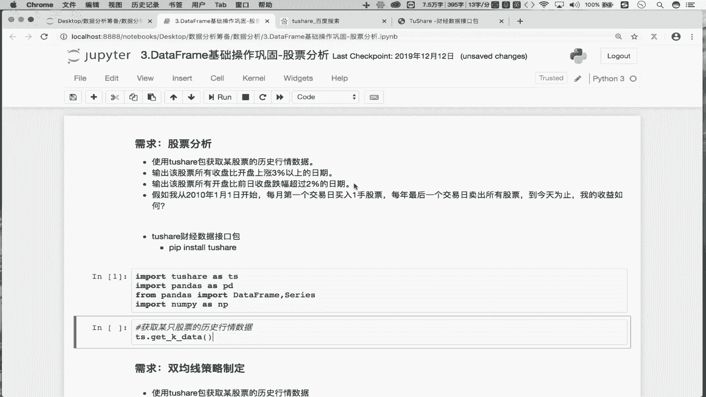

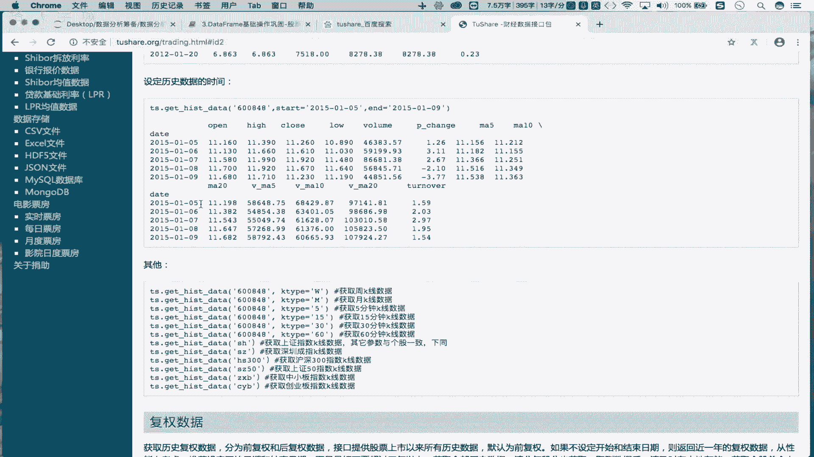

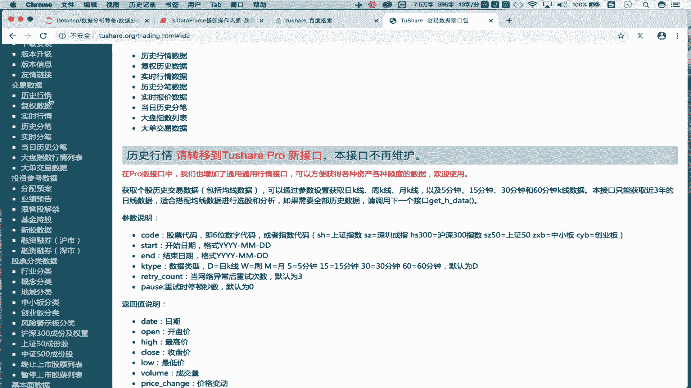

执行后，我们将得到一个 `DataFrame`，包含以下列：`date`（交易日期），`open`（开盘价），`close`（收盘价），`high`（最高价），`low`（最低价），`volume`（成交量），`code`（股票代码）。

## 第二步：数据存储与读取

为了数据的稳定性和避免重复网络请求，我们将数据保存到本地文件，后续直接从文件读取。

以下是相关的操作步骤：

1.  **将数据存储到本地**：使用 `to_csv` 方法将 `DataFrame` 数据保存为 CSV 文件。

```python
# 将数据保存到本地CSV文件
df.to_csv(‘maotai.csv‘)
```

2.  **从本地读取数据**：使用 `pandas` 的 `read_csv` 函数将数据读回 `DataFrame`。

```python
# 从本地CSV文件读取数据
df = pd.read_csv(‘maotai.csv‘)
print(df.head())
```

## 第三步：数据预处理

从文件读取数据后，我们需要进行一系列清洗和转换操作，使其更适合分析。

以下是需要进行的处理步骤：

1.  **删除无用列**：读取的 CSV 文件会自动生成一个无意义的索引列（列名为 ‘Unnamed: 0‘），我们需要将其删除。

```python
# 删除无用的索引列
df.drop(labels=‘Unnamed: 0‘, axis=1, inplace=True)
print(df.head())
```

代码说明：
*   `df.drop()` 用于删除行或列。
*   `labels` 指定要删除的列名。
*   `axis=1` 表示操作对象是列（在 `drop` 方法中，`axis=1` 代表列，`axis=0` 代表行）。
*   `inplace=True` 表示修改直接作用于原 `DataFrame`，而不返回新的副本。

2.  **查看数据类型**：使用 `info()` 方法查看各列的数据类型，有助于我们发现需要转换的数据。

```python
# 查看数据框基本信息及各列数据类型
print(df.info())
```

通过 `info()` 的输出，我们可以发现 `date` 列的数据类型是 `object`（即字符串），而不是时间类型。

3.  **转换日期列数据类型**：将 `date` 列从字符串转换为 `datetime` 类型，便于后续基于时间的分析和操作。

```python
# 将‘date‘列转换为datetime类型
df[‘date‘] = pd.to_datetime(df[‘date‘])
print(df.info())
```

转换后，再次查看 `df.info()`，可以看到 `date` 列的类型已变为 `datetime64[ns]`。

4.  **将日期列设置为行索引**：在时间序列分析中，将日期作为索引非常方便。我们使用 `set_index` 方法实现。

```python
# 将‘date‘列设置为行索引
df.set_index(‘date‘, inplace=True)
print(df.head())
```

设置完成后，`date` 列成为了 `DataFrame` 的行索引，数据看起来更加整洁，并且可以方便地进行基于时间的切片和重采样等操作。

## 总结

本节课中我们一起学习了金融量化分析的第一步——股票数据预处理。我们掌握了如何使用 `tushare` 获取股票历史数据，如何将数据存储到本地及读取，并完成了一系列关键的数据清洗与格式转换操作，包括删除无用列、转换日期数据类型以及设置日期索引。

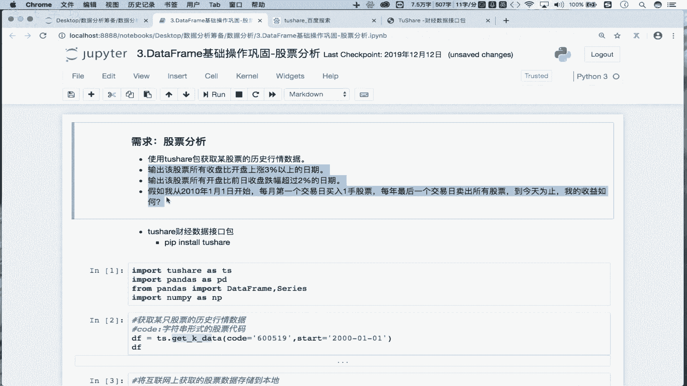

经过这些步骤，我们得到了一份干净、结构化的股票历史数据 `DataFrame`，为下一节实现具体的股票分析策略（如双均线策略）做好了准备。