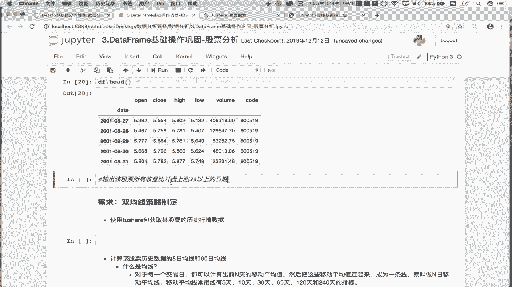
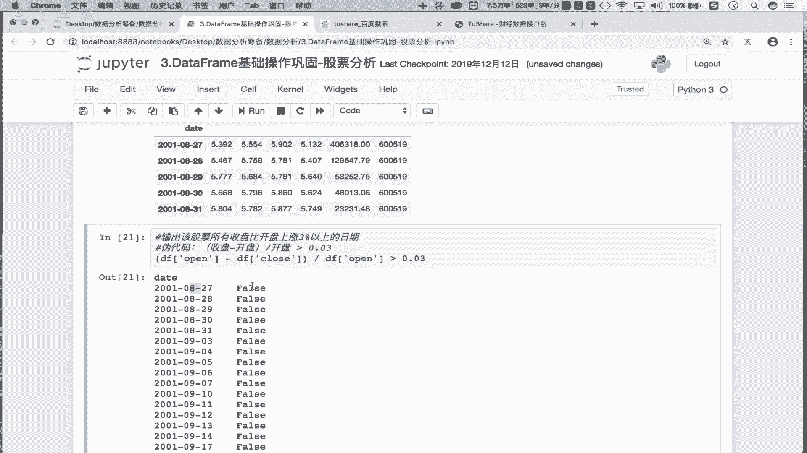
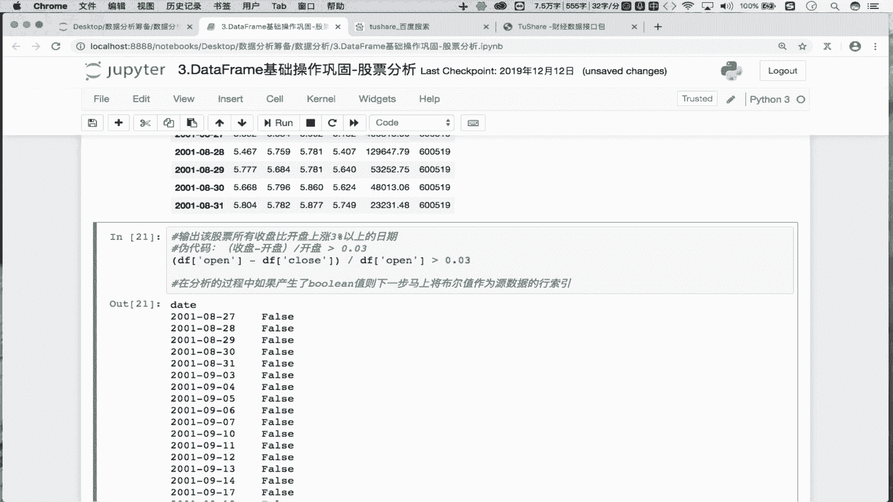
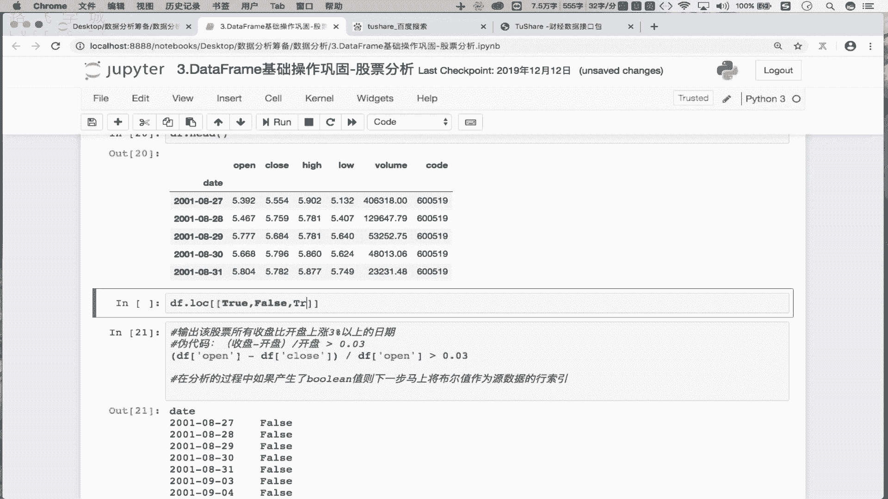
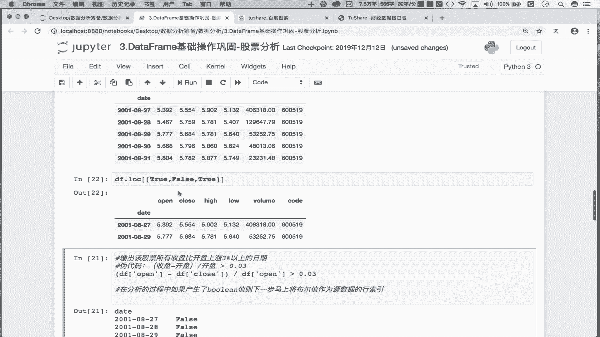
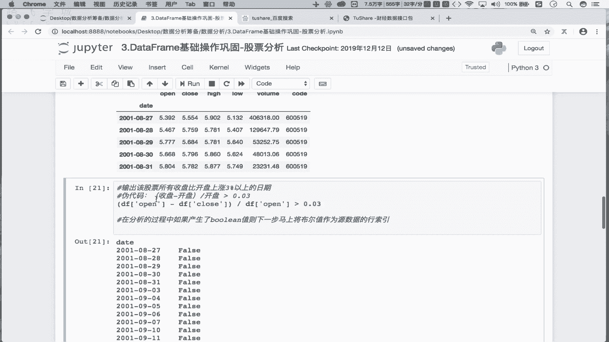
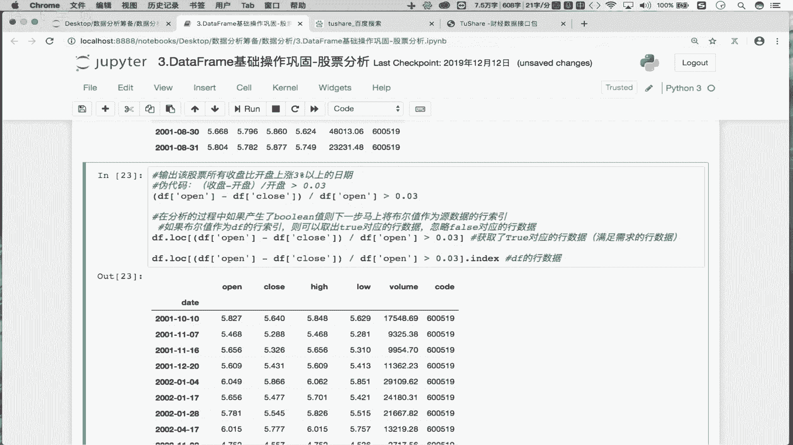
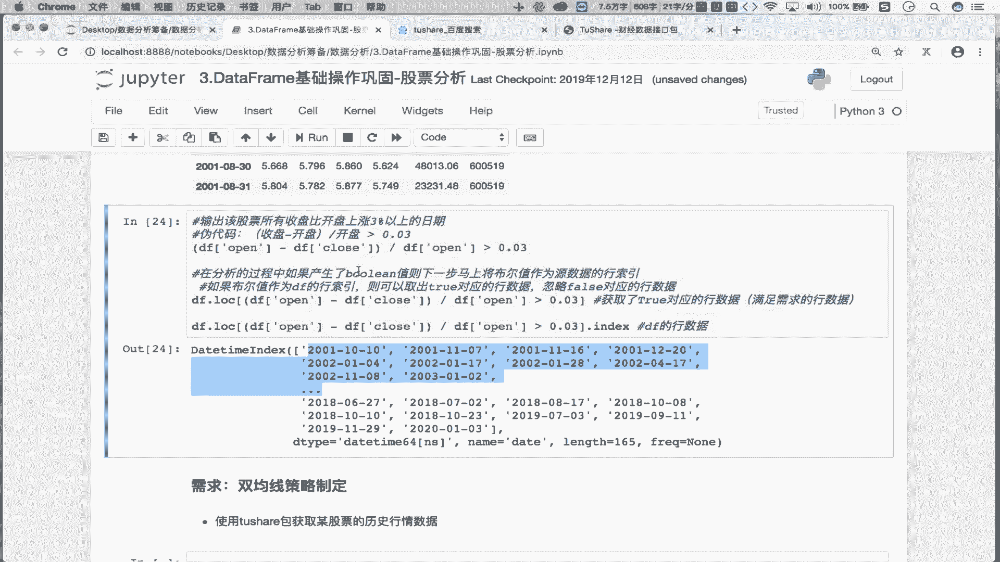

# Python数据分析实战：P12：03 金融量化项目案例_02 捕获股票上涨的日期 📈


## 概述
在本节课中，我们将学习如何利用Pandas处理股票历史交易数据，并实现一个核心分析需求：找出特定股票所有收盘价比开盘价上涨超过3%的日期。我们将重点掌握使用布尔值索引来筛选DataFrame数据的技巧。


---


## 数据预处理回顾
上一节我们介绍了如何对股票历史交易数据进行预处理，包括将日期列转换为时间序列并设置为行索引。


将日期列转换为时间序列并设为索引，是因为后续的分析需求（例如查找特定日期）会频繁用到时间。这样做可以让我们利用Pandas时间序列的特性来高效地完成这些操作。



---

## 核心需求：找出上涨超过3%的日期
本节中，我们来看看如何实现“找出该股票所有收盘价比开盘价上涨3%的日期”这一需求。这个分析的目的是总结股票涨幅的规律，例如发现某些月份上涨概率较高，为未来的投资决策提供参考。


### 需求分析与伪代码
我们的目标是找到满足 `(收盘价 - 开盘价) / 开盘价 > 0.03` 的所有日期。

首先，我们用伪代码描述这个逻辑判断：
```
(收盘价 - 开盘价) / 开盘价 > 0.03
```


在Pandas中，`开盘价`对应DataFrame的`open`列，`收盘价`对应`close`列。这两个列都是Series对象。


因此，实际的代码表达式为：
```python
( df[‘close’] - df[‘open’] ) / df[‘open’] > 0.03
```


这个表达式会对DataFrame中的每一行进行计算和比较，最终返回一个与原始数据行数相同的布尔值Series。其中，`True`表示该行数据满足“上涨超过3%”的条件，`False`则表示不满足。



---

## 关键技巧：使用布尔值进行数据筛选
当我们得到一个布尔值Series后，下一步就是提取所有`True`值对应的原始数据行。



这里分享一个重要的数据处理经验：**如果产生了布尔值，则下一步可以立即将该布尔值序列作为原DataFrame的行索引进行筛选。**


### 原理说明
在Pandas中，使用`.loc[]`索引器时，除了传入具体的行标签，还可以传入一个布尔值列表（或Series）。DataFrame会根据这个布尔值列表来筛选行：只保留布尔值为`True`对应的行，而忽略`False`对应的行。



例如：
```python
# 假设有一个简单的DataFrame
df_demo = pd.DataFrame({‘value’: [10, 20, 30]}, index=[‘A‘, ’B‘, ’C‘])
# 创建一个布尔序列
bool_series = pd.Series([True, False, True])
# 使用布尔序列筛选行
filtered_df = df_demo.loc[bool_series]
```
执行后，`filtered_df`将只包含索引为’A‘和’C‘的行（对应`True`），而索引’B‘的行（对应`False`）被过滤掉了。


### 应用实践
根据这个原理，我们可以将之前得到的布尔值表达式直接放入`.loc[]`中，来获取所有上涨日的完整数据：




```python
# 获取所有满足条件的行数据
up_days_df = df.loc[ ( df[‘close’] - df[‘open’] ) / df[‘open’] > 0.03 ]
```



执行这行代码后，`up_days_df`就是一个新的DataFrame，它只包含原数据中所有收盘价比开盘价上涨超过3%的日期的数据。


---


## 提取目标日期
我们最终需要的是日期，而不是整行数据。由于在预处理时我们已经将日期设置为了行索引（`index`），因此，满足条件的这些行的索引值，就是我们想要的日期列表。


提取索引非常简单：
```python
# 从筛选后的DataFrame中提取行索引，即为目标日期列表
target_dates = up_days_df.index
```
这样，`target_dates`就是一个包含了所有“上涨超过3%”的日期的Index对象。

---



## 总结
本节课我们一起学习了如何实现一个金融数据分析中的常见需求。我们回顾了将日期设为索引的好处，然后通过构建布尔表达式 `(close - open) / open > 0.03` 来识别股票上涨日。



更重要的是，我们掌握了一个高效的数据筛选技巧：**将布尔值序列直接用作`.loc[]`的索引，可以一步到位地筛选出所有符合条件的行数据**。最后，通过提取筛选后数据的行索引，我们轻松得到了目标日期列表。


这个“布尔值索引”的技巧在数据分析中极为常用，希望大家能够通过练习熟练掌握。