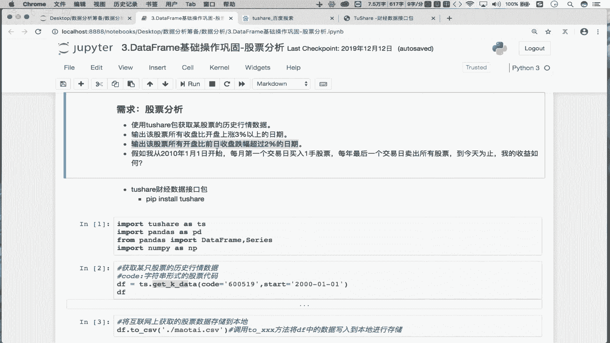
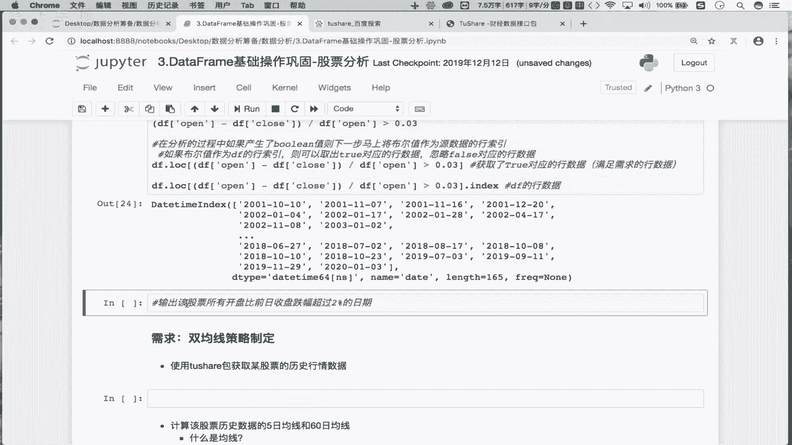
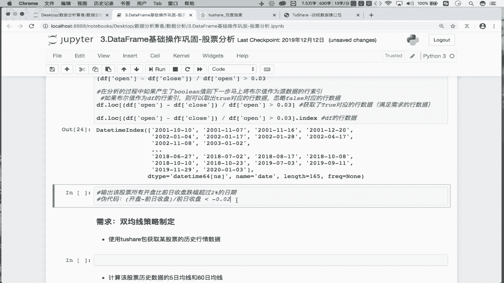
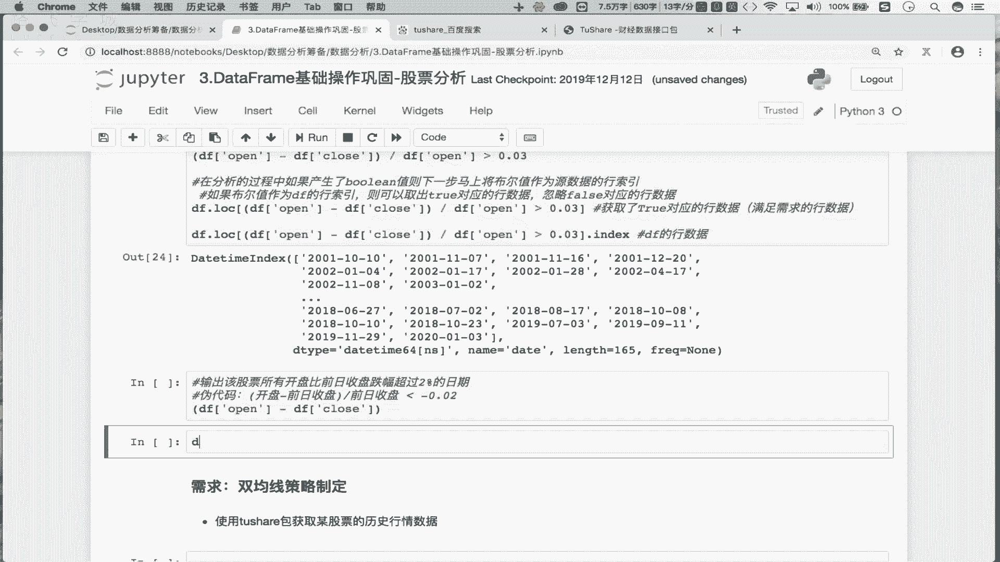
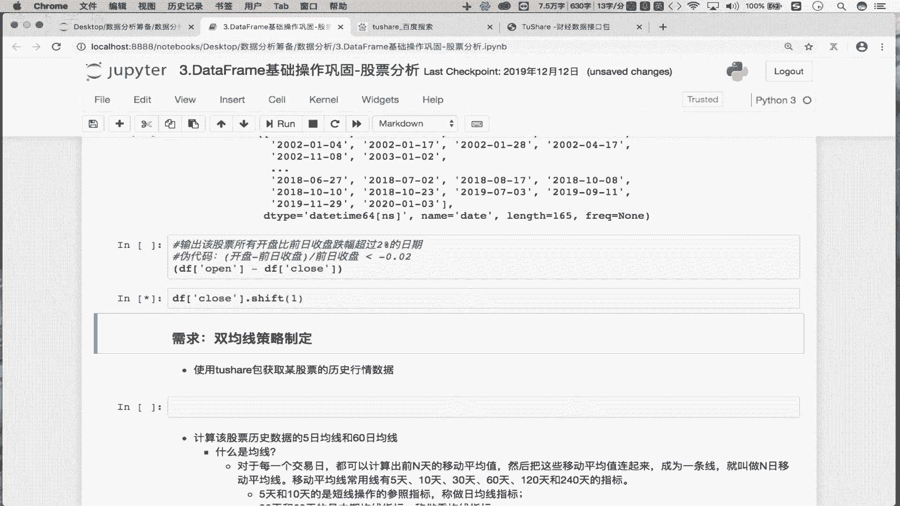
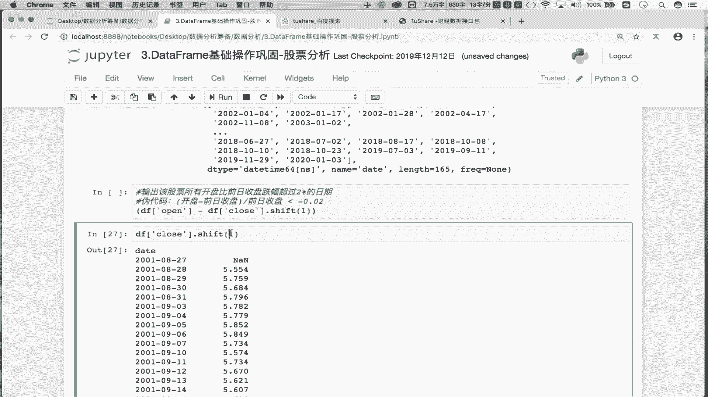
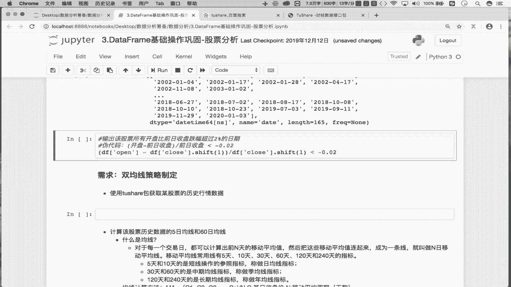
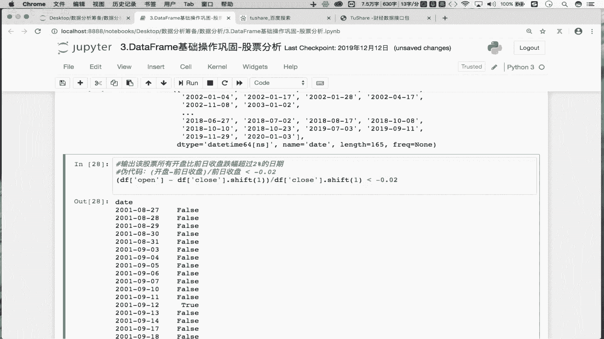
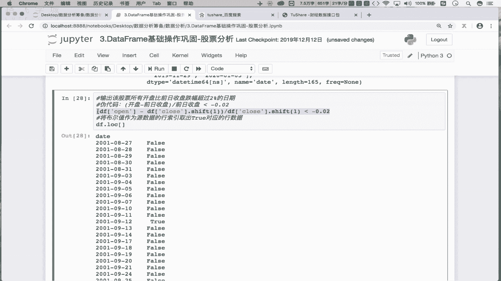
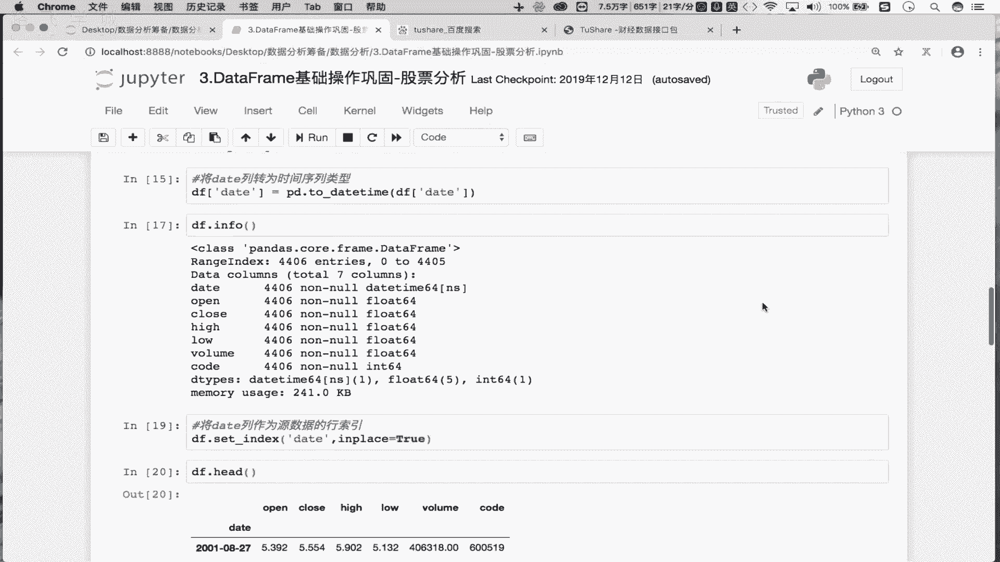

# Python数据分析实战：P13：03 金融量化项目案例_03 捕获股票跌幅的日期 📉




在本节课中，我们将学习如何利用Python的Pandas库，从股票数据中筛选出开盘价较前一日收盘价跌幅超过2%的日期。这是一个典型的金融数据分析需求，我们将通过逻辑推导和代码实现，一步步完成这个任务。



## 需求分析与逻辑推导

上一节我们处理了股票数据的获取与基本查看，本节中我们来看看一个具体的分析需求：找出股票所有开盘价较前一日收盘价跌幅超过2%的日期。

首先，我们需要明确计算逻辑。跌幅的计算公式为：
**跌幅 = (当日开盘价 - 前一日收盘价) / 前一日收盘价**



我们的目标是找出 **跌幅 < -0.02** 的日期。这里使用小于号是因为跌幅是负数，例如-0.03（跌幅3%）小于-0.02（跌幅2%），表示跌幅更大，满足“超过2%”的条件。



## 核心步骤与代码实现

理解了需求逻辑后，接下来我们将其转化为具体的Pandas代码。核心在于如何获取“前一日收盘价”这一列数据。

以下是实现此需求的关键步骤：

1.  **计算前一日收盘价**：使用 `df['close'].shift(1)` 可以将收盘价列整体向下移动一行，这样每一行的数据就变成了前一交易日的收盘价。
2.  **计算跌幅**：根据公式 `(df['open'] - 前一日收盘价) / 前一日收盘价` 进行计算。
3.  **条件筛选**：使用布尔索引筛选出 `跌幅 < -0.02` 的行。
4.  **提取日期**：从筛选出的结果中提取索引（即日期）。


以下是完整的代码实现：




```python
# 假设我们的股票数据存储在 DataFrame `df` 中，包含 'open'（开盘价）和 'close'（收盘价）列
# 计算跌幅超过2%的日期
date_list = df.loc[(df['open'] - df['close'].shift(1)) / df['close'].shift(1) < -0.02].index
```



## 代码分步解析



为了更清晰地理解这行代码，我们将其拆解：



1.  **获取前一日收盘价**：
    ```python
    pre_close = df['close'].shift(1)
    ```
    这行代码创建了一个新的Series，其中每个值都是其对应日期的前一日的收盘价。



2.  **计算涨跌幅**：
    ```python
    change_pct = (df['open'] - pre_close) / pre_close
    ```


3.  **创建布尔条件**：
    ```python
    condition = change_pct < -0.02
    ```
    这会得到一个布尔序列，`True` 表示该日期满足跌幅条件。

4.  **应用布尔索引并提取日期**：
    ```python
    result_df = df.loc[condition]  # 筛选出满足条件的行数据
    date_list = result_df.index    # 从结果中提取日期索引
    ```
    最终，`date_list` 就是我们需要找的所有跌幅超过2%的日期。




## 总结


本节课中我们一起学习了如何通过Pandas进行条件筛选，以解决一个实际的金融数据分析问题。我们掌握了几个关键点：
*   使用 `.shift(1)` 方法获取时间序列的前一期数据。
*   理解如何用公式 **`(当期值 - 前期值) / 前期值`** 计算变化率。
*   熟练运用布尔条件 `(change_pct < -0.02)` 和 `.loc[]` 索引器进行数据筛选。
*   最终通过一行简洁的代码 `df.loc[(df['open'] - df['close'].shift(1)) / df['close'].shift(1) < -0.02].index` 高效地得到了结果。通过分步拆解，初学者也能轻松理解其背后的逻辑。