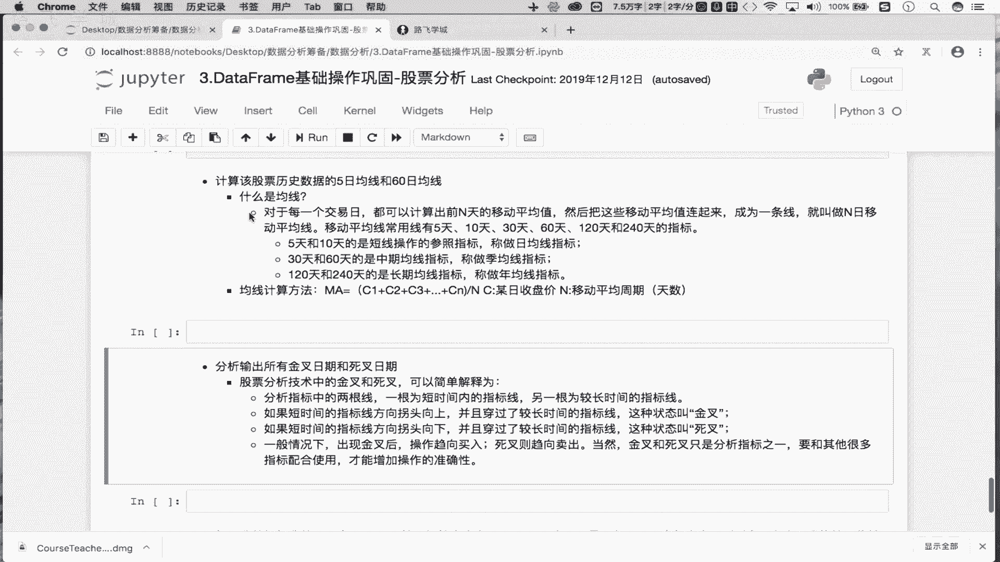
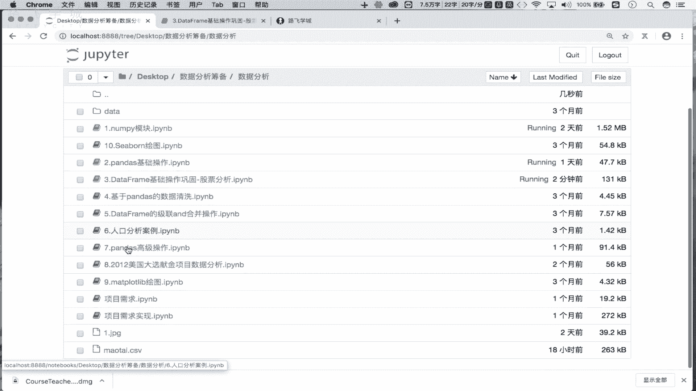
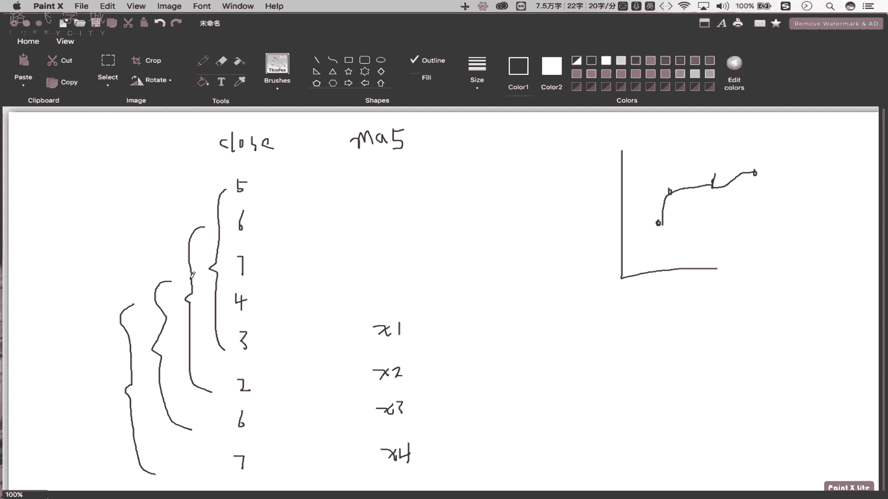

# Python数据分析：P15：04 金融量化之双均线策略_1.双均线策略-均线的计算分析 📈

## 概述
在本节课中，我们将学习金融量化分析中的一个基础策略——双均线策略。我们将从获取股票历史数据开始，逐步学习如何计算关键的5日均线和30日均线，并理解其背后的含义。这是制定交易策略的第一步。



---

## 数据获取与处理

上一节我们介绍了金融量化分析的基本概念，本节中我们来看看如何获取和处理股票数据。

首先，我们需要获取某只股票的历史行情数据。我们将使用`pandas`库来读取之前已经保存到本地的数据文件。

```python
import pandas as pd

# 读取本地保存的股票数据CSV文件
df = pd.read_csv('./茅台.csv')
```

读取出来的数据是一个`DataFrame`。我们需要删除其中无用的索引列。

```python
# 删除名为‘Unnamed: 0’的无用列
df = df.drop(labels='Unnamed: 0', axis=1)
```

接下来，我们需要将`date`列转换为时间序列格式，并将其设置为数据的行索引，以便进行基于时间的分析。

```python
# 将‘date’列转换为时间序列
df['date'] = pd.to_datetime(df['date'])




# 将‘date’列设置为行索引
df.set_index('date', inplace=True)
```

执行完上述步骤后，我们的数据`df`的行索引就变成了时间格式，数据准备就绪。

---

## 均线概念与计算

数据准备完成后，我们进入核心环节：计算均线。首先，我们来理解什么是均线。

### 什么是均线？
对于每一个交易日，都可以计算出前N天的移动平均值。将这些移动平均值连接起来形成的线，就叫做N日移动平均线，简称均线。常用的均线有5日、10日、30日、60日等。其中，5日和10日均线被视为短期均线。

均线基于股票的收盘价进行计算。其计算公式如下：


**MA = (C1 + C2 + C3 + ... + CN) / N**

其中：
- **MA** 代表移动平均值。
- **C1, C2, ..., CN** 代表连续N个交易日的收盘价。
- **N** 代表计算均线的周期（例如5或30）。

多个这样的移动平均值（点）在图表上连接起来，就形成了我们看到的均线。

### 计算5日与30日均线
理解了概念后，我们开始计算。我们将针对`DataFrame`中的`close`（收盘价）列进行计算。

以下是计算5日均值和30日均值的步骤：

```python
# 计算5日均值（MA5）
ma5 = df['close'].rolling(5).mean()

# 计算30日均值（MA30）
ma30 = df['close'].rolling(30).mean()
```



代码解释：
- `df[‘close’]` 选取了收盘价数据列。
- `.rolling(N)` 方法会创建一个滑动窗口对象，依次取出连续的N个数据（例如前5天）。
- `.mean()` 方法则对这个窗口内的N个数据计算平均值。

**注意**：对于5日均线，前4天的值会是`NaN`（非数字），因为直到第5天才有足够的数据计算第一个5日平均值。30日均线同理，前29个值为`NaN`。

`ma5`和`ma30`这两个`Series`中存储的就是一系列连续的移动平均值，它们就是构成均线的“点”。

---

## 可视化均线

虽然本节课的重点是计算，但我们可以简单地将计算出的均线可视化，以直观地观察其形态和交叉情况。

我们使用`matplotlib`库进行绘图：

```python
import matplotlib.pyplot as plt
# 确保图表能内嵌显示在Notebook中
%matplotlib inline

# 绘制5日均线
plt.plot(ma5[50:80], label='MA5')
# 绘制30日均线
plt.plot(ma30[50:80], label='MA30')

plt.legend() # 显示图例
plt.show()
```

通过图表，我们可以清晰地看到两条均线（这里为了展示交叉，只截取了部分数据）。短期均线（MA5）波动更剧烈，长期均线（MA30）则相对平滑。它们的交叉点（金叉或死叉）是后续制定交易信号的关键。

---

## 总结

本节课中我们一起学习了双均线策略的基础部分——均线的计算与分析。我们首先获取并处理了股票历史数据，然后深入理解了均线的定义与计算公式，最后使用`pandas`的`rolling`方法成功计算出了5日和30日的移动平均线，并进行了初步的可视化。

核心要点回顾：
1.  **数据准备**：使用`pandas`读取和处理数据，将日期列设置为索引。
2.  **均线概念**：均线是连续N日收盘价平均值的连线。
3.  **均线计算**：使用 **`df[‘close’].rolling(N).mean()`** 公式可以方便地计算出N日均值。
4.  **初步可视化**：通过绘图可以直观观察均线形态。


在下一节中，我们将基于计算出的两条均线，学习如何生成具体的交易信号，从而完成双均线策略的制定。