# Python三剑客：P16：04 金融量化之双均线策略_2.双均线策略-金叉&死叉 📈

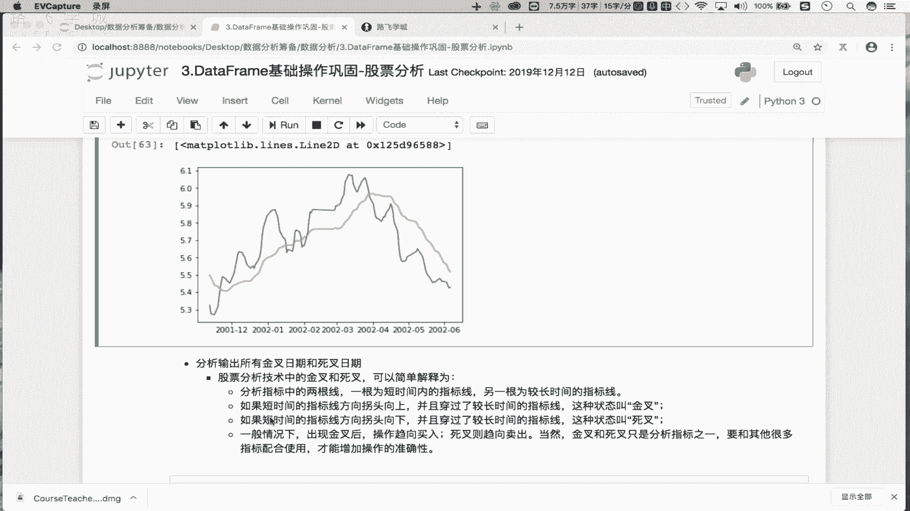

在本节课中，我们将要学习双均线策略中的核心概念：金叉与死叉。我们将理解它们的定义，并掌握如何通过编程方法，从股票数据中自动找出所有金叉和死叉出现的日期。

## 概述

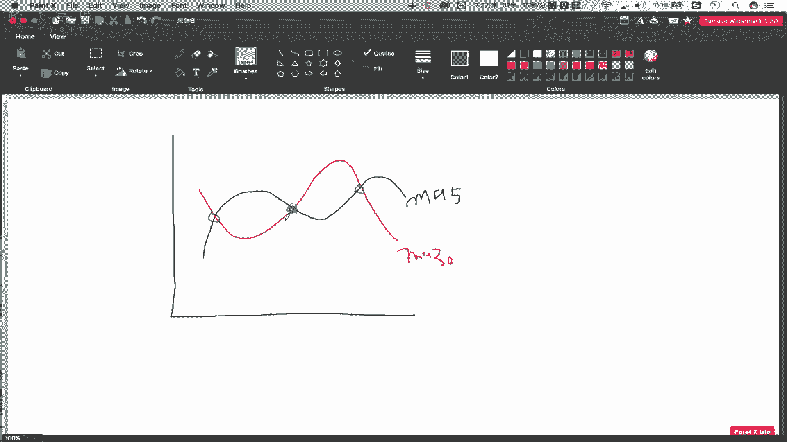

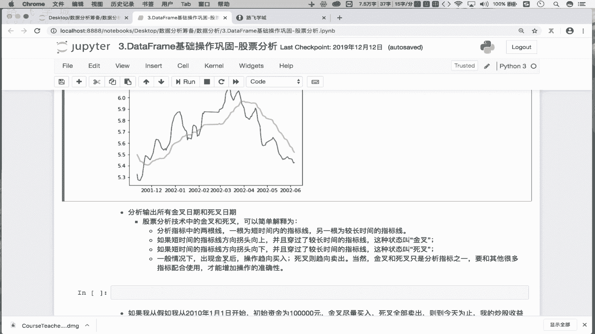

上一节我们介绍了如何计算并绘制股票的5日均线（MA5）和30日均线（MA30）。本节中，我们将基于这两条均线，深入探讨“金叉”和“死叉”这两个关键技术指标。它们是双均线交易策略中决定买入和卖出时机的关键信号。

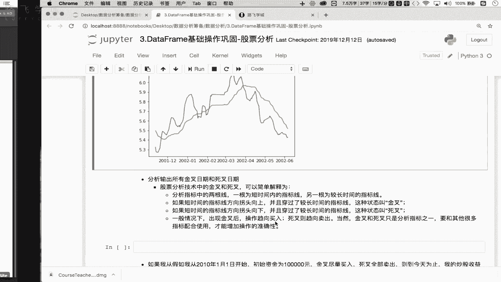


## 什么是金叉与死叉？🤔


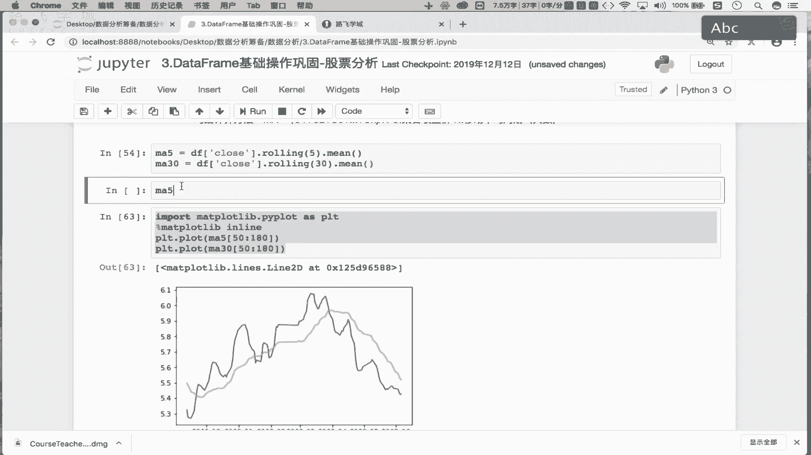

在股票技术分析中，金叉和死叉是分析指标中两根线交叉时产生的信号。在我们的双均线策略里，这两根线分别是短期均线（MA5）和长期均线（MA30）。


*   **金叉**：当短期均线（MA5）从下方**上穿**长期均线（MA30）时，其交叉点（或附近）被称为“金叉”。
*   **死叉**：当短期均线（MA5）从上方**下穿**长期均线（MA30）时，其交叉点（或附近）被称为“死叉”。

为了更直观地理解，我们可以参考下图。图中黑色线代表MA5（短期均线），红色线代表MA30（长期均线）。X轴代表时间，Y轴代表计算出的移动平均值。


在上图中，我们可以观察到三个交叉点：
*   第一个交叉点：黑线（MA5）上穿红线（MA30） -> **金叉**
*   第二个交叉点：黑线（MA5）下穿红线（MA30） -> **死叉**
*   第三个交叉点：黑线（MA5）再次上穿红线（MA30） -> **金叉**


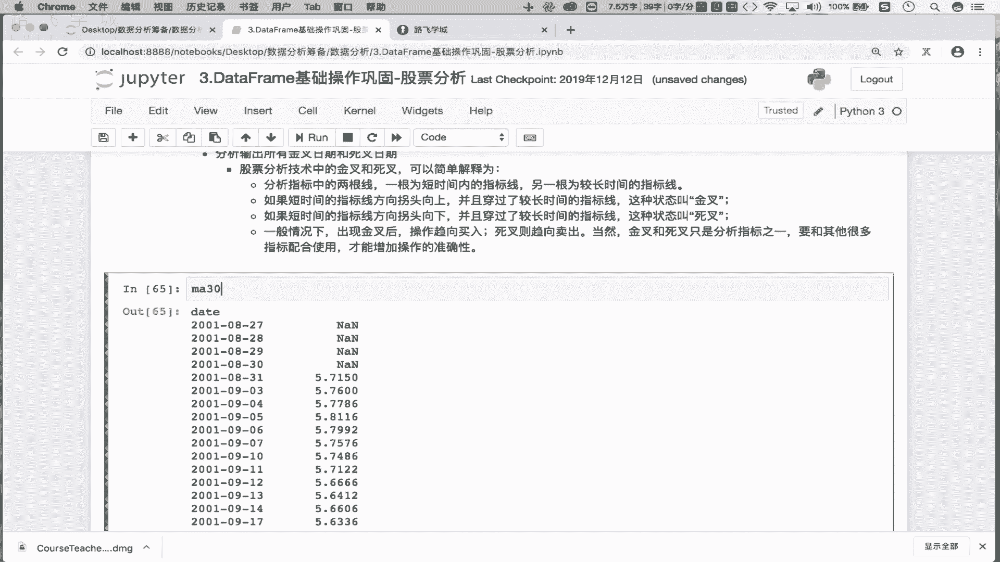

## 金叉与死叉的交易意义 💰

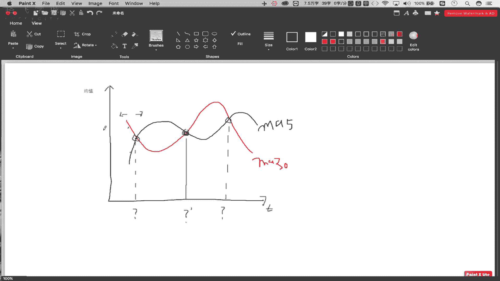

理解了金叉和死叉的形态后，我们来看看它们的交易指导意义。

*   **金叉**通常被视为**买入信号**。它表明短期趋势开始走强，并可能带动股价上涨。
*   **死叉**通常被视为**卖出信号**。它表明短期趋势开始走弱，股价可能下跌。

因此，在双均线策略中，一个基本的操作逻辑是：**在金叉出现时买入股票，在死叉出现时卖出股票**。

## 如何通过代码找出金叉与死叉日期？🔍


我们的目标是找出所有金叉和死叉发生的具体日期。关键在于识别MA5和MA30两条线交叉的时刻。

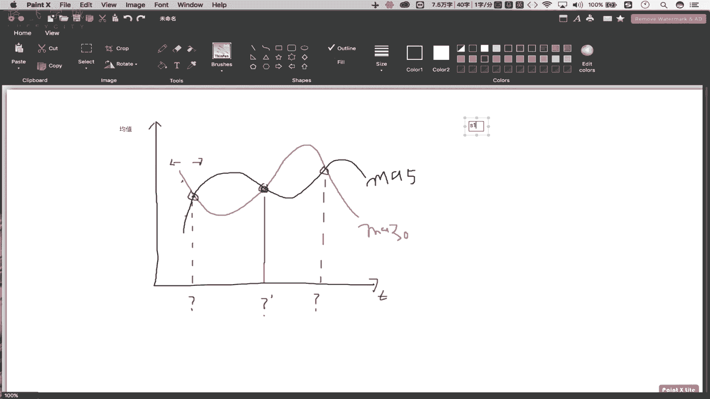

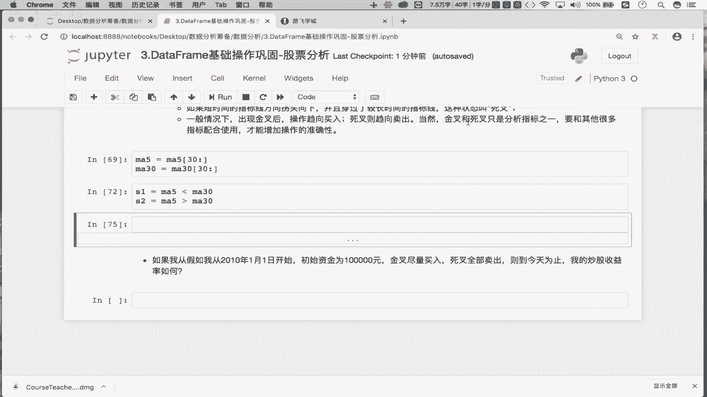

通过观察交叉点附近的特征，我们可以发现一个规律：
*   在金叉点**左侧**，MA5 < MA30。
*   在金叉点**右侧**，MA5 > MA30。
*   在死叉点**左侧**，MA5 > MA30。
*   在死叉点**右侧**，MA5 < MA30。

因此，交叉点本质上是MA5和MA30大小关系发生**切换**的位置。我们可以通过比较MA5和MA30序列，并寻找这种“切换”来定位交叉点。

以下是实现这一目标的具体步骤和代码：

首先，我们需要确保MA5和MA30序列具有相同的索引（日期），并过滤掉计算移动平均时产生的空值（NaN）。

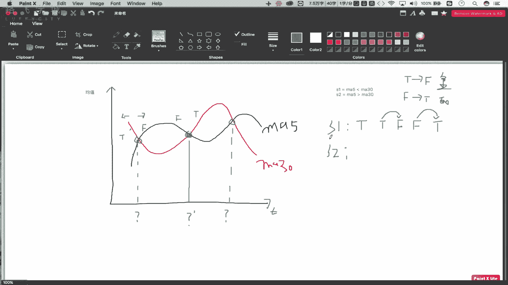

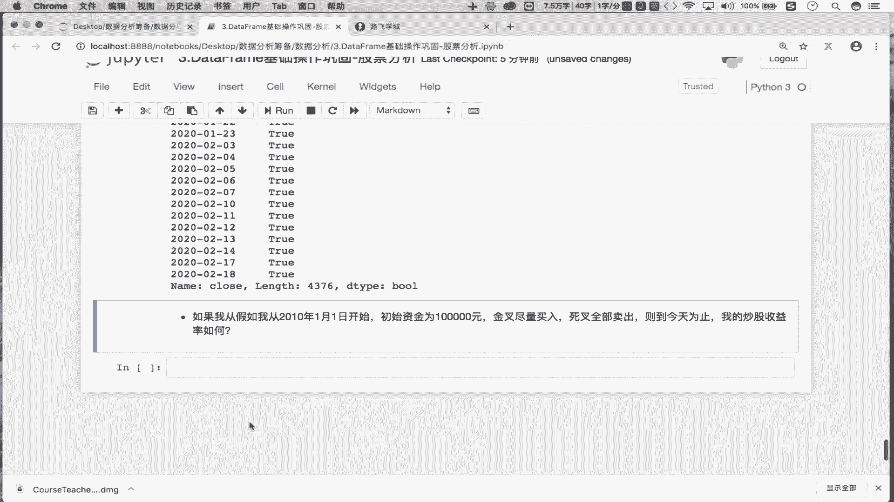

```python
# 假设 df 是包含股票数据的DataFrame，且已计算好‘ma5’和‘ma30’列
# 统一从第30个数据开始切片，以确保ma5和ma30都没有空值且索引对齐
ma5 = df[‘ma5‘][30:]
ma30 = df[‘ma30‘][30:]
df = df[30:] # 原数据也做相应切片
```

接着，我们创建两个布尔序列，分别代表“MA5小于MA30”和“MA5大于MA30”的条件。

```python
s1 = ma5 < ma30   # 序列，True表示 MA5 < MA30
s2 = ma5 > ma30   # 序列，True表示 MA5 > MA30
```

现在，核心技巧是利用序列的移位（`shift`）和逻辑运算来捕捉大小关系的切换点。

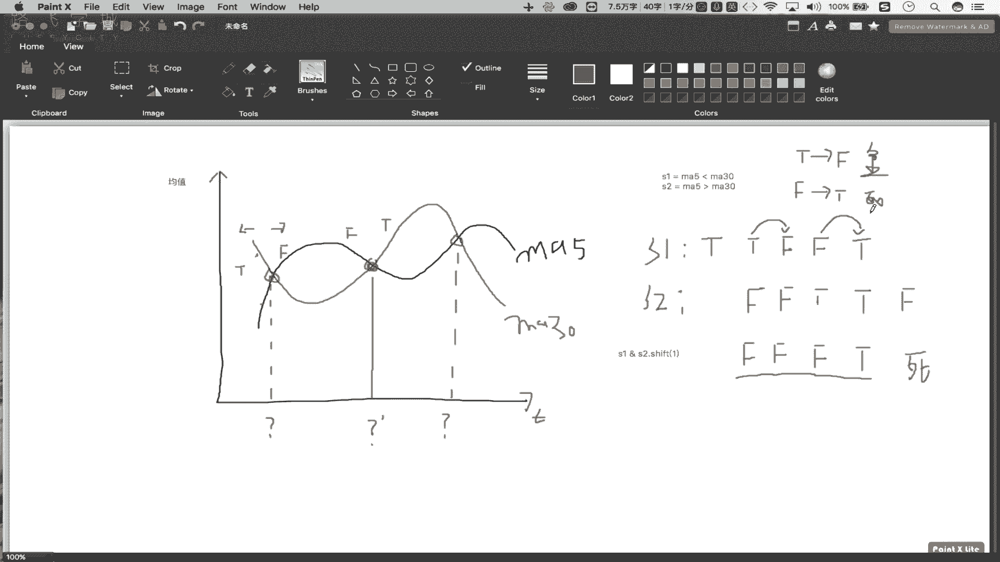

**找出死叉日期：**
死叉的特征是：前一日 MA5 > MA30 (即`s2`为True)，当日 MA5 < MA30 (即`s1`为True)。这对应着`s2`序列中`True`切换到`s1`序列中`True`。我们可以用`s1 & s2.shift(1)`来捕捉这个模式。

```python
# 判定死叉的条件：当日s1为True，且前一日s2为True
death_cross_condition = s1 & s2.shift(1)
# 获取死叉对应的行数据，其索引即为死叉日期
death_cross_dates = df.loc[death_cross_condition].index
```

**找出金叉日期：**
金叉的特征是：前一日 MA5 < MA30 (即`s1`为True)，当日 MA5 > MA30 (即`s2`为True)。这对应着`s1`序列中`True`切换到`s2`序列中`True`。我们可以用`~(s1 | s2.shift(1))`来捕捉这个模式（即“非(前一日s1为True或当日s2为True)”等价于“前一日s1为True且当日s2为True”）。

```python
# 判定金叉的条件：当日s2为True，且前一日s1为True
golden_cross_condition = ~(s1 | s2.shift(1)) # 对 (s1 | s2.shift(1)) 取反
# 获取金叉对应的行数据，其索引即为金叉日期
golden_cross_dates = df.loc[golden_cross_condition].index
```

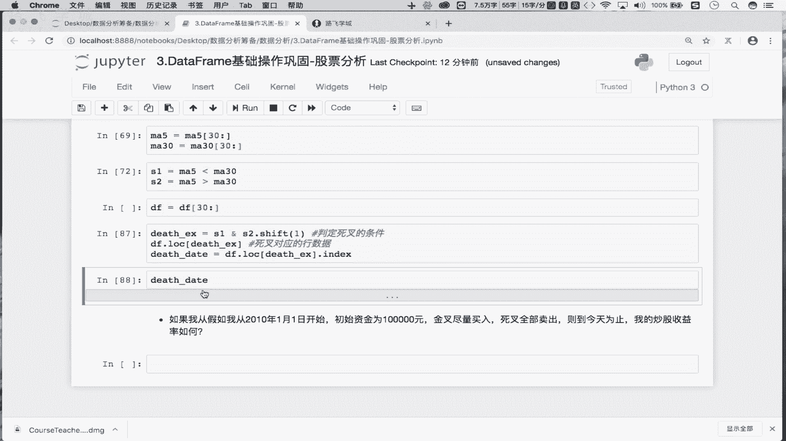

## 总结

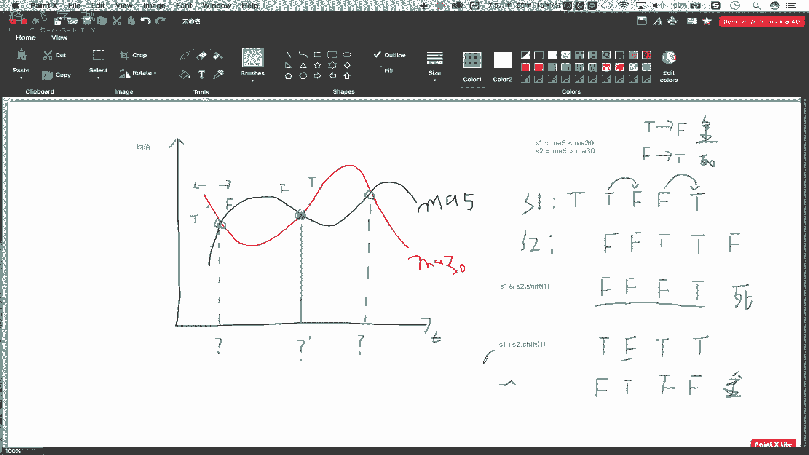

本节课中，我们一起学习了双均线策略的核心——金叉与死叉。

1.  **概念理解**：我们明确了金叉（短期均线上穿长期均线，买入信号）和死叉（短期均线下穿长期均线，卖出信号）的定义及其市场意义。
2.  **规律总结**：我们分析了交叉点前后MA5和MA30的大小关系变化规律，这是用代码识别交叉点的理论基础。
3.  **代码实现**：我们掌握了通过创建布尔序列、使用`shift()`方法进行移位，并结合逻辑运算（`&`， `|`， `~`），来精准定位金叉和死叉日期的编程方法。

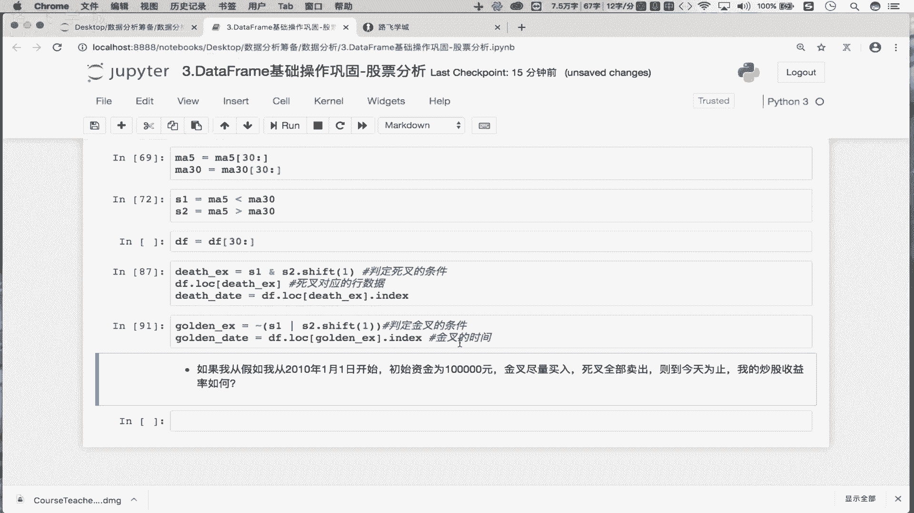

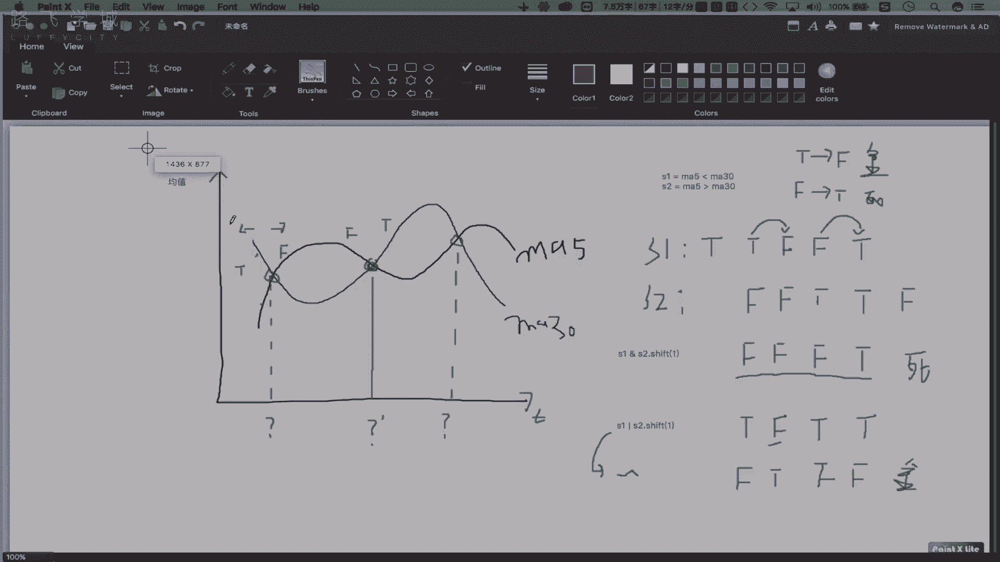

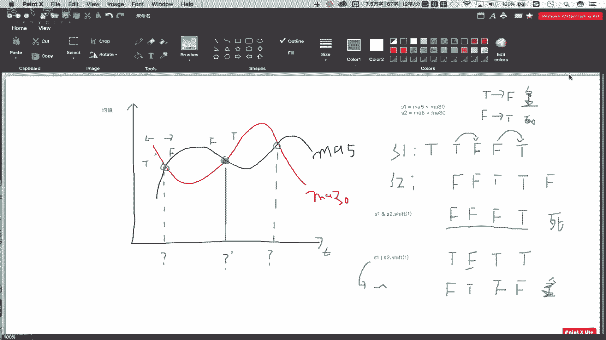

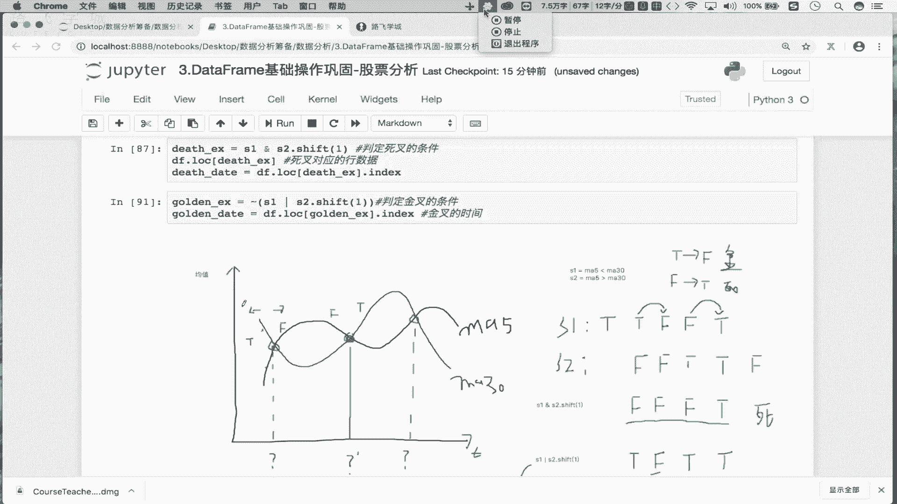

至此，我们已经能够从历史数据中提取出关键的交易信号点。在接下来的课程中，我们将利用这些信号点，来模拟和评估双均线策略的实际收益情况。