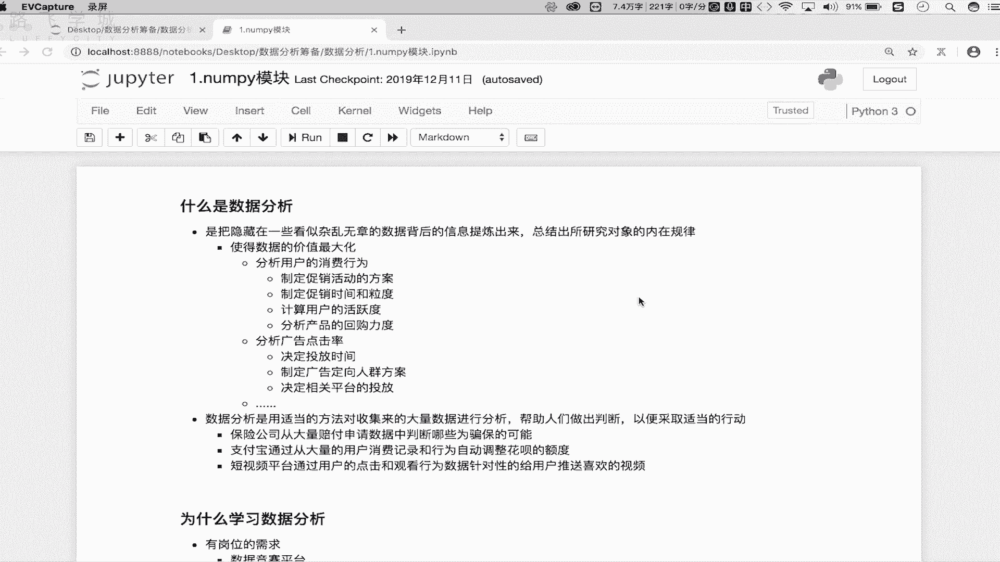
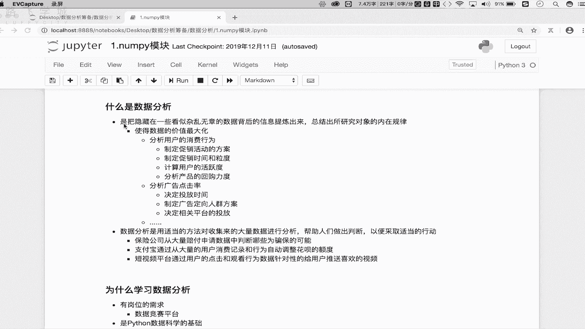
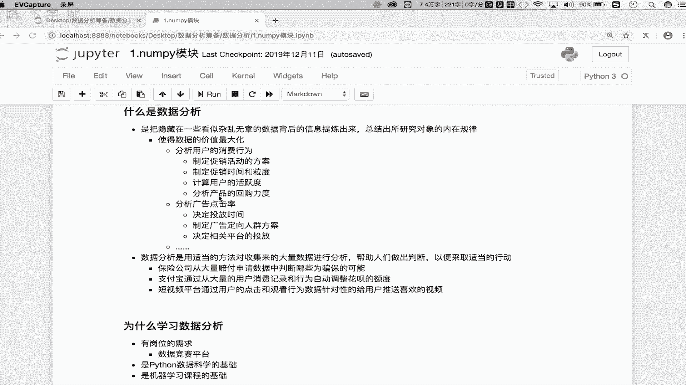
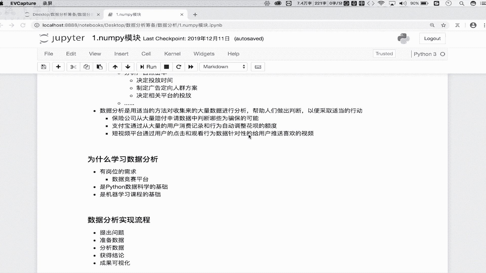
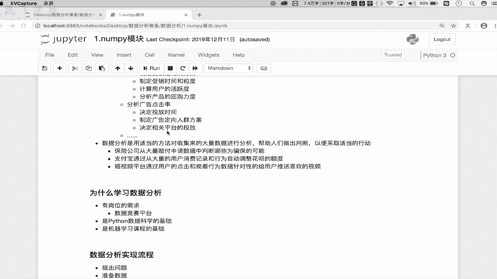
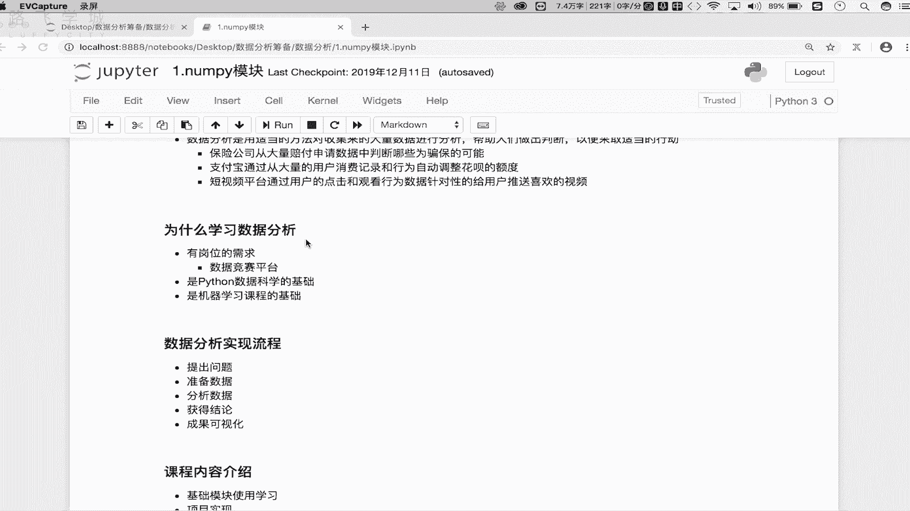
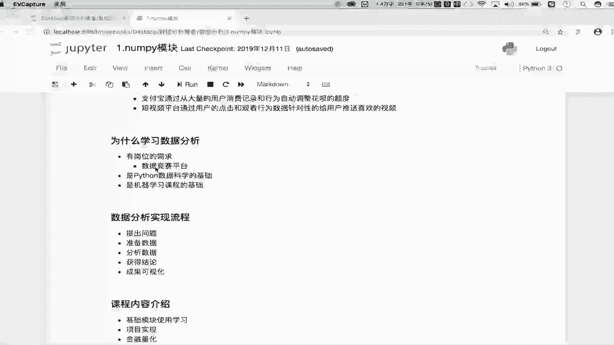
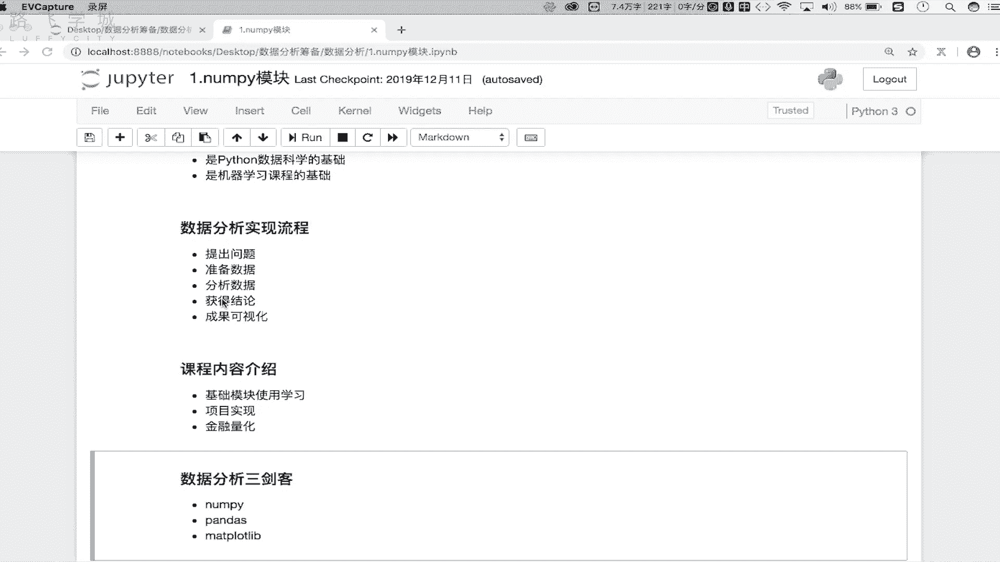
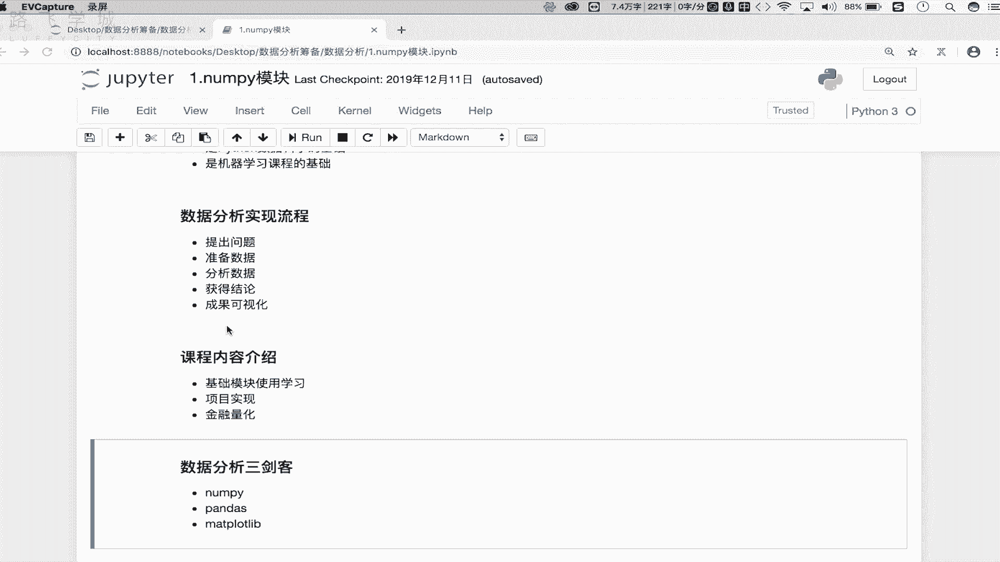
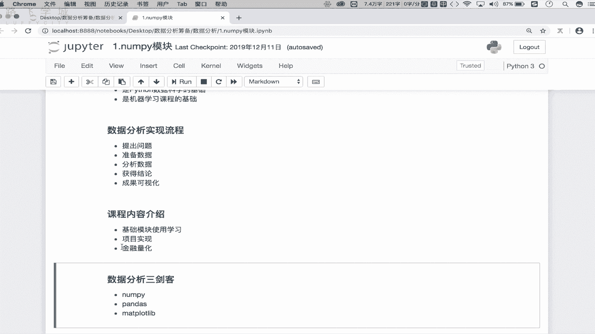

# Python数据分析入门：P2：01：数据分析秘笈介绍 📊

在本节课中，我们将要学习数据分析的基本概念、其重要性以及整个课程的学习路径。我们将从理解什么是数据分析开始，探讨它为何重要，并了解如何通过Python来实现数据分析。

---

## 什么是数据分析？

数据分析是指从看似杂乱无章且量级庞大的数据中，提炼出有价值的信息，并总结出这些数据背后存在的内部规律。

简单来说，数据分析的核心是**从数据中提炼价值**。

---

## 数据分析的作用与价值

上一节我们介绍了数据分析的基本概念，本节中我们来看看数据分析的核心作用。

数据分析最主要的作用是**将数据的价值最大化**，这通常体现在提升综合收入或利润上。各行各业都需要有价值的产出，数据分析技能可以帮助我们基于原始数据，制定策略以实现利润最大化。

以下是数据分析价值最大化的几个具体例子：

*   **分析用户消费行为**：商家可以基于历史消费记录，分析用户偏好、回购能力等，从而制定更有效的促销活动方案、确定促销时间和力度。
*   **优化广告投放**：广告商可以分析用户观看、点击广告的历史行为数据，从而决定广告内容、投放平台（如爱奇艺、腾讯）、投放时长，以更精准地触达目标人群，提升广告效果。

除了创造价值，数据分析还能帮助我们做出精准判断。它通过适当的方法分析大量数据，得出的结论可以帮助人们采取合适的行动。

以下是数据分析辅助决策的几个案例：

*   **保险反欺诈**：保险公司通过分析大量历史赔付申请数据，可以建立模型来精准识别潜在的骗保行为。
*   **信用额度评估**：支付宝等平台通过分析用户的消费记录和行为数据，来评估信用风险，从而为不同用户设定差异化的花呗额度。
*   **内容精准推送**：短视频平台通过分析用户长期的观看行为数据，为用户建立精准画像，从而实现视频和广告的个性化推荐。

从以上例子可以看出，数据分析已深入我们生活的方方面面。

---

## 为何要学习数据分析？

了解了数据分析的作用后，我们来看看学习它的必要性。主要有以下三点原因：

1.  **岗位需求广泛**：数据分析岗位在招聘平台（如Boss直聘）上需求量很大。与某些开发岗位主要集中于互联网行业不同，数据分析适用于所有产生数据的行业，包括传统制造业和新兴互联网行业，帮助企业利用数据做出正确决策、提升价值。
2.  **数据科学的基础**：Python在数据分析和机器学习领域优势显著。数据分析是Python数据科学的基础，它依赖于Python中封装好的大量数学和科学运算模块（如NumPy, Pandas）。掌握这些是进行高效数据分析的前提。
3.  **机器学习的前置技能**：对于日后想转向机器学习领域的同学来说，扎实的数据分析能力是必不可少的基础。打好数据分析的基础，能为学习更复杂的机器学习算法做好充分准备。

---

## 数据分析的基本流程

明确了学习动机，接下来我们了解数据分析是如何一步步实现的。一个典型的数据分析流程包含以下五个步骤：

1.  **提出问题**：明确需要解决或探索的业务问题。
2.  **准备数据**：收集与问题相关的数据。数据来源可以是公司内部提供、外部购买或通过网络爬虫获取。
3.  **分析数据**：使用数据分析工具（如Python的相关库）对数据进行处理、探索和建模分析。
4.  **获得结论**：从分析结果中提炼出有价值的洞察和结论。
5.  **结果可视化**：使用图表（如散点图、直方图、折线图）将分析结论直观地展示出来，便于理解和汇报。

---

## 本课程内容介绍

最后，我们来预览一下整个课程的学习路径。课程主要分为三大部分：

1.  **基础模块学习**：首先，我们将系统学习Python数据分析的核心模块（如NumPy, Pandas, Matplotlib）。这部分会详细讲解模块的导入、核心类、方法及属性的使用，是后续所有应用的基石。
2.  **企业实战项目**：在掌握基础工具后，我们将进入实战环节。课程会引入多个源自企业真实需求的项目。我们将从制定分析需求开始，运用所学技能对数据进行深入分析，并将结论通过可视化方式进行展示，让大家亲身体验企业级数据分析的全流程。
3.  **金融量化入门**：数据分析的一个重要落地方向是金融量化。本课程也会涉及这方面的知识，例如如何利用数据分析制定股票交易策略（如“双均线策略”、“小市值策略”），帮助大家了解如何将数据分析技能应用于金融领域。

---

本节课中我们一起学习了数据分析的定义、核心价值、学习必要性、基本流程以及本课程的整体架构。从下一节课开始，我们将正式踏上Python数据分析的学习之旅。