# Python数据分析：P20：05 数据清洗的骚操作_3.重复值和异常值的清洗 🧹


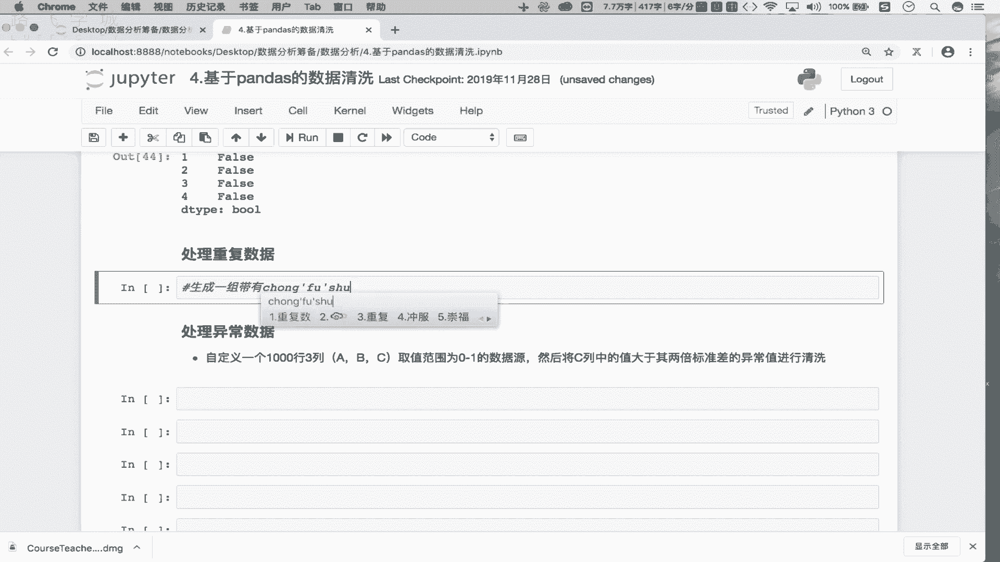


在本节课中，我们将要学习数据清洗的最后两个重要部分：重复值和异常值的处理。上一节我们介绍了缺失值的清洗方法，本节中我们来看看如何识别并处理数据中的重复行和不符合常规的异常值。

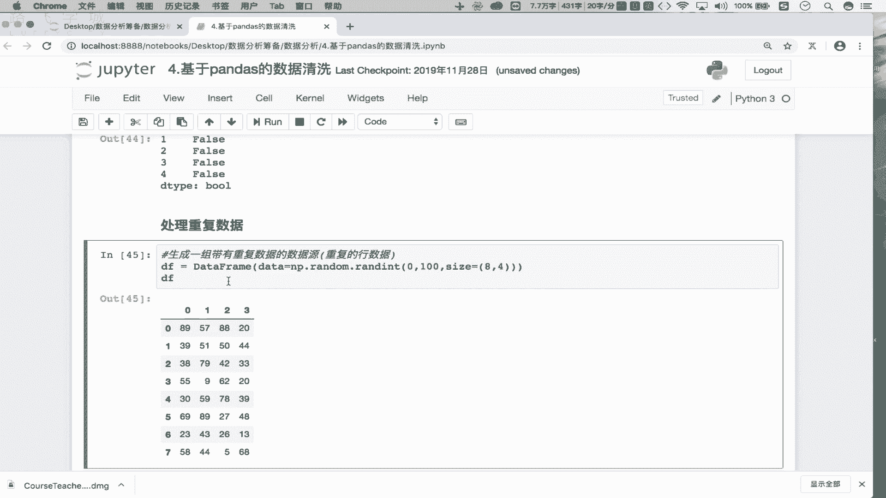


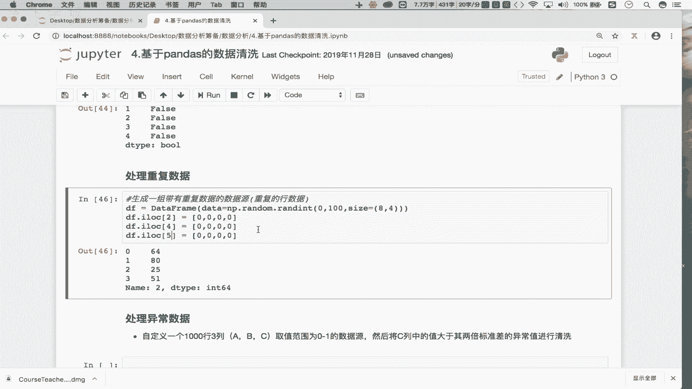

## 重复值的清洗 🔄

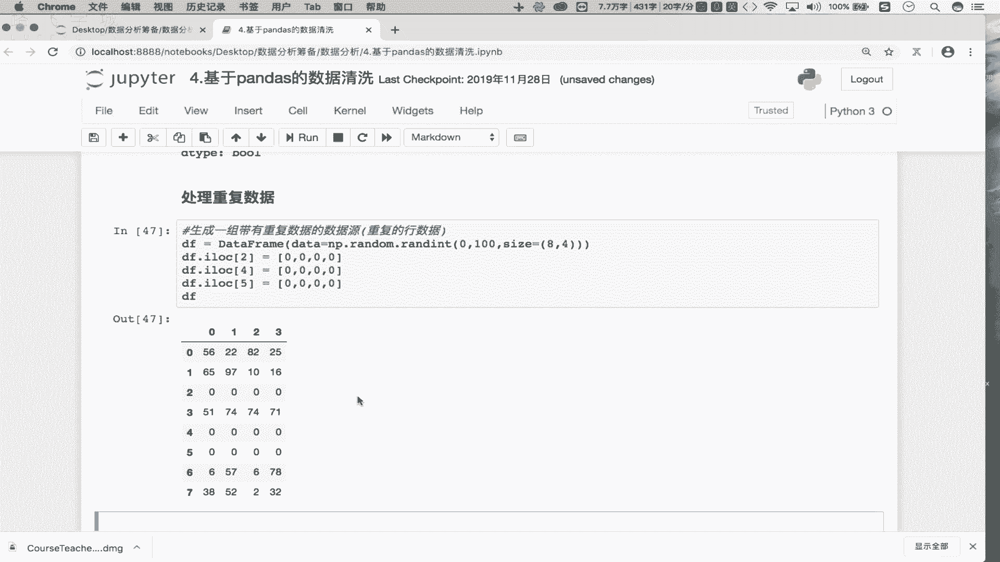

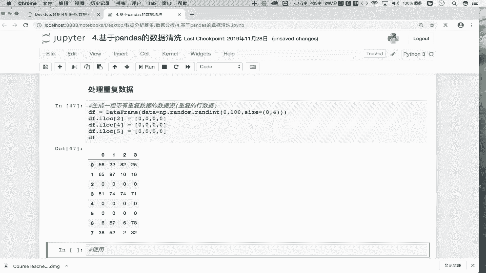

重复值指的是数据集中完全相同的行数据。处理重复值是数据清洗的常见步骤。

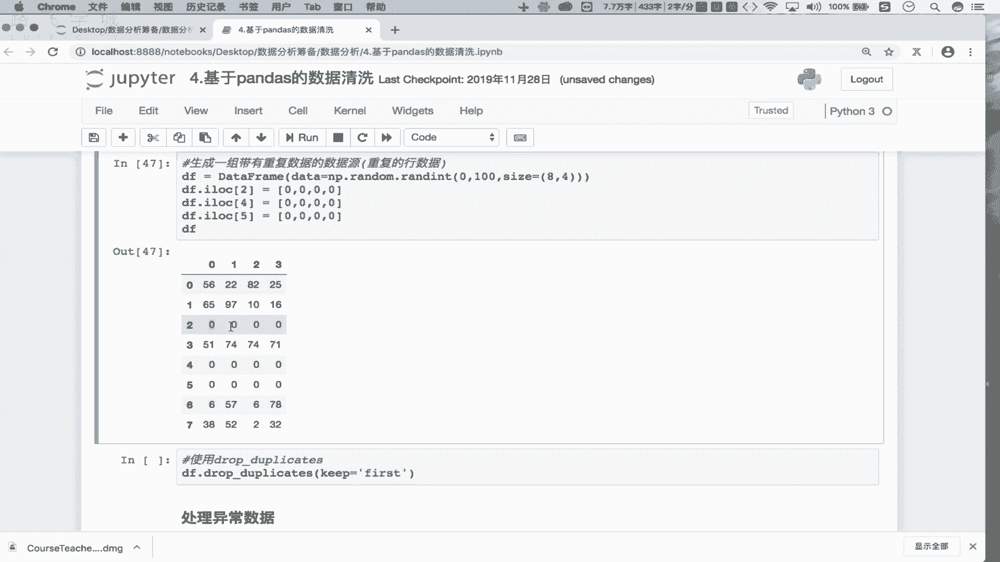

以下是生成并处理重复数据的步骤：

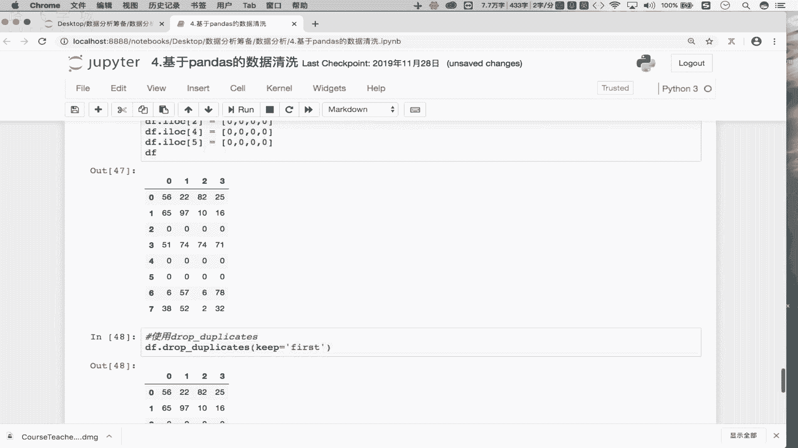

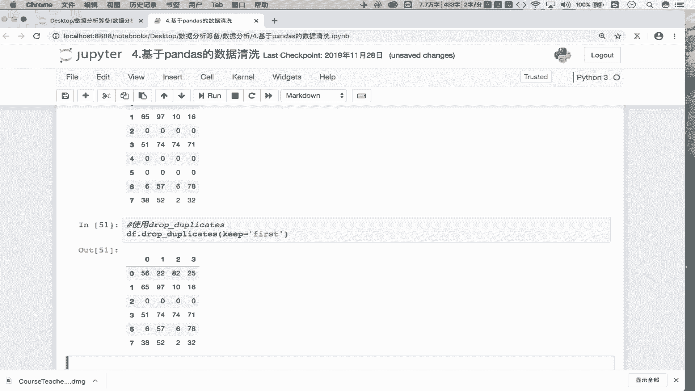

1.  首先，我们创建一个包含重复行的示例数据集。
    ```python
    import pandas as pd
    import numpy as np

    # 生成一个8行4列的随机数据框
    DF = pd.DataFrame(np.random.randint(0, 100, size=(8, 4)))
    # 人为制造重复行：将索引为2、4、5的行数据都设置为[0,0,0,0]
    DF.iloc[2] = [0,0,0,0]
    DF.iloc[4] = [0,0,0,0]
    DF.iloc[5] = [0,0,0,0]
    ```

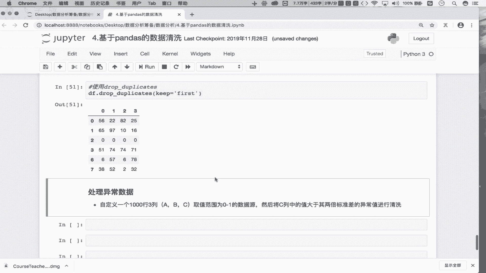

2.  使用 `drop_duplicates()` 方法清洗重复数据。该方法的关键参数是 `keep`，用于指定保留哪一行重复数据。
    *   `keep='first'`：保留第一次出现的重复行（默认值）。
    *   `keep='last'`：保留最后一次出现的重复行。
    *   `keep=False`：删除所有重复的行。
    ```python
    # 删除重复行，默认保留首次出现的行
    DF_cleaned = DF.drop_duplicates()
    ```

## 异常值的清洗 🚨

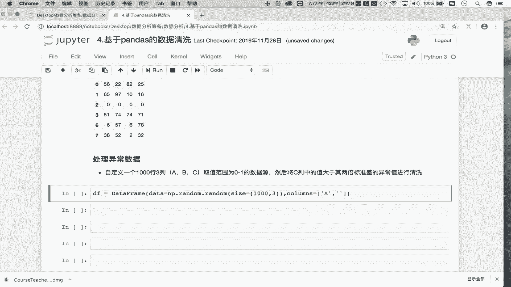

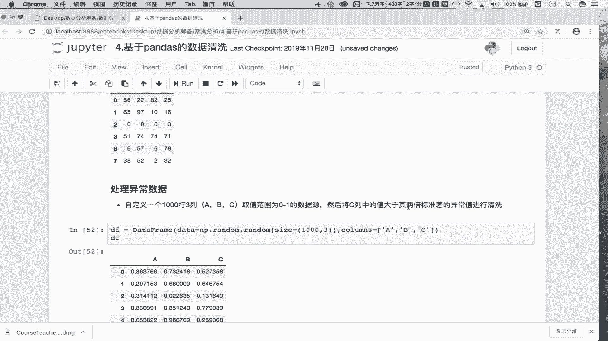

异常值是指那些明显偏离数据集整体规律或业务常识的数据点。例如，蔬菜大棚的温度传感器读数出现120℃。


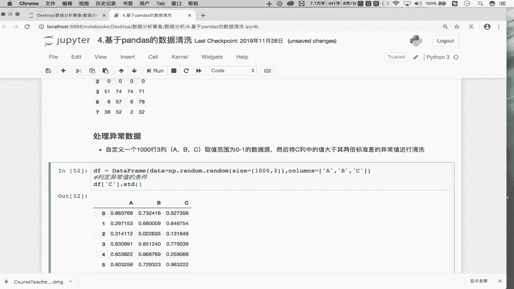

处理异常值通常需要先定义判定规则，然后根据规则筛选或修改数据。

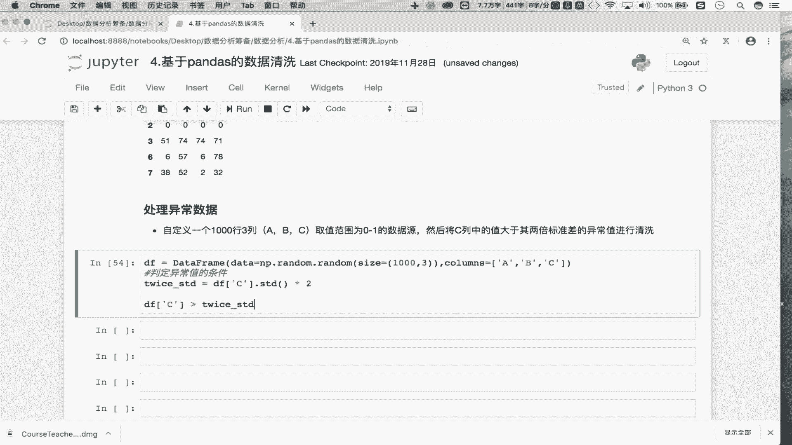

以下是清洗异常值的一个示例：


1.  首先，我们生成一个1000行3列的模拟数据集。
    ```python
    # 生成一个1000行3列，数值在0-1之间的数据框
    DF = pd.DataFrame(np.random.random(size=(1000, 3)), columns=['A', 'B', 'C'])
    ```

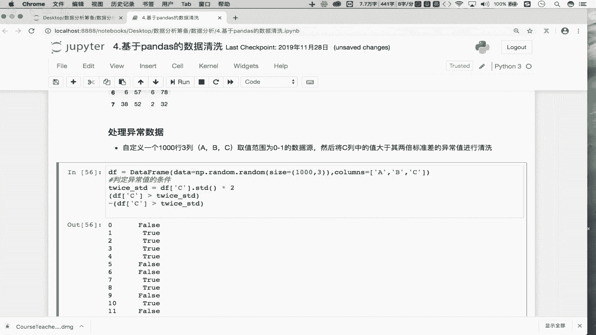


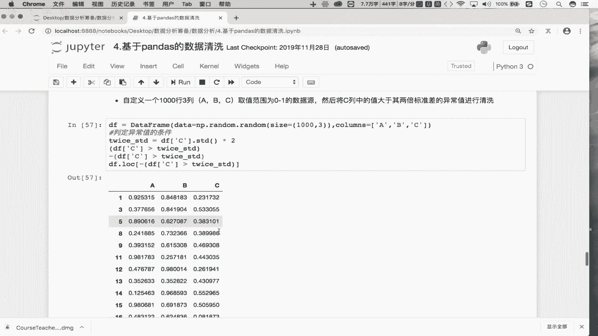

2.  定义异常值判定条件。本例中，我们设定规则为：如果`C`列的值大于该列两倍的标准差，则视为异常值。
    ```python
    # 计算C列两倍的标准差
    twice_std = DF['C'].std() * 2
    # 创建布尔序列，标记哪些是异常值（True表示是异常值）
    condition = DF['C'] > twice_std
    ```


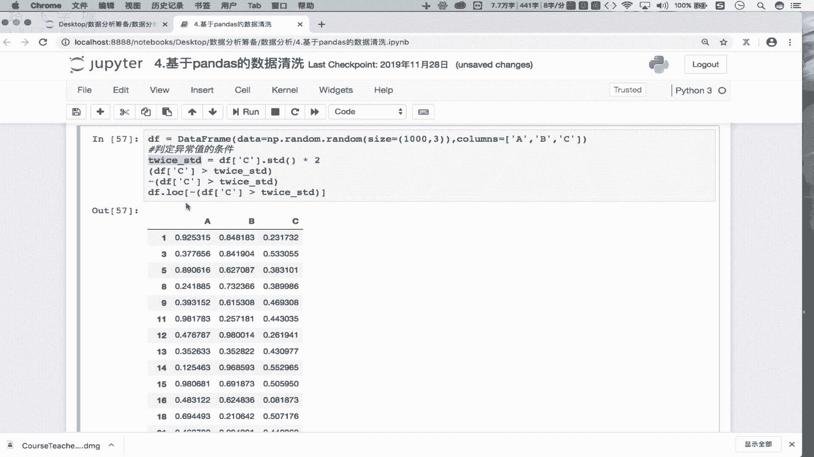

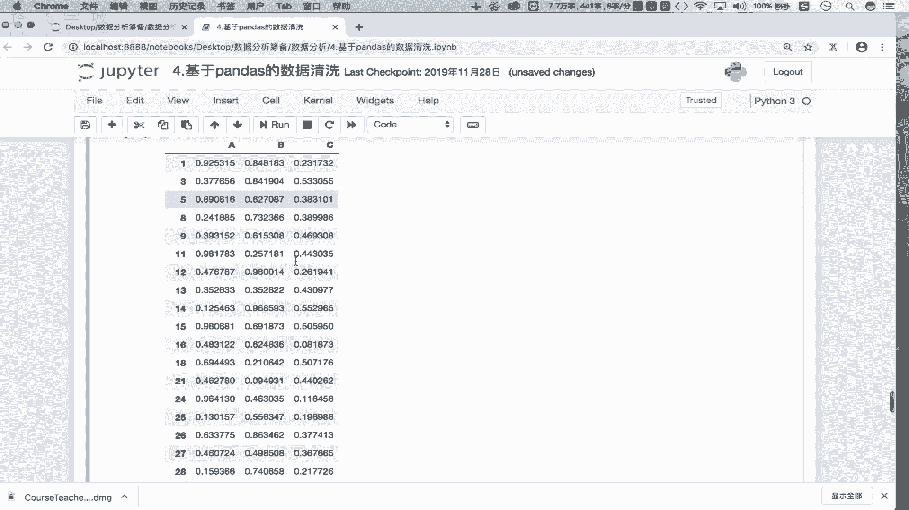

3.  根据条件清洗数据。我们的目标是将异常值所在的行删除。由于布尔索引会保留`True`对应的行，我们需要对条件取反（`~`），用`False`来标记异常值，从而在索引时将其排除。
    ```python
    # 使用取反操作符 ~ 来保留正常值（即 condition 为 False 的行）
    DF_cleaned = DF[~condition]
    ```

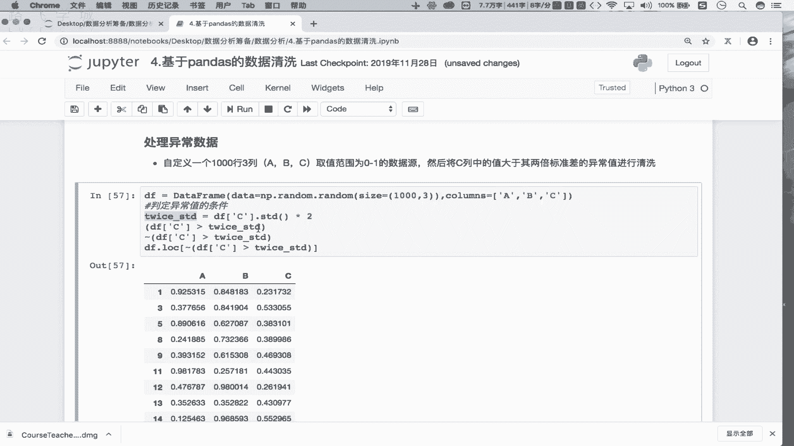


本节课中我们一起学习了数据清洗中处理重复值和异常值的方法。我们掌握了使用 `drop_duplicates()` 函数快速删除重复行，也学会了通过定义统计规则（如两倍标准差）来识别并过滤异常值。至此，关于数据清洗中缺失值、重复值和异常值处理的核心操作就介绍完毕了。