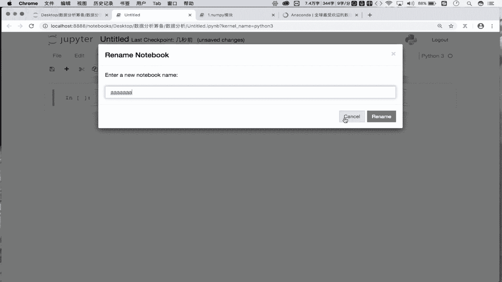

# Python数据分析三剑客：P3：01：环境搭建与Jupyter Notebook基础使用 🛠️

在本节课中，我们将学习如何搭建Python数据分析的开发环境，并掌握核心工具Jupyter Notebook的基本使用方法。这是开启数据分析之旅的第一步。

## 概述

上一节我们对数据分析课程进行了初步介绍。本节中，我们来看看数据分析所需的开发环境搭建流程。

## 1. Anaconda：集成环境介绍与安装

首先，我们需要安装一个名为Anaconda的集成环境。Anaconda是一个集成了数据分析和机器学习所需全部环境的软件包。

**核心概念**：Anaconda是一个**集成环境**，它预装了Python、数据分析库（如NumPy, Pandas）和科学计算工具。

以下是Anaconda的安装要点：
*   **下载**：访问Anaconda官网，根据你的操作系统（Windows、macOS或Linux）下载对应的安装包。
*   **安装**：运行下载的安装包，按照提示进行“下一步”安装。
*   **注意事项**：安装路径**不能包含中文或特殊符号**，建议安装在某个磁盘的根目录下。

安装过程的详细文档会另行提供。安装好Anaconda后，我们就具备了进行数据分析和机器学习开发的基础环境。


## 2. Jupyter Notebook：可视化开发工具


Anaconda安装好后，我们会使用它自带的一个基于浏览器的可视化开发工具——Jupyter Notebook。我们将在其中编写和执行代码。

**核心概念**：Jupyter Notebook是Anaconda提供的**基于浏览器的可视化开发工具**。

### 2.1 启动Jupyter Notebook




启动方法是在系统的终端（或命令提示符）中输入特定指令。

**代码示例（启动命令）**：
```bash
jupyter notebook
```
输入上述命令并按下回车，系统会自动启动一个本地服务并打开你的默认浏览器，显示Jupyter的主界面。

### 2.2 创建新文件

在Jupyter主界面，我们可以创建新的文件来编写代码。

以下是创建新文件的步骤：
1.  点击右上角的 **`New`** 按钮。
2.  在下拉菜单中选择 **`Python 3`**。这将创建一个新的、后缀为 `.ipynb` 的源代码文件。

### 2.3 Cell（单元格）的概念与模式

Jupyter Notebook中的内容是在一个个“单元格”（Cell）中编写的。每个Cell有两种主要模式。

**核心概念**：
*   **Code模式**：用于**编写和运行程序代码**。
*   **Markdown模式**：用于**编写格式化的文本笔记和说明**。

模式切换方法：选中一个Cell后，在工具栏的下拉菜单中可以选择“Code”或“Markdown”进行切换。两种模式的Cell都需要执行（Run）才能看到效果。

### 2.4 常用快捷键

熟练使用快捷键可以极大提升在Jupyter Notebook中的工作效率。

以下是几个最常用的快捷键：
*   **添加Cell**：按 **`A`** 在当前Cell上方插入；按 **`B`** 在当前Cell下方插入。
*   **删除Cell**：按 **`X`** 删除当前选中的Cell。
*   **切换Cell模式**：按 **`M`** 将当前Cell切换到Markdown模式；按 **`Y`** 切换回Code模式。
*   **执行Cell**：按 **`Shift + Enter`** 执行当前Cell，并跳转到下一个Cell。
*   **代码自动补全**：在输入代码时，按 **`Tab`** 键可以触发自动补全建议。
*   **查看帮助文档**：将光标放在某个函数或方法名上，按 **`Shift + Tab`** 可以查看其帮助文档。

## 总结


本节课中我们一起学习了搭建Python数据分析环境的核心步骤。首先，我们安装了集成环境Anaconda。然后，我们掌握了如何在Anaconda中使用Jupyter Notebook这一强大工具，包括如何启动、创建文件、理解Cell的两种模式以及使用关键快捷键。环境准备就绪后，我们就可以正式进入数据分析的代码实战了。