# 量化交易：Python入门之数据分析：1：时间和日期 📅

在本节课中，我们将要学习Python中处理日期和时间的基础知识。这对于量化交易和数据分析至关重要，因为金融数据通常都是基于时间序列的，确保数据按正确的时间顺序排列是分析的第一步。

## 导入必要的包

首先，我们需要导入处理日期和时间所需的Python包。Python通过“包”或“模块”来组织代码功能，我们需要使用时将其导入。

以下是需要导入的包：

```python
import datetime as dt
import time as tm
```

*   `import datetime as dt`：导入`datetime`包，并将其重命名为`dt`，以便后续代码中更简洁地调用。
*   `import time as tm`：导入`time`包，并将其重命名为`tm`。

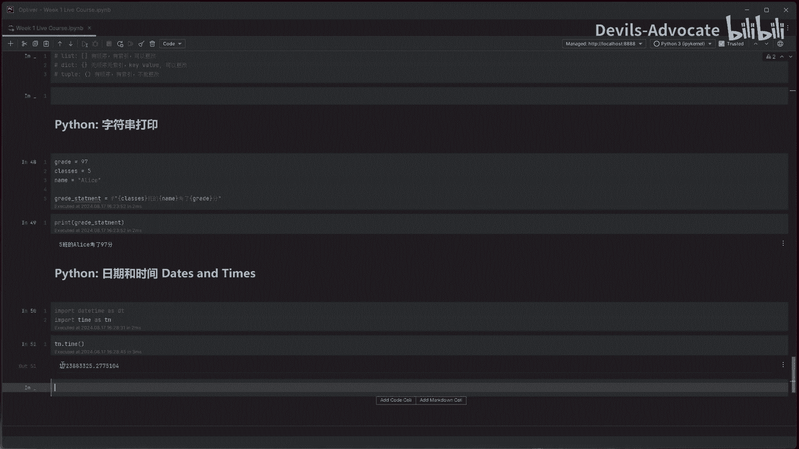

## 理解时间戳

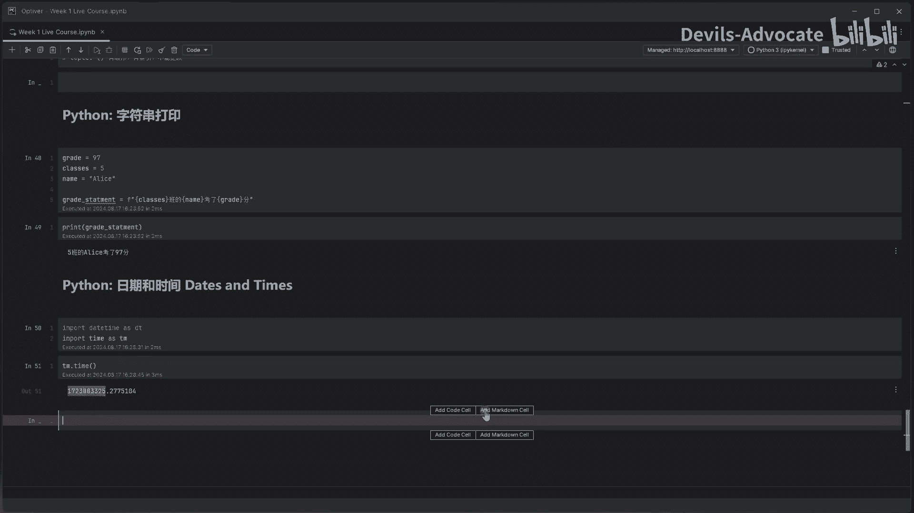

上一节我们介绍了如何导入包，本节中我们来看看时间的基础概念。`time`模块中的`time()`函数返回一个代表“时间戳”的数字。

```python
timestamp = tm.time()
print(timestamp)
```

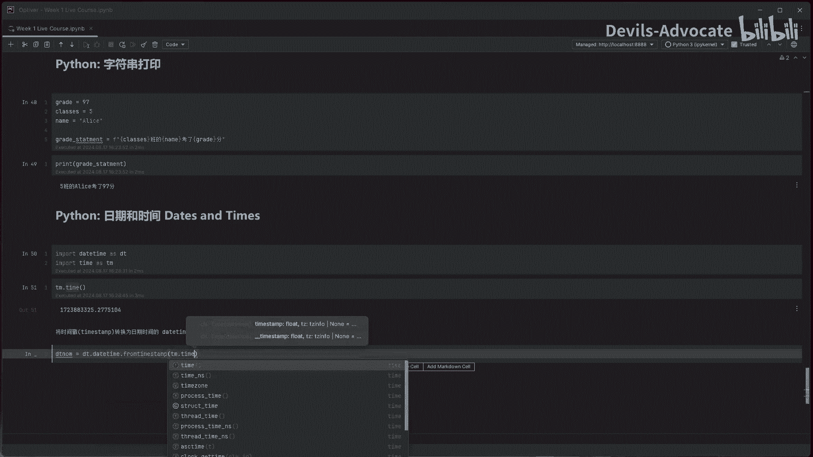

这个长数字是从**1970年1月1日**（称为Unix纪元）到当前时刻所经过的**秒数**。它是一个计算机易于处理的纯数字，但人类不易阅读。

## 转换时间戳为可读格式

为了将时间戳转换为我们能理解的日期时间格式，我们需要使用`datetime`模块。

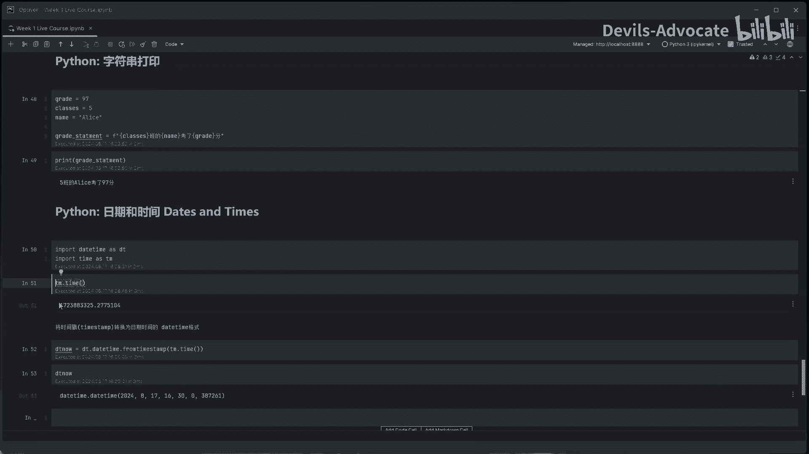

将时间戳转换为日期时间的`datetime`格式：

```python
now = dt.datetime.fromtimestamp(timestamp)
print(now)
```

这段代码会输出类似 `2024-08-17 16:30:24.123456` 的结果，包含了年、月、日、时、分、秒和微秒。
*   `dt.datetime.fromtimestamp()` 是一个函数，它接收时间戳作为输入，并返回一个`datetime`对象。

## 访问日期时间对象的属性

获得`datetime`对象（例如上面代码中的`now`变量）后，我们可以轻松地访问其各个组成部分。

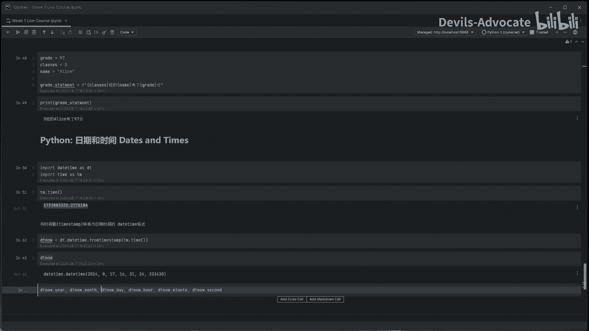

以下是访问`datetime`对象属性的方法：

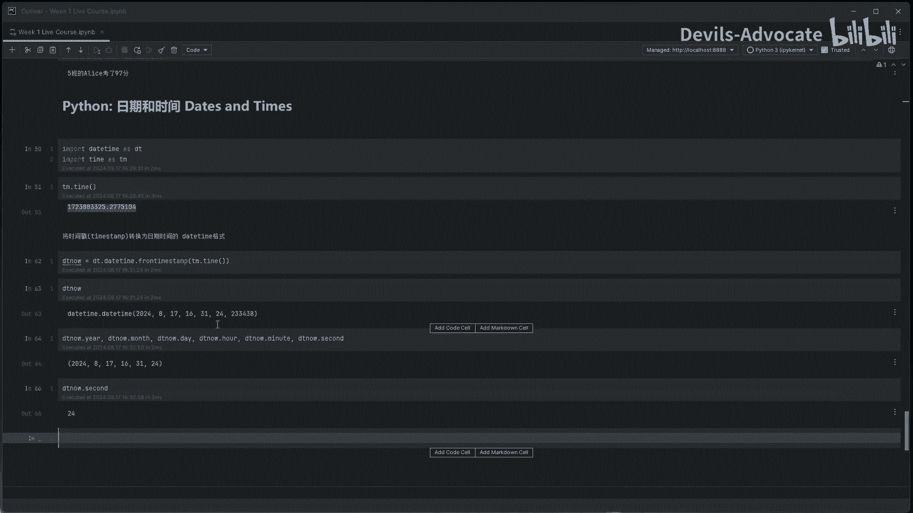

```python
print(now.year)   # 获取年份，例如 2024
print(now.month)  # 获取月份，例如 8
print(now.day)    # 获取日期，例如 17
print(now.hour)   # 获取小时，例如 16
print(now.minute) # 获取分钟，例如 30
print(now.second) # 获取秒数，例如 24
```

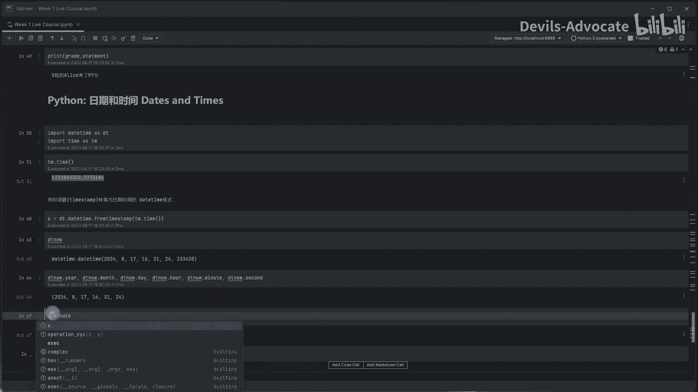

## 使用时间差进行计算

在数据分析中，我们经常需要计算两个日期之间的间隔，或者在某个日期上增加或减少一段时间。这可以通过`timedelta`对象来实现。

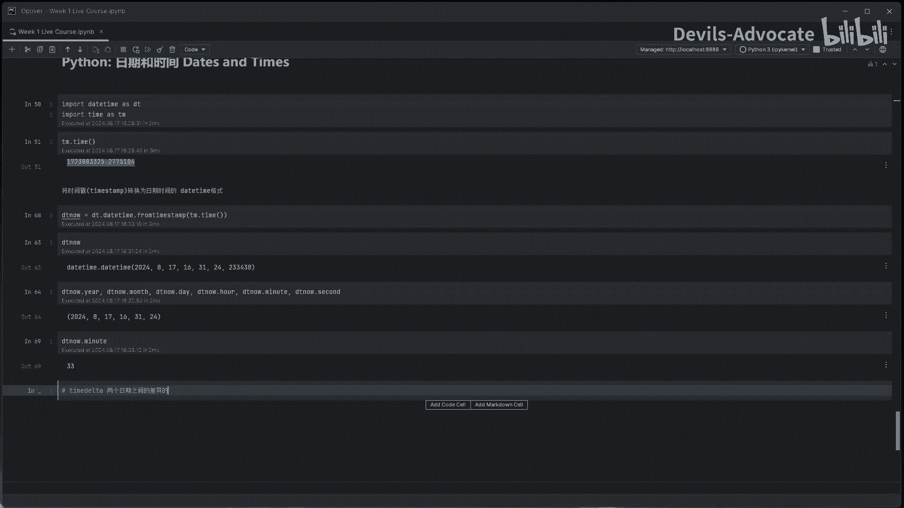

`timedelta`表示两个日期或时间之间的差异。

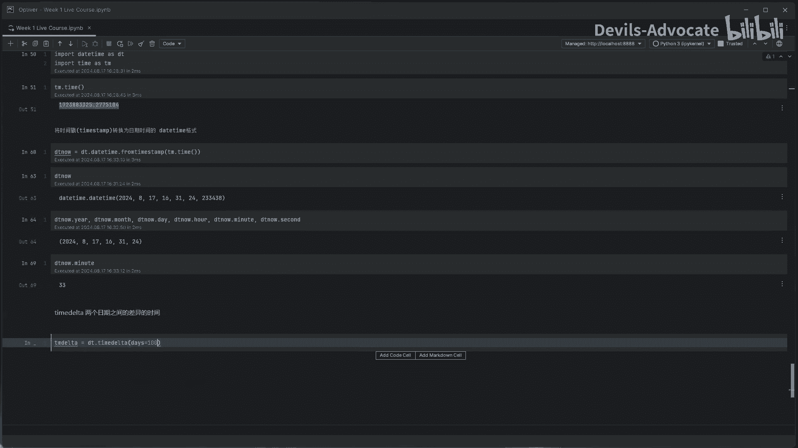

```python
# 定义一个100天的时间差
hundred_days = dt.timedelta(days=100)

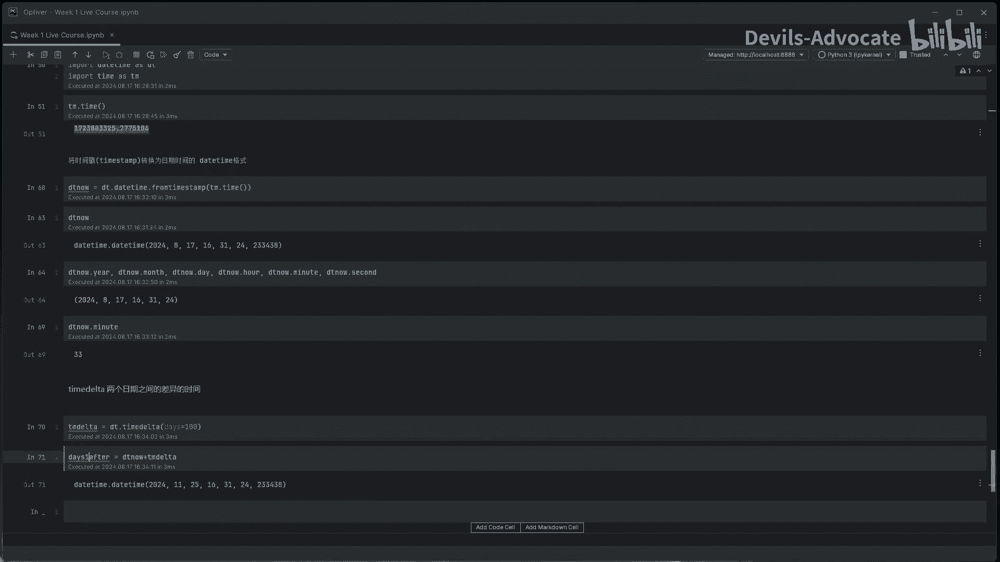

# 计算100天后的日期
future_date = now + hundred_days
print(future_date)

# 计算100天前的日期
past_date = now - hundred_days
print(past_date)
```

## 获取当前日期与比较

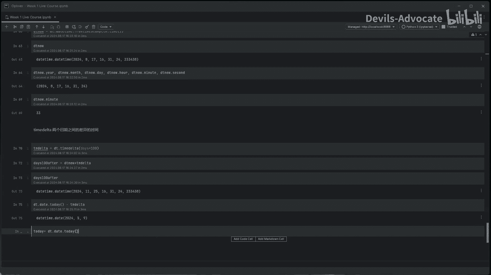

有时我们只关心日期部分，而不需要具体的时间。`datetime`模块也提供了直接获取当前日期的方法。

以下是获取和比较日期的操作：

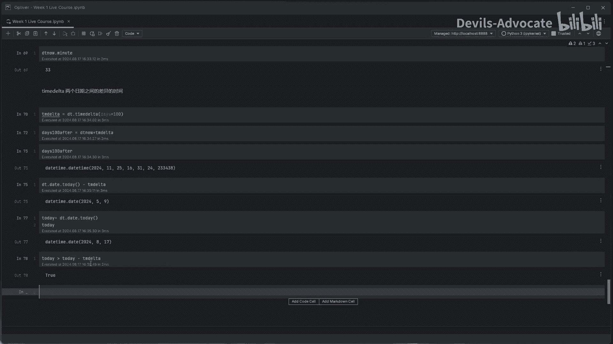

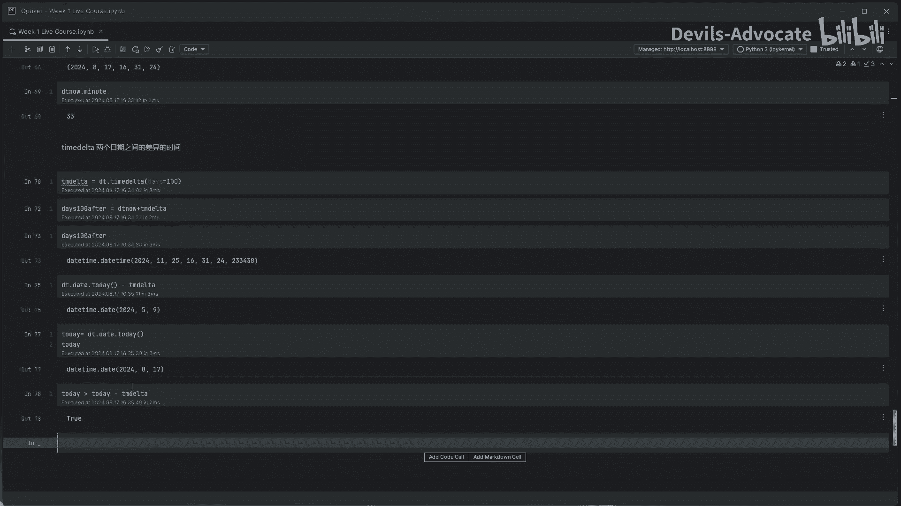

```python
# 获取当前日期（不包含时间）
today = dt.date.today()
print(today)

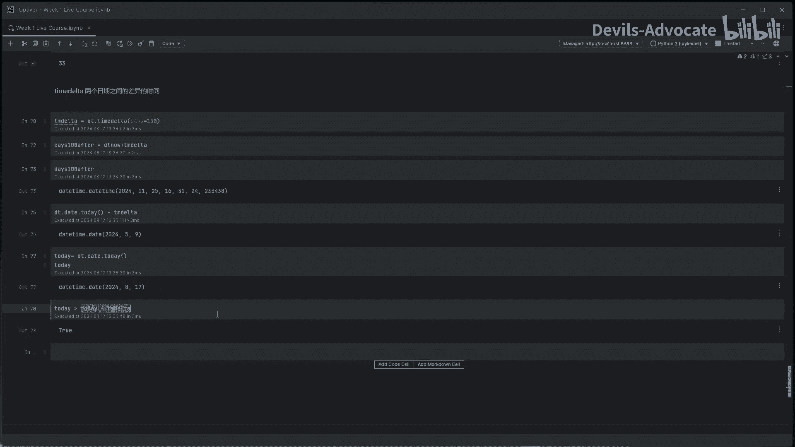

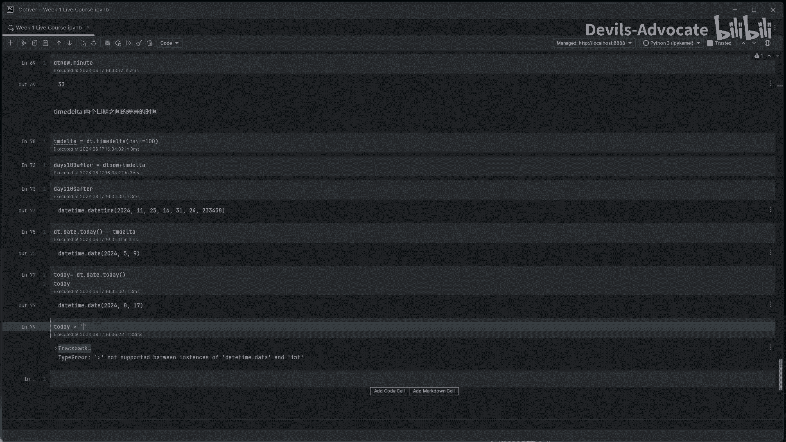

# 日期之间可以进行比较
yesterday = today - dt.timedelta(days=1)
print(today > yesterday)  # 输出 True

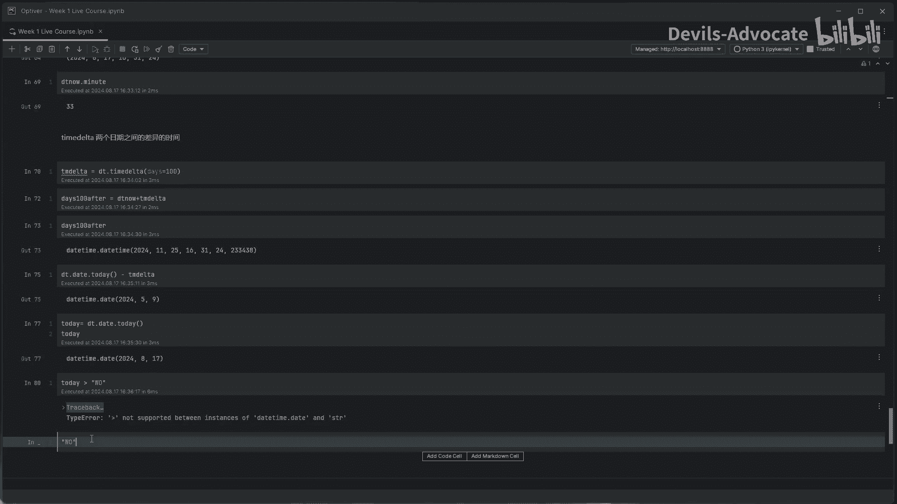

# 注意：不同类型的数据通常不能直接比较
# 例如，日期对象和整数不能比较
# print(today > 100)  # 这会引发 TypeError 错误
```

**请注意**：虽然某些情况下Python允许字符串之间进行比较（按字典序），但这在日期比较中并不可靠，应始终使用`datetime`或`date`对象进行日期相关的逻辑判断。

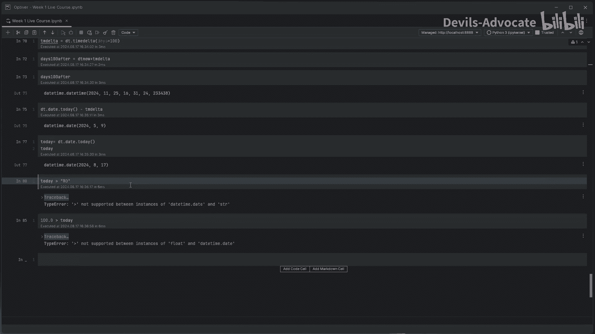

## 总结

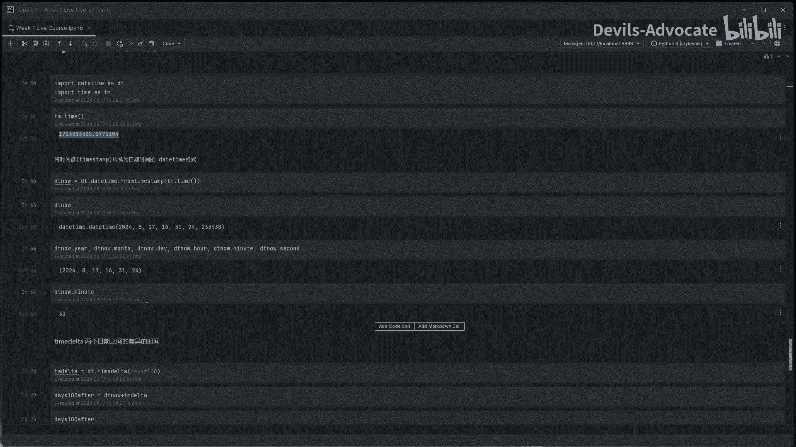

本节课中我们一起学习了Python处理日期和时间的基础操作。我们掌握了如何导入`datetime`和`time`模块，理解了时间戳的概念并将其转换为可读格式，学会了提取日期时间对象的各个部分，以及使用`timedelta`进行日期计算和比较。这些是构建时间序列数据分析，特别是量化金融分析的基石。