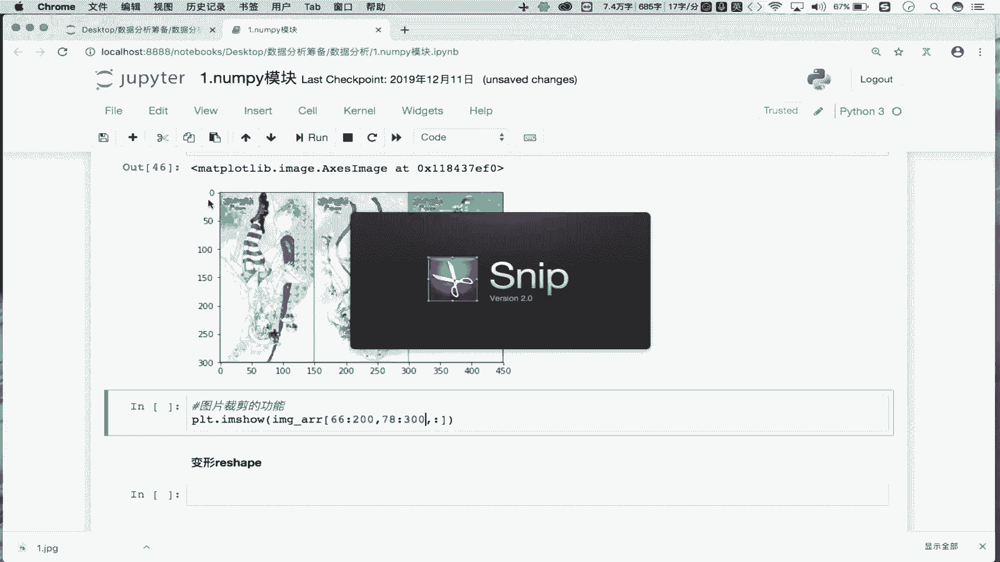

# Python金融分析+量化交易：P16：NumPy索引与切片操作详解 🧮

在本节课中，我们将学习NumPy库中索引和切片的核心操作。这些操作是高效处理数组数据的基础，尤其在金融数据分析和量化交易中至关重要。我们将从基础概念开始，逐步深入到实际应用，例如图片处理。

## 索引操作

上一节我们介绍了NumPy数组的创建。本节中我们来看看如何获取数组中的特定数据，即索引操作。

NumPy数组的索引操作与Python列表的索引操作原理相同。首先，我们创建一个示例数组。

```python
import numpy as np
arr = np.random.randint(1, 100, size=(5, 6))
print(arr)
```

以下是索引操作的基本用法：
*   **获取单行数据**：`arr[1]` 取出下标为1的行数据。
*   **获取多行数据**：`arr[[1, 3, 4]]` 取出下标为1、3、4的行数据。

## 切片操作

理解了索引之后，本节我们来看看更灵活的切片操作。切片可以帮助我们获取数组的连续子集。

切片操作通过在方括号内使用冒号`:`来指定范围。NumPy数组的切片可以同时在行和列两个维度上进行，使用逗号`,`分隔。

以下是切片操作的具体应用：
*   **切出前两行**：`arr[0:2, :]` 或简写为 `arr[:2, :]`。逗号左边是行切片，右边是列切片。
*   **切出前两列**：`arr[:, 0:2]`。当只对列进行切片时，行部分用冒号`:`表示全选。
*   **切出前两行的前两列**：`arr[0:2, 0:2]`。

## 数组反转

切片操作的一个强大功能是实现数组的反转。反转是指将数组元素的顺序进行倒置。

反转通过切片语法`[start:stop:step]`中的`step`（步长）参数设置为`-1`来实现。

以下是实现不同维度反转的方法：
*   **将数组的行倒置**：`arr[::-1, :]`
*   **将数组的列倒置**：`arr[:, ::-1]`
*   **将所有元素倒置（行列均倒置）**：`arr[::-1, ::-1]`

## 实战应用：图片处理

掌握了切片和反转的原理后，我们可以将其应用于实际场景，例如图片的翻转与裁剪。一张图片在NumPy中通常被表示为一个三维数组 `(高度， 宽度， 颜色通道)`。

首先，我们读取并显示一张图片。

```python
import matplotlib.pyplot as plt
image_arr = plt.imread('1.jpg')
plt.imshow(image_arr)
plt.show()
```

### 图片翻转

图片翻转是通过对图片数组的特定维度进行反转实现的。

*   **左右翻转（列倒置）**：`plt.imshow(image_arr[:, ::-1, :])`
*   **上下翻转（行倒置）**：`plt.imshow(image_arr[::-1, :, :])`

### 图片裁剪

图片裁剪是通过对图片数组的行和列维度进行切片，截取局部区域实现的。



例如，截取图片中从第66行到200行，第78列到300列的区域：
`plt.imshow(image_arr[66:200, 78:300, :])`


## 总结


本节课中我们一起学习了NumPy的索引与切片操作。我们首先回顾了与列表相似的索引操作，然后深入学习了更强大的多维切片，包括如何切取子数组、实现数组反转。最后，我们将这些知识应用于实战，演示了如何对图片进行左右/上下翻转以及局部裁剪。这些操作是进行高效数据预处理和特征提取的基石，务必熟练掌握。