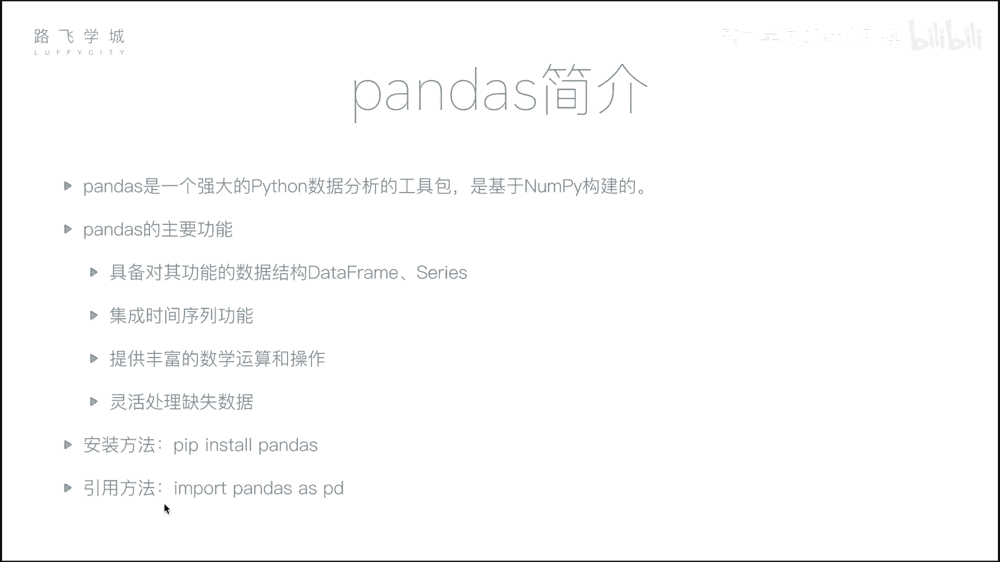
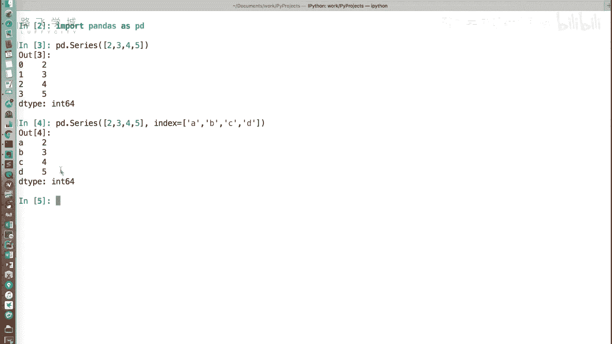
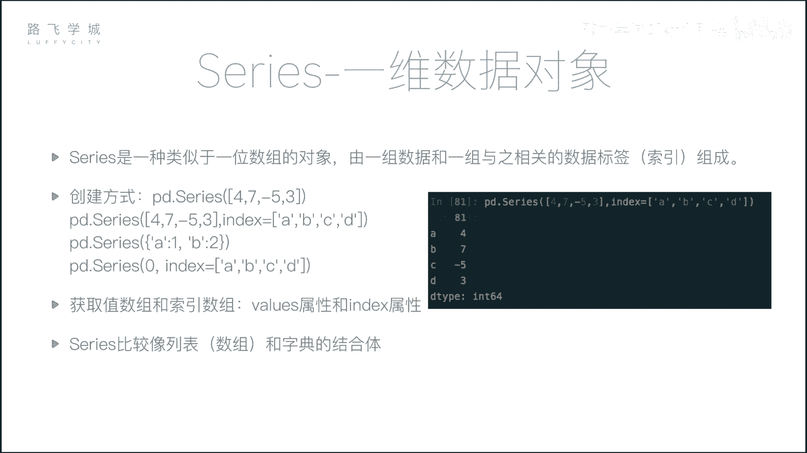
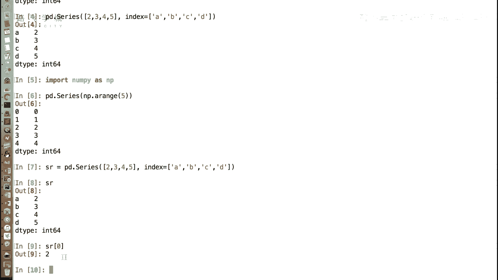
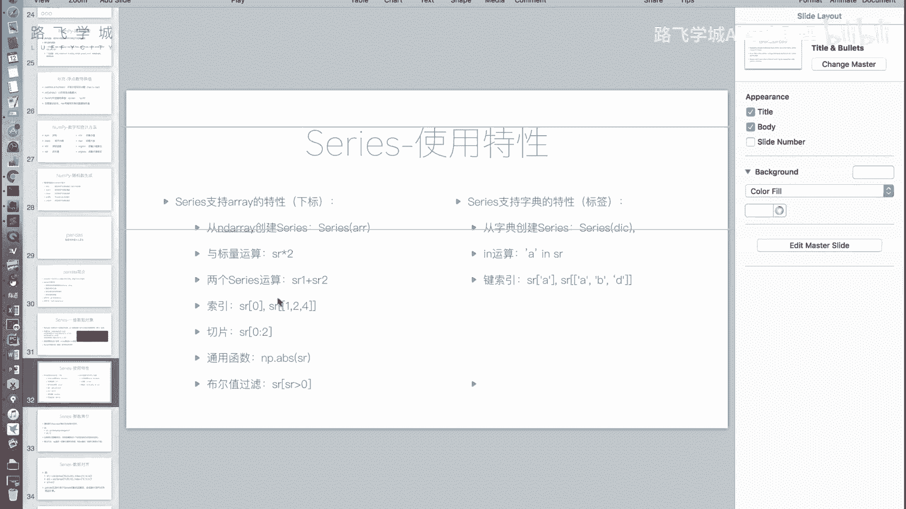
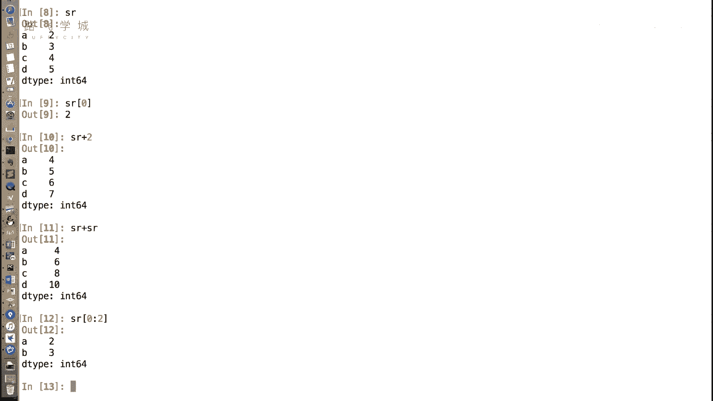
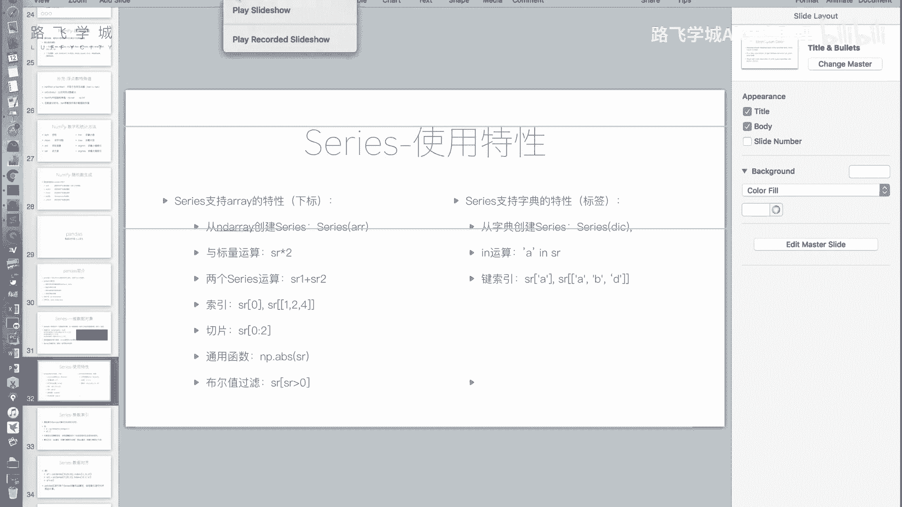
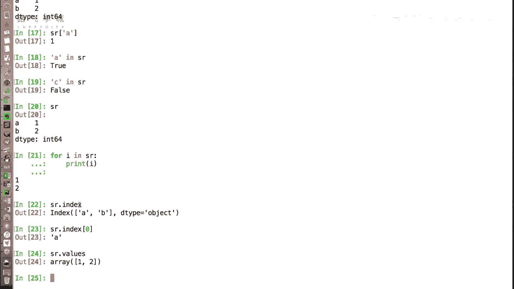
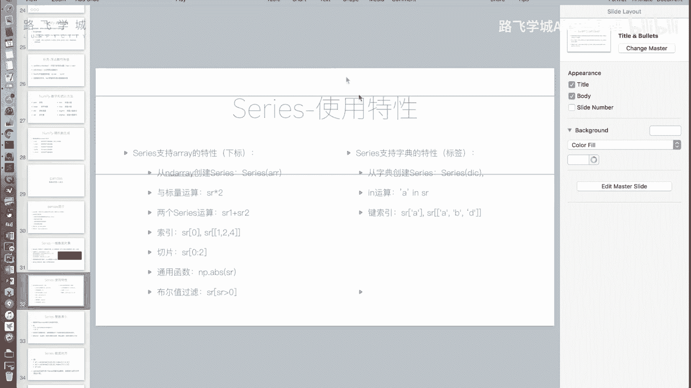
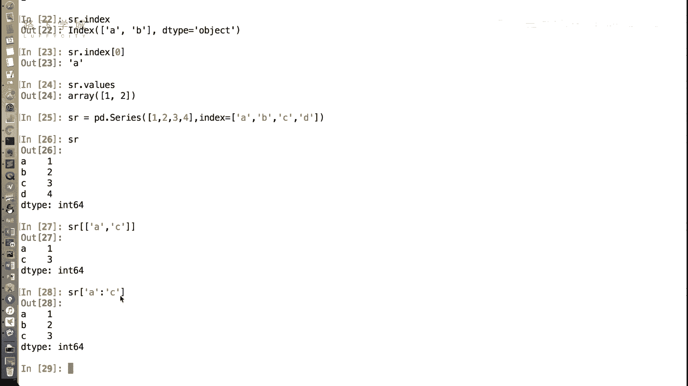

# Python金融分析+量化交易：P19：Series介绍 📊

在本节课中，我们将要学习Pandas库中的第一个核心数据结构——Series。Series是构建Pandas数据分析能力的基石，理解它是后续学习DataFrame和进行实际分析的关键。

上一节我们介绍了NumPy，它是一个强大的数值计算基础包。本节中我们来看看基于NumPy构建的、在数据分析领域应用更广泛的Pandas库。Pandas封装层级更高，无论进行何种领域的数据分析，它都是不可或缺的工具。

Pandas的主要功能包括：
*   提供两种核心数据结构：**DataFrame**和**Series**。
*   集成了时间序列处理功能。
*   提供了丰富的数学运算和操作。
*   能够灵活地处理缺失数据。

其安装方法非常简单，使用`pip install pandas`即可。官方建议的导入方式如下：

```python
import pandas as pd
```



接下来，我们将按照此约定来使用Pandas。

---


## 什么是Series？ 🤔

首先，我们来介绍Pandas中的第一种核心数据对象：**Series**。

Series是一种类似于一维数组的对象。你可以把它看作是**数组（列表）和字典的结合体**。下面我们通过代码来直观感受。



```python
import pandas as pd



# 从列表创建Series
s1 = pd.Series([2, 3, 4, 5])
print(s1)
```
输出结果左侧是默认的整数索引（0, 1, 2, 3），右侧是数据值。这看起来就像一个列表或数组。

```python
# 创建Series时指定自定义索引（标签）
s2 = pd.Series([2, 3, 4, 5], index=[‘A‘, ‘B‘, ‘C‘, ‘D‘])
print(s2)
```
此时，输出结果左侧的索引变成了我们指定的‘A‘, ‘B‘, ‘C‘, ‘D‘，这就像字典的键（key）。因此，Series确实融合了列表（通过位置访问）和字典（通过标签访问）的特性。

---

## Series的数组（列表）特性 📋



Series继承了许多来自NumPy数组或Python列表的特性。以下是其主要体现：



**1. 从列表或数组创建**
Series可以直接从Python列表或NumPy数组创建，正如我们上面演示的那样。

**2. 通过下标（位置）访问**
即使我们为Series指定了自定义标签（如‘A‘, ‘B‘, ‘C‘），仍然可以通过整数位置（下标）来访问数据。

```python
s = pd.Series([2, 3, 4, 5], index=[‘A‘, ‘B‘, ‘C‘, ‘D‘])
print(s[0])  # 输出: 2
```

**3. 向量化运算**
与NumPy数组一样，Series支持向量化运算。
*   可以与标量（单个数值）进行运算。
*   两个相同大小的Series之间可以进行逐元素运算（加、减、乘、除、比较等）。



```python
print(s * 2)           # 每个元素乘以2
print(s + s)           # 两个相同Series相加
```



**4. 切片**
和列表类似，Series支持使用整数位置进行切片。

```python
print(s[0:2])  # 切片，获取前两个元素（位置0和1）
```

**5. 支持通用函数与布尔索引**
Series兼容NumPy的通用函数（如`np.abs`, `np.log`），并且支持布尔索引进行数据筛选。

```python
print(s[s > 3])  # 布尔索引，筛选出值大于3的元素
```

---

## Series的字典特性 📖

除了数组特性，Series也具备一些类似字典的行为。

**1. 从字典创建**
可以直接用一个Python字典来创建Series，字典的键（key）会自动成为Series的索引（标签）。

```python
s_dict = pd.Series({‘a‘: 1, ‘b‘: 2, ‘c‘: 3})
print(s_dict)
```





**2. 通过标签访问**
这是Series作为“增强版字典”的核心功能，可以通过索引标签来获取值。

```python
print(s_dict[‘a‘])  # 输出: 1
```

**3. `in`操作**
可以使用`in`关键字检查某个标签是否存在于Series的索引中。

```python
print(‘a‘ in s_dict)  # 输出: True
print(‘z‘ in s_dict)  # 输出: False
```
**注意**：对Series进行`for`循环遍历时，默认输出的是**值**，而不是键（索引）。这与遍历字典不同。

**4. 分别获取索引和值**
可以通过`.index`和`.values`属性分别获取Series的索引部分和值部分。

```python
print(s_dict.index)   # 输出索引对象
print(s_dict.values)  # 输出值数组（通常是NumPy数组）
```

**5. 标签索引的高级用法**
*   **花式索引**：可以传入一个标签列表，一次性获取多个值。
    ```python
    print(s_dict[[‘a‘, ‘c‘]])  # 获取标签‘a‘和‘c‘对应的值
    ```
*   **标签切片**：使用标签进行切片时，切片范围是**前闭后闭**的（包含结束标签）。
    ```python
    print(s_dict[‘a‘:‘c‘])  # 获取从标签‘a‘到标签‘c‘（包含‘c‘）的所有值
    ```

---

## Series的应用场景 💡

现在，让我们结合Series的特性，想象一下它的实际应用场景。



Series完美适用于**带标签的一维数据**。例如：
*   **股票日收盘价序列**：索引可以是日期（如‘2023-01-04‘），值是对应的收盘价。这样，你既可以通过日期标签（`s[‘2023-01-04‘]`）快速查询某天价格，也可以通过位置切片（`s[:5]`）方便地获取前几天的数据进行分析。
*   **带有时间戳的传感器读数**：索引是时间戳，值是读数。它既保持了数据的顺序（这是列表的特性），又提供了像字典一样通过键快速查找的能力。

这解决了传统上可能需要将`(时间戳， 值)`元组存入列表，再手动循环查找的繁琐问题，极大地提升了数据处理的效率和代码的简洁性。

---

本节课中我们一起学习了Pandas的核心数据结构Series。我们了解到Series是一个融合了数组和字典特性的强大一维数据容器，它支持通过位置和标签两种方式访问数据，并继承了NumPy的向量化运算能力。理解Series是后续学习更复杂的DataFrame以及进行实际数据分析项目的重要基础。在下一节，我们将介绍Pandas的另一个核心——DataFrame。