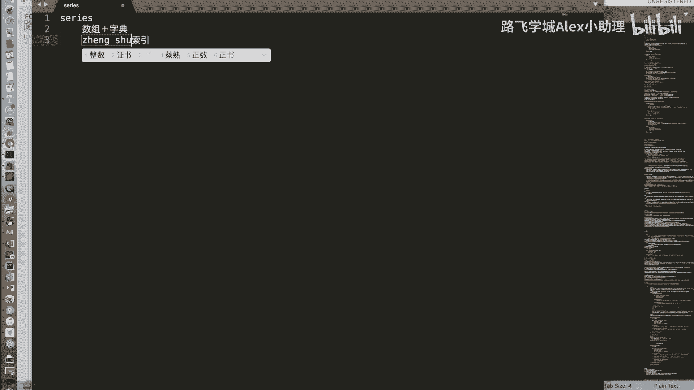
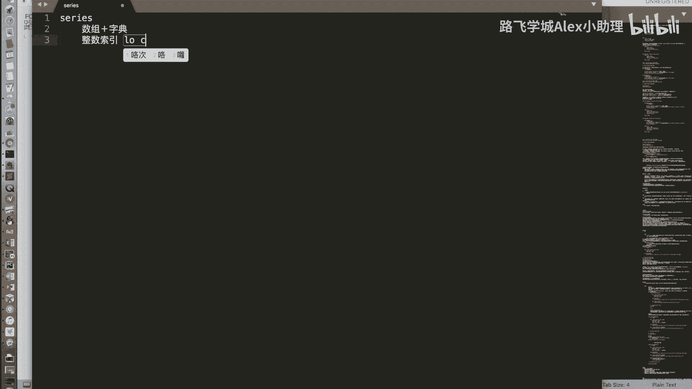
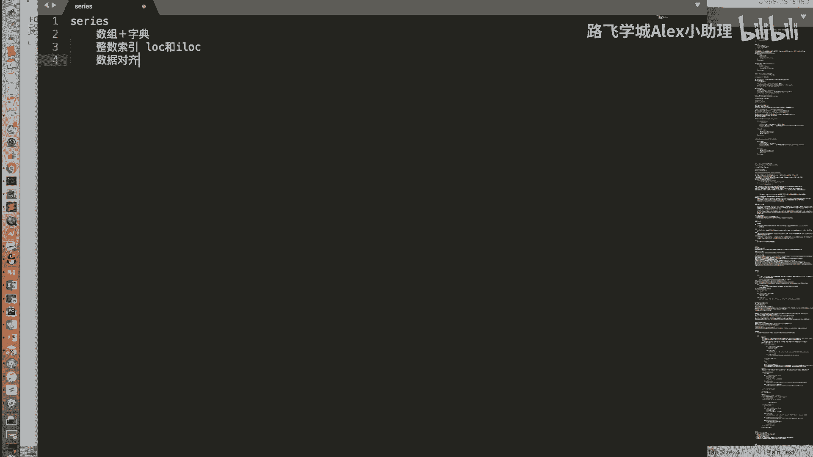
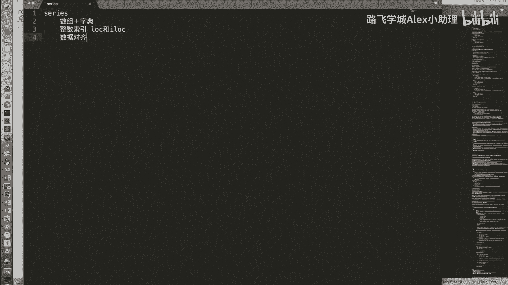
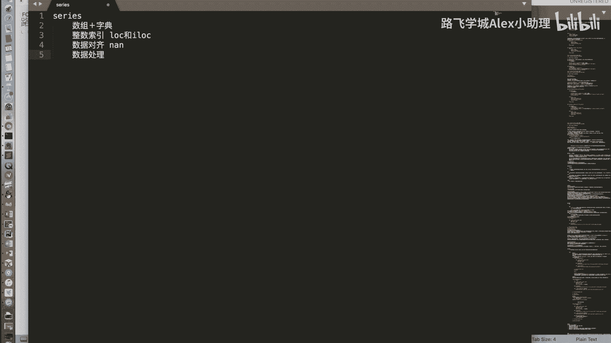
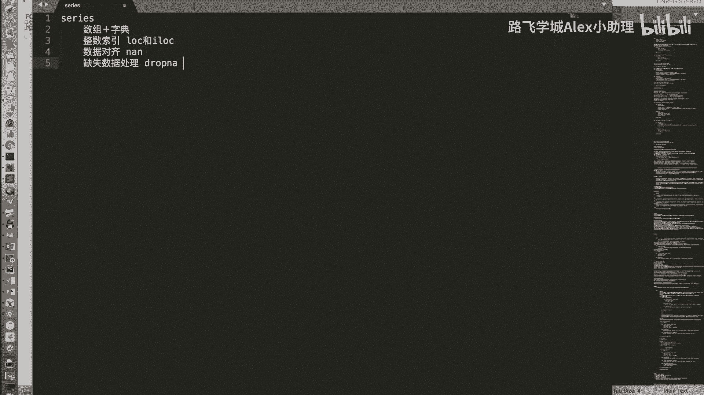
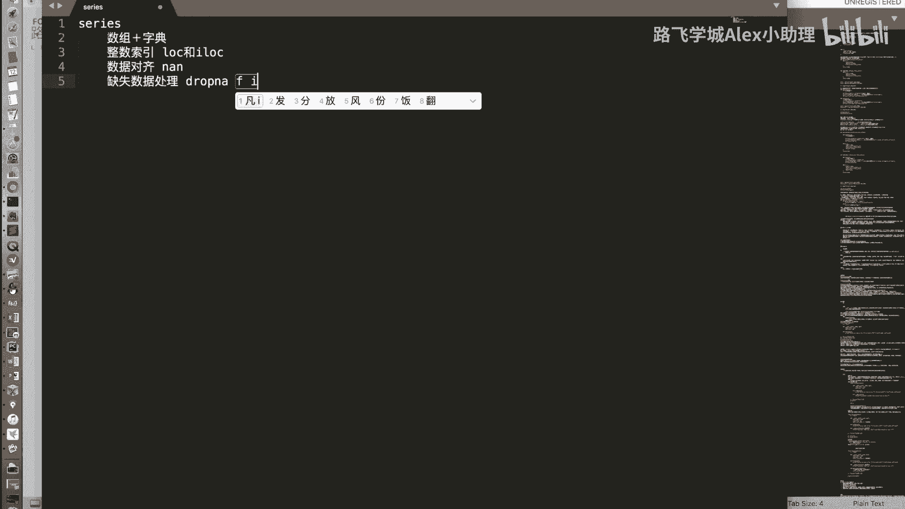
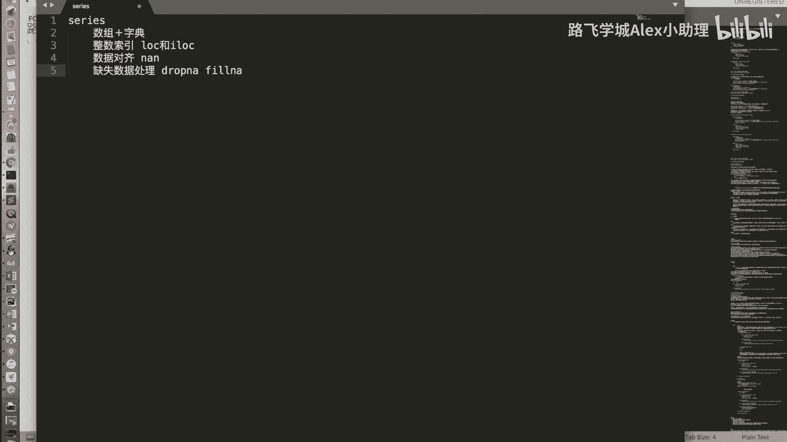
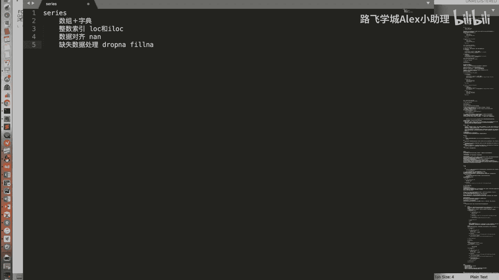

Python金融分析+量化交易：P23：Series小结 📝

在本节课中，我们将对Pandas的第一个核心数据结构——Series进行总结，梳理其核心特性、操作以及数据处理方法。

---

上一节我们详细介绍了Series的创建与基本操作。本节中，我们来看看Series的核心概念总结。

Series是一个结合了**字典**和**数组**特性的数据结构。它同时支持通过**整数下标**和**标签**进行数据访问。

以下是Series作为数组和字典集合体的具体表现：

*   **数组特性**：支持按下标索引、切片、布尔值索引。支持两个Series之间或Series与标量之间的算术运算。
    *   **代码示例**：`s1 + s2` 或 `s * 2`
*   **字典特性**：支持按标签索引，支持`in`操作符检查标签是否存在。
    *   **代码示例**：`s[‘label‘]` 或 `‘label‘ in s`

---

当Series的索引为整数时，使用中括号`[]`进行索引可能会产生歧义。它可能被解释为按下标索引，也可能被解释为按标签索引。

为了解决这个歧义，我们引入了两个重要的属性：`.iloc`和`.loc`。
*   **`.iloc`**：明确指定为**整数下标**索引。
    *   **代码示例**：`s.iloc[0]` 获取第一个元素（无论索引标签是什么）。
*   **`.loc`**：明确指定为**标签**索引。
    *   **代码示例**：`s.loc[0]` 获取索引标签为`0`的元素。

---

在介绍算术运算时，我们提到了Series的**数据对齐**特性。

当两个Series进行运算时，Pandas会**自动根据标签对齐数据**，然后对标签匹配的值进行计算。如果一个Series在某个标签上有值，而另一个没有，则结果在该标签位置会生成一个缺失值，表示为`NaN`。

*   **公式示意**：`s1 + s2` 的结果中，仅标签共有的位置进行加法，独有标签的位置结果为`NaN`。

---

既然运算可能产生缺失值`NaN`，我们就需要掌握处理缺失数据的方法。

以下是两种主要的缺失数据处理方式：

*   **删除缺失值**：使用`.dropna()`方法直接移除包含`NaN`的行。
    *   **代码示例**：`s_clean = s_with_nan.dropna()`
*   **填充缺失值**：使用`.fillna()`方法为`NaN`位置填充指定的值。
    *   **代码示例**：`s_filled = s_with_nan.fillna(0)` 用0填充所有`NaN`。

---

除了上述Pandas特有的功能外，Series继承了NumPy数组的许多强大功能。

例如，**布尔型索引**和**花式索引**等操作在Series中同样适用，这得益于其底层的NumPy数组实现。

---

本节课中我们一起学习了Pandas Series数据结构的核心总结。我们明确了它是字典与数组的集合体，掌握了使用`.iloc`和`.loc`进行明确索引的方法，理解了数据对齐的规则，并学会了使用`.dropna()`和`.fillna()`处理缺失数据。Series作为Pandas的基石，其大部分数组操作能力都源于NumPy，为后续学习更复杂的DataFrame打下了坚实基础。