# Python金融分析与量化交易实战：P11：11.10.3-策略收益效果分析 📈

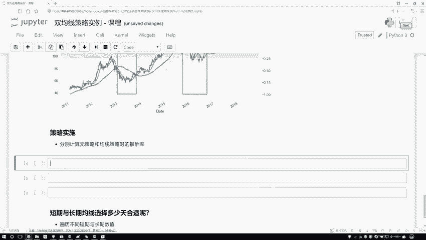

在本节课中，我们将学习如何计算和比较量化交易策略的收益。我们将通过一个具体的例子，分析使用“双均线策略”与“什么都不做”（即持有原始资产）两种方式下的最终收益差异。核心在于理解如何从股价数据计算日收益率，并应用策略信号来调整这些收益率，最终通过累加和对数还原得到总收益。

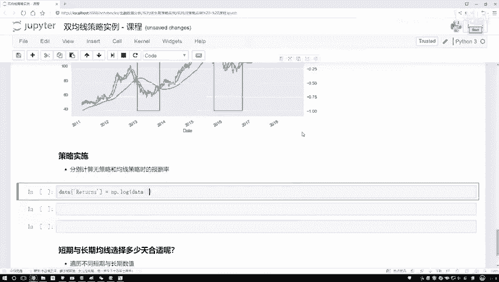

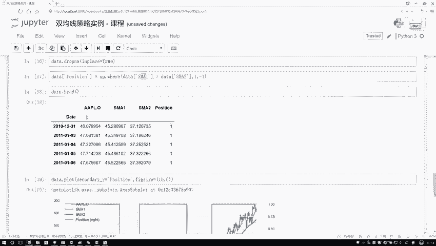

---

上一节我们介绍了如何生成交易信号（`position`）。本节中，我们来看看如何利用这些信号来计算策略的实际收益。

首先，我们需要计算股价的日收益率。在金融分析中，为了便于累加计算，我们通常使用对数收益率。对数收益率的计算公式如下：

**公式：** `log_return = log(price_t / price_{t-1})`

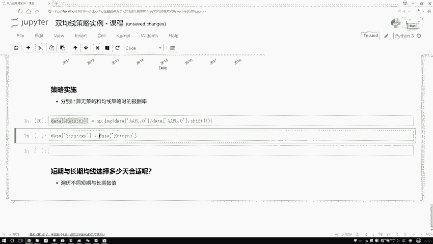

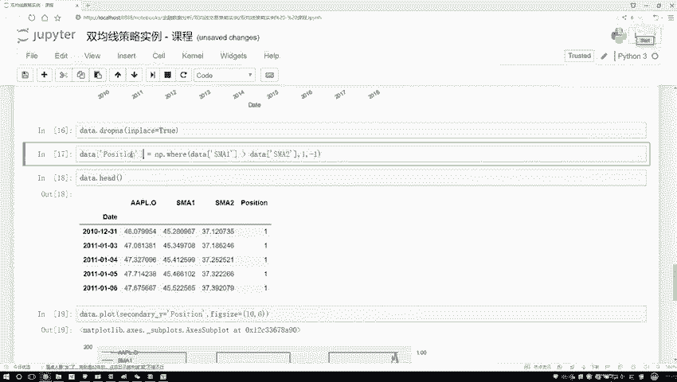

在代码中，我们可以使用Pandas的`shift`方法来计算这个值。

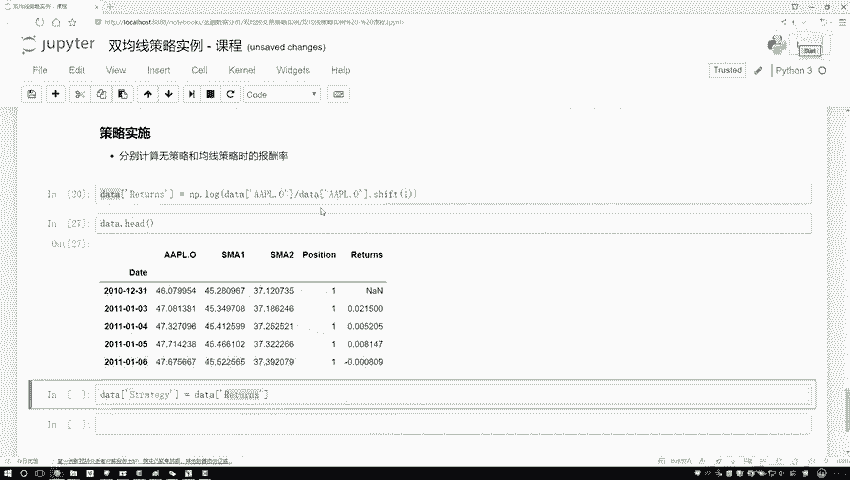

```python
# 计算对数收益率
data['return'] = np.log(data['close'] / data['close'].shift(1))
```

执行这段代码后，我们得到了一个名为`return`的列，它代表了资产每日的增长比率。

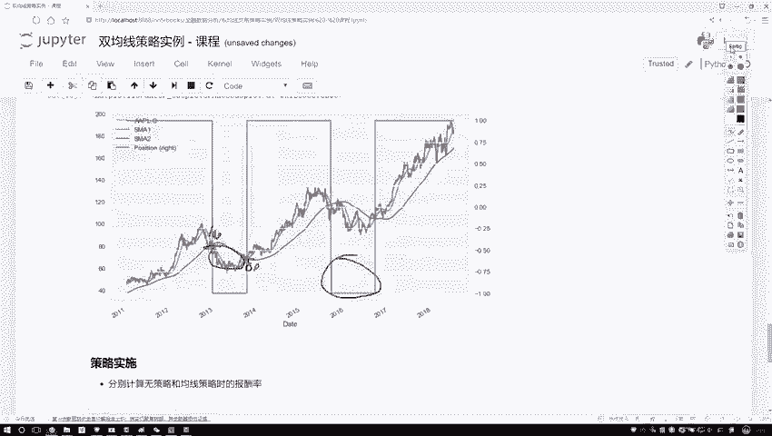

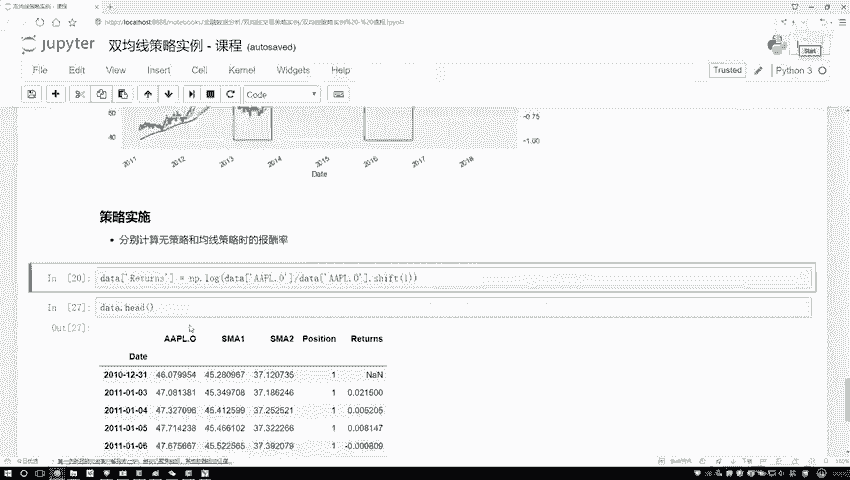

---

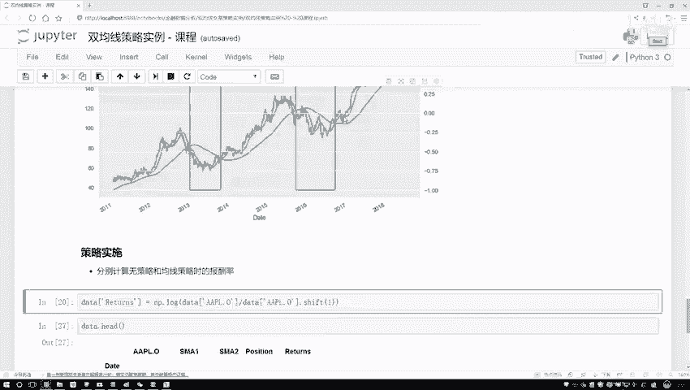

接下来，我们将策略信号应用到收益率上。我们的策略信号`position`是一个由1和-1组成的序列。
*   当`position`为1时，代表我们遵循原始走势（买入或持有）。
*   当`position`为-1时，代表我们进行反向操作（例如，在股价下跌时通过做空获利）。

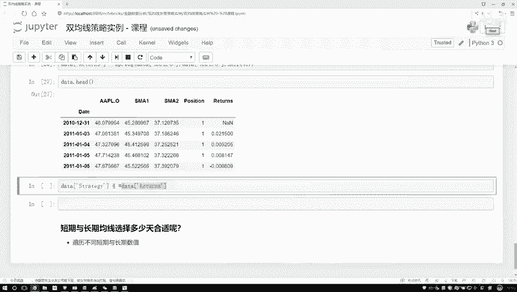

因此，策略的日收益率等于原始日收益率乘以当日的策略信号。同样，我们需要对信号进行`shift(1)`操作，以确保使用的是前一日生成的信号来指导当日的交易。

```python
# 计算策略收益率
data['strategy_return'] = data['position'].shift(1) * data['return']
```

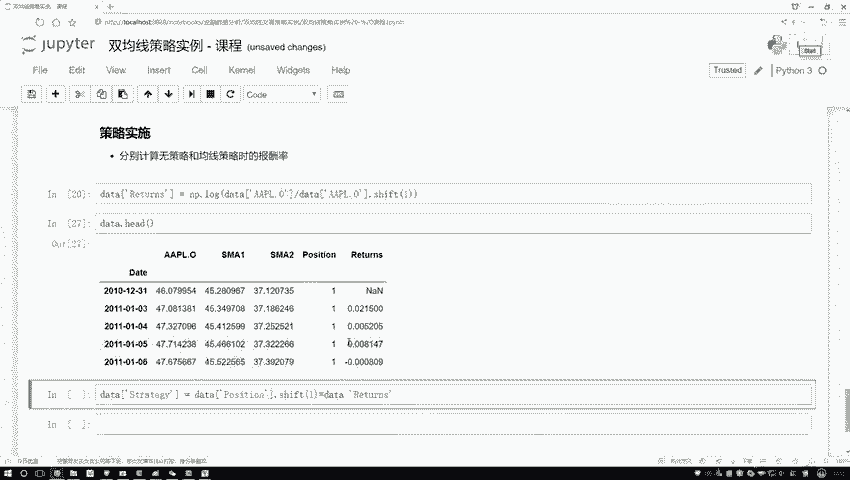

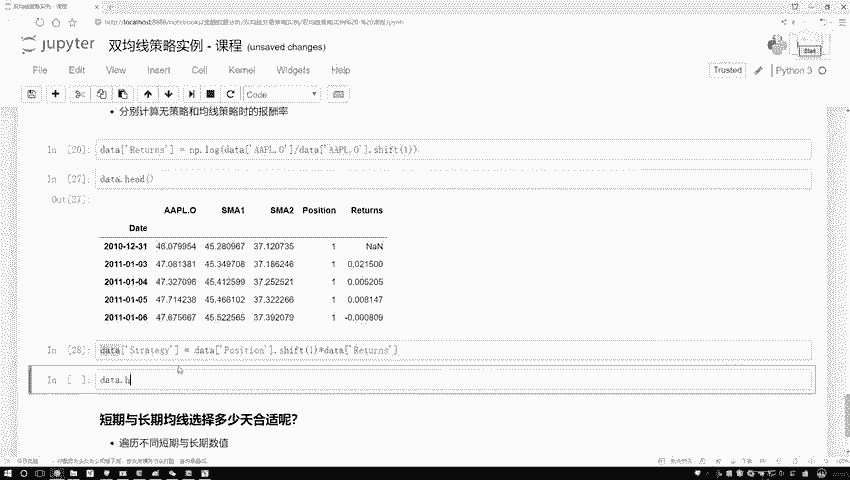

计算完成后，`strategy_return`列就记录了应用策略后，每日的收益率情况。

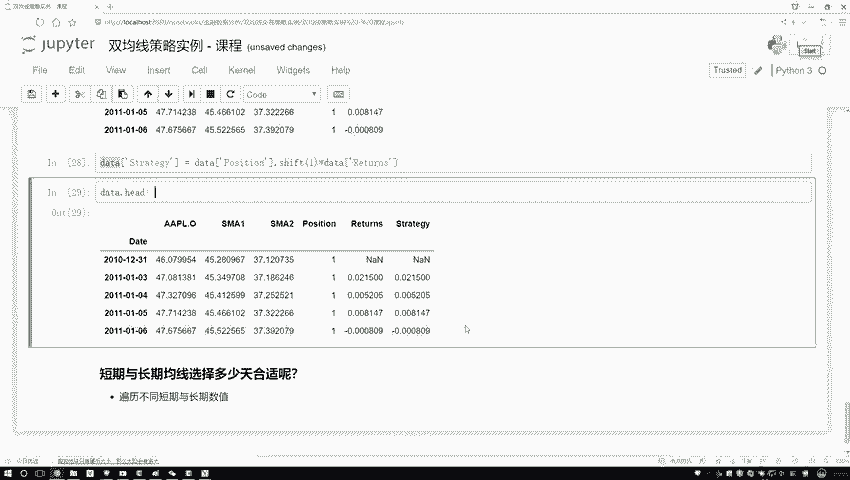

---

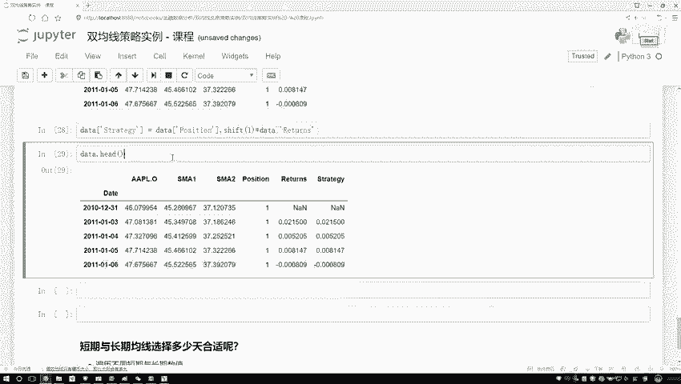

为了比较长期收益，我们需要将每日的收益率累加起来，并还原为最终的总资产价值。这个过程分为两步：
1.  对收益率序列求和，得到累计对数收益率。
2.  使用指数函数将对数收益率还原为最终的价值倍数（假设初始投资为1元）。

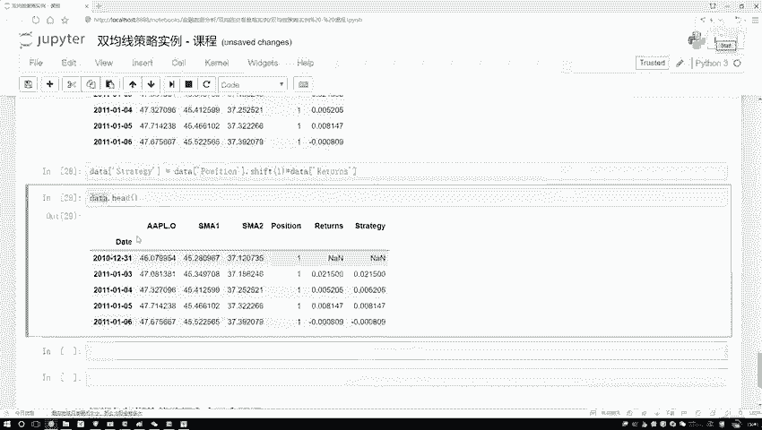

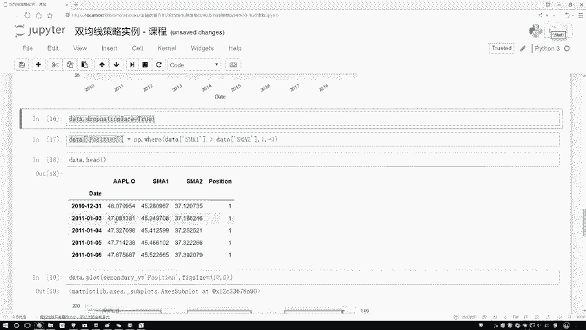

以下是计算最终收益的步骤：

首先，处理可能存在的缺失值（例如第一天的收益率），然后进行累加和还原。

```python
# 删除含有缺失值的行
data.dropna(inplace=True)

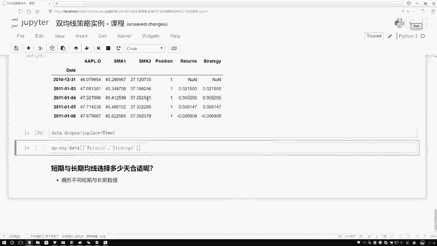

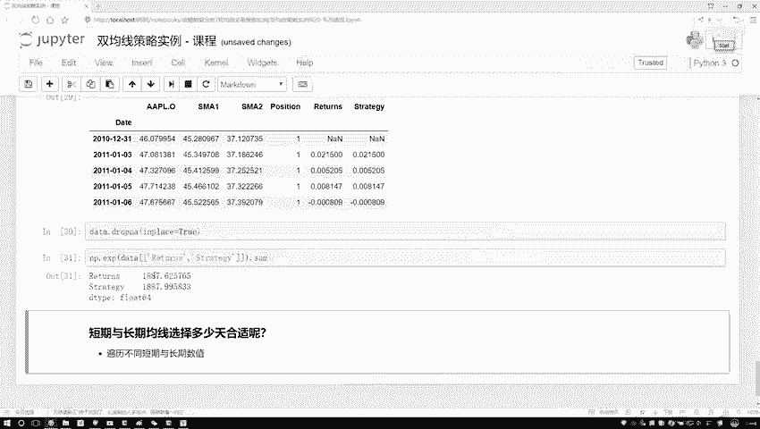

# 计算累计对数收益率并还原为最终价值
final_return = np.exp(data['return'].sum())
final_strategy_return = np.exp(data['strategy_return'].sum())

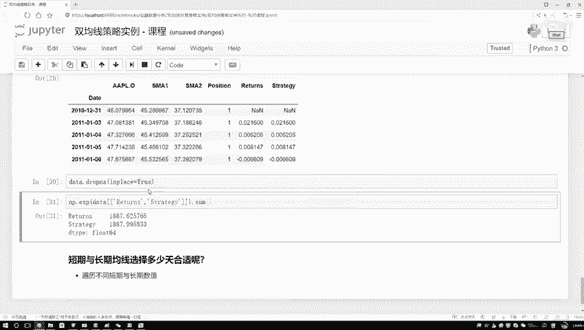

print(f"原始持有最终价值: {final_return:.2f}")
print(f"策略执行最终价值: {final_strategy_return:.2f}")
```

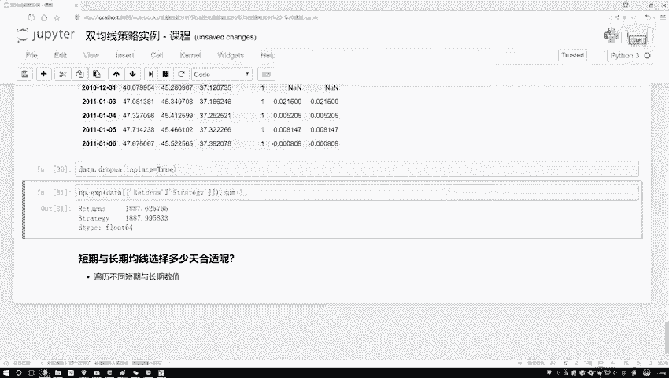

通过比较`final_return`和`final_strategy_return`，我们可以直观地看到策略是否带来了超额收益。例如，如果原始持有使1元变成了4元，而策略使其变成了5.8元，则说明该策略在回测期间是有效的。

---

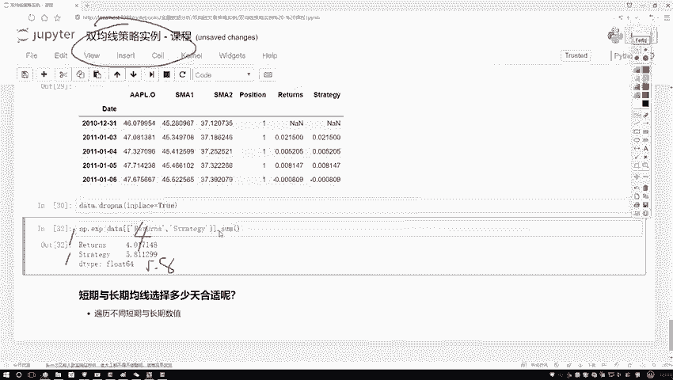

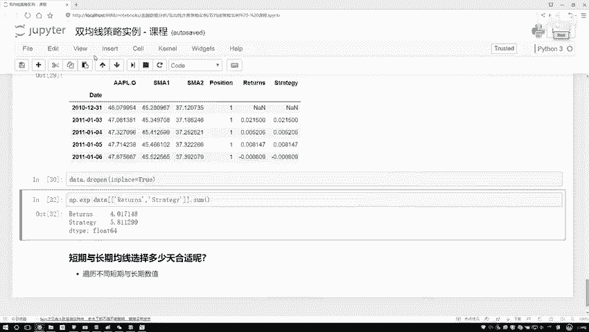

本节课中我们一起学习了量化策略收益分析的核心流程。我们首先计算了资产的对数日收益率，然后利用预先定义的交易信号（`position`）生成了策略日收益率序列。最后，通过累加和对数还原，我们得到了策略与基准（买入持有）的最终收益，从而完成了对策略效果的基本评估。这个过程是量化交易回测中评估策略性能的基础。