# Python金融分析与量化交易实战：P14：14.13.2-年化指标分析 📈

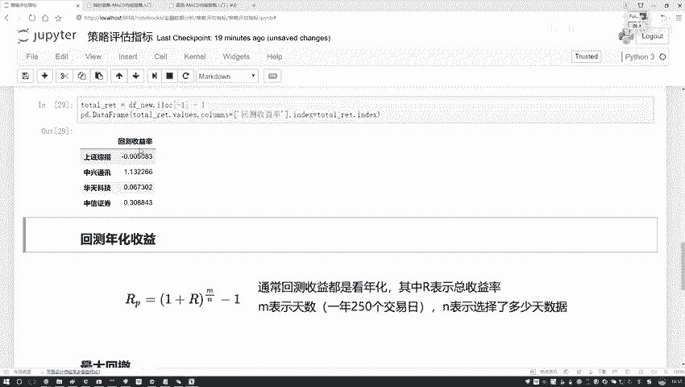

在本节课中，我们将要学习如何计算和解读量化策略中的年化收益率。这是评估策略长期表现的关键指标之一。

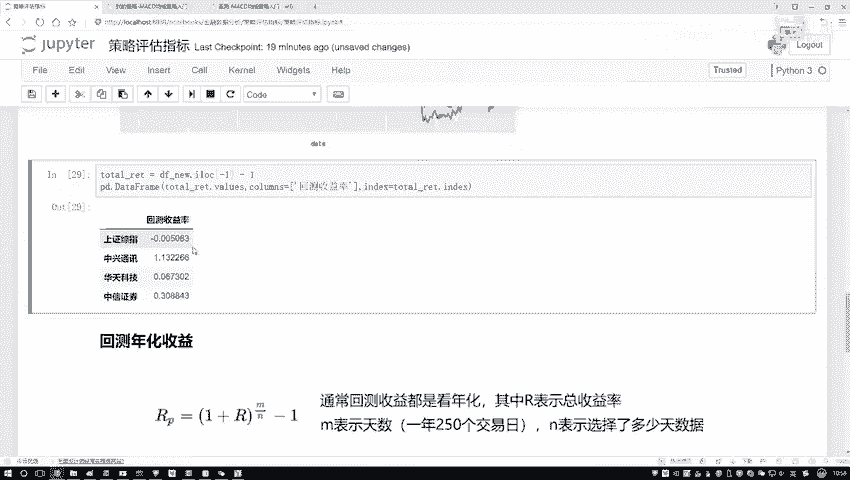

上一节我们介绍了回测收益率，它衡量了策略在整个回测周期内的总盈亏情况。本节中我们来看看如何将总收益率转化为更标准化的年化收益率。

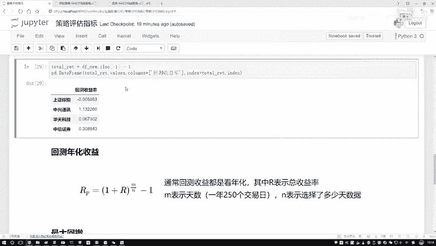

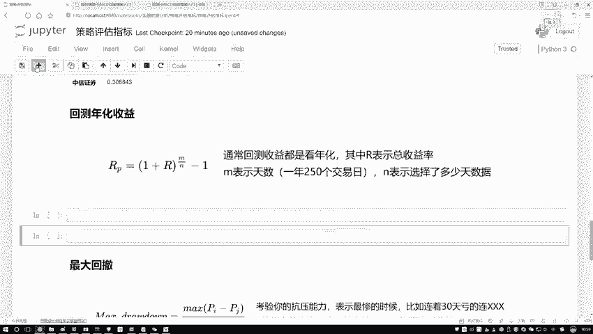

## 理解年化收益率

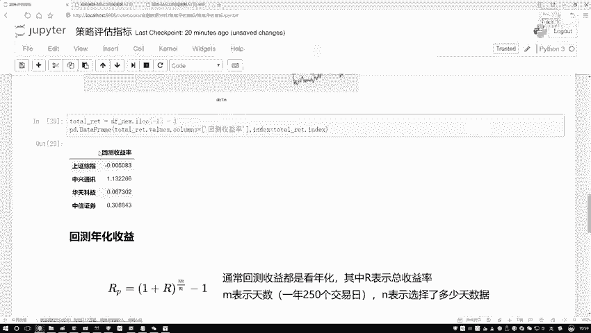

回测收益率反映了策略在整个测试期间的总收益。然而，如果测试周期长短不一，直接比较不同策略的总收益是不公平的。年化收益率将总收益折算为每年的平均收益率，便于进行横向比较。

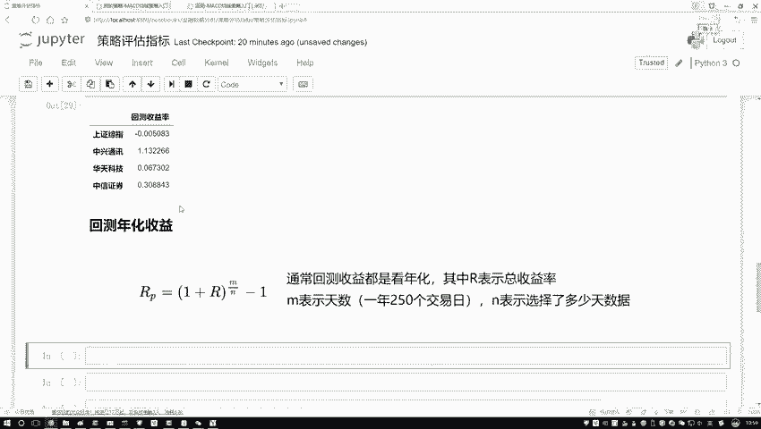

例如，一个策略运行了10年，总收益率为150%；另一个策略运行了2年，总收益率为50%。仅看总收益率，前者似乎更好。但通过年化收益率计算，我们能更客观地评估哪个策略每年的盈利能力更强。

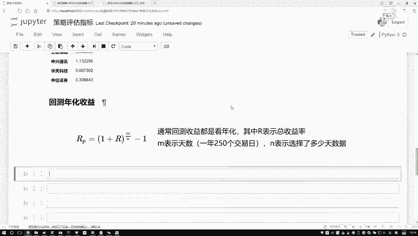

## 年化收益率计算公式

年化收益率的计算基于复利思想。其核心公式如下：

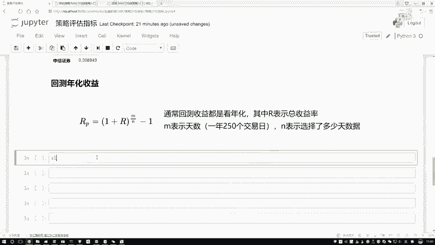

**年化收益率 = (1 + 总收益率)^(年交易日数 / 总交易日数) - 1**

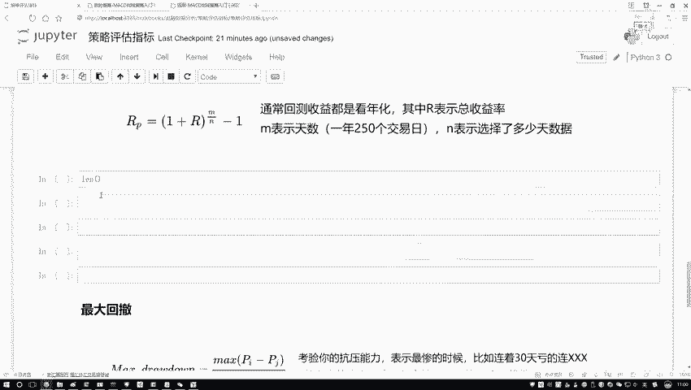

其中：
*   **总收益率 (R)**：即上一节计算的回测收益率。
*   **年交易日数 (M)**：通常取250或252天，代表一年的平均交易日数量。
*   **总交易日数 (N)**：回测数据的总天数。

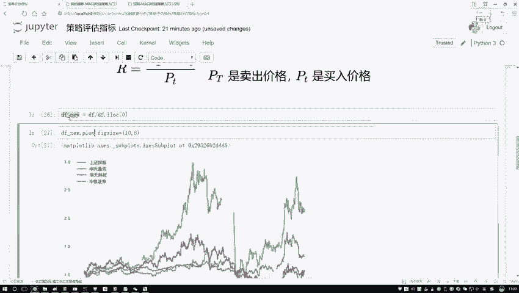

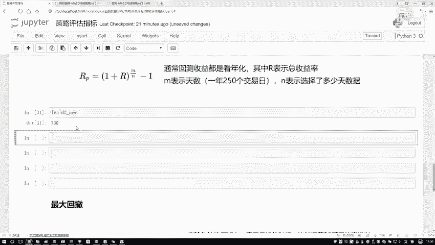

以下是使用Python代码实现该公式的示例：

```python
# 假设 total_return 是计算好的总收益率序列
# 假设 total_days 是回测数据的总天数（例如730天）
annual_trading_days = 250  # 设定一年有250个交易日

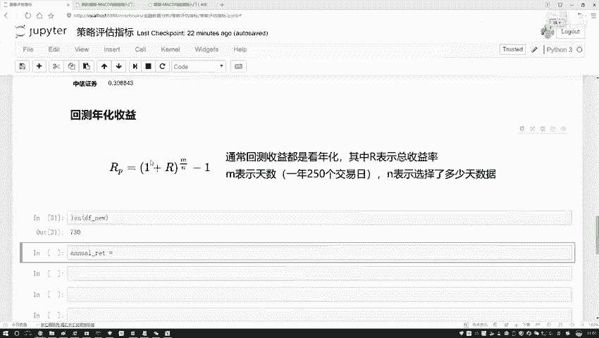

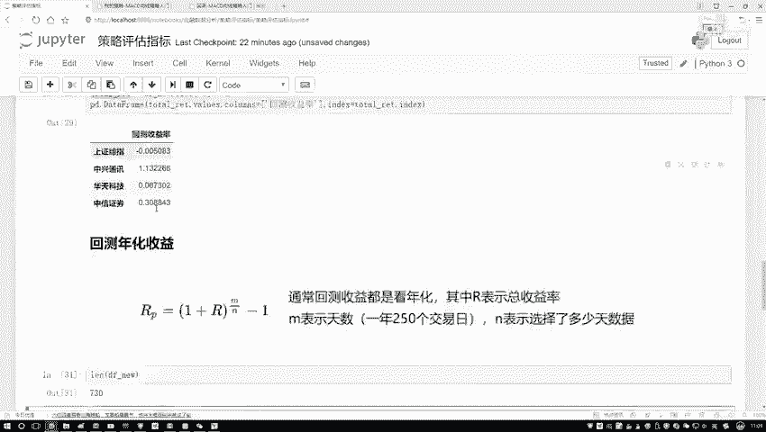

# 计算年化收益率
annualized_return = (1 + total_return) ** (annual_trading_days / total_days) - 1
```

## 计算过程演示

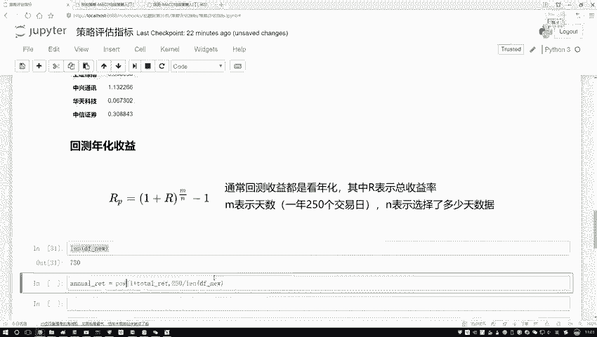

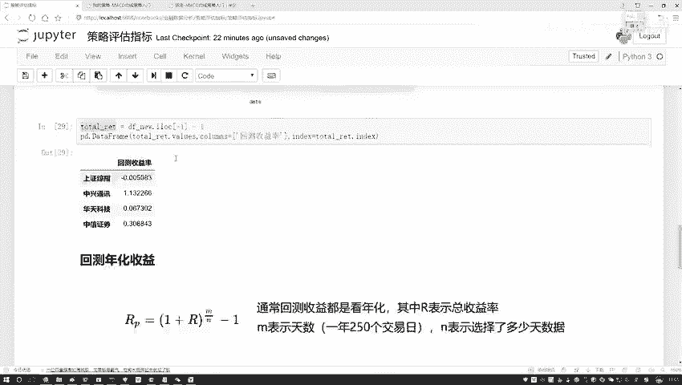

以下结合具体数据演示计算步骤：

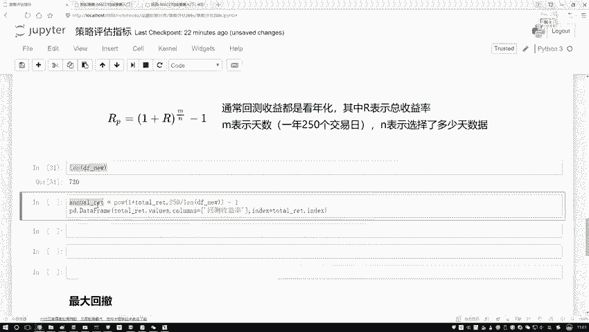

1.  **获取数据**：首先，我们拥有一个包含730个交易日样本的数据集。
2.  **已知总收益率**：假设我们已经计算出某只股票在整个回测期间的总收益率（R）。
3.  **应用公式**：将总收益率（R）、年交易日数（M=250）和总交易日数（N=730）代入上述公式进行计算。

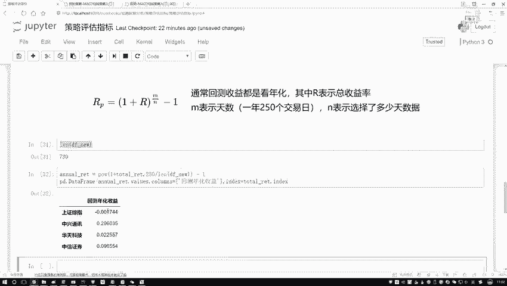

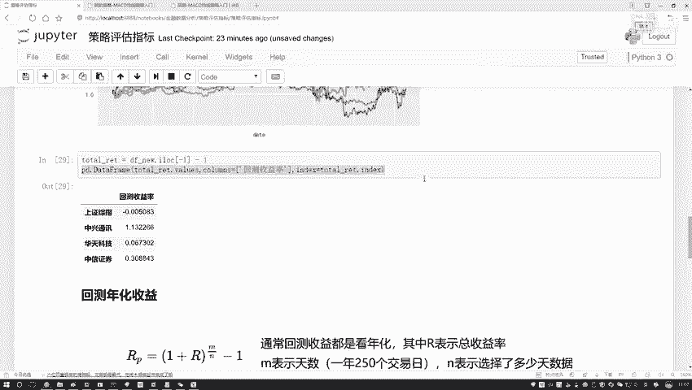

执行计算后，我们会得到一个新的指标——年化收益率。与总收益率相比，这个数值可能略有不同，但它提供了一个以“年”为单位的标准化收益视角，使得不同时间长度的策略之间可以公平比较。

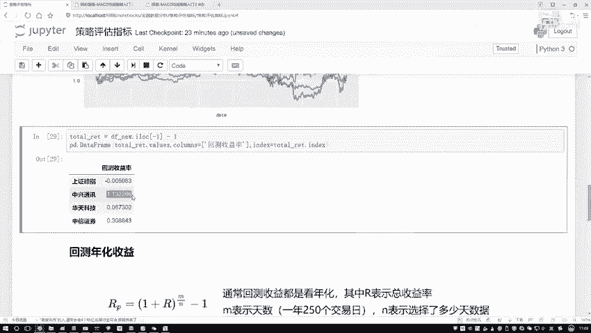

## 核心指标对比

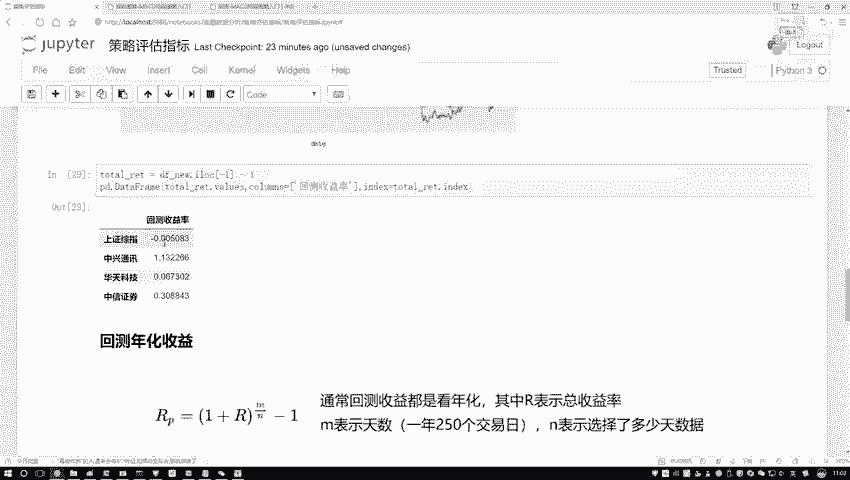

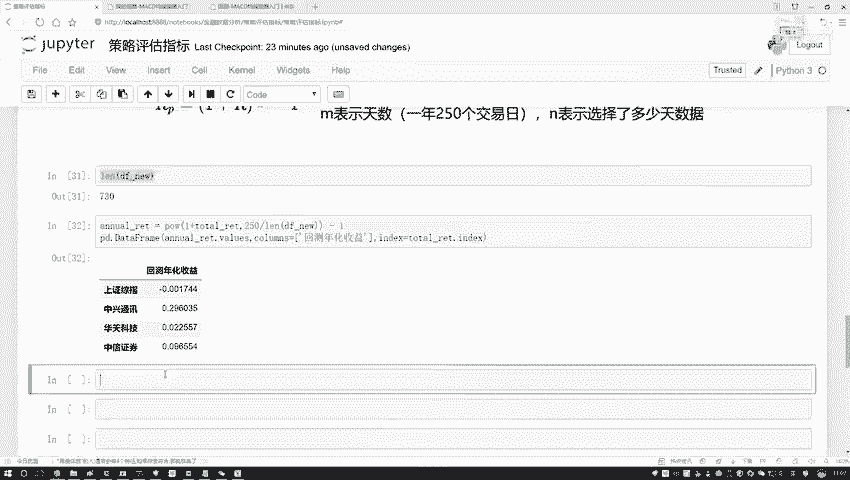

在量化策略分析中，我们主要关注两类收益指标：

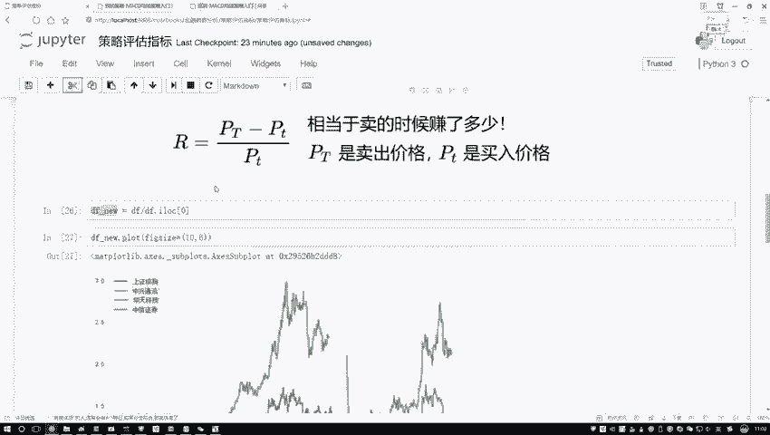

以下是两个核心收益指标：
*   **回测收益率**：策略在整个测试周期内的总盈亏比率。它直接回答了“这个策略最终让我赚了或赔了多少”的问题。
*   **年化收益率**：将总收益率折算成年均收益率。它回答了“这个策略平均每年能带来多少回报”的问题，是衡量策略盈利能力效率的关键指标。

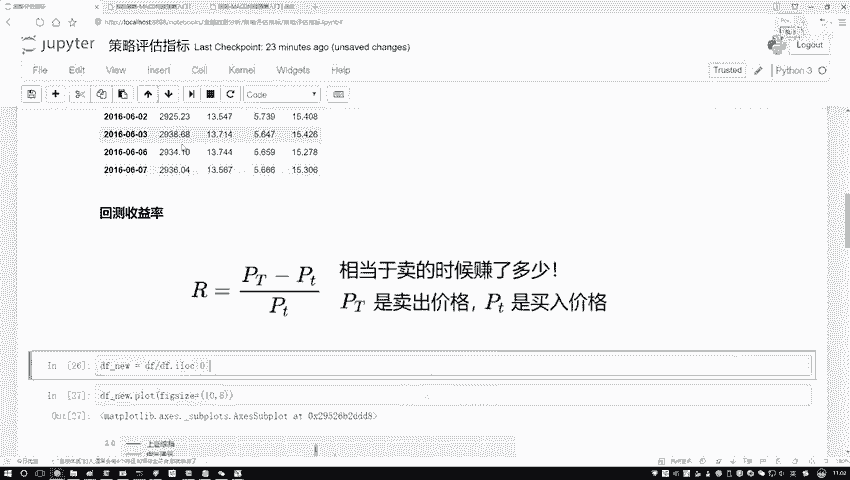

本节课中我们一起学习了年化收益率的概念、计算公式及其在Python中的实现。理解并计算年化收益率对于客观评估量化策略的长期表现至关重要，它是将不同周期策略放在同一标准下比较的桥梁。