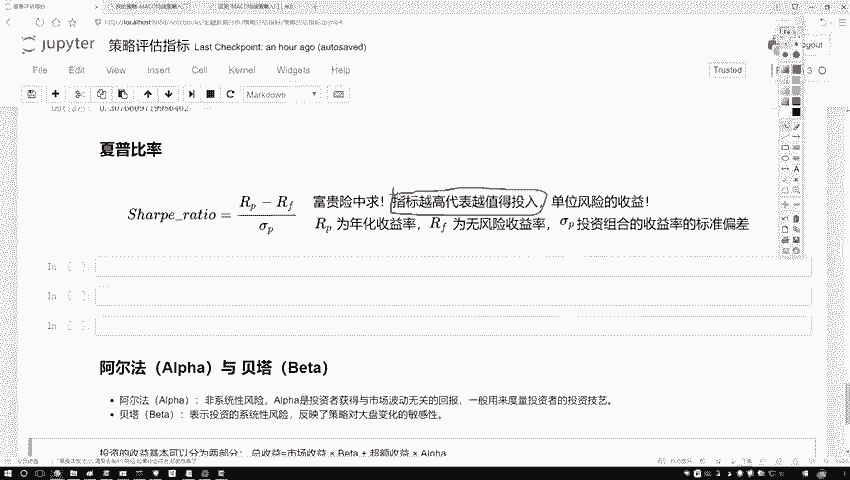
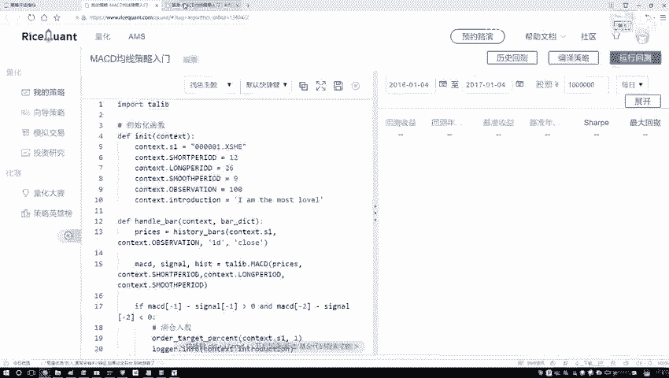
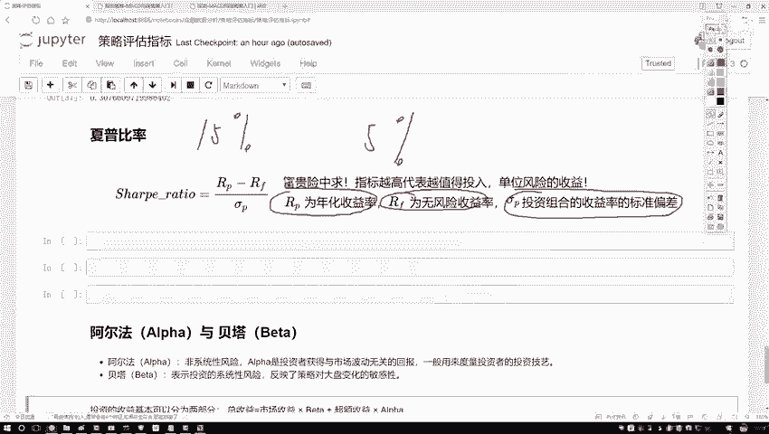
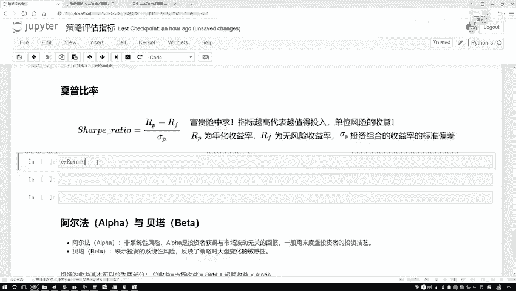
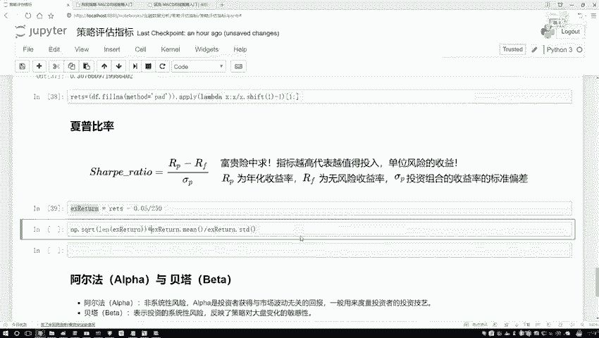
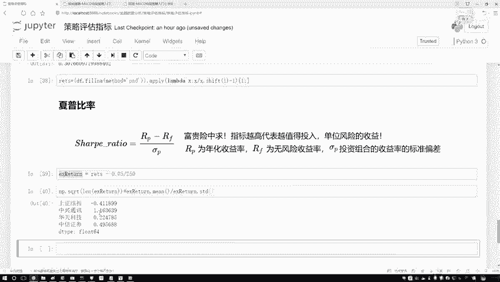
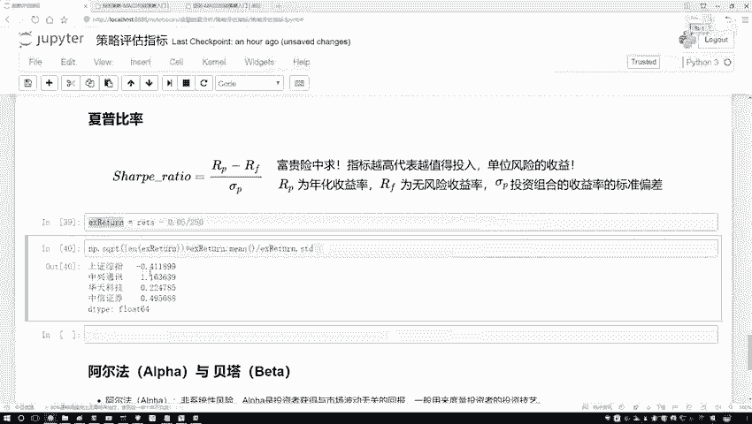
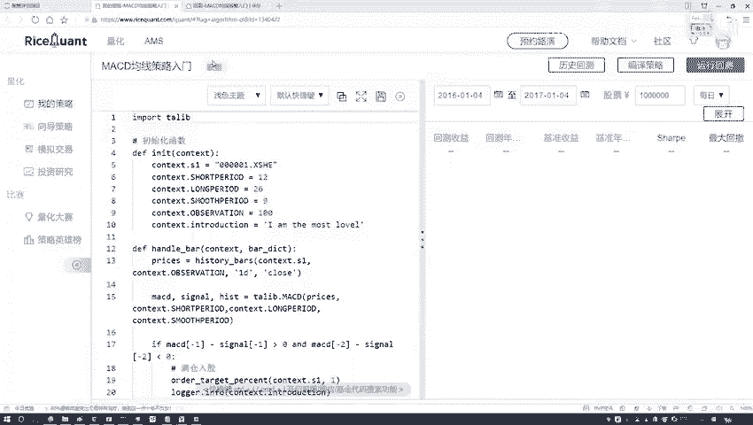
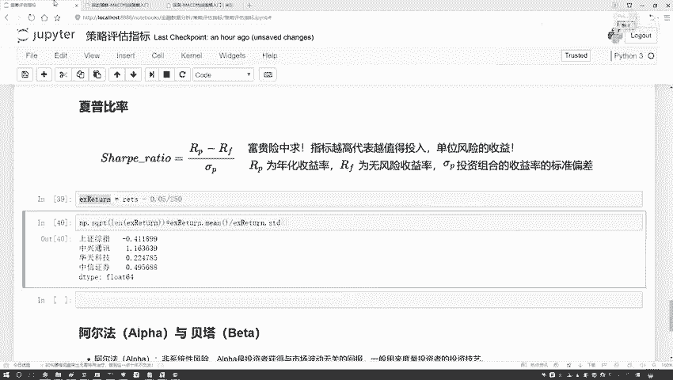

# Python金融分析与量化交易实战：P16：16.15.4-夏普比率的作用 📈

在本节课中，我们将要学习一个在金融投资中至关重要的风险调整后收益指标——夏普比率。我们将了解它的定义、计算方法以及它在实际投资决策中的应用。

## 夏普比率的定义与意义

上一节我们介绍了投资回报率，本节中我们来看看如何衡量风险与收益的关系。

夏普比率描述的是，在承担单位风险的情况下，所能获得的超额收益是多少。指标越高，意味着对于每单位风险，投资者获得的补偿（收益）越高，投资组合的表现也就越优秀。





我们可以用一个生活中的例子来理解：一份在战乱地区日薪数万的工作，其高薪对应的是极高的生命风险。夏普比率就是用来量化这种“风险与回报是否匹配”的指标。在选股或选择投资组合时，在其他条件相似的情况下，我们倾向于选择夏普比率更高的选项。

## 夏普比率的计算公式

理解了夏普比率的意义后，我们来看看如何具体计算它。

其核心思想是比较投资组合的收益与无风险收益的差异，并将这个差异与投资组合自身的波动性（风险）进行比较。公式如下：

**夏普比率 = (投资组合收益率 - 无风险收益率) / 投资组合收益率的标准差**

*   **投资组合收益率**：你的投资（如股票组合）在一段时间内的平均回报。
*   **无风险收益率**：通常指国债等几乎无风险资产的收益率，是投资的机会成本。
*   **投资组合收益率的标准差**：衡量投资组合收益的波动性，波动越大代表风险越高。

## 使用Python计算夏普比率

接下来，我们将在Python环境中，基于实际的股票回报率数据来计算夏普比率。



首先，我们需要准备好数据。假设我们已经有了一个包含多只股票每日回报率的DataFrame `returns`，并且已经处理了其中的缺失值（例如用前一天的收益填充）。

```python
import numpy as np
import pandas as pd



# 假设 returns 是一个DataFrame，列是各股票名称，行是日期对应的日收益率
# 例如：returns = pd.DataFrame(...)

# 设置年化无风险收益率，例如5%
risk_free_rate = 0.05
# 计算年化交易日数，通常取250天
trading_days_per_year = 250

# 计算超额收益（日度）
excess_returns = returns - risk_free_rate / trading_days_per_year

# 计算夏普比率（年化）
# 1. 计算超额收益的均值（日度）并年化
annualized_excess_return = excess_returns.mean() * trading_days_per_year
# 2. 计算收益的标准差（日度）并年化
annualized_volatility = returns.std() * np.sqrt(trading_days_per_year)
# 3. 计算夏普比率
sharpe_ratio = annualized_excess_return / annualized_volatility

print(sharpe_ratio)
```





以下是计算步骤的分解说明：
1.  **计算日度超额收益**：从每日回报中减去日化的无风险收益率。
2.  **年化超额收益**：将日度超额收益的均值乘以年交易天数。
3.  **年化波动率**：将日收益率的标准差乘以年交易天数的平方根。这是将日波动率转化为年化波动率的标准方法。
4.  **计算比率**：将年化超额收益除以年化波动率，得到最终的夏普比率。

运行代码后，我们将得到一个Series，其中包含了每只股票的夏普比率。数值最大的股票，意味着在历史数据中，其单位风险带来的超额收益最高。





## 总结



本节课中我们一起学习了夏普比率。我们首先了解了它是一个衡量**投资组合“风险调整后收益”**的核心指标，数值越高代表投资效率越好。接着，我们掌握了它的**计算公式**，理解了分子代表超额收益，分母代表风险。最后，我们使用Python，基于处理好的股票收益率数据，一步步计算出了各股票的夏普比率，并知道如何根据其结果进行初步的优劣判断。记住，夏普比率是量化投资中筛选和评估策略的重要工具之一。