# Python金融分析与量化交易实战：P17：阿尔法与贝塔概述

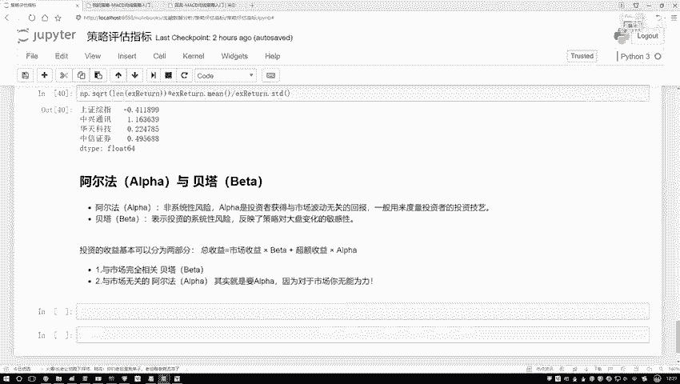

在本节课中，我们将要学习量化投资中的两个核心概念：阿尔法（α）和贝塔（β）。理解这两个指标对于评估投资策略的收益来源至关重要。

## 收益的两种来源

上一节我们介绍了多种策略评估指标，本节中我们来看看收益的构成。投资所获得的收益可以分解为两个部分。

一部分收益与整体市场环境相关。当市场整体向好时，大部分投资都能获得收益，这部分收益可以看作是“随大流”获得的。

另一部分收益则与市场整体波动无关，它源于投资者独特的策略、深入的研究或敏锐的洞察力。例如，通过分析公司财务数据、运营状况等信息，做出优于市场平均水平的投资决策所带来的收益。

阿尔法和贝塔就是分别用来衡量这两部分收益的指标。

## 阿尔法（α）与贝塔（β）的定义

以下是阿尔法与贝塔的核心定义：

*   **贝塔（β）**：衡量投资组合收益相对于市场基准收益的敏感性。它反映了策略受市场波动影响的程度，即“系统性风险”。**公式**可以表示为投资组合收益与市场收益之间的线性回归系数：
    `投资组合收益 = α + β * 市场收益 + 误差项`
    其中，β值越大，说明策略收益对市场变化的反应越剧烈。

*   **阿尔法（α）**：衡量投资组合超越市场基准的超额收益。它代表了与市场波动无关的收益部分，通常用来评估策略本身或投资经理的主动管理能力，即“非系统性风险”带来的回报。在上述公式中，α即为回归方程的截距，代表市场收益为零时，策略所能获得的收益。

## 如何理解市场收益与超额收益

我们可以通过一个收益对比图来直观理解：

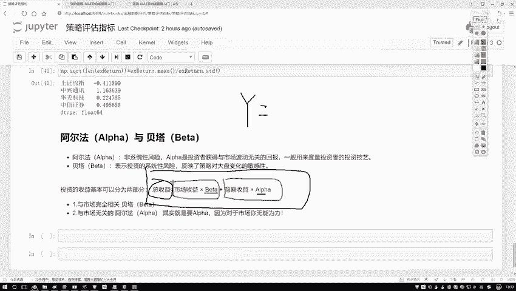

*   **市场收益（基准收益）**：例如沪深300指数的收益，代表大盘的整体走势。
*   **策略收益**：你的投资策略实际获得的收益。
*   **超额收益**：策略收益减去市场收益后的部分。这部分收益完全归功于你的策略的有效性。

因此，总收益可以看作由市场收益（受β影响）和超额收益（由α代表）两部分组成。

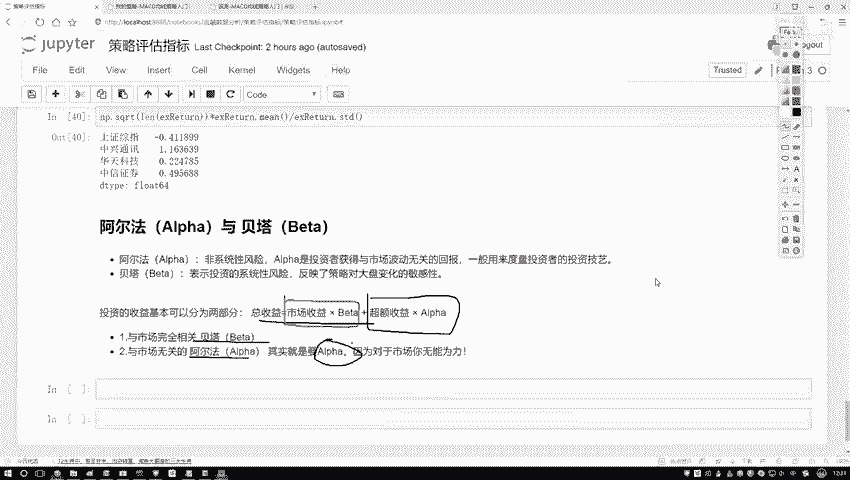

## 我们的核心目标

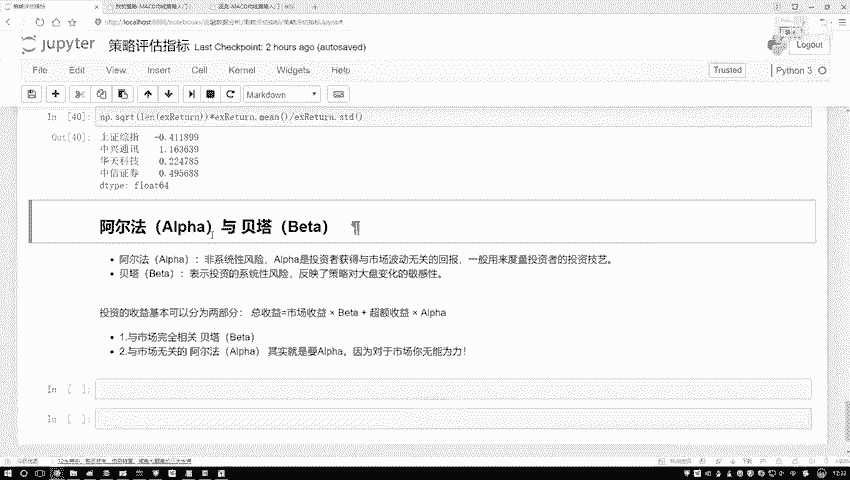

市场走势是个人投资者无法控制的。因此，量化策略的核心目标不是预测市场（获取β），而是通过构建有效的模型和策略，持续地获取**超额收益**，即追求正的、稳定的**阿尔法（α）**。

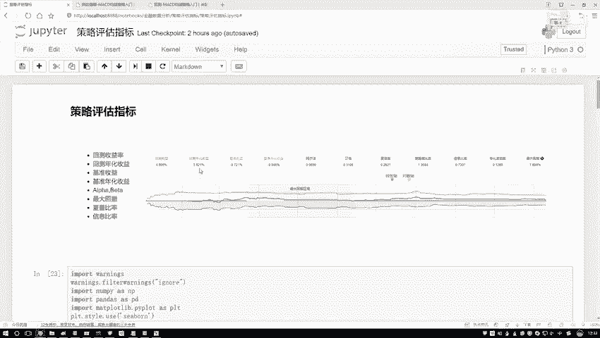

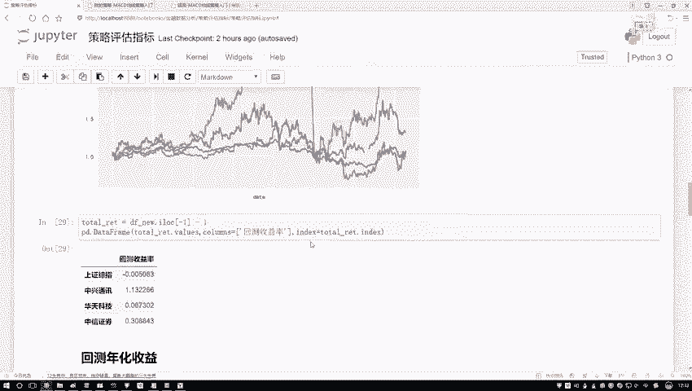

## 关于指标公式的说明

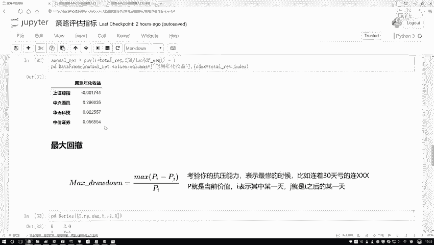

在策略评估中，我们会遇到许多指标（如夏普比率、最大回撤等）。

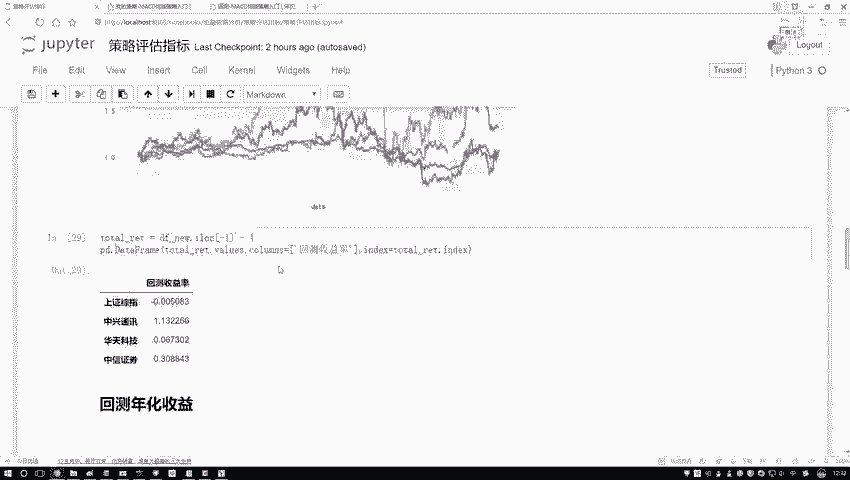

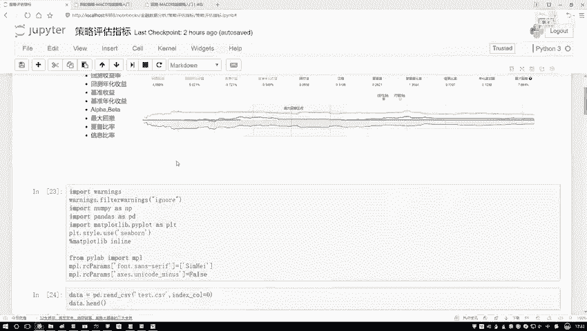

以下是学习建议：

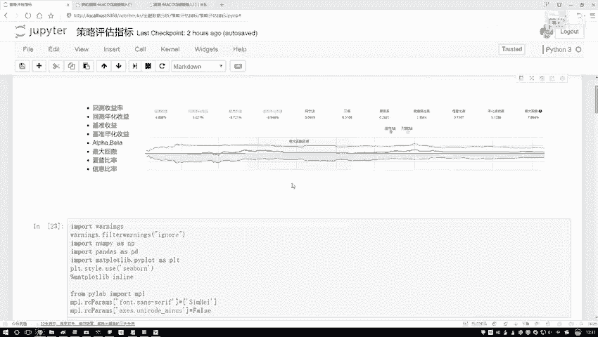

*   理解指标的含义和用途比死记硬背公式更重要。
*   在实际应用中，通常借助成熟的Python工具包（如`empyrical`, `quantstats`）或量化平台进行计算，无需手动实现。
*   例如，基准收益（即市场收益）是评估的起点，我们的目标就是战胜这个基准。

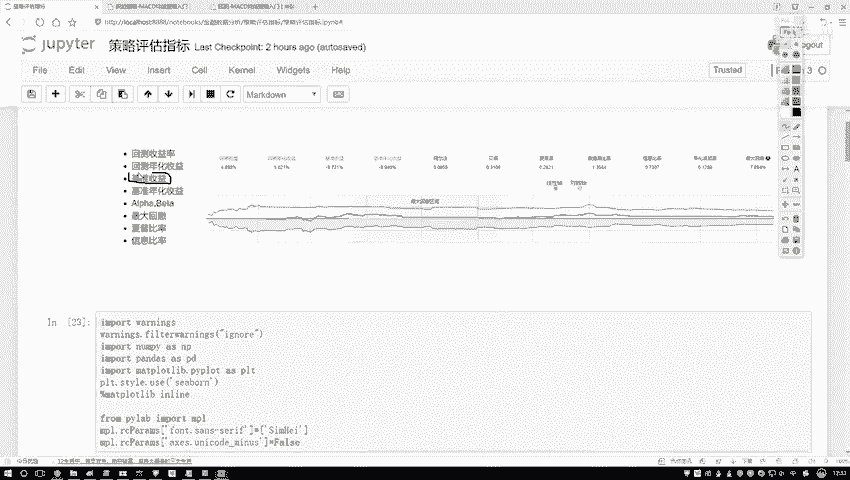

---

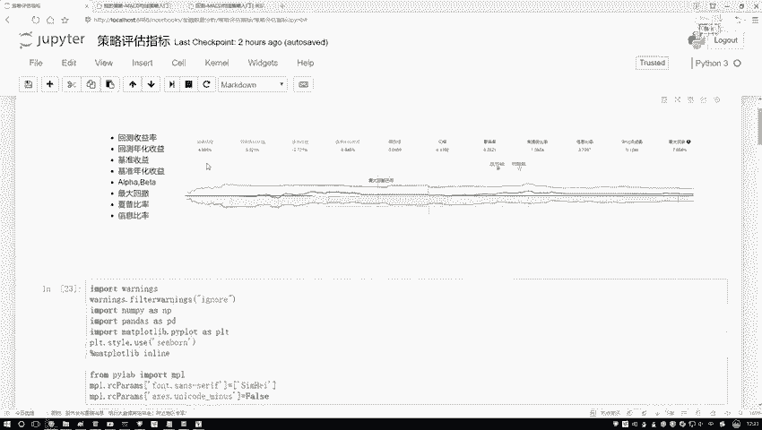

本节课中我们一起学习了阿尔法（α）和贝塔（β）的概念。贝塔衡量了收益中与市场共舞的部分，而阿尔法则代表了通过自身努力和策略战胜市场所获得的超额收益。在量化交易中，持续寻找并获取阿尔法是我们的首要目标。后续在因子策略分析等章节中，我们将深入探讨如何具体分析和优化这些指标。