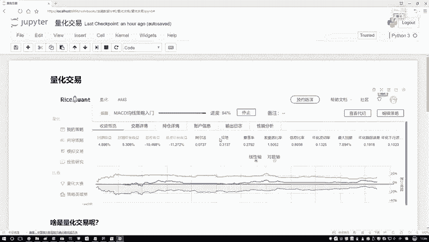
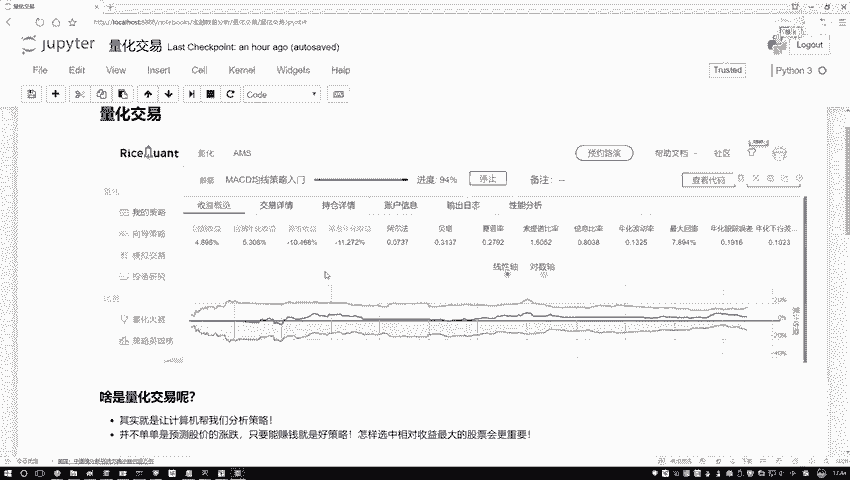
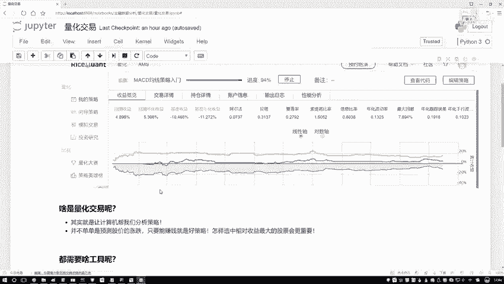
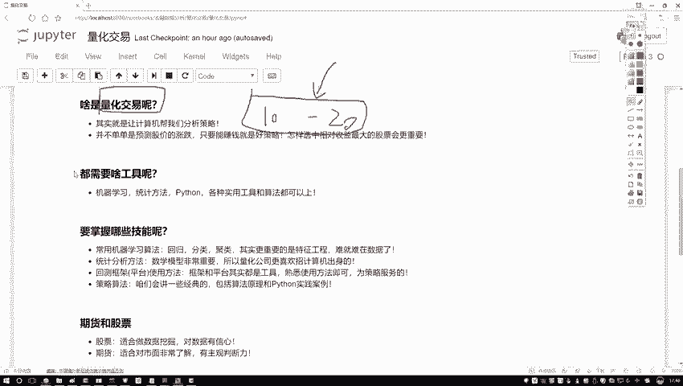
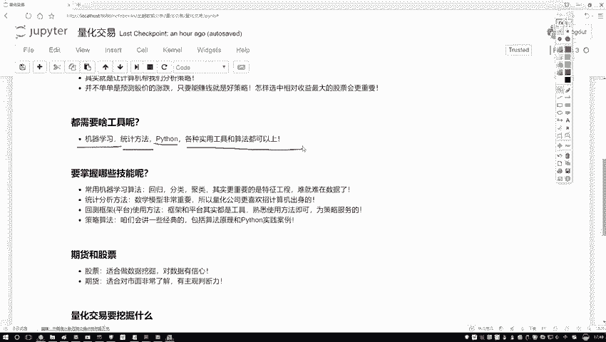

# Python金融分析与量化交易实战：P18：量化交易概述



## 概述
在本节课中，我们将学习量化交易的基本概念及其核心构成。我们将探讨量化交易与传统交易的区别，并了解实现量化交易所需要掌握的关键技能。





## 什么是量化交易？

上一节我们介绍了课程主题，本节中我们来看看量化交易的本质。

传统交易，例如个人炒股，依赖于交易者长时间盯盘和主观判断。这种方法存在局限性：人的主观性可能导致判断失误，且个人精力有限，难以分析大量股票或跨越长时间段的历史数据。

量化交易的核心目标同样是追求收益，但方法不同。它并非依赖人类的主观决策，而是将交易策略的设计与执行交给计算机。其本质是：**基于历史数据，通过计算机算法设计并验证交易策略，以追求收益最大化**。

这个过程通常被称为**回测**。即利用过去已定型的历史数据，测试不同策略在历史上的表现，通过多项指标评估策略的优劣。量化交易就是让计算机在历史数据中进行数据挖掘，寻找能带来盈利的有效策略。

简而言之，量化交易是数据驱动、算法驱动的交易方式。它利用大数据和人工智能算法，旨在克服人类主观性的局限，实现更理性、更高效的决策。

## 量化交易的核心技能

了解了量化交易的定义后，我们来看看实现它需要哪些核心技能。量化交易是一个交叉学科领域，需要综合运用多种知识。

以下是实现量化交易需要关注的核心技能点：



*   **机器学习算法**：用于分析数据、预测市场走势或识别交易信号。例如，可以使用回归模型预测股价，或使用分类模型判断买卖时机。
    ```python
    # 示例：使用简单的线性回归预测股价
    from sklearn.linear_model import LinearRegression
    model = LinearRegression()
    model.fit(historical_features, historical_prices)
    predicted_price = model.predict(current_features)
    ```

*   **统计方法**：用于计算和分析各种市场指标（如移动平均线、波动率），评估策略的风险与收益。例如，计算夏普比率（Sharpe Ratio）来评估风险调整后的收益。
    ```
    夏普比率公式 = (投资组合预期收益率 - 无风险利率) / 投资组合收益率的标准差
    ```

*   **编程能力（如Python）**：这是将策略想法付诸实践的必要工具。用于获取数据、清洗数据、实现策略逻辑、执行回测和自动化交易。

在量化交易实践中，对金融学原理的了解是有益的，但重点应放在**如何处理数据、从数据中挖掘信息并转化为有效策略**上。你可以将量化交易视为数据挖掘在金融领域的一个热门应用。只要能提升策略效果，任何合适的工具和方法都可以使用。



## 总结
本节课中我们一起学习了量化交易的基础知识。我们明确了量化交易是利用计算机算法对历史数据进行回测以制定交易策略的数据驱动方法。同时，我们了解了实现量化交易需要重点关注机器学习、统计学和编程（特别是Python）等核心技能，其本质是数据挖掘在金融领域的应用。