# Python金融分析与量化交易实战：P19：量化交易所需技能分析

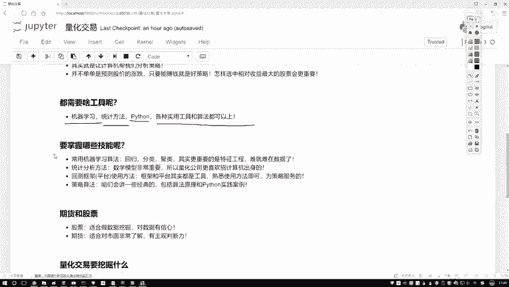

在本节中，我们将分析从事量化交易所需要掌握的核心技能。量化交易是一个综合领域，它融合了数据科学、金融学和计算机科学的知识。

## 核心技能概览

以下是量化交易从业者需要具备的主要技能。

### 1. 机器学习与特征工程

上一节我们介绍了量化交易的基本概念，本节中我们来看看其核心技能。机器学习算法是基础，主要包括回归、分类和聚类等常规方法。

更重要的是**特征工程**。在数据挖掘中，数据质量决定了模型性能的上限，而算法只是用来逼近这个上限的工具。特征工程的核心在于如何处理数据，并从海量数据中提取最有价值的信息。

金融数据极为庞大和复杂。例如分析股票，不仅涉及收盘价、开盘价，还包括对应公司的财务数据、各种指标数据等。我们需要整合市场数据、公司数据、财务报表和股市走势等多层面信息。如何设计算法并有效融合这些数据，是特征工程的关键，也是量化交易中最具挑战性的部分。

### 2. 统计学与数学知识

量化交易岗位通常要求数学、统计学、计算机或金融专业背景。这是因为无论是算法还是交易策略，本质上都是将数学公式应用于数据的过程。

数学是量化交易的基石。需要掌握的数学知识点很多，包括概率论、统计学、线性代数、微积分等，这些是理解和构建模型的基础。

### 3. 平台与框架的使用

量化交易需要借助特定的平台或框架进行策略回测和实践。课程后续将选择一款平台进行讲解，该平台应具备API简单、可视化清晰的特点。

在Python中，你可以编写策略代码，在平台上进行编译和回测。回测可以模拟在特定历史时期（如2010年至2020年）执行策略，并评估其每日表现及最终收益结果。

平台和框架是工具，关键在于熟练使用，无需死记硬背。

### 4. 策略与算法

量化交易的策略算法种类繁多。最新的算法通常见于学术论文。本课程将重点讲解最常用、最经典的算法。

课程内容包括如何应用机器学习算法，以及如何使用常见的交易策略算法。我们将深入讲解这些算法的原理，并重点演示如何在Python中实现。

**注意**：本课程名为“Python金融分析与量化交易实战”，重点在于如何使用Python工具实现量化交易策略，并将其应用于实际案例，而非教授如何炒股。

## 实践重点：股票 vs. 期货

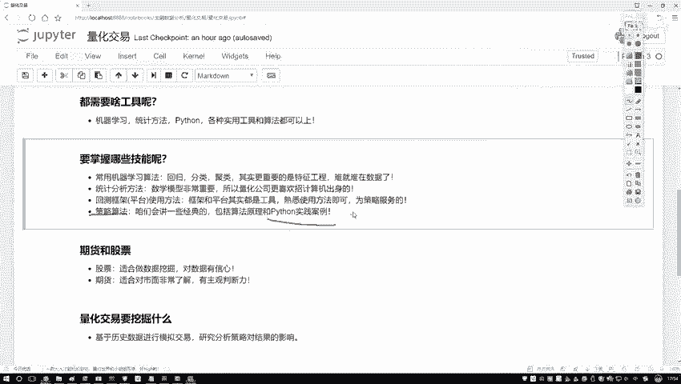

有同学会问，量化交易既能应用于股票也能应用于期货，课程重点是哪一方面？

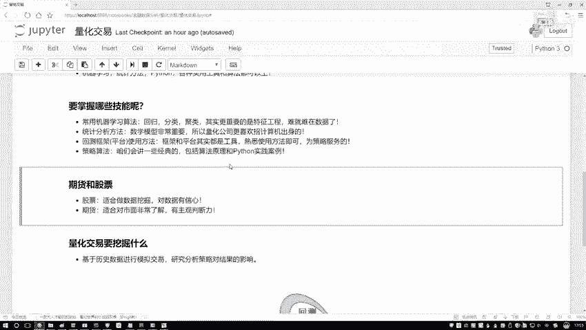

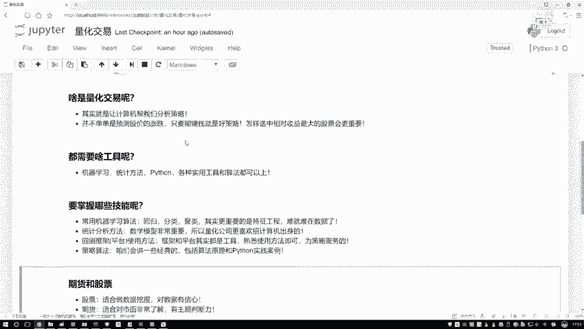

本课程将更侧重于股票相关的量化交易。因为股票拥有丰富的数据指标，非常适合进行数据挖掘。

期货交易则更依赖于对市场的深度了解和主观判断，其成功往往需要行业内的专业经验。因此，期货市场的数据挖掘相对困难，主观因素影响更大。

课程中会以股票为重点，并辅以几个期货小例子。股票市场更适合作为使用Python进行数据挖掘和案例实践的载体。

## 量化交易的本质：数据挖掘

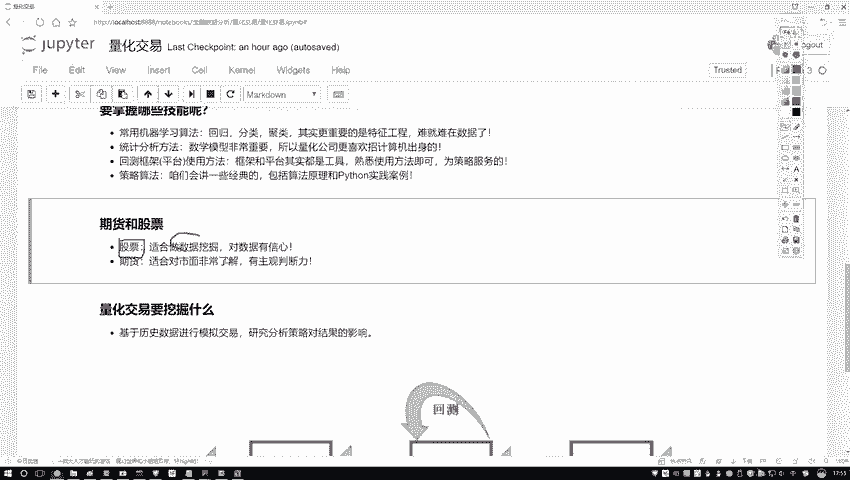

既然提到数据挖掘，我们需要明确其工作流程。数据挖掘的过程可以概括为以下几个步骤：

以下是数据挖掘的基本步骤：
1.  **数据处理**：获取原始数据后，进行清洗、转换和特征提取。
2.  **策略设计**：基于处理后的数据，设计交易逻辑和算法。
3.  **回测验证**：将策略应用于历史数据，测试其表现。公式可以简化为：`策略表现 = 回测(策略， 历史数据)`。
4.  **实际指导**：对回测结果良好的策略，用于指导实际的投资决策。

量化交易本质上就是将数据挖掘算法应用于金融数据。它不仅仅是预测股票涨跌（这是一个分类问题），更是一个优化问题，核心目标是**实现收益最大化**。

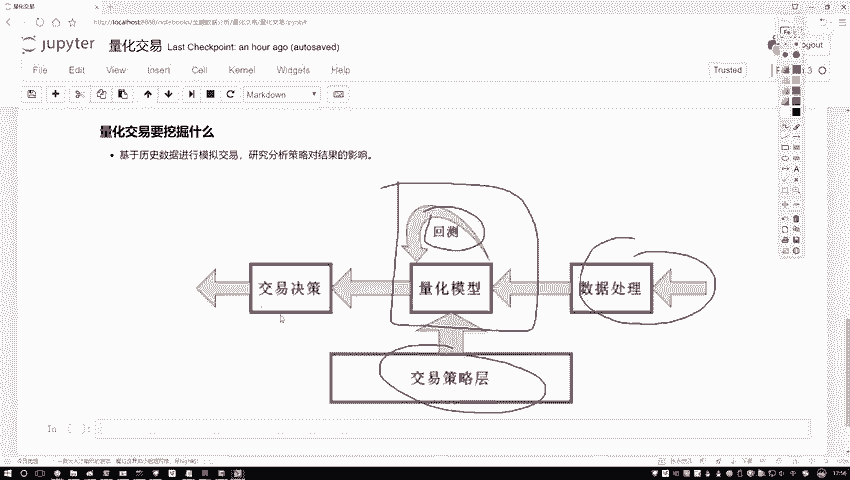

例如，给定一个股票池和固定本金，目标是如何选股、如何配置资金，以实现单位风险下的最高收益。这也是数据挖掘要解决的问题。

## 总结与建议

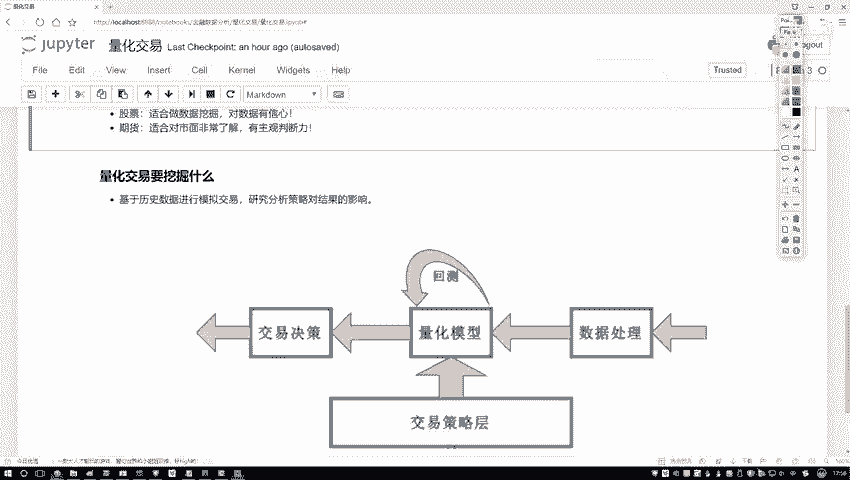

关于量化交易，初学者无需掌握过多背景知识。

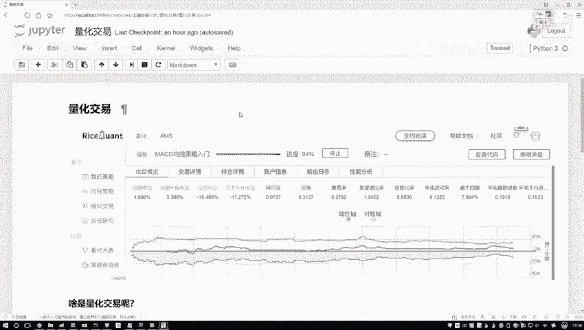

不必阅读长篇大论的理论。

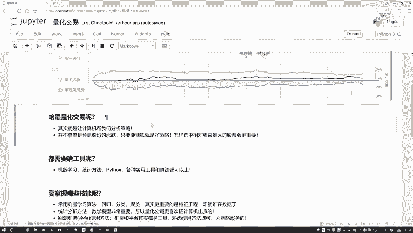

也无需深究其发展历史（国内起步较晚）。关键在于理解量化交易要做什么。

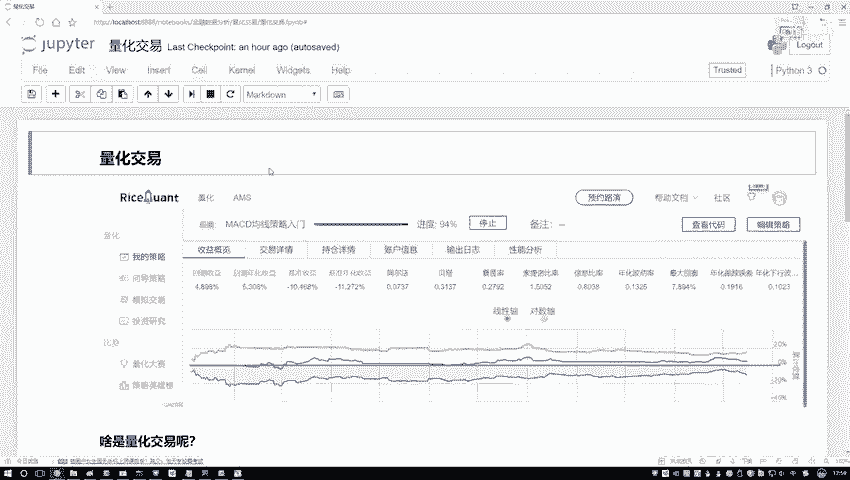

理解数据挖掘的含义。

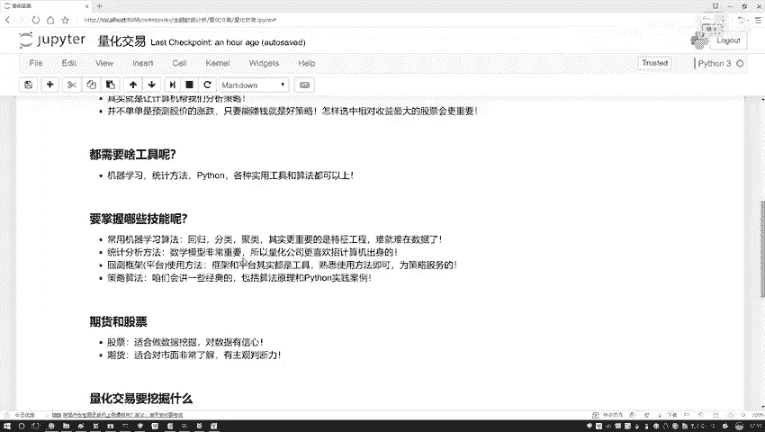

了解所使用的工具（如Python及相关平台）。

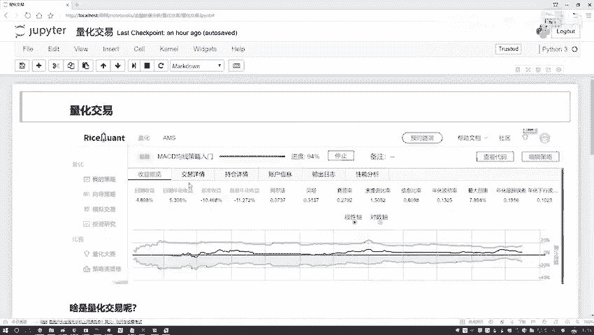

并对课程后续要讲的内容有一个大致了解即可。本节内容是对所需技能的概述。

**本节课总结**：我们一起学习了量化交易所需的核心技能，包括机器学习与特征工程、数学统计知识、平台工具使用以及策略算法。明确了课程将以股票市场为重点，通过Python实践，将量化交易理解为以收益最大化为目标的数据挖掘过程。