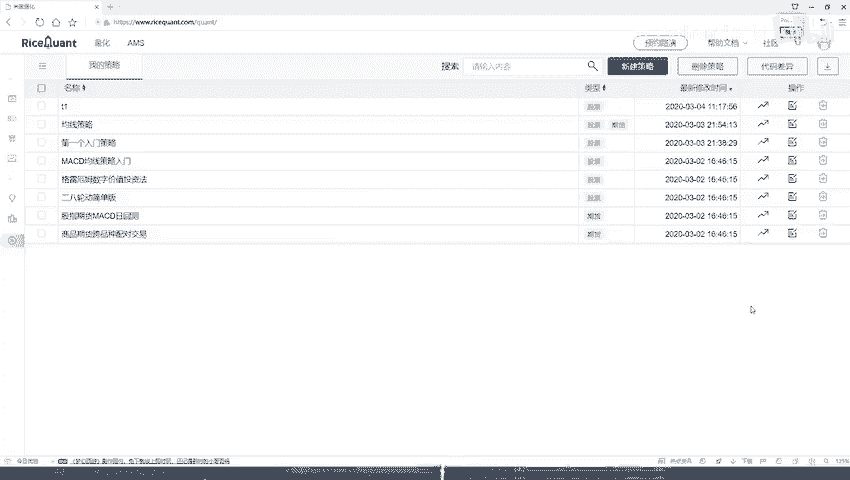
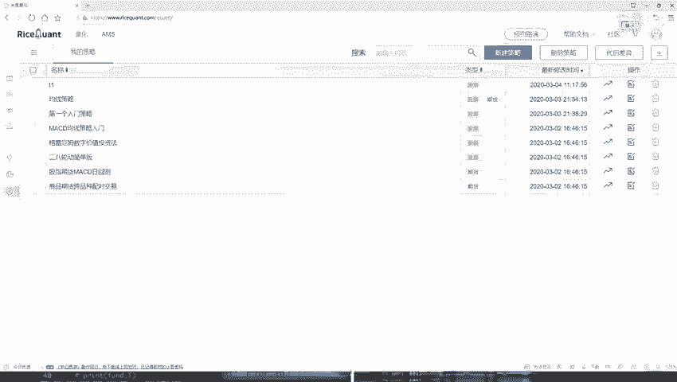
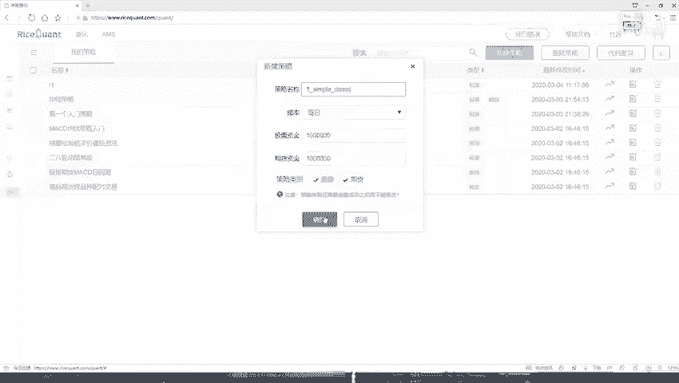
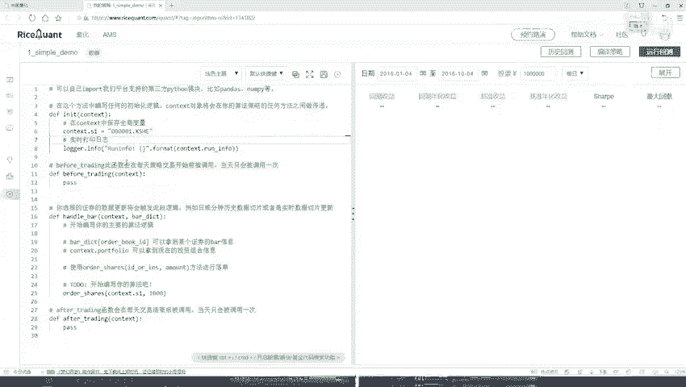
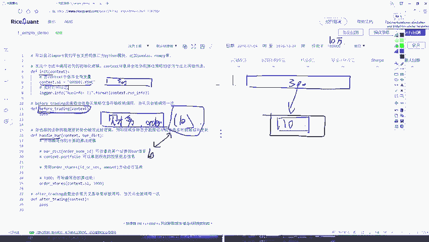
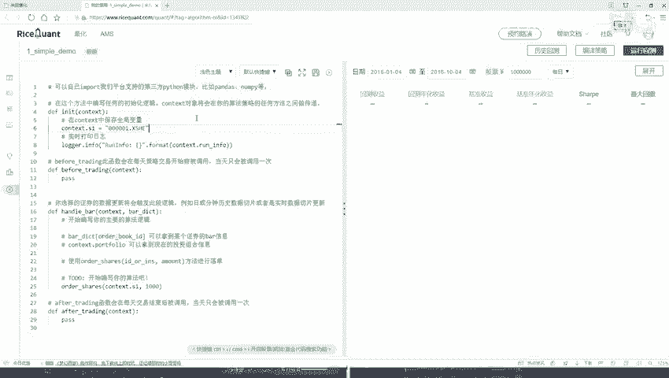

# Python金融分析与量化交易实战：P21：21.20.1-策略任务分析P20 📊

在本节课中，我们将学习如何在一个交易平台上构建一个简单的量化交易策略，并熟悉相关的API接口。我们将通过一个具体案例，演示从策略构思到代码实现的全过程。

## 策略目标概述 🎯

我们将设计一个策略，其核心目标是：始终持有沪深300指数成分股中表现最好的10只股票。具体来说，我们会定期（例如每天）根据某个财务指标（如盈利数据）对沪深300的所有成分股进行排序，选出排名前10的股票。我们的投资组合将始终只包含这10只股票，并根据每日的排序结果进行动态调整。

## 策略实现步骤分解 🔧

上一节我们概述了策略目标，本节中我们来看看具体的实现步骤。整个策略的实现可以分为三个主要部分，分别对应交易平台提供的三个核心函数模块。

### 第一步：初始化模块 (`initialize`)

在初始化函数中，我们需要完成一些一次性的设置工作。

以下是初始化模块需要完成的任务：
*   获取沪深300指数的全部成分股，作为我们的股票池。
*   进行其他必要的全局变量初始化。

### 第二步：盘前处理模块 (`before_trading`)

在每天实际交易开始前，我们需要进行数据准备和计算。这个函数会在每个交易日开盘前被调用。

以下是盘前处理模块需要完成的任务：
*   从股票池（沪深300成分股）中，获取我们关心的财务数据（例如每股收益）。
*   根据该财务数据对300只股票进行排序。
*   选出排名前10的股票代码，并保存下来，供当日的交易逻辑使用。

### 第三步：交易处理模块 (`handle_bar`)

这是策略的核心，负责执行具体的交易逻辑。该函数在交易时间内会被定期调用（例如每分钟或每天）。

以下是交易处理模块需要完成的任务：
*   检查当前投资组合中持有的股票。
*   将当前持有的股票与`before_trading`模块计算出的当日“最优10只股票”列表进行比较。
*   卖出那些不在当日最优列表中的股票。
*   用卖出股票获得的资金，买入那些在最优列表中但当前并未持有的股票。
*   目标是使投资组合最终恰好持有这10只最优股票。

## 总结 📝

本节课中我们一起学习了如何为一个简单的量化交易策略进行任务分析。我们设计了一个“始终持有沪深300中财务表现最佳前10股票”的策略，并将其实现分解为三个清晰的步骤：在`initialize`中初始化股票池，在`before_trading`中每日计算排名，在`handle_bar`中执行调仓交易。这个方法听起来简单，但涵盖了量化策略从数据准备到交易执行的核心流程。