# Python金融分析与量化交易实战：P22：股票池筛选与财务数据预处理

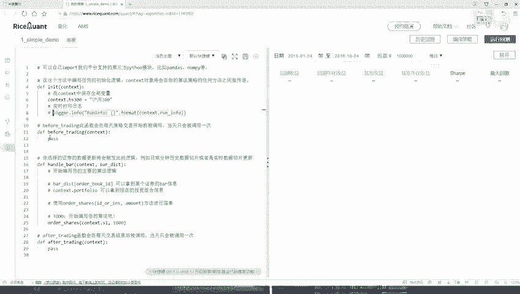

在本节课中，我们将学习如何构建一个股票池，并基于财务指标（如营业收入）对股票进行筛选和排序，为后续的交易策略做准备。

上一节我们介绍了策略的基本框架，本节中我们来看看如何实现一个具体的股票筛选逻辑。

## 初始化策略与股票池

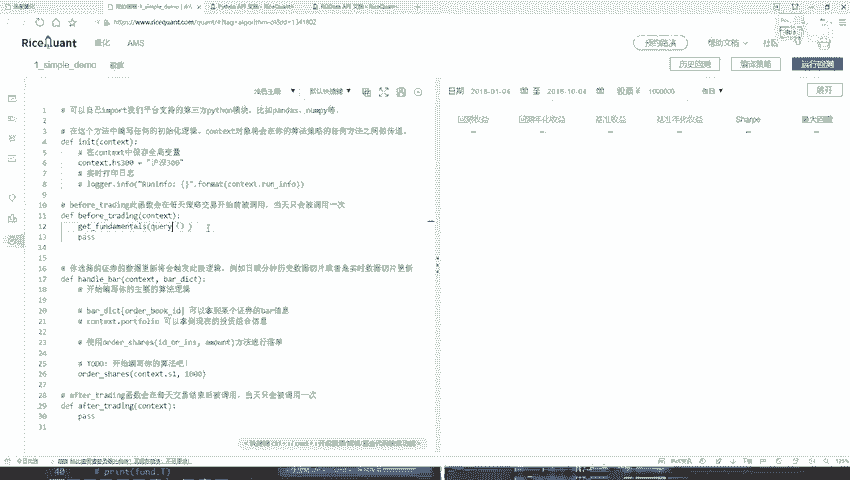

首先，在策略的构造函数中，我们需要定义我们的初始股票池。这里我们以沪深300指数成分股为例。

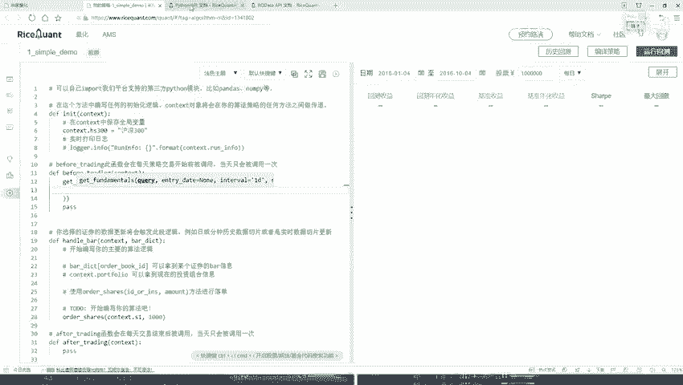

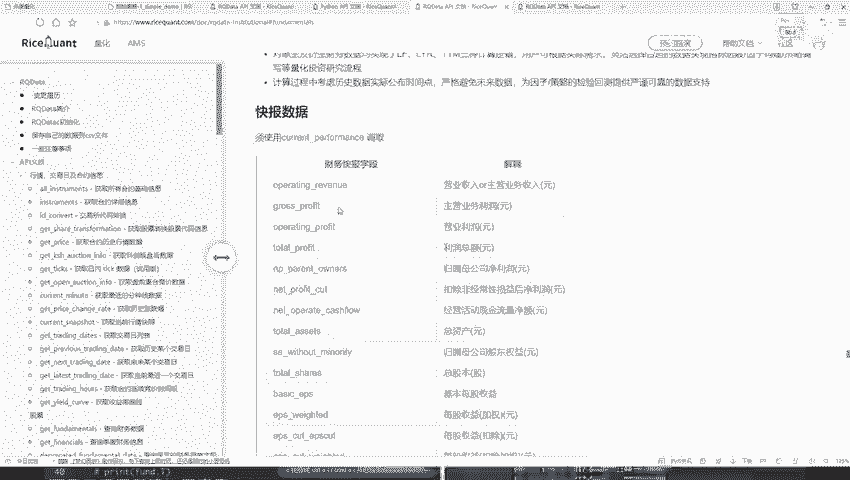

```python
def initialize(context):
    # 设定初始股票池为沪深300指数成分股
    g.stock_pool = index_components('000300.XSHG')  # 沪深300指数代码
    # 其他初始化设置，如起始资金等，此处暂不调整
```

## 数据查询与预处理

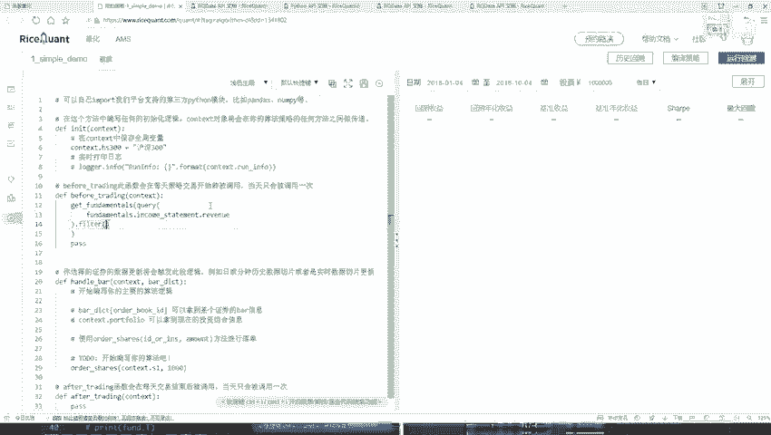

在每日交易开始前（`before_trading`函数中），我们需要获取股票的财务数据并进行筛选。这本质上是一个数据挖掘的过程。

以下是实现此功能的核心步骤：

1.  **构建查询（Query）**：使用平台提供的`query`功能，指定要查询的财务指标字段。
2.  **应用过滤器（Filter）**：限定查询范围，例如只查询属于我们股票池（沪深300）的股票。
3.  **排序（Order By）**：根据选定的指标（如营业收入）对结果进行排序。
4.  **限制数量（Limit）**：只保留排名靠前的若干只股票，作为当日的候选股票。

具体实现代码如下：

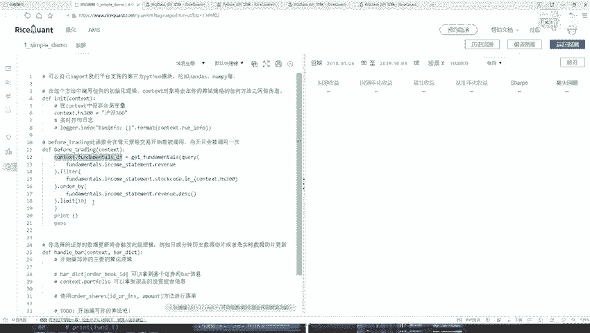

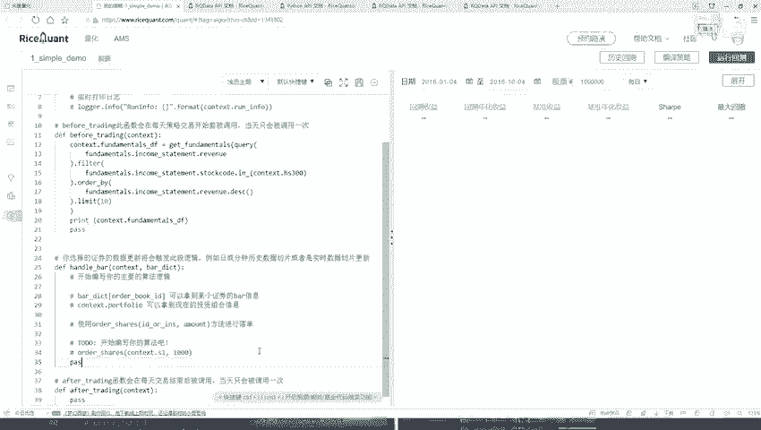

```python
def before_trading(context):
    # 步骤1：构建查询，获取营业收入指标
    q = query(
        fundamentals.financial_indicator.operating_revenue  # 营业收入字段
    )

    # 步骤2：应用过滤器，仅筛选股票池中的股票
    q = q.filter(
        fundamentals.financial_indicator.code.in_(g.stock_pool)
    )

    # 步骤3：按营业收入降序排列（从高到低）
    q = q.order_by(
        fundamentals.financial_indicator.operating_revenue.desc()
    )

    # 步骤4：限制结果数量，例如只取前10名
    q = q.limit(10)

    # 执行查询，获取结果（DataFrame格式）
    g.selected_stocks = get_fundamentals(q)

    # 打印结果以供检查
    logger.info(f"当日筛选出的股票：\n{g.selected_stocks}")
```

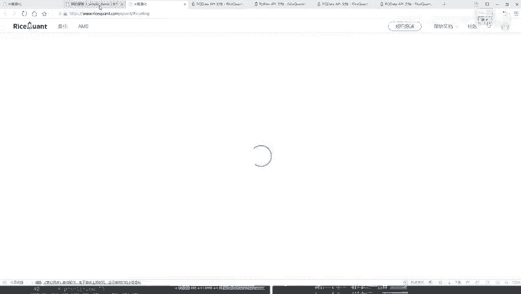

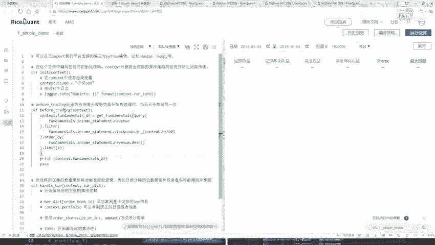

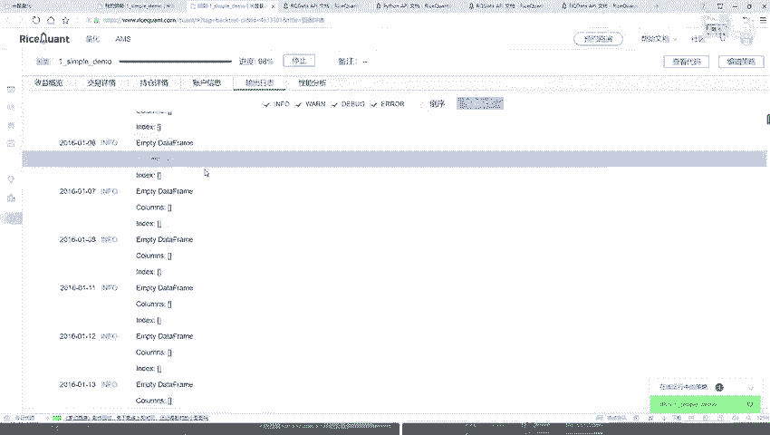

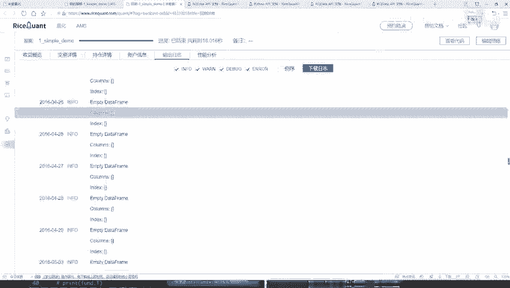

**核心概念说明**：
*   **`query(...)`**：用于构建数据查询语句的函数。
*   **`filter(...)`**：用于对查询结果施加过滤条件。
*   **`order_by(...)`**：用于对查询结果进行排序。
*   **`limit(N)`**：用于限制返回结果的数量为N条。
*   **`get_fundamentals(q)`**：执行构建好的查询`q`，并返回一个`DataFrame`，其中包含股票代码和对应的财务数据。

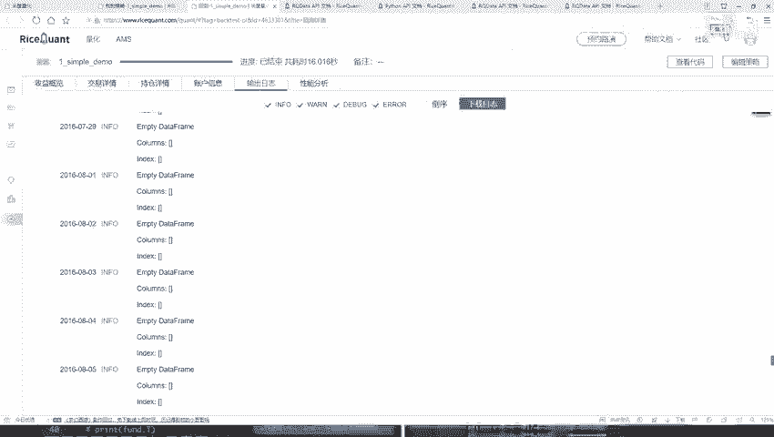

## 注意事项与调试

在编写和运行策略时，需要注意以下几点：

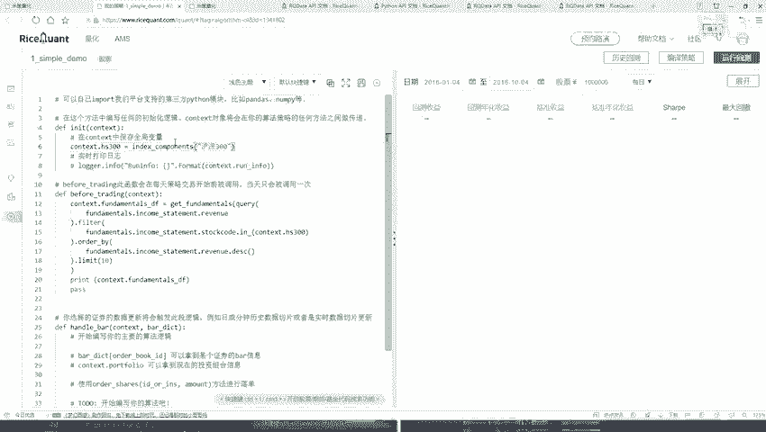

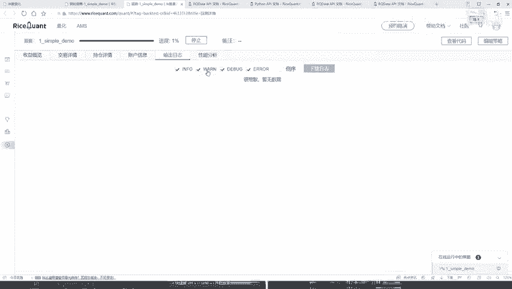

*   **字段准确性**：确保查询的财务指标字段名称正确。所有可用字段都可以在平台的API文档或数据浏览器中查找确认。
*   **股票池定义**：确保`index_components`函数传入正确的指数代码。例如，沪深300的正确代码是`‘000300.XSHG‘`。
*   **结果验证**：初次运行后，务必通过打印日志（`logger.info`）检查查询结果是否为空或是否符合预期。如果结果为空，通常需要检查过滤条件或股票池定义是否正确。

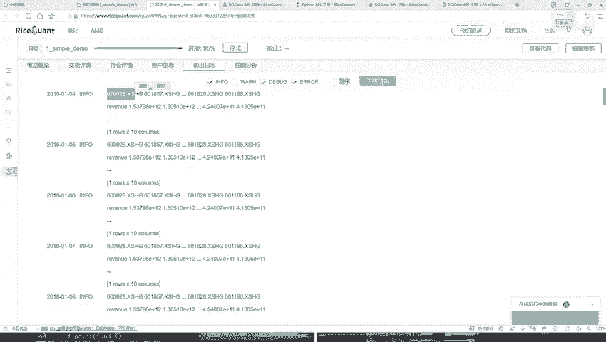

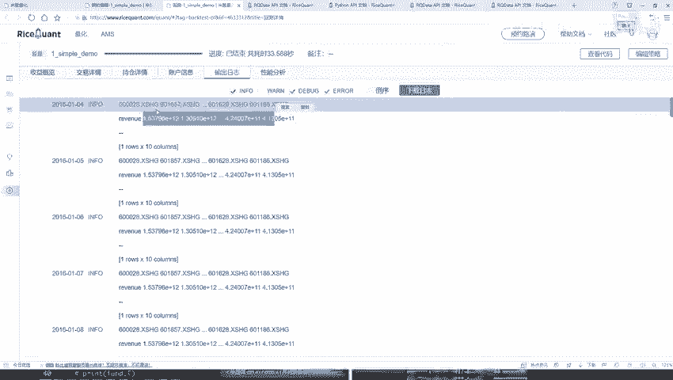

本节课中我们一起学习了如何利用财务数据对预设股票池进行筛选和排序。我们掌握了使用`query`、`filter`、`order_by`和`limit`等关键函数来构建数据查询逻辑的方法，这是量化策略中数据预处理阶段的基础。在接下来的课程中，我们将基于筛选出的股票池，进一步构建交易信号和下单逻辑。