# Python金融分析与量化交易实战：P25：因子数据预处理

在本节课中，我们将学习如何对因子数据进行预处理。因子是影响投资决策的指标，例如市净率或营收增长率。处理这些数据是构建有效量化模型的关键步骤。我们将按照“三步走”策略进行讲解：去极值、标准化和中性化。

## 第一步：去极值

上一节我们介绍了因子数据预处理的重要性，本节中我们来看看如何处理数据中的极端值。去极值不是直接删除异常点，而是将其调整到合理的边界内。

以下是几种常见的去极值方法：

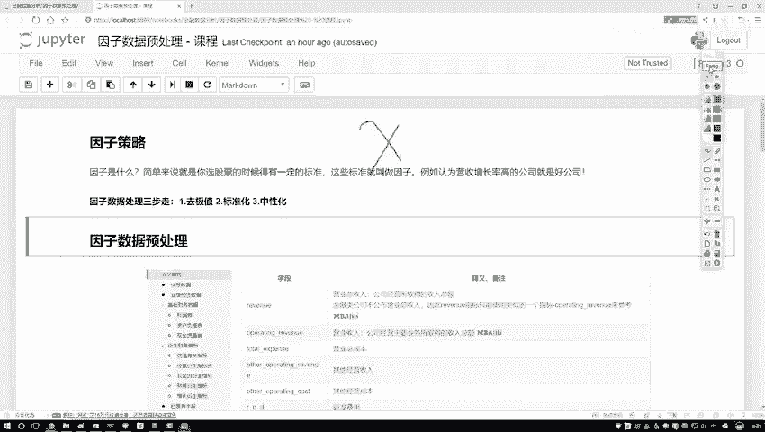

*   **分位数法**：此方法利用数据的分布位置来设定边界。例如，中位数（Q2）是将数据一分为二的值。我们更常用四分位数，即Q1（25%分位数）和Q3（75%分位数）。通过计算四分位距（IQR = Q3 - Q1），可以设定正常值的上下界（例如，下界 = Q1 - 1.5 * IQR，上界 = Q3 + 1.5 * IQR），并将超出边界的值拉回边界处。
*   **标准差法**：此方法假设数据服从正态分布。通过计算数据的均值（μ）和标准差（σ），可以设定边界（例如，μ ± 3σ）。落在边界之外的值被视为极值并进行调整。
*   **绝对中位差法**：这是一种对异常值更稳健的方法。它计算每个数据点与中位数偏差的绝对值的中位数（MAD），并以此设定边界。

在代码中，分位数法可以如下实现：
```python
import numpy as np

def winsorize_by_quantile(data, lower_quantile=0.05, upper_quantile=0.95):
    lower_bound = np.percentile(data, lower_quantile * 100)
    upper_bound = np.percentile(data, upper_quantile * 100)
    data_winsorized = np.clip(data, lower_bound, upper_bound)
    return data_winsorized
```

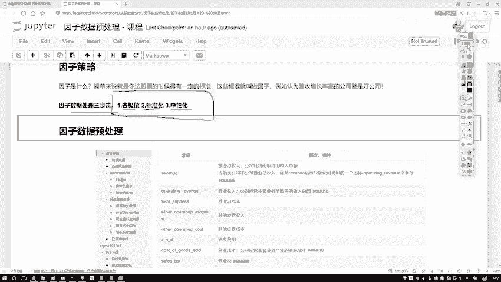

## 第二步：标准化

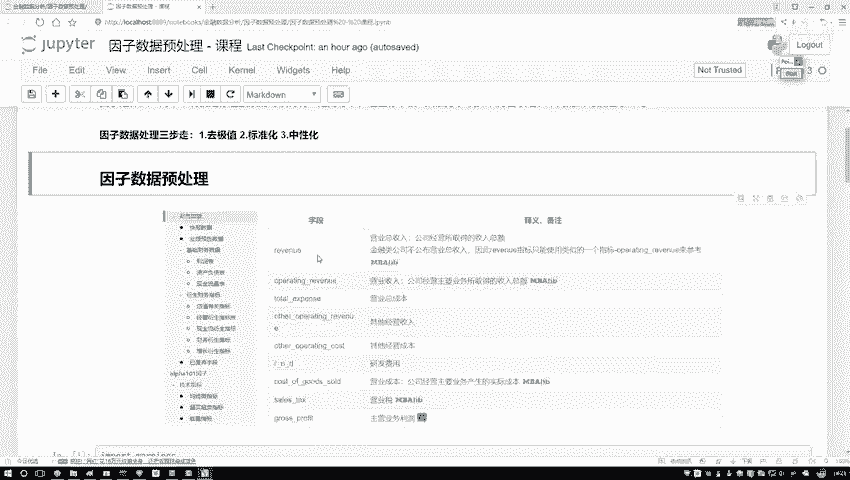

处理完极值后，我们需要解决不同因子取值范围差异大的问题。标准化旨在将数据转换到统一的尺度上，便于后续模型比较和计算。

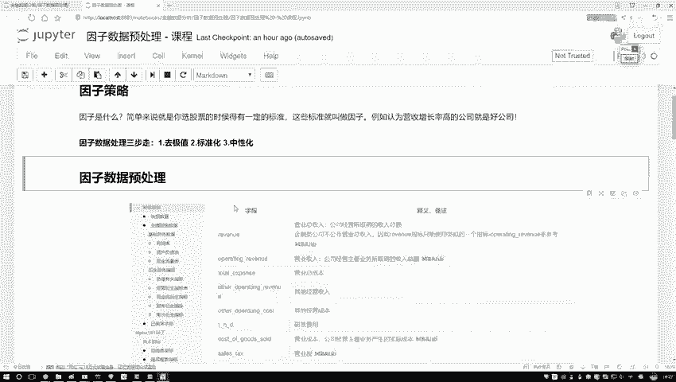

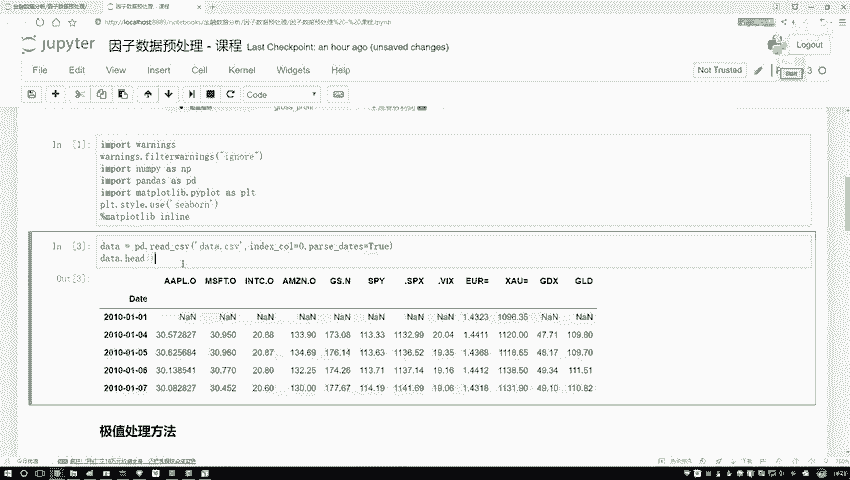

以下是两种主要的标准化方法：

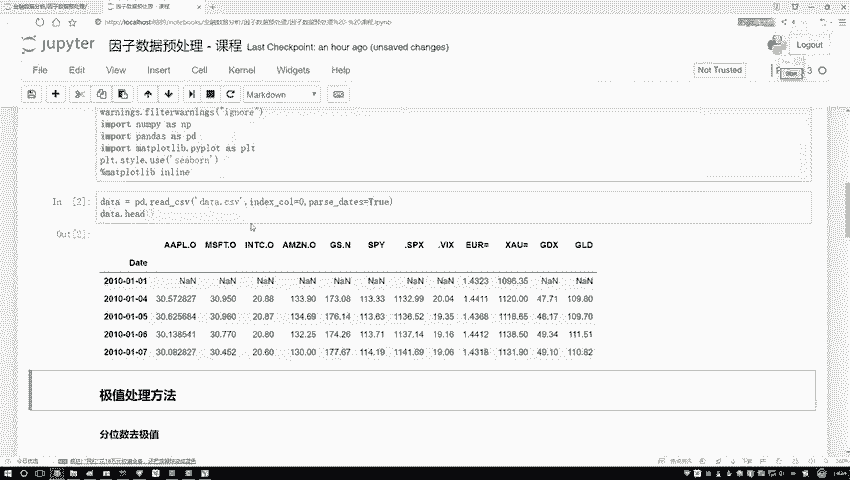

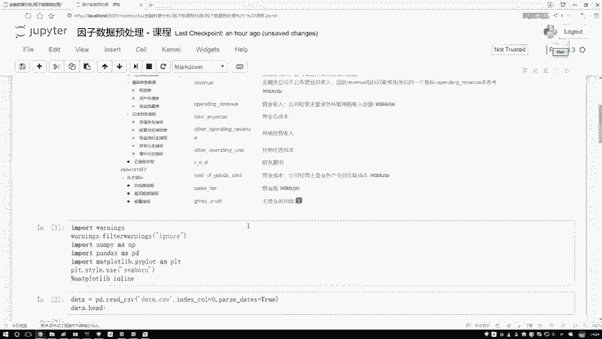

*   **Z-Score 标准化**：此方法将数据转换为均值为0、标准差为1的分布。公式为：**z = (x - μ) / σ**，其中x是原始值，μ是均值，σ是标准差。
*   **Min-Max 标准化**：此方法将数据线性映射到[0, 1]区间。公式为：**x_scaled = (x - x_min) / (x_max - x_min)**。

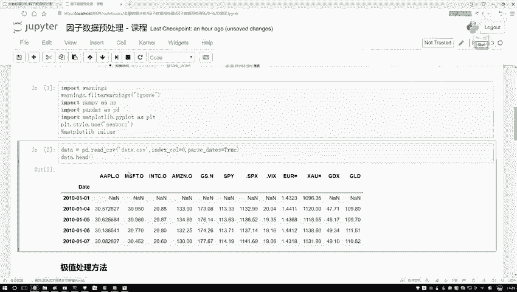

在Python中，可以使用`sklearn`库方便地实现：
```python
from sklearn.preprocessing import StandardScaler, MinMaxScaler

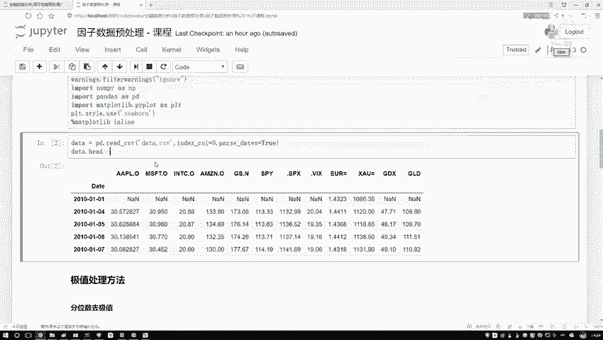

# Z-Score 标准化
scaler_z = StandardScaler()
data_scaled_z = scaler_z.fit_transform(data)

# Min-Max 标准化
scaler_mm = MinMaxScaler()
data_scaled_mm = scaler_mm.fit_transform(data)
```

## 第三步：中性化

标准化之后，我们将进入因子处理特有的环节——中性化。在量化多因子模型中，我们常常希望因子收益独立于某些系统性风险（如行业、市值），中性化就是为了消除这些影响。

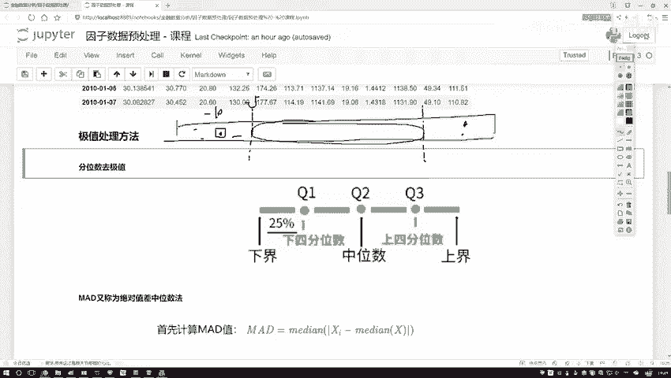

例如，市净率因子可能在不同行业间存在天然差异。中性化的目的是剔除行业属性后，观察纯粹的市净率因子对股票收益的影响。

常用的方法是使用**线性回归**进行中性化处理。以剔除行业和市值影响为例：
1.  将因子值（如市净率）作为因变量 **y**。
2.  将行业哑变量和市值作为自变量 **X**。
3.  建立线性回归模型：**y = Xβ + ε**。
4.  取回归模型的残差 **ε** 作为中性化后的新因子值。这个残差代表了无法被行业和市值解释的部分，即“纯净”的因子暴露。

代码示例如下：
```python
import statsmodels.api as sm

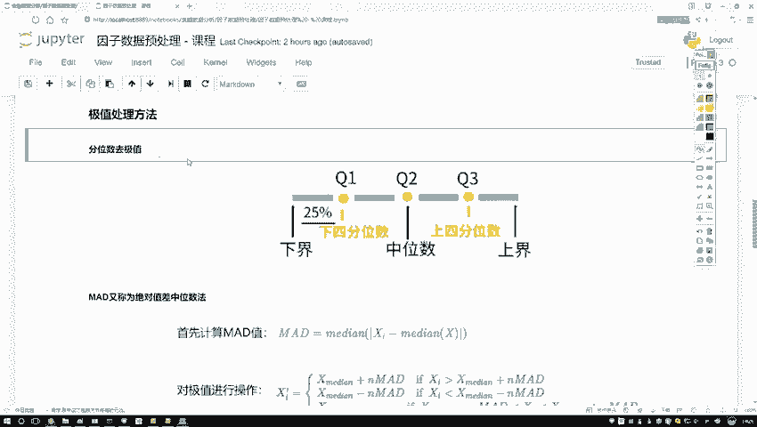

# 假设 df 包含因子值‘pb_ratio’，行业哑变量‘industry_dummy’和‘market_cap’
X = df[['industry_dummy', 'market_cap']]
X = sm.add_constant(X) # 添加截距项
y = df['pb_ratio']

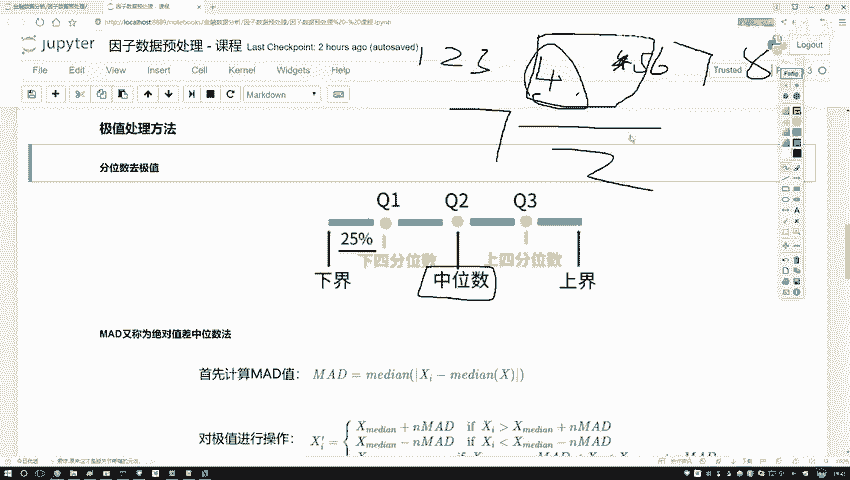

model = sm.OLS(y, X).fit()
df['pb_ratio_neutral'] = model.resid # 残差即为中性化后的因子
```

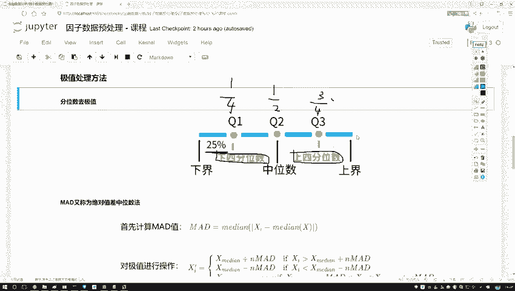

本节课中我们一起学习了因子数据预处理的三个核心步骤：去极值、标准化和中性化。去极值处理异常点，标准化统一数据尺度，中性化则剥离了常见的系统性风险，使我们能更纯粹地评估因子本身的有效性。这些步骤为后续构建稳健的量化多因子模型奠定了坚实的基础。