# Python金融分析与量化交易实战：P26：基于百分位去极值实例

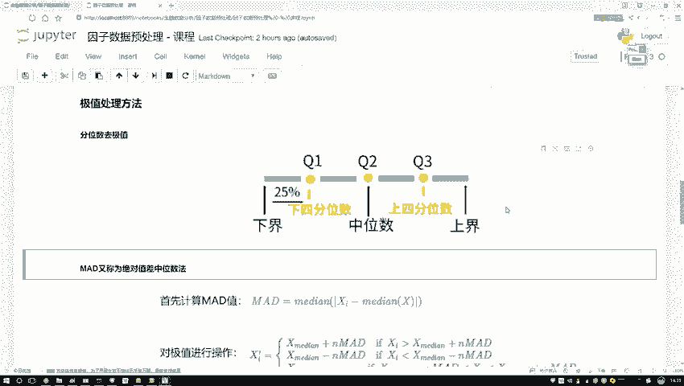

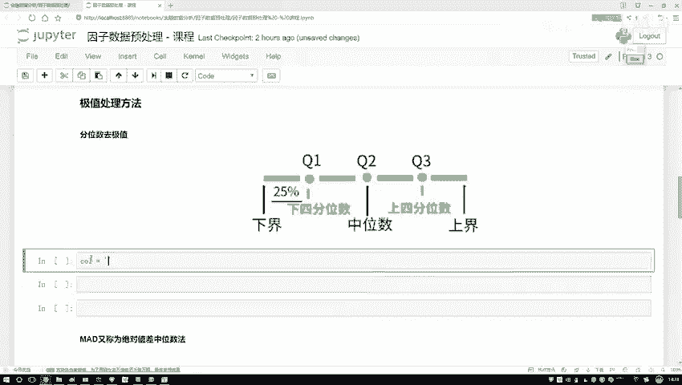

## 概述
在本节课中，我们将学习一种在金融数据处理中常用的技术：**基于百分位去极值**。我们将通过一个具体的Python实例，演示如何识别并处理数据中的极端值，使数据分布更加规范，为后续的量化分析打下基础。

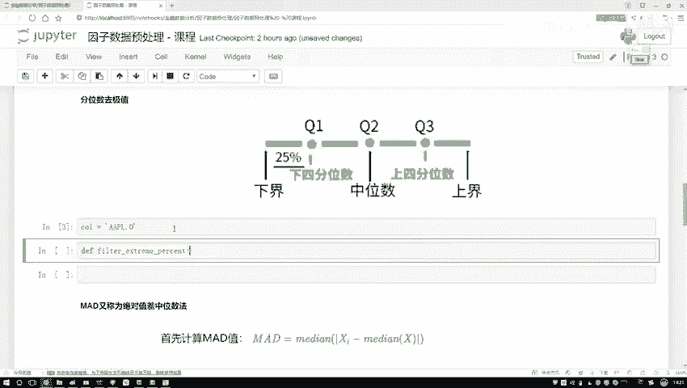

上一节我们介绍了数据预处理的重要性，本节中我们来看看如何使用分位数（如Q1和Q3）来识别和修正极端值。

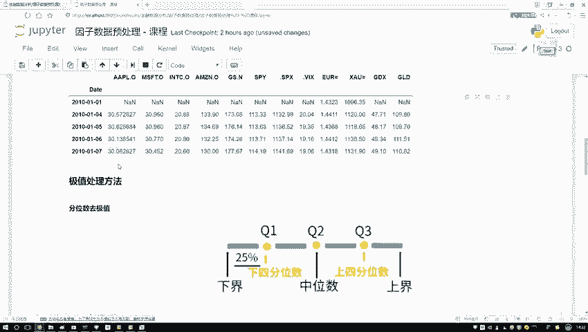

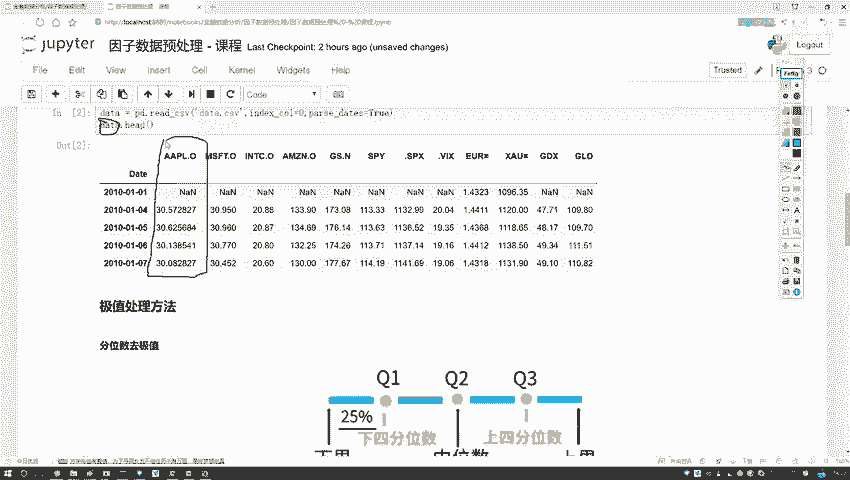

## 核心步骤与代码实现

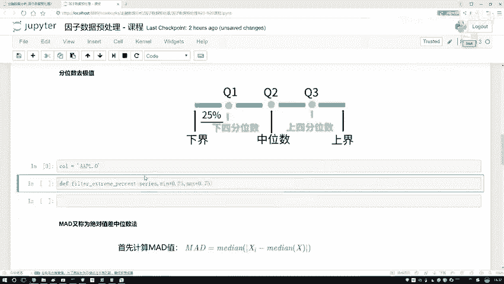

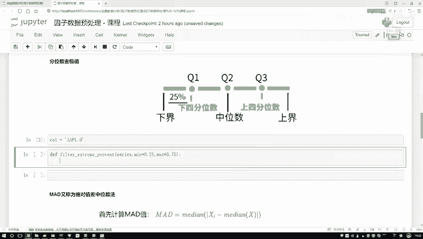

### 1. 明确目标与思路
我们的目标是：对于给定的一列数据，计算其第一四分位数（Q1，25%）和第三四分位数（Q3，75%）。将所有小于Q1的值设置为Q1，将所有大于Q3的值设置为Q3。这样，数据就被规范在[Q1, Q3]的范围内。

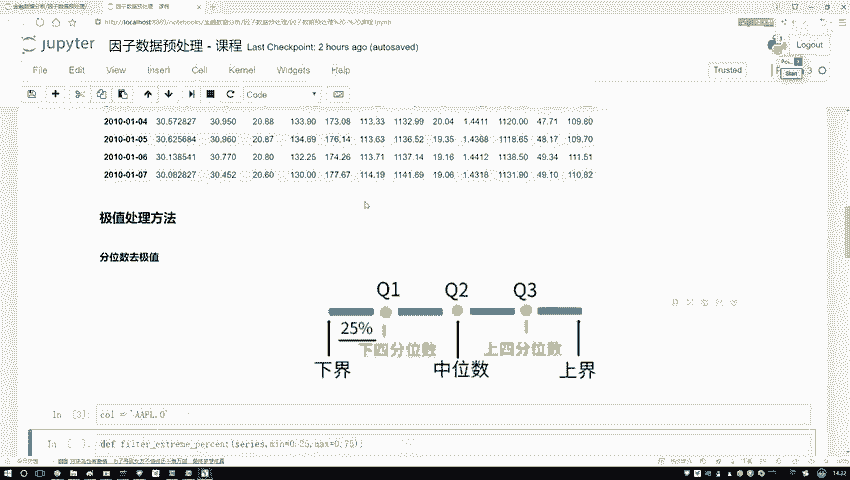

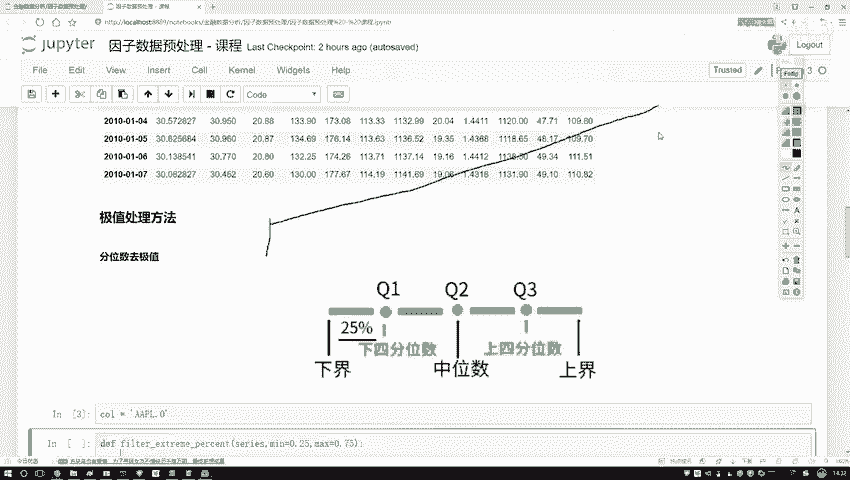

### 2. 定义去极值函数
以下是实现该功能的核心函数。我们将逐步拆解其逻辑。

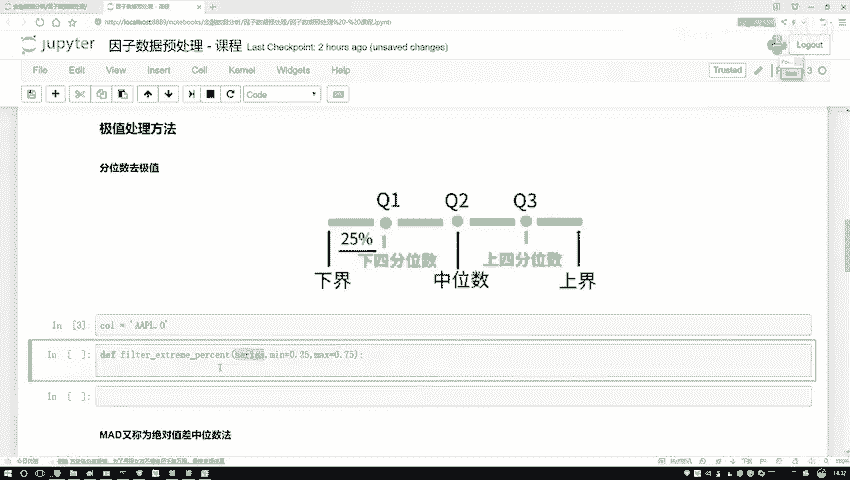

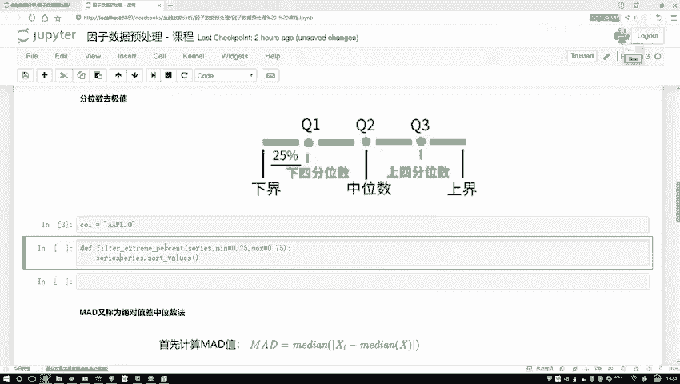

```python
import pandas as pd
import numpy as np

def winsorize_by_percentile(series, low_percentile=0.25, high_percentile=0.75):
    """
    基于百分位进行去极值处理。
    参数:
        series: pandas Series，待处理的数据列。
        low_percentile: 下限百分位，默认0.25（Q1）。
        high_percentile: 上限百分位，默认0.75（Q3）。
    返回:
        处理后的 pandas Series。
    """
    # 第一步：对数据进行排序
    sorted_series = series.sort_values()

    # 第二步：计算指定百分位对应的值
    # 使用quantile函数计算分位数
    q = sorted_series.quantile([low_percentile, high_percentile])
    low_bound = q.iloc[0]  # 下限值（如Q1）
    high_bound = q.iloc[1] # 上限值（如Q3）

    # 第三步：使用np.clip函数将数据规范到[low_bound, high_bound]区间
    # 小于low_bound的值变为low_bound，大于high_bound的值变为high_bound
    winsorized_series = np.clip(series, low_bound, high_bound)

    return winsorized_series
```

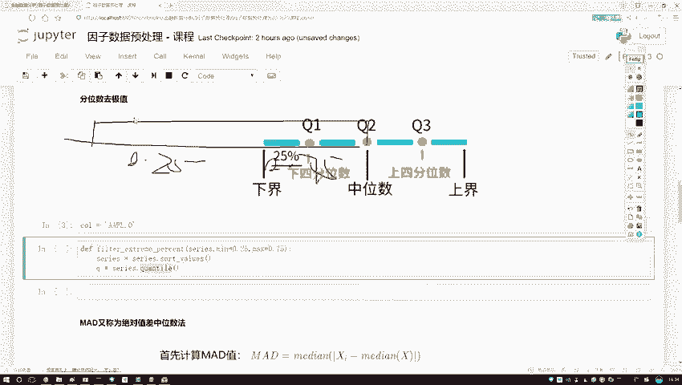

### 3. 函数逻辑详解
以下是函数中关键步骤的详细说明：

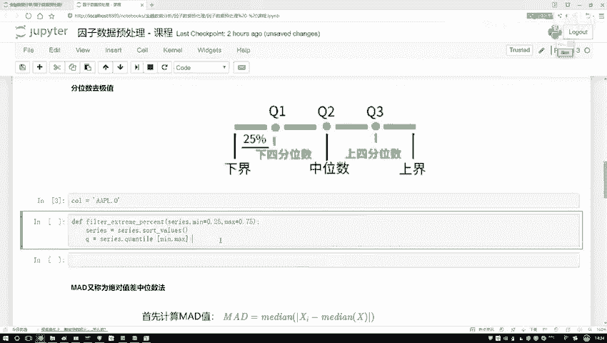

**第一步：数据排序**
为了准确找到分位数对应的数据点，我们首先需要将数据按从小到大的顺序排列。这通过 `series.sort_values()` 实现。

**第二步：计算分位点**
我们使用Pandas的 `quantile()` 函数。传入一个包含目标百分位（如`[0.25, 0.75]`）的列表，该函数会返回对应位置的值。例如，`q.iloc[0]` 对应25%分位数（Q1），`q.iloc[1]` 对应75%分位数（Q3）。

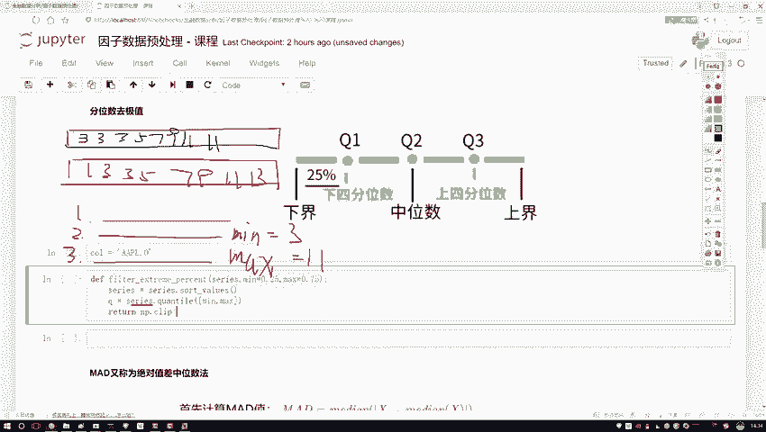

**第三步：数据裁剪（Clip）**
这是去极值的核心操作。我们使用NumPy的 `np.clip()` 函数。该函数接收三个主要参数：
1.  待处理的数组（这里是我们的数据列 `series`）。
2.  最小值下限（`low_bound`）。
3.  最大值上限（`high_bound`）。
函数会将所有小于下限的值设置为下限，所有大于上限的值设置为上限，而处于中间的值则保持不变。

### 4. 应用函数与结果对比
定义好函数后，我们可以将其应用于实际数据，并可视化处理前后的差异。

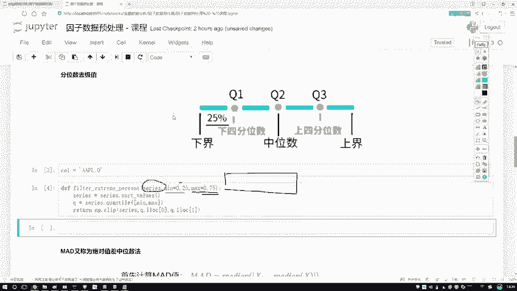

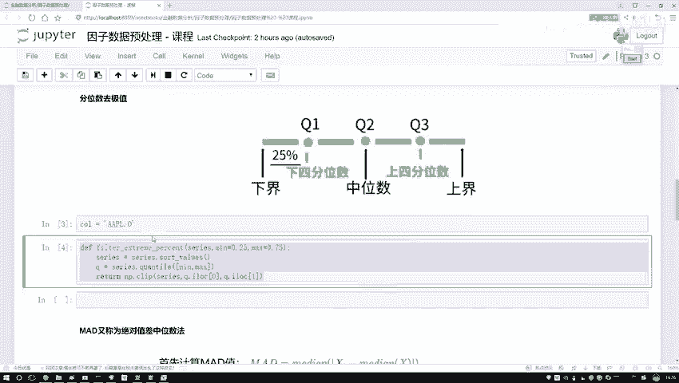

```python
# 假设 `data` 是一个DataFrame，其中包含名为 ‘column_name‘ 的列
column_to_process = ‘column_name‘

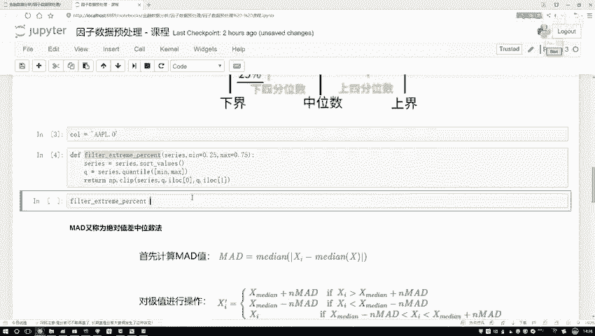

# 应用去极值函数
# 这里使用默认的25%和75%作为边界
processed_data = winsorize_by_percentile(data[column_to_process])

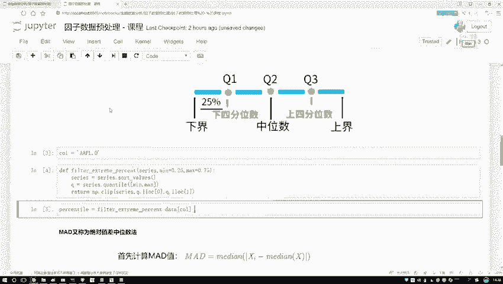

# 可视化对比
import matplotlib.pyplot as plt

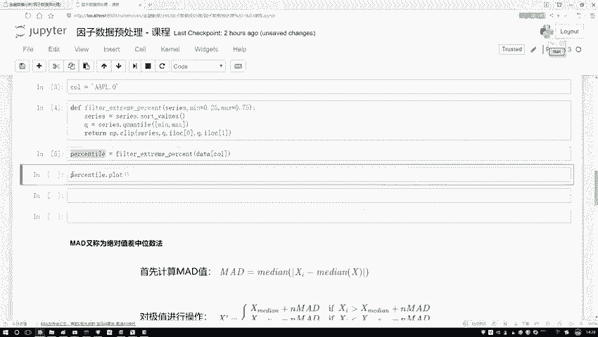

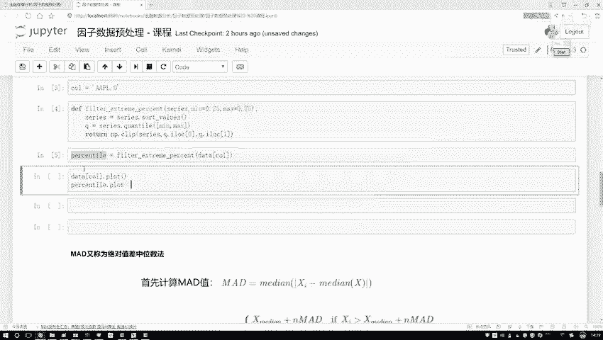

plt.figure(figsize=(12, 6))

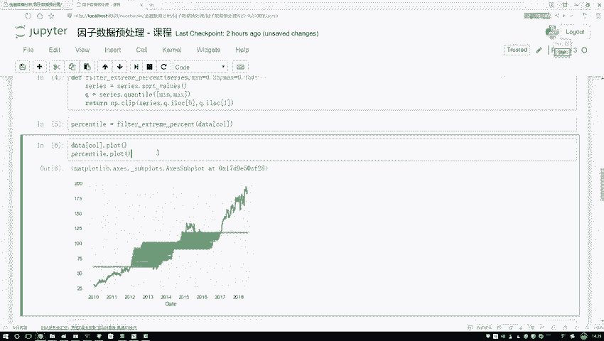

# 绘制原始数据
plt.subplot(2, 1, 1)
data[column_to_process].plot(title=‘原始数据‘)
plt.axhline(y=data[column_to_process].quantile(0.25), color=‘r‘, linestyle=‘--‘, label=‘Q1‘)
plt.axhline(y=data[column_to_process].quantile(0.75), color=‘g‘, linestyle=‘--‘, label=‘Q3‘)
plt.legend()

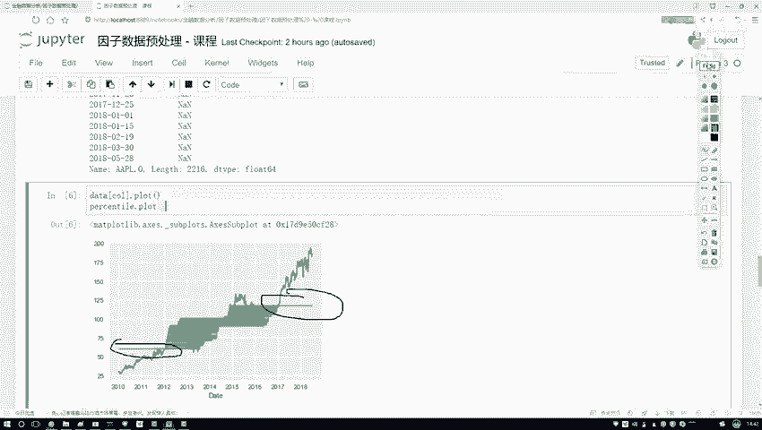

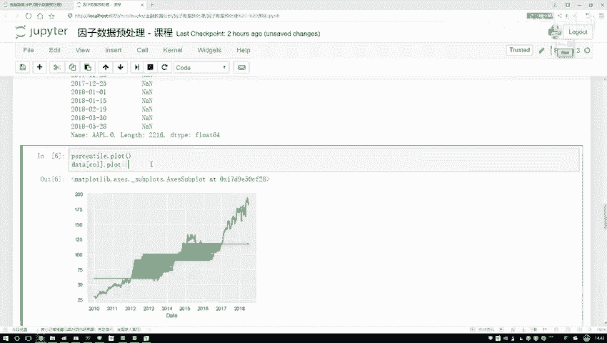

# 绘制处理后的数据
plt.subplot(2, 1, 2)
processed_data.plot(title=‘基于百分位去极值后的数据‘)
plt.axhline(y=processed_data.min(), color=‘r‘, linestyle=‘--‘, label=‘新下限‘)
plt.axhline(y=processed_data.max(), color=‘g‘, linestyle=‘--‘, label=‘新上限‘)
plt.legend()

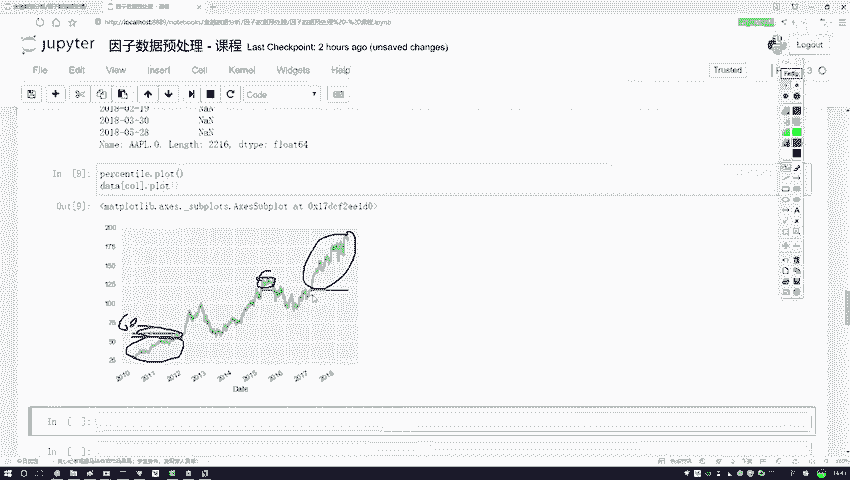

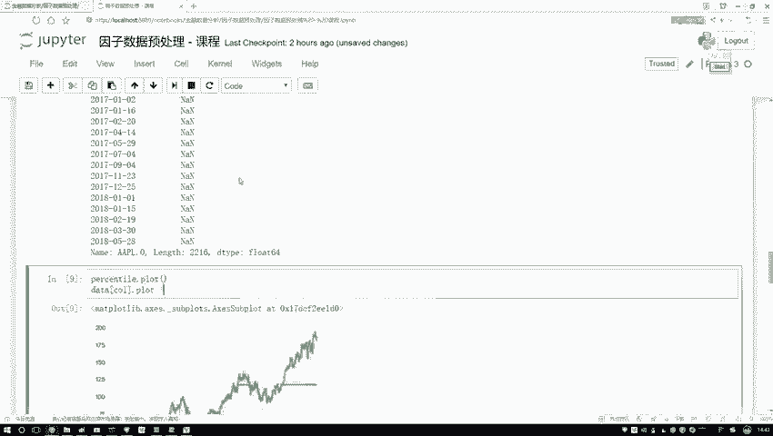

plt.tight_layout()
plt.show()
```

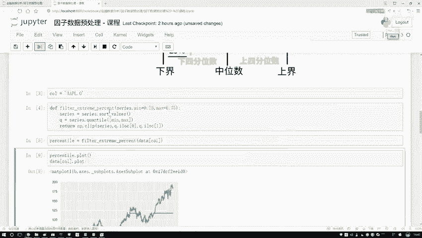

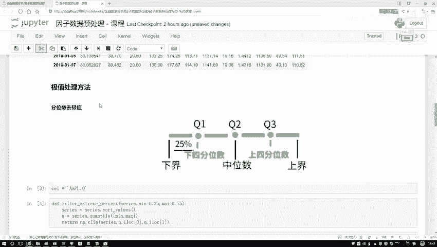

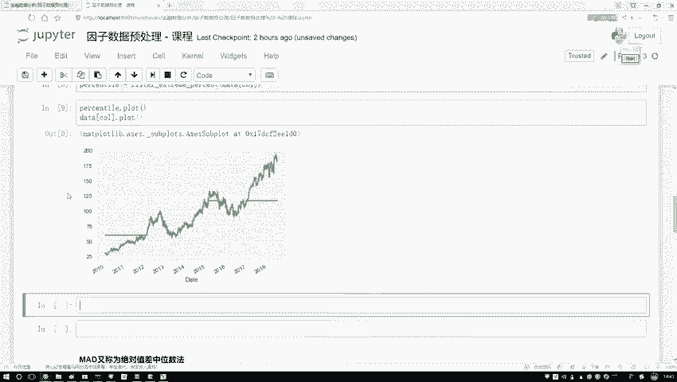

通过上下两个子图的对比，可以清晰地看到，处理后数据的极端部分（超出红色和绿色虚线的部分）被“拉回”到了边界线上，数据分布变得更加集中。

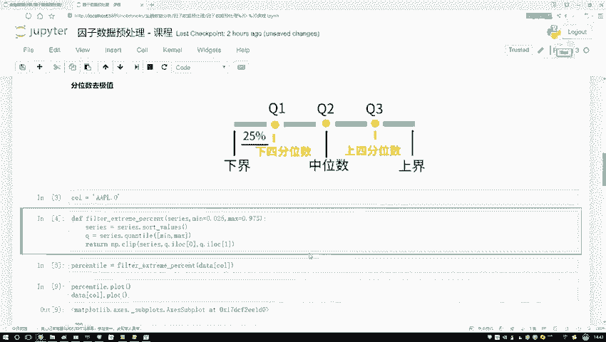

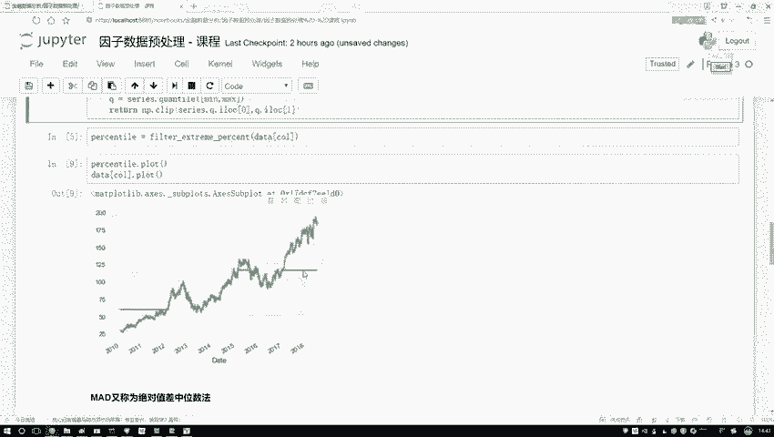

## 注意事项与实际应用
1.  **分位数的选择**：本例中使用25%和75%是为了演示效果明显。在实际金融因子分析中，为了更严格地剔除异常值，可能会使用更极端的分位数，例如 **2.5%** 和 **97.5%**。你可以通过修改函数的 `low_percentile` 和 `high_percentile` 参数来调整。
2.  **函数的通用性**：我们编写的 `winsorize_by_percentile` 函数是一个通用工具，可以方便地应用于任何需要去极值的数值型Pandas Series。
3.  **理解原理**：这种方法的核心思想是**不删除数据**，而是**用边界值替代极端值**，从而在保留所有样本点的同时，减少异常值对整体分析（如计算均值、方差）造成的扭曲影响。

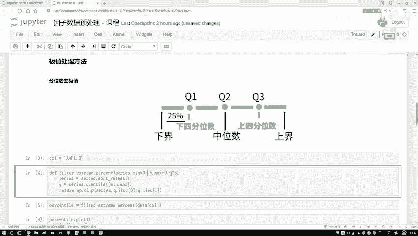

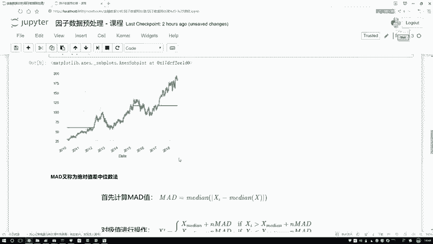

## 总结
本节课中我们一起学习了基于百分位进行去极值处理的方法。我们掌握了其核心思想：利用分位数确定数据的合理范围，并将超出此范围的极端值替换为边界值。通过定义Python函数、分步讲解逻辑以及可视化对比，我们完整地实现了这一过程。这是金融数据预处理中非常实用的一步，能有效提升后续建模和分析的稳健性。