# Python金融分析与量化交易实战：P28：3-Sigma方法实例

在本节课中，我们将要学习一种在金融数据处理中常用的去极值方法——3-Sigma方法。我们将从原理入手，理解其背后的统计学思想，并通过代码实例演示如何实现它。

## 概述

上一节我们介绍了去极值的概念和几种常见方法。本节中，我们来看看基于统计学原理的 **3-Sigma方法**。该方法假设数据服从正态分布，通过计算数据的均值和标准差，来识别并处理那些偏离均值过远的“极值”数据点。

## 3-Sigma方法原理

3-Sigma方法的原理基于正态分布（也称高斯分布）。我们可以通过一张正态分布图来理解。

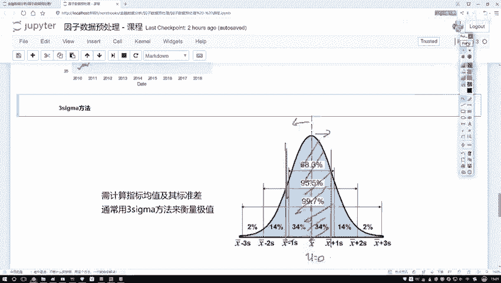


上图中展示了一个标准的正态分布曲线。曲线的中心是均值（μ），通常为0。数据点分布在均值两侧。

*   靠近均值（图中红色阴影区域）的数据点出现的概率很高，代表正常数据。
*   离均值越远的数据点，出现的概率越低。这些出现在分布曲线两端、概率极低区域的数据点，很可能就是我们需要处理的“离群点”或“极值”。

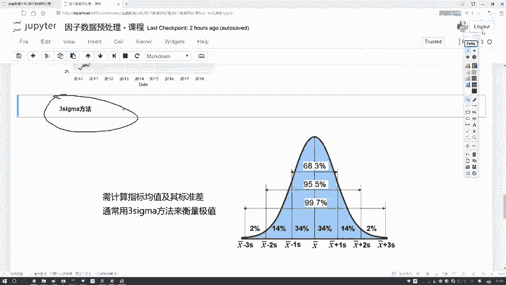

**3-Sigma** 具体指的是以均值为中心，向左右各延伸3倍标准差（σ）的区间。


在正态分布中，数据落在这个区间内的概率是确定的。以下是关键区间与概率的对应关系：

*   **μ ± 1σ**：包含约 **68.3%** 的数据。
*   **μ ± 2σ**：包含约 **95.4%** 的数据。
*   **μ ± 3σ**：包含约 **99.7%** 的数据。

3-Sigma方法的核心思想是：我们假设数据经过某种变换后，理论上服从正态分布。然后，我们设定一个界限（例如 μ ± 3σ），认为落在这个界限内的数据（约99.7%）是“正常”的，而落在这个界限外的数据（约0.3%）是“极值”，需要对它们进行规范化处理。

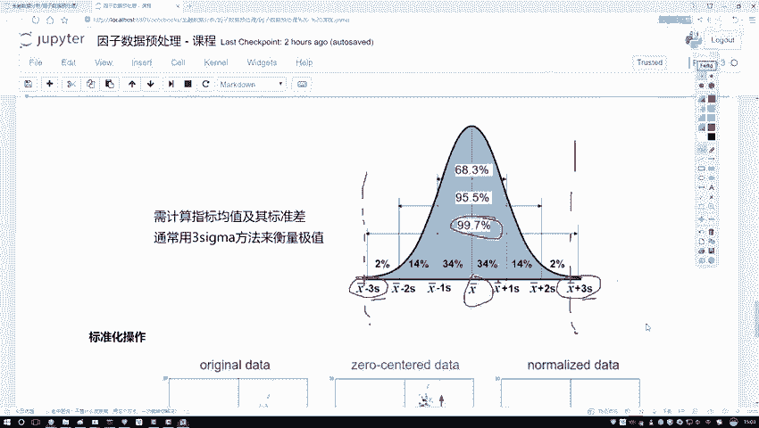

因此，要实现这个方法，我们只需要计算两个值：数据的**均值（μ）**和**标准差（σ）**。

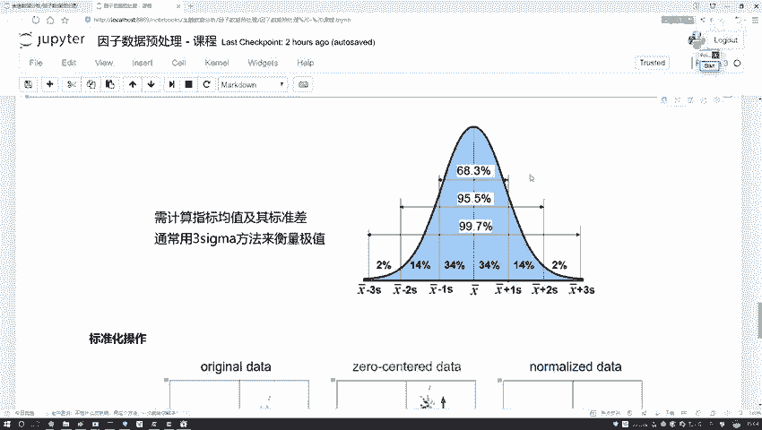


计算公式如下：
*   **上限（upper_limit） = μ + n * σ**
*   **下限（lower_limit） = μ - n * σ**

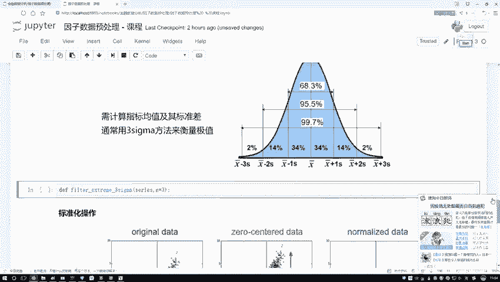

其中，`n` 通常取3，代表3-Sigma。你也可以根据需求调整 `n` 的值（例如取1或2），来控制被视为“正常”的数据范围。

## 代码实现

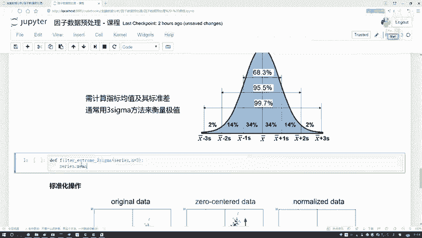

理解了原理后，我们来看看如何用Python代码实现3-Sigma方法。我们将编写一个函数，输入一列数据和一个倍数 `n`，返回处理后的数据序列以及计算出的上下限。

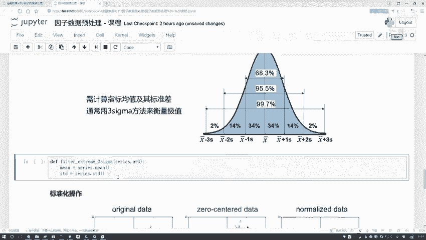

以下是实现步骤：

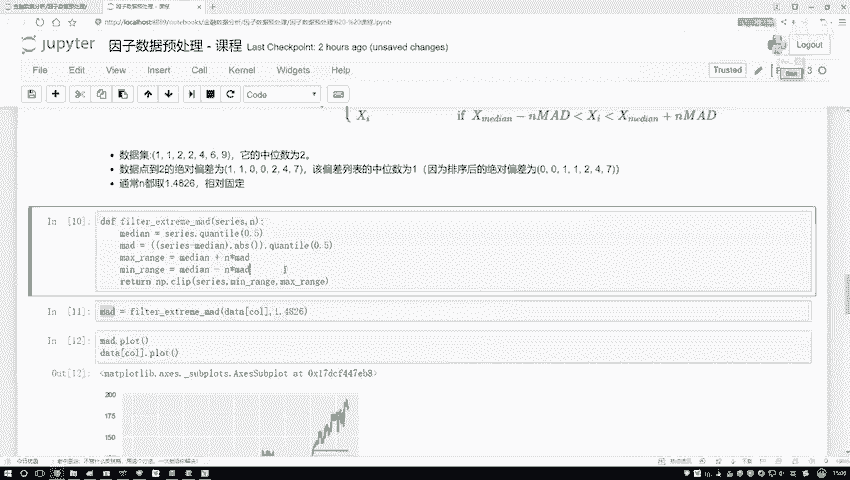

首先，我们复制一个函数框架，并将其命名为 `three_sigma`。

```python
def three_sigma(series, n=3):
    """
    使用3-Sigma方法处理极值。
    参数:
        series: pandas Series, 待处理的数据列。
        n: int, 标准差的倍数，默认为3。
    返回:
        series_cp: pandas Series, 处理后的数据。
        lower_limit: float, 计算出的下限。
        upper_limit: float, 计算出的上限。
    """
    # 计算均值和标准差
    mean = series.mean()
    std = series.std()

    # 计算上下限
    upper_limit = mean + n * std
    lower_limit = mean - n * std

    # 复制原数据，避免修改原始数据
    series_cp = series.copy()

    # 将超出上下限的值规范到边界上
    series_cp[series_cp > upper_limit] = upper_limit
    series_cp[series_cp < lower_limit] = lower_limit

    return series_cp, lower_limit, upper_limit
```

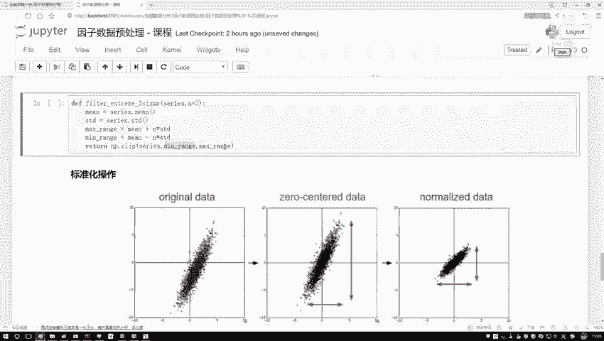

代码说明：
1.  `mean = series.mean()` 和 `std = series.std()` 分别计算输入数据序列的均值和标准差。
2.  `upper_limit` 和 `lower_limit` 根据公式 **μ ± nσ** 计算得出。
3.  我们创建原数据的一个副本 `series_cp` 进行操作。
4.  使用布尔索引，将所有大于上限的值设置为上限值，将所有小于下限的值设置为下限值。这样就完成了“去极值”的规范化操作，而不是直接删除。

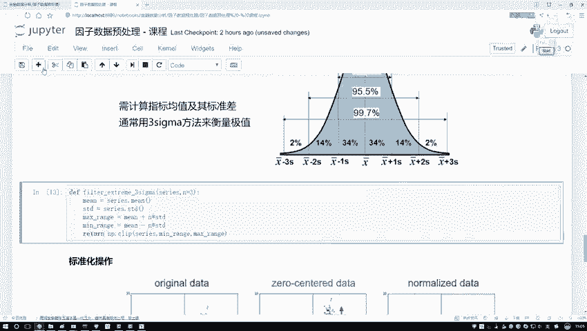

## 方法应用与对比

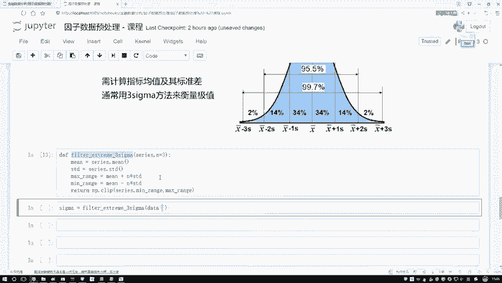

现在，让我们使用这个函数处理数据，并可视化结果。为了使效果更明显，我们先将 `n` 设为1，即使用 **1-Sigma** 方法（包含约68.3%的数据）。

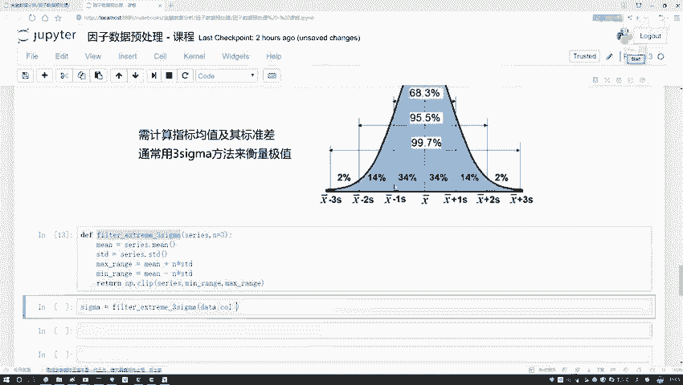

```python
# 假设 `data` 是包含我们待处理数据的DataFrame，`col_name` 是列名
processed_data, lower, upper = three_sigma(data[col_name], n=1)

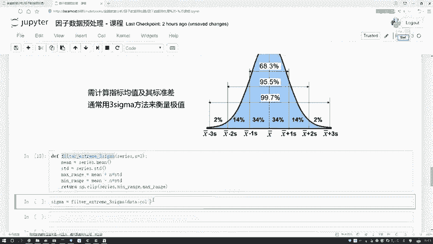

print(f"下限: {lower:.2f}")
print(f"上限: {upper:.2f}")

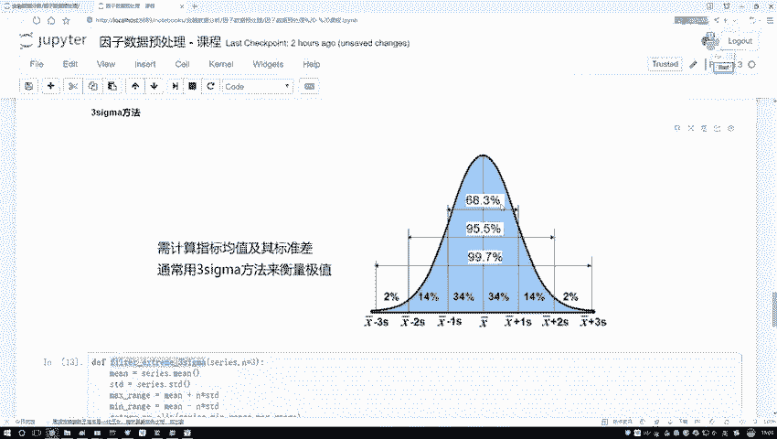

# 可以绘制图形观察处理效果（此处为示意，需配合绘图库如matplotlib）
# plt.plot(data[col_name], label='原始数据')
# plt.axhline(y=upper, color='r', linestyle='--', label='上限')
# plt.axhline(y=lower, color='g', linestyle='--', label='下限')
# plt.legend()
# plt.show()
```


执行代码后，我们会得到处理后的数据以及计算出的上下限。

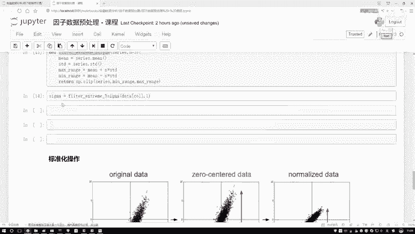

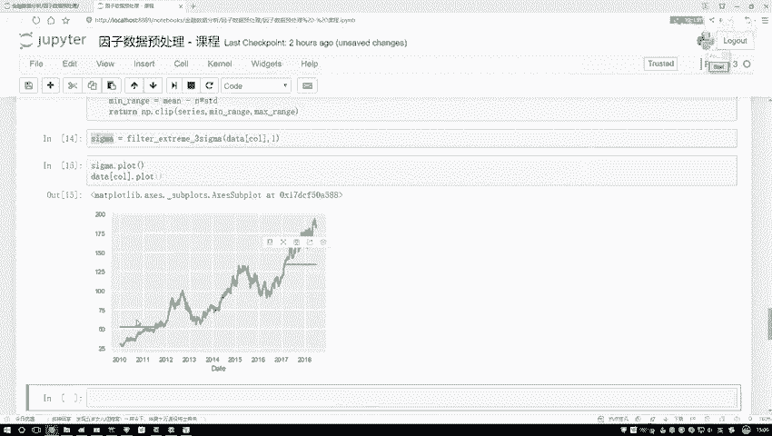


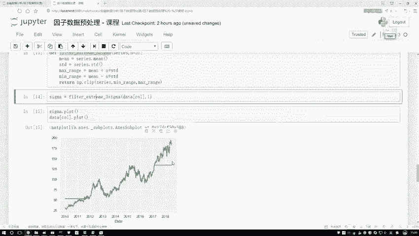

通过图像（假设的绿线和蓝线代表不同方法或参数下的界限）我们可以观察到，不同的去极值方法（如分位数法、中位数绝对偏差法、3-Sigma法）或同一方法的不同参数（`n`的取值），会计算出不同的上下限。

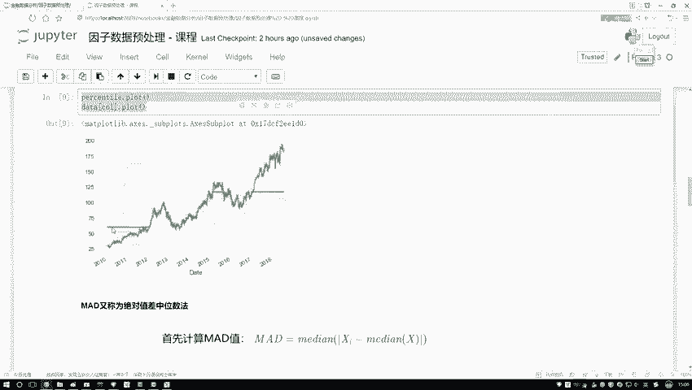

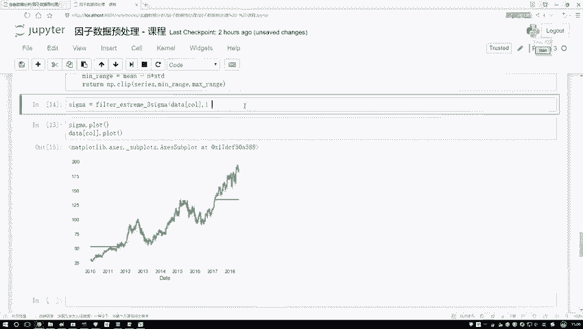

例如，某个方法的上限可能在60左右，另一个方法在50左右。**3-Sigma方法得到的结果可能约为50多一点**。这些差异都是正常的。


选择哪种方法以及设定何种参数，取决于具体的实际任务需求。这几种方法都是数据预处理中常用的策略，大家可以在实践中分别尝试，通过实验来选择最适合当前数据场景的方法。

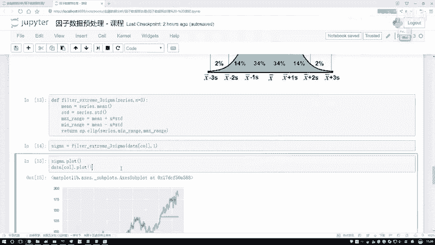

## 总结

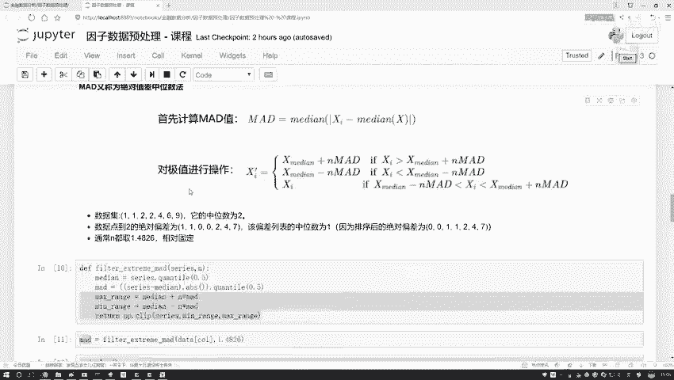

本节课中我们一起学习了**3-Sigma去极值方法**。我们来回顾一下核心要点：

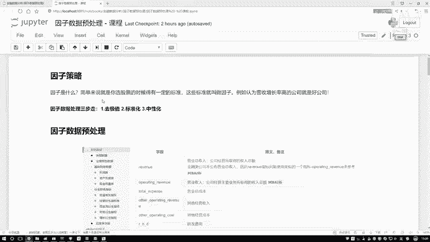

1.  **原理基础**：该方法基于数据服从**正态分布**的假设，利用**均值（μ）**和**标准差（σ）** 来定义正常数据的范围。
2.  **核心操作**：通过公式 **上限 = μ + nσ** 和 **下限 = μ - nσ** 确定边界。通常 `n=3`，包含约99.7%的数据。
3.  **实现方式**：不是删除极值，而是将其**规范**到计算出的上界或下界上，使所有数据都落在 `[lower_limit, upper_limit]` 区间内。
4.  **方法对比**：它是数据预处理“去极值”步骤中的一种有效策略，与分位数法、MAD法等方法各有适用场景，需根据实际情况选择和调试。

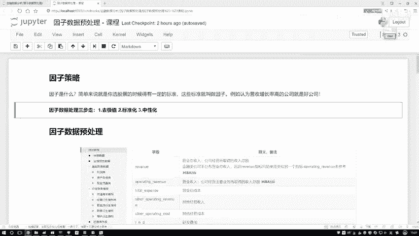

至此，我们完成了数据处理“三步走”中第一步——去极值的几种主要方法的介绍。掌握这些方法，能为后续的金融分析与建模打下坚实的数据基础。