# Python金融分析与量化交易实战：P29：29.28.5-标准化处理方法 📊

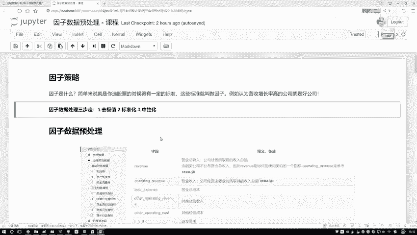

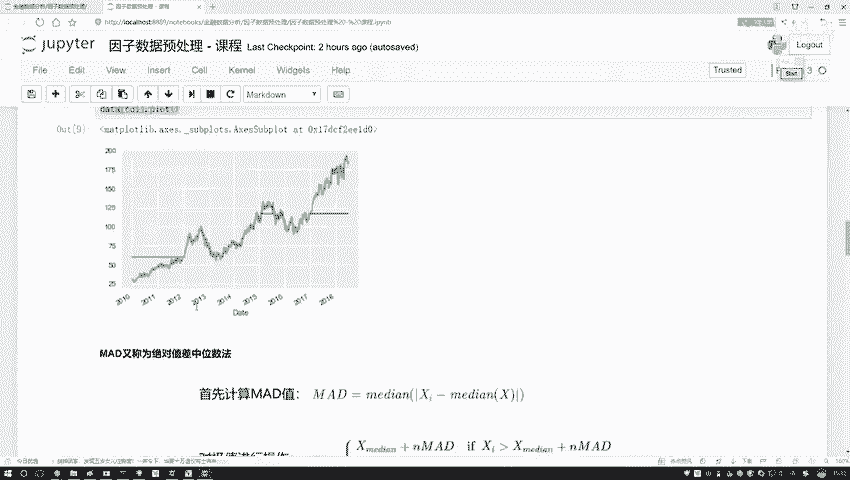

在本节课中，我们将要学习数据预处理中的一个核心步骤：标准化。我们将了解标准化的目的、原理，并通过公式和代码演示如何实现它。

## 概述

标准化是数据预处理中常用的技术，旨在消除不同特征（或指标）之间由于量纲和取值范围不同带来的影响。通过标准化，我们可以让数据更易于比较和分析，为后续的建模工作打下良好基础。

## 标准化的目的与原理

上一节我们介绍了数据预处理的重要性，本节中我们来看看标准化的具体作用。

假设我们有一组数据，包含两个特征X1和X2。X1的取值范围较大，而X2的取值范围较小。如果直接使用原始数据，数值较大的特征可能会在模型计算中占据主导地位，从而影响结果的公正性。

标准化的核心目标有两个：
1.  使数据在每个维度上以零为中心对称分布。
2.  使数据在各个维度上的取值范围近似相同。

标准化的数学公式如下：

**`z = (x - μ) / σ`**

其中：
*   `x` 是原始数据。
*   `μ` 是该特征所有数据的均值。
*   `σ` 是该特征所有数据的标准差。

这个公式可以分解为两个步骤：
1.  **去均值**：`x - μ`。这一步将数据的中心移动到零点，实现以零为中心的对称。
2.  **除标准差**：`(x - μ) / σ`。这一步根据数据自身的离散程度（标准差）进行缩放。取值范围大、离散程度高的数据，其标准差也大，除以较大的标准差后，其缩放幅度大；反之亦然。最终使得所有特征的数据都分布在一个相近的尺度上。

## 标准化的代码实现

理解了原理后，我们来看看如何用代码实现标准化操作。以下是手动实现标准化函数的步骤：

首先，我们需要计算数据的均值和标准差。

```python
def standardize(series):
    """
    对输入的Pandas Series进行标准化处理。
    参数:
        series: 待标准化的数据序列。
    返回:
        标准化后的数据序列。
    """
    # 计算均值和标准差
    mean_val = series.mean()
    std_val = series.std()
    
    # 应用标准化公式: (x - mean) / std
    standardized_series = (series - mean_val) / std_val
    
    return standardized_series
```

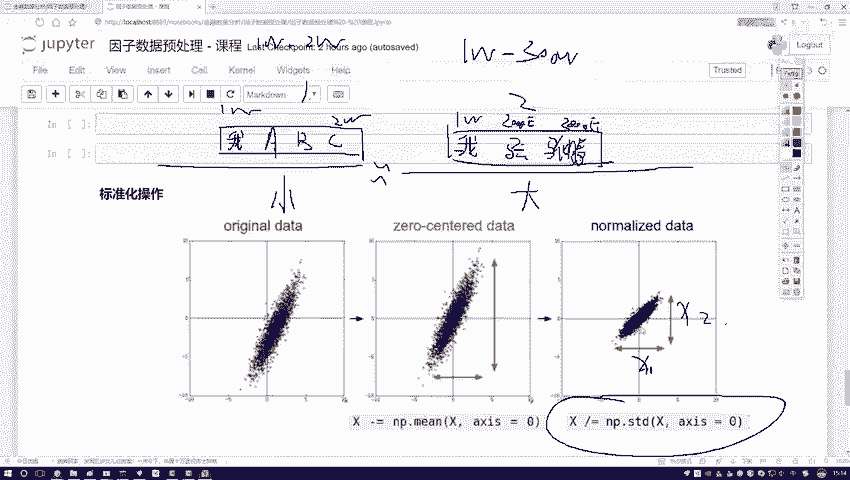

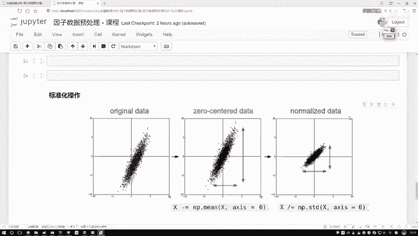

代码非常简单：先计算两个核心统计量，然后应用公式即可。

## 使用Scikit-learn进行标准化

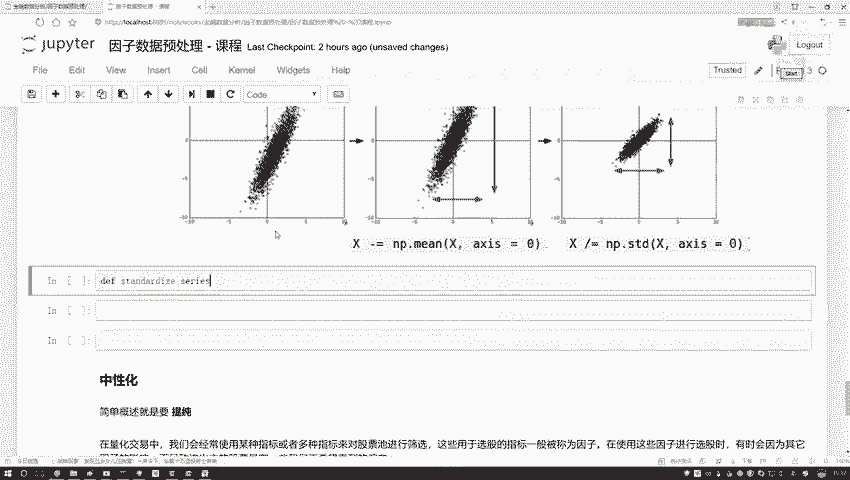

除了手动实现，我们也可以利用成熟的机器学习库。Scikit-learn提供了现成的标准化工具。

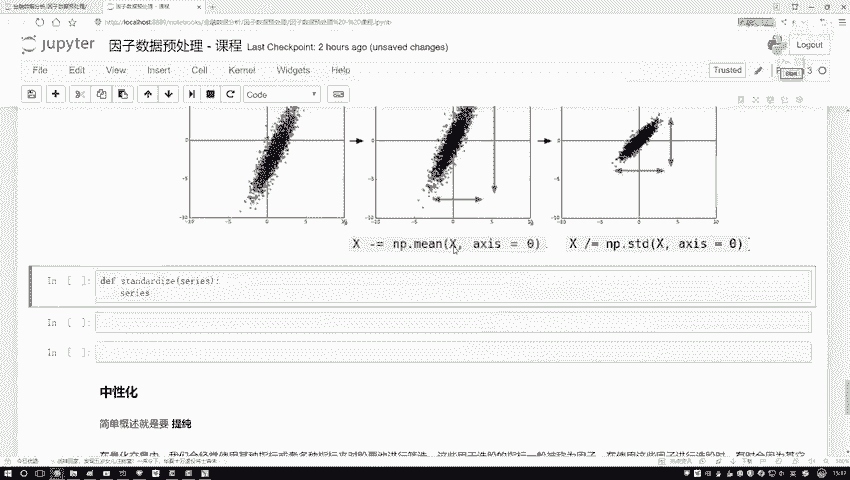

如果你想使用Scikit-learn，只需从其预处理模块导入`StandardScaler`即可。以下是简要说明：

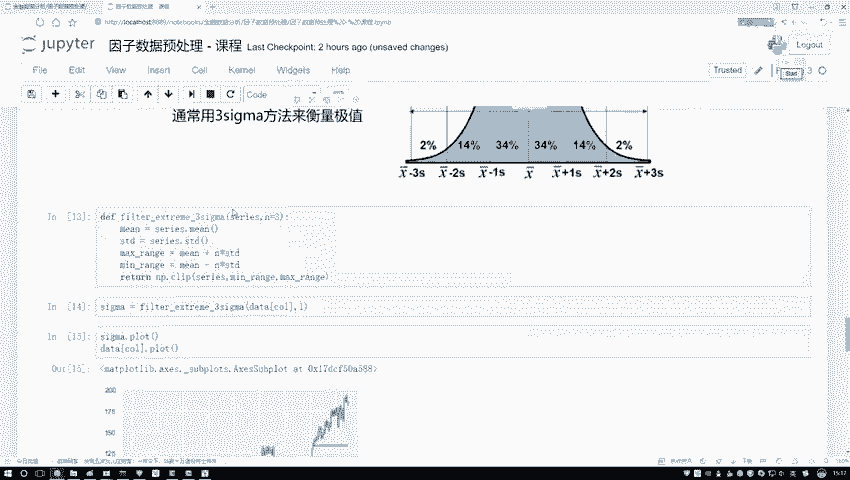

1.  导入模块：`from sklearn.preprocessing import StandardScaler`
2.  创建标准化器：`scaler = StandardScaler()`
3.  拟合并转换数据：`scaled_data = scaler.fit_transform(data)`

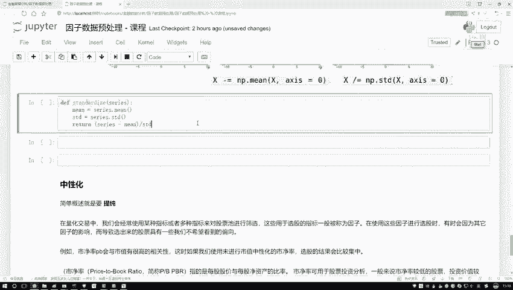

使用库函数通常只需一行核心代码就能完成，更加方便快捷。

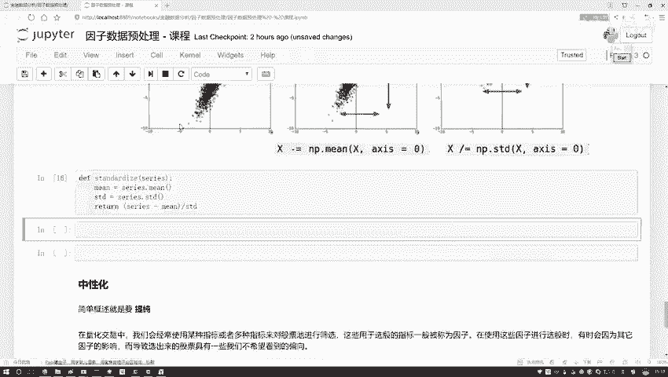

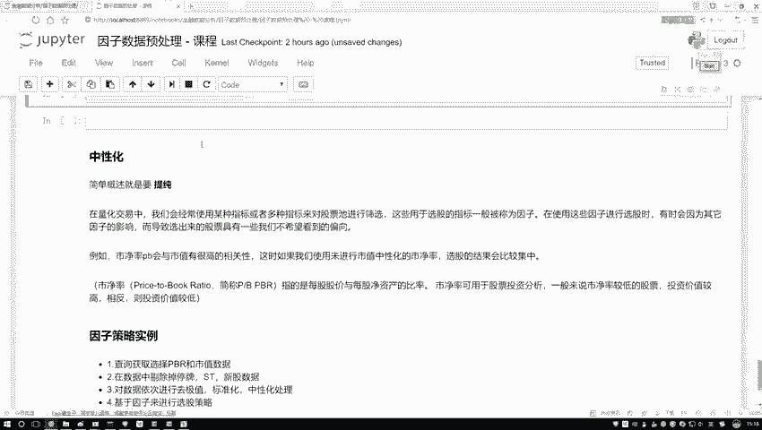

## 效果演示

让我们通过一个例子来观察标准化的效果。

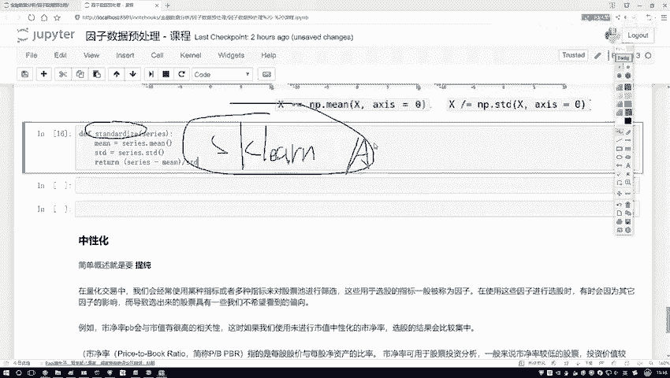

假设我们有以下原始数据，其数值范围差异较大：

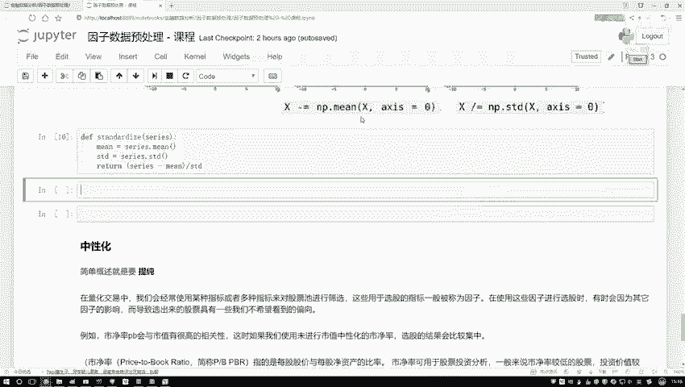

```python
原始数据示例: [30.5, 22.1, 105.7, 18.3]
```

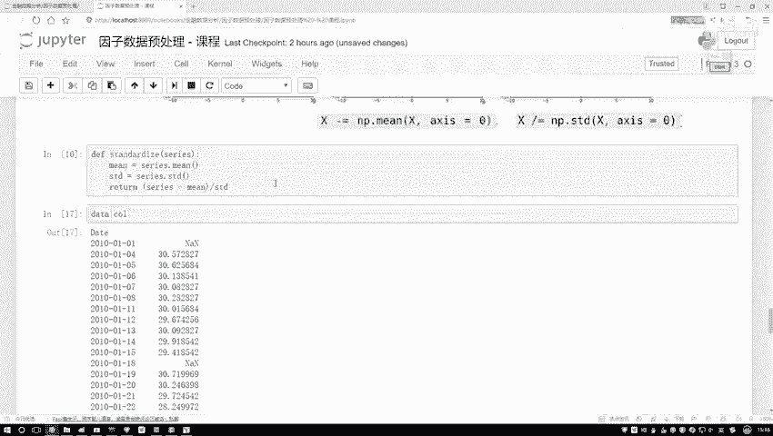

使用我们编写的`standardize`函数处理后，得到标准化数据：

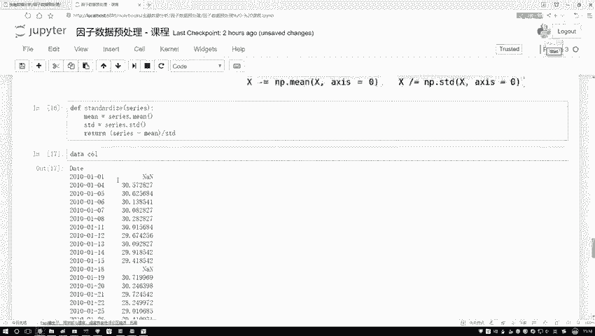

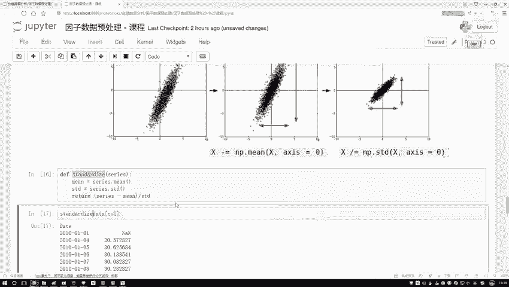

```python
标准化后数据: [0.12, -0.45, 1.78, -0.89]
```

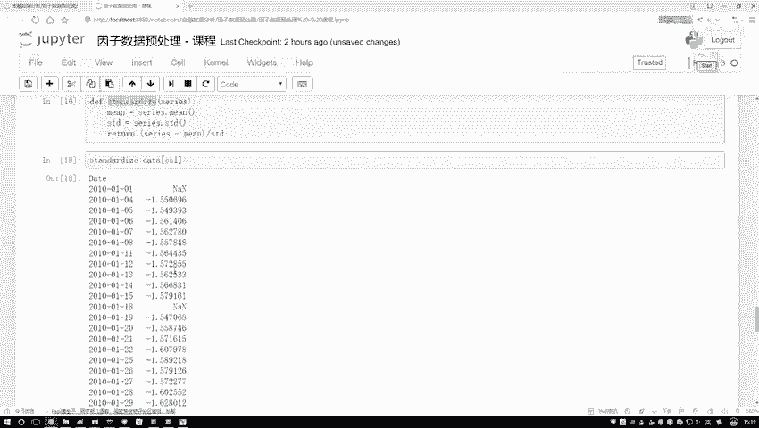

可以看到，原始数据中从18到105的大范围数值，被转换到了-0.89到1.78这样一个较小的、以零为中心的区间内。这验证了标准化的效果。

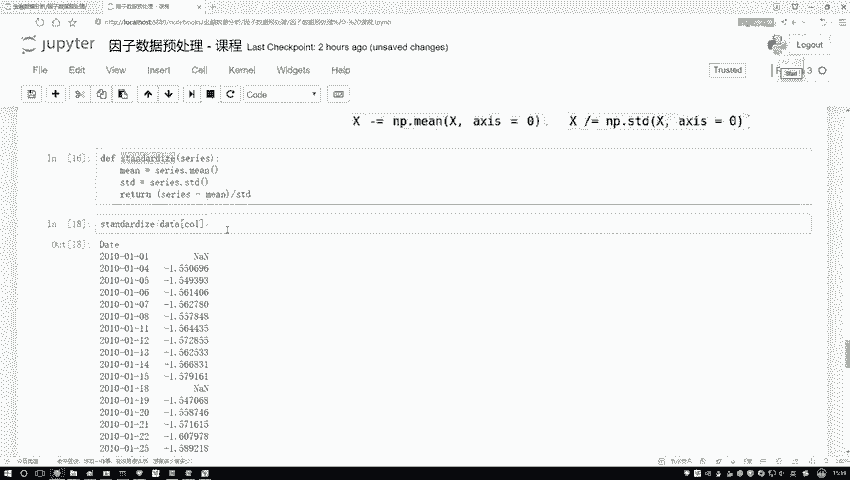

## 总结

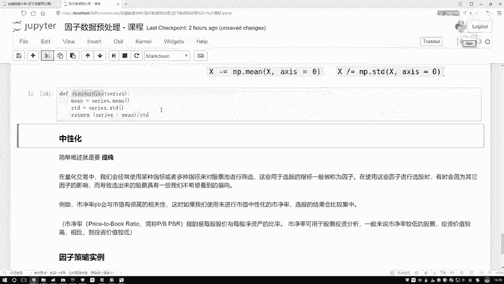

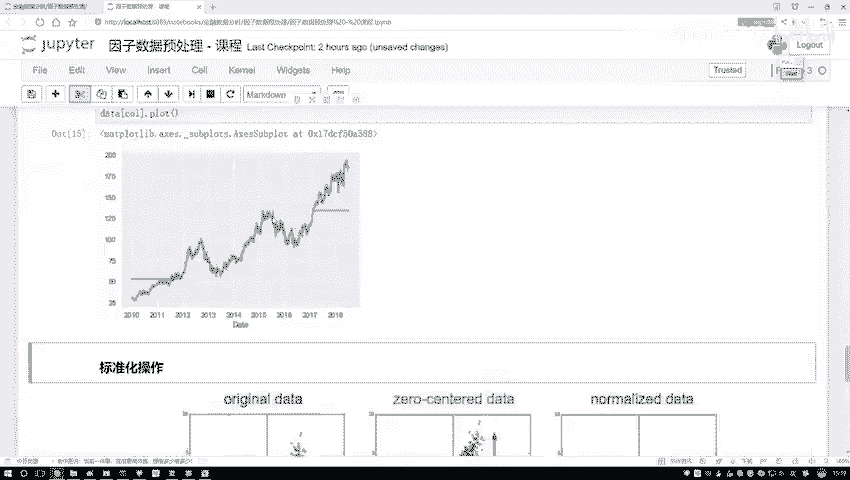

本节课中我们一起学习了数据标准化处理。
*   我们首先明确了标准化的**目的**：消除量纲影响，使不同特征具有可比性。
*   然后，我们学习了标准化的核心**公式**：**`z = (x - μ) / σ`**，并理解其“去均值”和“除标准差”两步的含义。
*   接着，我们手动实现了标准化函数，也介绍了使用Scikit-learn库的快捷方法。
*   最后，通过示例我们看到，标准化成功地将数据转换到相近的尺度上。

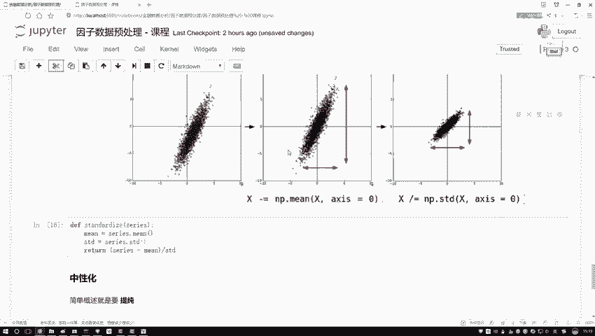

标准化是数据分析和机器学习建模前非常关键且常见的一步，掌握其原理与实现对后续学习至关重要。