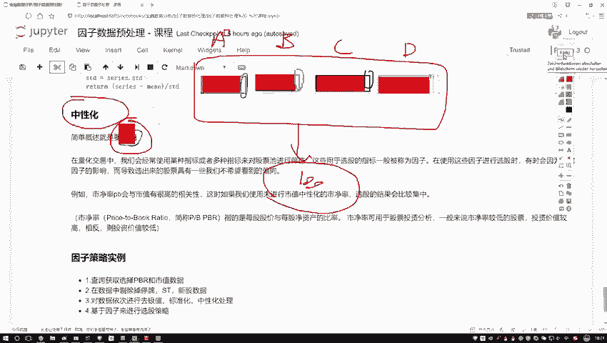
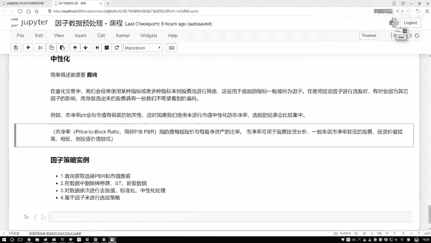

# Python金融分析与量化交易实战：P30：30.29.6-中性化处理方法通俗解释

## 概述

在本节课程中，我们将学习量化交易中的一个重要概念——**中性化**。我们将解释中性化的目的、核心思想，并通过一个简单的例子帮助初学者理解其必要性。最后，我们会介绍其基本计算方法，为后续的代码实践打下基础。

## 中性化的目的：提纯因子

上一节我们介绍了因子在选股中的应用。本节中，我们来看看一个常见问题：多个因子可能包含大量相同的信息，导致选股结果缺乏多样性。中性化就是为了解决这个问题，其核心目的是**提纯**。

为了理解“提纯”，我们先看一个例子。假设我们设计了一个选股策略，其中使用了四个不同的因子，我们称之为因子A、因子B、因子C和因子D。

理论上，这四个因子应该从不同角度帮助我们筛选股票。但实际操作中，你可能会发现，无论怎么调整这四个因子的组合，最终选出的股票池总是高度相似。

为什么会这样？很可能是因为这四个因子内部，绝大部分的影响力都来自于同一个共同因素，比如**市值**。

*   因子A（例如市净率）的变动，绝大部分可由市值解释。
*   因子B、C、D的变动，也绝大部分与市值高度相关。

这样一来，虽然名义上有四个因子，但真正起决定性作用的几乎都是“市值”这一个维度。我们无法看到每个因子自身独特的、有价值的信息。所有因子都被“市值”这个共同因素“污染”了。

所谓“提纯”，就是从每个因子中，剔除掉这些共性的、常识性的部分（如市值的影响），从而提取出该因子**独有的、有价值的信息**。这个过程就叫做**中性化**。它让我们的分析聚焦于因子的“个性”，而非“共性”。

## 量化交易中的中性化

在量化交易中，我们经常使用多个指标（因子）对股票池进行筛选，以构建投资组合。

然而，在使用因子选股的过程中，经常会因为某些共性因素（如行业、市值）的强烈影响，导致选出的股票具有我们不希望看到的倾向性，例如全部集中于大盘股或某个特定行业。

例如，市净率（PB）因子与市值通常有很高的相关性。如果不进行中性化处理，直接使用市净率选股，结果可能会严重偏向某一市值风格的股票，无法体现市净率因子本身带来的超额收益信息。

这里简要介绍一下**市净率**：它是每股股价与每股净资产的比值。净资产等于公司总资产减去总负债。通常认为，较低的市净率可能意味着股票被低估，投资价值更高，潜在回报空间更大。



综上所述，中性化处理是为了剥离因子中与共性特征（如市值、行业）相关的部分，从而更纯粹地利用该因子自身的选股能力。

## 中性化的基本计算方法

介绍完概念，我们来看看如何实现中性化。其核心思想是建立模型，剥离不需要的影响。

最常用的方法是使用线性回归。以剔除市值影响为例：

1.  **建立模型**：将被分析的因子（如市净率）作为因变量 `Y`，将需要剔除的共性因素（如市值）作为自变量 `X`。
2.  **进行回归**：拟合线性回归模型 `Y = α + β * X + ε`。其中，`β * X` 代表了 `Y` 中能被 `X`（市值）解释的部分。
3.  **提取残差**：模型中的残差 `ε` 即为 `Y` 中无法被 `X` 解释的部分。这个残差序列就是**中性化后的因子值**。它已经剔除了市值的影响。

用公式和代码描述其核心步骤：

**公式**：
`中性化后因子 = 原始因子 - 回归预测值 = ε`

**伪代码逻辑**：
```python
# 假设 df 是包含股票代码、日期、原始因子值（如 pb_ratio）和市值（market_cap）的DataFrame
# 对每个时间截面（每天）进行处理
for date in all_dates:
    # 获取当天的数据
    daily_data = df[df[‘date‘] == date]
    
    # 建立线性回归模型：原始因子 ~ 市值
    X = daily_data[‘market_cap‘].values.reshape(-1, 1)
    y = daily_data[‘pb_ratio‘].values
    
    model = LinearRegression()
    model.fit(X, y)
    
    # 计算预测值（即能被市值解释的部分）
    y_pred = model.predict(X)
    
    # 中性化后的因子 = 原始值 - 预测值 （即残差）
    df.loc[daily_data.index, ‘pb_ratio_neutral‘] = y - y_pred
```

需要注意的是，在实际操作中，我们通常需要获取股票的因子数据（如市净率）和市值数据。这些数据需要通过金融数据API来获取。因此，接下来的课程将在量化平台中进行具体的代码演示。

## 总结

本节课中，我们一起学习了**中性化**处理方法。
*   我们首先明确了中性化的目的是**提纯因子**，即剥离因子中与共性特征（如市值、行业）相关的部分，提取其独有的、有价值的信息。
*   然后，我们通过一个例子说明了不进行中性化可能导致选股结果偏向单一维度，缺乏多样性。
*   最后，我们介绍了中性化的基本实现原理——利用线性回归模型分离影响，并提取残差作为中性化后的因子值。



理解中性化是构建更稳健、更有效的量化选股模型的关键一步。在接下来的实战环节，我们将应用这一方法处理真实数据。